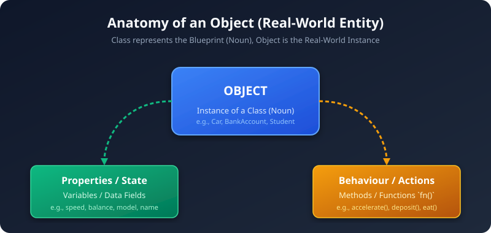
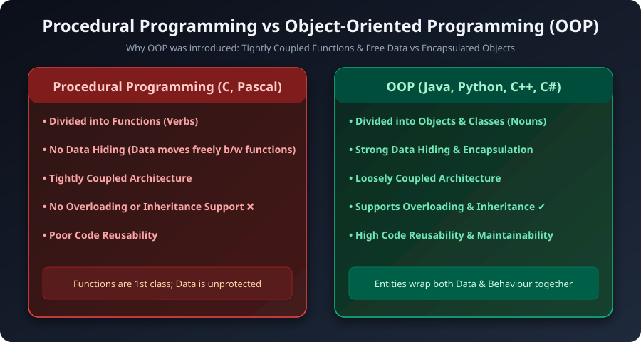
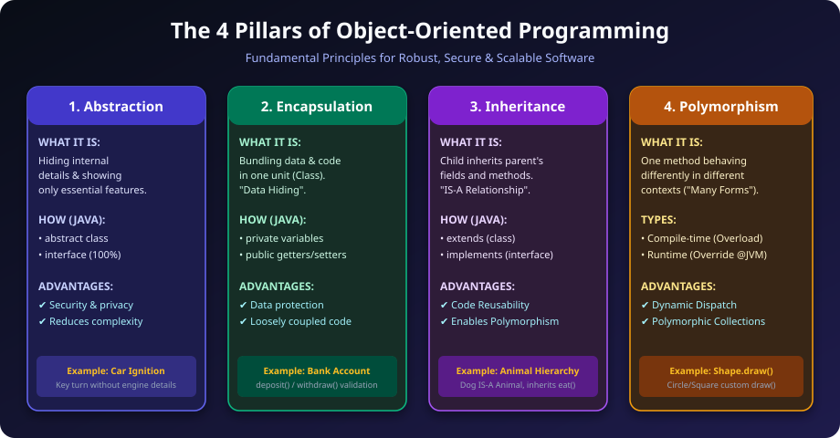
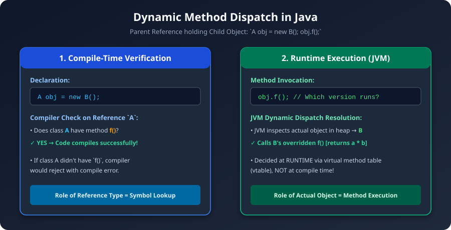
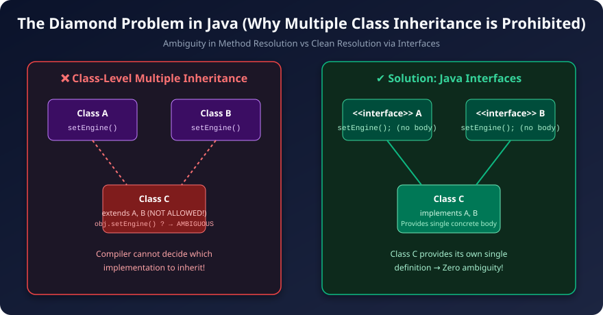
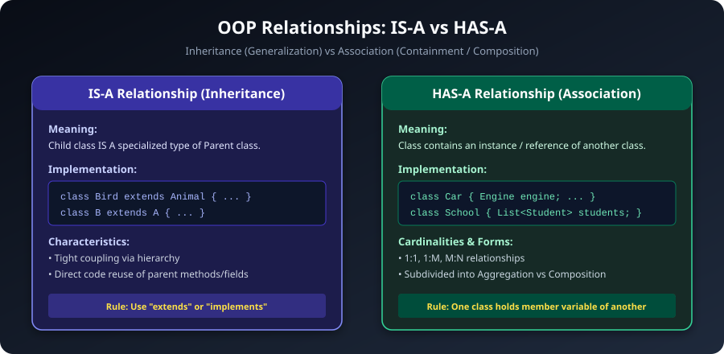
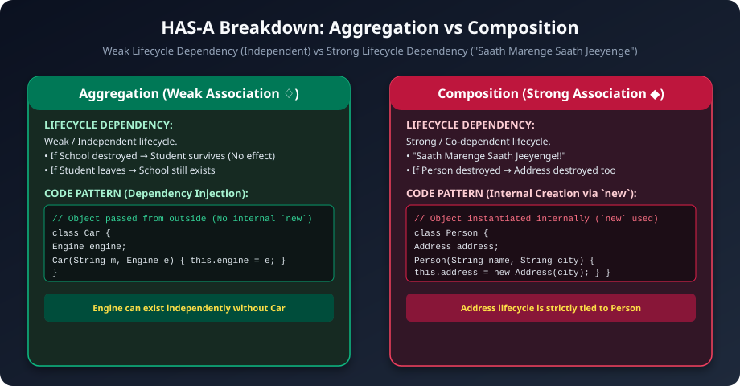

## Core Concepts & Object Structure

### Object Anatomy:
- An **Object** represents a real-world entity (e.g., `Car`, `Bike`, `ATM`, `BankAccount`).
- A **Class** represents the blueprint or template (*Noun*), and an **Object** is the real-world instance.
- **Properties / State:** Data variables holding state (`variables`).
- **Behaviour / Actions:** Functions / Methods operating on data (`fn()`).



---

## Procedural Programming vs Object-Oriented Programming (OOP)

### Why OOP was Needed:
- **Procedural languages** (e.g., C, Pascal, FORTRAN) only offer **functions / verbs**. They lack the ability to represent real-world entities (**nouns / classes**).
- In procedural languages, **data moves freely** from one function to another, meaning **no data hiding** and **tight coupling** (components are overly dependent on each other).
- **OOP solves this** by packaging nouns (Classes) containing both their data (properties) and verbs (behaviour) together with access restrictions.

| S.No. | Procedural Programming (C, Pascal, FORTRAN) | Object-Oriented Programming (Java, C++, Python, C#) |
|---|---|---|
| **1.** | Program is divided into parts called **functions** (verbs). | Program is divided into **Objects & Classes** (nouns). |
| **2.** | Does not provide a proper way to hide data; data moves freely. | Objects provide **data hiding & encapsulation**. |
| **3.** | Function overloading is **not possible**. | Method overloading is **supported**. |
| **4.** | Inheritance is **not possible**. | Inheritance is **supported**. |
| **5.** | Code reusability is **absent / low**. | Code reusability is **high**. |
| **6.** | **Tightly coupled** architecture. | **Loosely coupled** architecture. |



---

## The 4 Pillars of OOP



### 1. Data Abstraction (1st Pillar)
- **Definition:** Hiding internal implementation complexity and exposing only the essential interface to the user.
- **Real-World Analogy:** You know how to start a car by turning the key or pushing the start button, but you do not need to know the internal combustion engine mechanics.
- **Key Advantages:**
  - Increases security & confidentiality.
  - Reduces system complexity for the caller.
  - The caller only cares about *what* to do, not *how* it is implemented internally.
- **Achieved in Java using:**
  - `abstract class`
  - `interface` (provides 100% contract-based abstraction)

### 2. Encapsulation (2nd Pillar)
- **Definition:** Bundling data (variables) and the code (methods) that operates on that data into a single unit called a **Class**. Also referred to as **Data Hiding**.
- **Key Advantages:**
  - Better code readability and data security.
  - Leads to **loosely coupled** code.
  - Prevents external code from modifying state arbitrarily.
- **Achieved in Java using:**
  - Declaring fields as `private`.
  - Providing controlled access via `public` getter and setter methods with validation.

### 3. Inheritance (3rd Pillar)
- **Definition:** Mechanism where one class acquires the properties and methods of another class. Models an **IS-A** relationship.
- **Types of Inheritance:**
  1. **Single Inheritance:** Class `B` extends Class `A`.
  2. **Multilevel Inheritance:** Class `C` extends `B`, and `B` extends `A`.
  3. **Multiple Inheritance:** Prohibited in Java classes due to the **Diamond Problem**, but supported via **Interfaces**.
- **Java Keywords:**
  - `extends` for inheriting from a class.
  - `implements` for implementing an interface.
- **Key Advantages:**
  - High **code reusability**.
  - Serves as the foundation to achieve **runtime polymorphism**.

### 4. Polymorphism (4th Pillar)
- **Definition:** The ability of the same method to exhibit different behaviours in different situations ("Many Forms").
- **Types of Polymorphism:**
  1. **Compile-Time / Static Polymorphism (Method Overloading):**
     - Same method name in the same class with different parameter lists (number, type, or order of parameters).
     - **Critical Rule:** Overloading is resolved **ONLY** on the basis of method parameters, **NEVER on the return type**.
  2. **Run-Time / Dynamic Polymorphism (Method Overriding):**
     - Subclass provides a specific implementation of a method defined in its superclass (`@Override`).
     - In overriding, the method signature (name, parameters, return type) is **exact and identical**.

---

## Dynamic Method Dispatch & Method Overriding


### Runtime Polymorphism in Java

**Runtime polymorphism** works through a mechanism called **dynamic method dispatch** — the JVM decides *which version of an overridden method to call* at runtime, based on the actual object type, not the reference type.

---

### The Core Idea

```java
Shape s = new Circle();
s.draw(); // Which draw() runs? — decided at RUNTIME, not compile time
```

The reference `s` is of type `Shape`, but the object it points to is a `Circle`. Java waits until the program is actually running to look at the real object and call the correct `draw()`.

---

### Step-by-Step Example

```java
class Shape {
    void draw() {
        System.out.println("Drawing a Shape");
    }
}

class Circle extends Shape {
    @Override
    void draw() {
        System.out.println("Drawing a Circle");
    }
}

class Triangle extends Shape {
    @Override
    void draw() {
        System.out.println("Drawing a Triangle");
    }
}

public class Main {
    public static void main(String[] args) {

        Shape s1 = new Shape();    // reference = Shape,   object = Shape
        Shape s2 = new Circle();   // reference = Shape,   object = Circle
        Shape s3 = new Triangle(); // reference = Shape,   object = Triangle

        s1.draw(); // "Drawing a Shape"
        s2.draw(); // "Drawing a Circle"    ← Circle's version called
        s3.draw(); // "Drawing a Triangle"  ← Triangle's version called
    }
}
```

All three variables are declared as `Shape`, but they hold different objects. At runtime, Java checks what the object actually is and calls the correct method.

---

### How It Works Internally

Java uses a **vtable (virtual method table)** behind the scenes:

1. Every class has a vtable — a table of method pointers.
2. When you call `s2.draw()`, the JVM looks at the actual object (`Circle`), finds its vtable, and calls `Circle`'s `draw()`.
3. This lookup happens at **runtime**, not at compile time.

```
Reference type → Shape    (compiler only sees this)
Actual object  → Circle   (JVM sees this at runtime)
Method called  → Circle's draw()  ✓
```

---

### Real Power — Polymorphic Arrays

This is where runtime polymorphism really shines:

```java
public class Main {
    public static void main(String[] args) {

        // Array of Shape references holding different objects
        Shape[] shapes = {
            new Circle(),
            new Triangle(),
            new Shape(),
            new Circle()
        };

        // One loop, different behaviour for each object
        for (Shape s : shapes) {
            s.draw(); // JVM picks the right draw() each time
        }
    }
}
```

Output:
```
Drawing a Circle
Drawing a Triangle
Drawing a Shape
Drawing a Circle
```

You write one `s.draw()` call, and Java automatically invokes the right version depending on each object.

---

### Another Common Example — with a Method Parameter

```java
class Animal {
    void sound() {
        System.out.println("Some sound");
    }
}

class Dog extends Animal {
    @Override
    void sound() {
        System.out.println("Dog barks: Woof!");
    }
}

class Cat extends Animal {
    @Override
    void sound() {
        System.out.println("Cat meows: Meow!");
    }
}

public class Main {

    // Accepts any Animal — works for Dog, Cat, or anything else
    static void makeSound(Animal a) {
        a.sound(); // runtime decides which sound() to call
    }

    public static void main(String[] args) {
        makeSound(new Dog()); // "Dog barks: Woof!"
        makeSound(new Cat()); // "Cat meows: Meow!"
    }
}
```

The method `makeSound()` doesn't know or care what type of animal it receives. At runtime, Java figures it out automatically.

---

### 3 Rules for Runtime Polymorphism

1. There must be **inheritance** — a parent-child class relationship.
2. The method must be **overridden** in the child class (`@Override`).
3. A **parent reference must point to a child object** — `Animal a = new Dog();`

---

### Compile-time vs Runtime — Key Difference

| | Compile-time | Runtime |
|---|---|---|
| Also called | Method overloading | Method overriding |
| Resolved at | Compile time | Runtime (JVM) |
| Same class? | Yes | No (parent-child) |
| Parameters | Different | Same |
| Keyword | — | `@Override` |

The simplest way to remember: **overloading = same class, different params. Overriding = different class, same method signature.**

### How Dynamic Method Dispatch Works:
Overriding is achieved through inheritance. Consider the following code:

```java
class A {
    int a;
    int b;
    int f() {
        return a + b;
    }
}

class B extends A {
    int a;
    int b;
    @Override
    int f() {
        return a * b;
    }
}

public class Main {
    public static void main(String[] args) {
        // Case 1: Standard object creation
        B obj1 = new B();
        obj1.f(); // Calls B's f() -> returns a * b

        // Case 2: Polymorphic reference
        A obj2 = new B();
        obj2.f(); // Which f() will be called?
    }
}
```

### Execution Steps:
1. **Compile-Time Check:** The compiler checks the reference type `A`. Does `A` have a method `f()`? **Yes!** -> Compiles successfully.
2. **Run-Time Dispatch:** At runtime, the JVM inspects the heap to find the actual object (`B`). The JVM invokes `B`'s version of `f()`.
3. This mechanism is called **Dynamic Method Dispatch** (resolved at runtime via the virtual method table / vtable).



---

## Multiple Inheritance & The Diamond Problem

### Why Multiple Class Inheritance is Prohibited in Java:
Suppose multiple class inheritance were allowed:




If `Class C` inherits from both `Class A` and `Class B`:
```java
C obj = new C();
obj.setEngine(); // Which setEngine() should the JVM call? Class A's or Class B's?
```
This causes ambiguity known as the **Diamond Problem**. To prevent this ambiguity, Java does not support multiple class inheritance.

### The Solution: Interfaces
Multiple inheritance **is allowed** using interfaces because interfaces declare methods without concrete bodies. `Class C` is forced to implement its own concrete body:
```java
interface A { void setEngine(); }
interface B { void setEngine(); }

class C implements A, B {
    @Override
    public void setEngine() {
        System.out.println("Custom engine set for C - No ambiguity!");
    }
}
```

### Q: Why is Method Overloading NOT possible by changing only the return type?
- **Answer:** When calling a method like `calculate(5, 10);`, the caller does not specify which return type is expected. The compiler cannot determine which method to invoke, leading to ambiguity.


---

## OOP Relationships: IS-A vs HAS-A



### 1. IS-A Relationship (Inheritance)
- Expressed using `extends` or `implements`.
- Example: `class Bird extends Animal` $\rightarrow$ **Bird IS-A Animal**.
- Example: `class B extends A` $\rightarrow$ **B IS-A A**.

### 2. HAS-A Relationship (Association)
- Expressed when one class contains a reference to another class:
  ```java
  class A {
      B b; // A HAS-A B
  }
  ```
- **Cardinality Variants:**
  - **1 : 1 Relationship:** `class A { B b; }`
  - **1 : M Relationship:** `class A { List<B> bs; }`
  - **M : N Relationship:** `class A { List<B> bs; }` and `class B { List<A> as; }`

---

## Aggregation vs Composition (HAS-A Breakdown)



### Comparison Table:

| Feature | Aggregation (Weak Association ♢) | Composition (Strong Association ◆) |
|---|---|---|
| **Relationship Strength** | Weak Relationship | Strong Relationship (*"Saath Marenge Saath Jeeyenge!!"*) |
| **Object Lifecycle** | **Independent:** Destroying container does not destroy contained object. | **Co-dependent:** Destroying container destroys contained object. |
| **Real-Life Example** | `School` and `Student` (If school shuts down, students still exist). | `Person` and `Address` / `School` and `Room` (If school destroyed, rooms cease to exist). |
| **Code Implementation** | Object is injected/passed from outside (No internal `new`). | Object is created **internally** using `new` inside constructor. |

---

### Code Examples & Patterns:

#### 1. One-Way Aggregation (Loose Relation):
```java
class Engine {
    // Engine can exist independently
}

class Car {
    String model;
    Engine engine;

    // Aggregation: Engine instance is passed from outside
    public Car(String model, Engine engine) {
        this.model = model;
        this.engine = engine; // Reference stored, no internal 'new'
    }
}
```
*If `Car` is destroyed, `Engine` is NOT destroyed.*

#### 2. One-Way Composition (Tight Relation):
```java
class Address {
    String city;
    Address(String city) { this.city = city; }
}

class Person {
    String name;
    Address address;

    // Composition: Address is instantiated inside Person
    public Person(String name, String city) {
        this.name = name;
        this.address = new Address(city); // 'new' keyword used internally!
    }
}
```
*If `Person` is destroyed, `Address` is destroyed too.*

---

#### 3. Two-Way Aggregation:
```java
import java.util.ArrayList;
import java.util.List;

class Dept {
    String name;
    List<Emp> emps;

    Dept(String name) {
        this.name = name;
        this.emps = new ArrayList<>();
    }
}

class Emp {
    String name;
    Dept dept;

    Emp(String name, Dept dept) {
        this.name = name;
        this.dept = dept;
    }
}
```
*Both `Emp` and `Dept` can exist independently without requiring the simultaneous destruction of the other.*

#### 4. Two-Way Composition:
```java
class Engine {
    Car car;

    Engine(Car car) {
        this.car = car;
    }
}

class Car {
    String model;
    Engine engine;

    Car(String model) {
        this.model = model;
        this.engine = new Engine(this); // Engine created internally and bound to 'this' Car
    }
}
```
*`Engine` is tightly coupled and bound to the lifecycle of the `Car`.*

---

## 🎯 Extended OOP Reference & Code Examples


Here are all 4 OOP principles explained clearly with Java examples:

---

## 1. Encapsulation

**Definition:** Wrapping data (fields) and methods together inside a class, and restricting direct access to the data using access modifiers like `private`. External code can only interact through controlled `public` methods.

**Real-life analogy:** A medicine capsule — the contents are hidden inside, you can't directly touch them.

```java
class BankAccount {
    private double balance;  // hidden from outside

    // Controlled access via public methods
    public double getBalance() {
        return balance;
    }

    public void deposit(double amount) {
        if (amount > 0) {
            balance += amount;  // validation before modifying
        }
    }

    public void withdraw(double amount) {
        if (amount > 0 && amount <= balance) {
            balance -= amount;
        }
    }
}

public class Main {
    public static void main(String[] args) {
        BankAccount acc = new BankAccount();
        acc.deposit(1000);
        acc.withdraw(200);
        System.out.println(acc.getBalance()); // 800.0

        // acc.balance = 99999; // ERROR! balance is private
    }
}
```

**Key benefit:** The `balance` field cannot be modified directly from outside. All changes go through methods that validate the input first.

---

## 2. Inheritance

**Definition:** A child class acquires the properties and methods of a parent class using the `extends` keyword. It promotes code reuse and models an "is-a" relationship.

**Real-life analogy:** A child inherits traits (eye color, height) from a parent but can also have their own unique traits.

```java
// Parent class
class Animal {
    String name;

    void eat() {
        System.out.println(name + " is eating.");
    }

    void sleep() {
        System.out.println(name + " is sleeping.");
    }
}

// Child class inherits from Animal
class Dog extends Animal {
    void bark() {
        System.out.println(name + " says: Woof!");
    }
}

// Another child class
class Cat extends Animal {
    void meow() {
        System.out.println(name + " says: Meow!");
    }
}

public class Main {
    public static void main(String[] args) {
        Dog dog = new Dog();
        dog.name = "Bruno";
        dog.eat();    // inherited from Animal → "Bruno is eating."
        dog.sleep();  // inherited from Animal → "Bruno is sleeping."
        dog.bark();   // Dog's own method   → "Bruno says: Woof!"

        Cat cat = new Cat();
        cat.name = "Kitty";
        cat.eat();    // inherited → "Kitty is eating."
        cat.meow();   // Cat's own → "Kitty says: Meow!"
    }
}
```

**Key benefit:** `eat()` and `sleep()` are written once in `Animal` but reused in both `Dog` and `Cat`. No code duplication.

---

## 3. Polymorphism

**Definition:** The ability of one method or reference to behave differently depending on the actual object it refers to. The word literally means "many forms". There are two types:
- **Compile-time (overloading):** Same method name, different parameters in the same class.
- **Runtime (overriding):** Child class provides its own version of a parent class method.

**Real-life analogy:** A person behaves differently at work, at home, and with friends — same person, different behaviour based on context.

```java
// ── Runtime Polymorphism (Method Overriding) ──
class Shape {
    void draw() {
        System.out.println("Drawing a shape.");
    }
}

class Circle extends Shape {
    @Override
    void draw() {
        System.out.println("Drawing a Circle.");
    }
}

class Rectangle extends Shape {
    @Override
    void draw() {
        System.out.println("Drawing a Rectangle.");
    }
}

// ── Compile-time Polymorphism (Method Overloading) ──
class Calculator {
    int add(int a, int b) {
        return a + b;
    }

    double add(double a, double b) {  // same name, different params
        return a + b;
    }

    int add(int a, int b, int c) {    // same name, three params
        return a + b + c;
    }
}

public class Main {
    public static void main(String[] args) {
        // Runtime polymorphism — decided at runtime
        Shape s1 = new Circle();       // Shape reference, Circle object
        Shape s2 = new Rectangle();

        s1.draw();  // "Drawing a Circle."
        s2.draw();  // "Drawing a Rectangle."

        // Compile-time polymorphism — decided at compile time
        Calculator calc = new Calculator();
        System.out.println(calc.add(2, 3));        // 5
        System.out.println(calc.add(2.5, 3.5));    // 6.0
        System.out.println(calc.add(1, 2, 3));     // 6
    }
}
```

**Key benefit:** You can write `Shape s = new Circle()` and call `s.draw()` without knowing or caring which specific shape it is at compile time. The JVM figures it out at runtime.

---

## 4. Abstraction

**Definition:** Hiding the internal implementation details and showing only the essential features to the user. Achieved in Java using `abstract` classes and `interfaces`.

**Real-life analogy:** When you press the accelerator in a car, you don't need to know how the engine works internally — you just use the pedal.

```java
// ── Using Abstract Class ──
abstract class Vehicle {
    String brand;

    // Abstract method — no body, must be implemented by child
    abstract void start();

    // Concrete method — has a body, shared by all vehicles
    void stop() {
        System.out.println(brand + " stopped.");
    }
}

class Car extends Vehicle {
    @Override
    void start() {
        System.out.println(brand + " car starts with a key.");
    }
}

class Bike extends Vehicle {
    @Override
    void start() {
        System.out.println(brand + " bike starts with a kick.");
    }
}

// ── Using Interface (100% abstraction) ──
interface Printable {
    void print();  // always abstract by default
}

interface Scannable {
    void scan();
}

class Printer implements Printable, Scannable {
    @Override
    public void print() {
        System.out.println("Printing document...");
    }

    @Override
    public void scan() {
        System.out.println("Scanning document...");
    }
}

public class Main {
    public static void main(String[] args) {
        Car car = new Car();
        car.brand = "Toyota";
        car.start();  // "Toyota car starts with a key."
        car.stop();   // "Toyota stopped."

        Bike bike = new Bike();
        bike.brand = "Honda";
        bike.start(); // "Honda bike starts with a kick."

        Printer p = new Printer();
        p.print();    // "Printing document..."
        p.scan();     // "Scanning document..."
    }
}
```

**Key benefit:** `Vehicle` forces every subclass to define `start()` in its own way, while `stop()` is shared. The user of the class doesn't need to know *how* starting works internally.

---

## Quick Summary

| Principle | Mechanism | Purpose |
|---|---|---|
| Encapsulation | `private` + getters/setters | Protect data |
| Inheritance | `extends` | Reuse code |
| Polymorphism | `@Override` / overloading | One interface, many behaviours |
| Abstraction | `abstract` / `interface` | Hide complexity |

