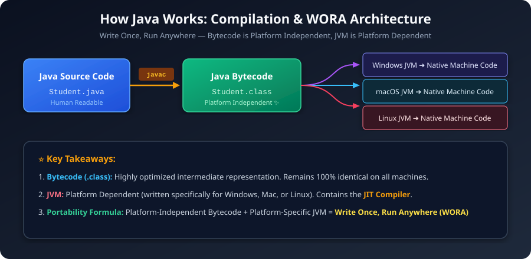
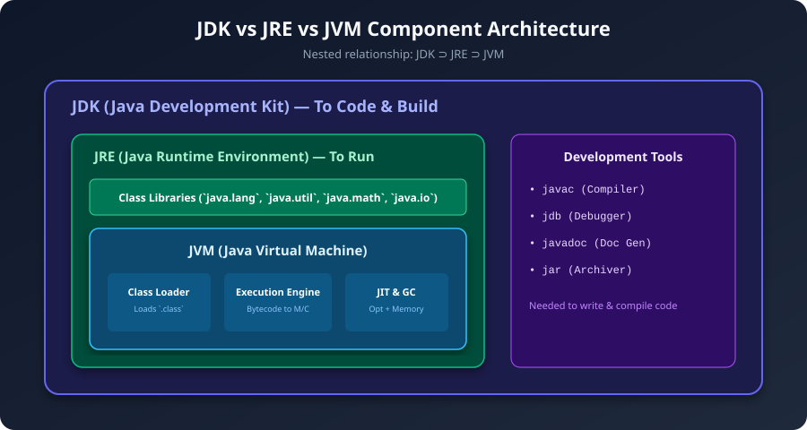
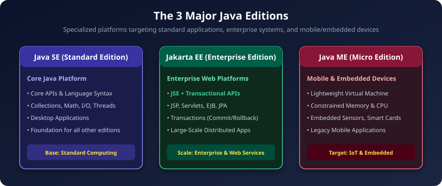
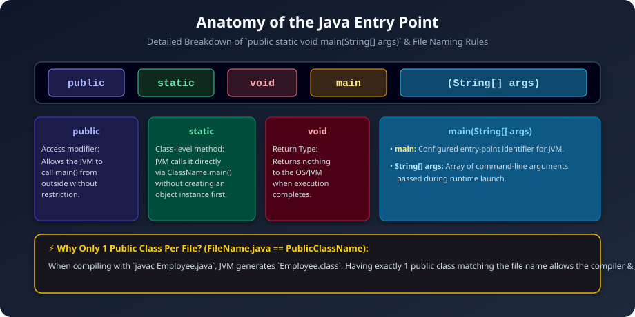

  

---

# How Java Works: Architecture & Internal Execution

---

## Platform Independence & WORA (Write Once, Run Anywhere)

Java is a **platform-independent, object-oriented programming language**. Its primary architectural advantage is **portability**, encapsulated by the philosophy **WORA (Write Once, Run Anywhere)**.

### The Execution Lifecycle:
1. You write Java source code in a file ending with `.java` (e.g., `Student.java`).
2. The Java compiler (`javac`) compiles the source code into an intermediate format called **Bytecode** (`Student.class`).
3. The generated **Bytecode is 100% platform-independent** and can be transferred to any computer architecture.
4. The target operating system's specific **Java Virtual Machine (JVM)** executes the bytecode and converts it into native machine instructions (`M/C code`).



---

## The Core Architecture: JVM vs JRE vs JDK

Java provides a nested, modular environment to develop and execute programs:



### 1. JVM (Java Virtual Machine) — The Execution Engine
- An **abstract / virtual machine** that loads, verifies, and executes Java Bytecode.
- **Platform Dependent:** Unlike Bytecode, the JVM itself is platform-specific. Windows, macOS, and Linux each require their own distinct JVM implementations.
- **Key Components of JVM:**
  - **Class Loader:** Dynamically loads compiled `.class` files into JVM memory.
  - **Bytecode Execution Engine:** Interprets and executes bytecode instructions.
  - **JIT (Just-In-Time) Compiler:** Compiles frequently executed bytecode (hotspots) directly into native machine code at runtime to maximize execution speed.
  - **Garbage Collector (GC):** Automatically reclaims unreferenced heap memory.

### 2. JRE (Java Runtime Environment) — The Running Environment
- **Formula:** `JRE = JVM + Standard Class Libraries`
- Provides the runtime libraries (e.g., `java.lang`, `java.util`, `java.math`, `java.io`) required by the JVM to execute Java applications.
- **Role:** If you only want to **run** pre-compiled Java applications/bytecode on a client machine without writing code, installing the JRE is sufficient.

### 3. JDK (Java Development Kit) — The Developer Toolset
- **Formula:** `JDK = JRE + Development Tools (Compiler, Debugger, Archiver)`
- Contains the complete developer toolkit required to **write, compile, test, document, and debug** Java code:
  - `javac`: Java Compiler that converts `.java` $\rightarrow$ `.class`.
  - `jdb`: Java Debugger.
  - `jar`: Java Archive packager.
  - `javadoc`: Documentation generator.
- **Platform Dependency Summary:** All three components (**JDK, JRE, JVM**) are **Platform Dependent**, while the generated **Bytecode (.class)** is **Platform Independent**.

> To check the currently installed Java runtime version on your terminal:
> ```bash
> java -version
> ```

---

## Java Editions: Standard, Enterprise, and Micro

Java is organized into specialized editions tailored for different computing tiers:



| Edition | Full Name | Primary Focus & Included Technologies |
|---|---|---|
| **JSE** | **Java Standard Edition (Core Java)** | The foundational platform. Contains core language syntax, object models, Collections Framework, I/O, Networking, Concurrency, and Math libraries for desktop and server-side utilities. |
| **JEE / Jakarta EE** | **Jakarta EE (Java Enterprise Edition)** | Built on top of JSE (`JSE + Enterprise & Transactional APIs`). Provides enterprise-grade features such as JSP, Servlets, JPA, EJBs, distributed messaging, and transactional commit/rollback mechanisms for large-scale web systems. |
| **JME** | **Java Micro Edition** | Stripped-down, lightweight runtime and specialized APIs designed for resource-constrained environments (embedded devices, smart cards, IoT sensors). |

---

## Class Structure & First Java Program

A standard Java class definition follows a structured layout:

```java
public class Employee {
    // 1. Instance & Static Variables (State)
    private int id;
    private String name;

    // 2. Constructors (Object Initialization)
    public Employee(int id, String name) {
        this.id = id;
        this.name = name;
    }

    // 3. Methods (Behaviour)
    public void displayDetails() {
        System.out.println("ID: " + id + ", Name: " + name);
    }

    // 4. Entry Point Method
    public static void main(String[] args) {
        Employee emp = new Employee(101, "Alice");
        emp.displayDetails();
    }

    // 5. Optional Nested / Inner Classes
    class Department {
        String deptName;
    }
}
```

### Compiling and Running from the Command Line:
```bash
# Step 1: Compile the source file (produces Employee.class)
javac Employee.java

# Step 2: Execute the compiled bytecode (do NOT include .class extension)
java Employee
```

---

## Anatomy of the Main Method

The standard entry point method signature in Java is:

```java
public static void main(String[] args)
```



### Detailed Keyword Breakdown:

1. **`public` (Access Modifier):**
   - Specifies that the method can be accessed from outside the class and outside its package.
   - The JVM must be able to invoke `main()` from the outside runtime context without access restriction errors.

2. **`static` (Class-Level Modifier):**
   - Binds the method to the class itself rather than to an individual object instance.
   - **Why needed:** Allows the JVM to invoke `main()` directly via `ClassName.main()` without needing to instantiate an object of the class beforehand.

3. **`void` (Return Type):**
   - Indicates that the method does not return any value back to the caller (the JVM / Operating System) when execution terminates.

4. **`main` (Method Identifier):**
   - The predefined entry point identifier configured in the JVM specification. When a Java program launches, the JVM specifically searches for a method named `main` with this exact signature.

5. **`String[] args` (Command-Line Arguments):**
   - An array of `String` objects representing parameters passed from the terminal/command line during program launch (e.g., `java App arg1 arg2`).

---

## Source File & Class Naming Rules

### Rule 1: File Name Must Match Public Class Name
- A source file named `Employee.java` **must** define `public class Employee`.
- If the file is named `Employee.java` but contains `public class Manager`, the compiler will throw a compilation error:
  `class Manager is public, should be declared in a file named Manager.java`.

### Rule 2: At Most One `public` Class Per File
- A single `.java` source file can contain multiple class definitions, but **at most one class can be declared `public`**.
- All other classes in the same file must have package-private (default) access.

### Why Does Java Enforce This Rule?
1. **Unambiguous Entry Point Resolution:**
   - When you execute `java Employee`, the JVM searches for `Employee.class`. Having the filename match the public class name guarantees that the JVM and compiler can instantly find the exact bytecode file corresponding to that public class without scanning through the entire filesystem or multiple source files.
2. **Deterministic Compilation:**
   - If a source file contained multiple public classes, the compiler would not know which class name to enforce for the file, leading to ambiguities in package imports and linking.