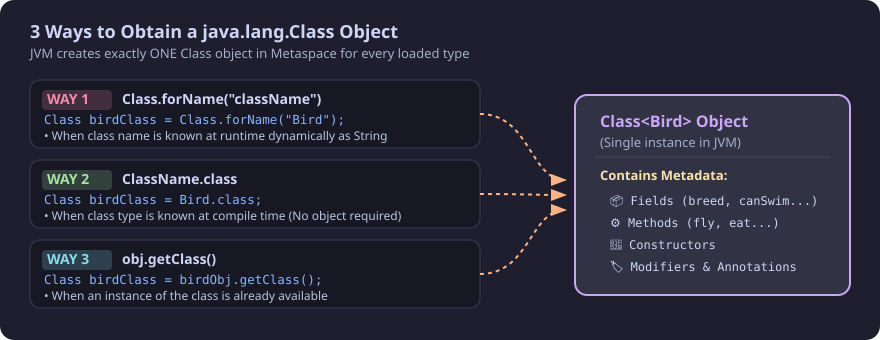
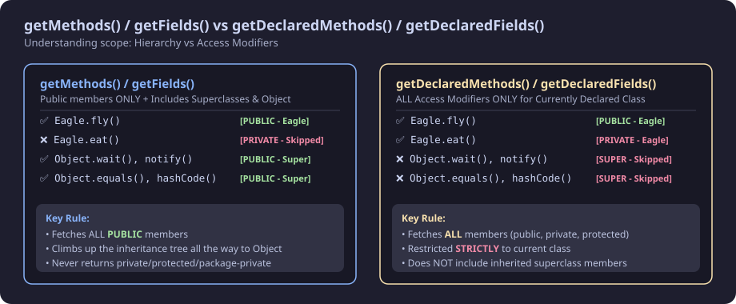
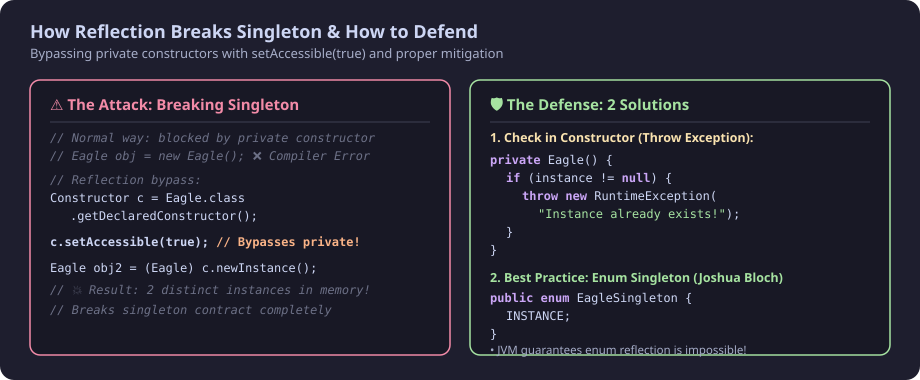

> **Note:** Reflection is **very rarely used** in day-to-day business application logic, but it is **frequently asked in interviews** and forms the backbone of frameworks like **Spring**, **Hibernate**, **JUnit**, and **Jackson**.

---

## 1. What is Reflection?

**Reflection** is an API in Java that is used to examine and inspect Classes, Methods, Fields, Interfaces, and Constructors at **runtime**, and also allows modifying the runtime behavior of classes.

### What can we inspect & do with Reflection?
* **Methods:** Inspect all methods declared or inherited in a class, their return types, parameter types, and modifiers.
* **Fields:** Inspect all fields (both public and private), their data types, and modifiers.
* **Return Types & Modifiers:** Check access modifiers (`public`, `private`, `protected`, `static`, `final`).
* **Interfaces & Superclasses:** Check what interfaces a class implements and what superclass it extends.
* **Change Values:** Mutate the value of both `public` and `private` fields at runtime (bypassing encapsulation).
* **Invoke Methods & Constructors:** Dynamically invoke private/public methods and instantiate objects via private constructors.

---

## 2. Understanding the `Class` Class in Java

To perform reflection on any class, we first need to obtain its `Class` object (`java.lang.Class`).

```
                    ┌─────────────────────────┐
                    │      There is a class   │
                    │      with name 'Class'  │
                    └─────────────────────────┘
```

### What is this `Class` object?
* An instance of `java.lang.Class` represents classes and interfaces in a running Java application.
* The **JVM creates exactly ONE `Class` object** for each and every class loaded during runtime (stored in JVM Metaspace).
* This `Class` object contains all metadata about the class: methods, fields, constructors, superclasses, annotations, and access modifiers.

---

### How to Get the `Class` Object (3 Ways)



There are **3 standard ways** to obtain a `Class` object:

```java
// Assume we have a class called Bird
class Bird {
}
```

#### Way 1: Using `Class.forName("className")`
Used when the class name is determined dynamically at runtime as a `String` (e.g., from configuration files or database drivers). Throws `ClassNotFoundException` if the class cannot be found.

```java
// Pass the fully-qualified class name as a String
Class birdClass = Class.forName("Bird");
```

#### Way 2: Using `.class` (Class Literal)
Used when the class type is known at compile time. It is clean and does not require an existing instance or throw checked exceptions.

```java
// Direct class literal
Class birdClass = Bird.class;
```

#### Way 3: Using `getClass()` Method
Inherited from `java.lang.Object`. Used when you already have an instance of the object.

```java
Bird birdObj = new Bird();

// Call getClass() on the instance
Class birdClass = birdObj.getClass();
```

---

## 3. Reflection of Classes: Basic Inspection

Let's inspect basic metadata of a class such as its name and access modifier:

```java
public class Eagle {
    public String breed;
    private boolean canSwim;

    public void fly() {
        System.out.println("fly");
    }

    public void eat() {
        System.out.println("eat");
    }
}
```

```java
import java.lang.reflect.Modifier;

public class Main {
    public static void main(String[] args) {
        // 1. Get Class object
        Class eagleClass = Eagle.class;

        // 2. Get class name
        System.out.println(eagleClass.getName());

        // 3. Get class modifiers (converted to readable string)
        System.out.println(Modifier.toString(eagleClass.getModifiers()));
    }
}
```

#### Output:
```text
Eagle
public
```

---

### Methods Available in `Class` Object

All inspection methods on `java.lang.Class` are **`get` methods** (not `set` methods):

| Method Name | Return Type | Description |
| :--- | :--- | :--- |
| `getName()` | `String` | Fully qualified class name |
| `getSimpleName()` | `String` | Class name without package |
| `getModifiers()` | `int` | Bitmask of modifiers (use `Modifier.toString()`) |
| `getSuperclass()` | `Class<?>` | Direct superclass |
| `getInterfaces()` | `Class<?>[]` | All implemented interfaces |
| `getFields()` | `Field[]` | All **public** fields (including inherited) |
| `getDeclaredFields()` | `Field[]` | All fields declared in class (**public & private**) |
| `getMethods()` | `Method[]` | All **public** methods (including inherited & `Object`) |
| `getDeclaredMethods()` | `Method[]` | All methods declared in class (**public & private**) |
| `getConstructors()` | `Constructor<?>[]` | All **public** constructors |
| `getDeclaredConstructors()` | `Constructor<?>[]` | All constructors declared in class (**public & private**) |
| `getPackage()` | `Package` | Package information |
| `getAnnotations()` | `Annotation[]` | All annotations present on class |
| `getClassLoader()` | `ClassLoader` | ClassLoader that loaded this class |

> **Note:** The `java.lang.reflect` package provides helper classes such as `Field`, `Method`, `Constructor`, `Modifier`, and `Parameter` to manipulate values. These classes are returned by the `get*` methods above.

---

## 4. Reflection of Methods



### 1. Using `getMethods()` (Public + Inherited Methods)
`getMethods()` returns **all public methods** belonging to the class **plus all inherited public methods** from parent classes and `java.lang.Object` (e.g., `wait`, `equals`, `toString`, `hashCode`, `getClass`, `notify`, `notifyAll`).

```java
public class Eagle {
    public String breed;
    private boolean canSwim;

    public void fly() {
        System.out.println("fly");
    }

    private void eat() {
        System.out.println("eat");
    }
}
```

```java
import java.lang.reflect.Method;

public class Main {
    public static void main(String[] args) {
        Class eagleClass = Eagle.class;

        // Returns ALL public methods (including superclass / Object class methods)
        Method[] methods = eagleClass.getMethods();
        for (Method method : methods) {
            System.out.println("Method name: " + method.getName());
            System.out.println("Return Type: " + method.getReturnType());
            System.out.println("Class Name: " + method.getDeclaringClass());
            System.out.println("*****");
        }
    }
}
```

#### Output:
```text
Method name: fly
Return Type: void
Class Name: class Eagle
*****
Method name: wait
Return Type: void
Class Name: class java.lang.Object
*****
Method name: equals
Return Type: boolean
Class Name: class java.lang.Object
*****
Method name: toString
Return Type: class java.lang.String
Class Name: class java.lang.Object
*****
... (remaining Object class public methods)
```

---

### 2. Using `getDeclaredMethods()` (Declared Public & Private Methods)
`getDeclaredMethods()` returns **all methods (both public and private)** that are **declared directly inside this class**. It does **NOT** include inherited parent methods.

```java
import java.lang.reflect.Method;

public class Main {
    public static void main(String[] args) {
        Class eagleClass = Eagle.class;

        // Returns ALL methods declared in Eagle class ONLY (both public and private)
        Method[] methods = eagleClass.getDeclaredMethods();
        for (Method method : methods) {
            System.out.println("MethodName: " + method.getName());
        }
    }
}
```

#### Output:
```text
MethodName: fly
MethodName: eat
```

---

### 3. Invoking Methods Dynamically using Reflection

We can look up a method by name and parameter types using `getMethod(name, parameterTypes...)`, and invoke it using `Method.invoke(objectInstance, args...)`:

```java
public class Eagle {
    public Eagle() {
    }

    public void fly(int intParam, boolean boolParam, String strParm) {
        System.out.println("fly intParam: " + intParam + " boolParam: " + boolParam + " strParm: " + strParm);
    }
}
```

```java
import java.lang.reflect.Method;

public class Main {
    public static void main(String[] args) throws Exception {
        // 1. Get Class object
        Class eagleClass = Class.forName("Eagle");

        // 2. Create instance
        Object eagleObject = eagleClass.getDeclaredConstructor().newInstance();

        // 3. Get Method with matching parameter types
        Method flyMethod = eagleClass.getMethod("fly", int.class, boolean.class, String.class);

        // 4. Invoke method by passing object instance and arguments
        flyMethod.invoke(eagleObject, 1, true, "hello");
    }
}
```

#### Output:
```text
fly intParam: 1 boolParam: true strParm: hello
Process finished with exit code 0
```

#### Invocation Breakdown:
* `eagleClass.getMethod("fly", int.class, boolean.class, String.class)`:
  * `"fly"` &rarr; Name of the target method.
  * `int.class, boolean.class, String.class` &rarr; Parameter types to resolve overloaded signatures.
* `flyMethod.invoke(eagleObject, 1, true, "hello")`:
  * `eagleObject` &rarr; Instance on which the method should execute (use `null` for `static` methods).
  * `1, true, "hello"` &rarr; Actual argument values passed to the method.

---

## 5. Reflection of Fields

```java
public class Eagle {
    public String breed;
    private boolean canSwim;

    public void fly() {
        System.out.println("fly");
    }

    private void eat() {
        System.out.println("eat");
    }
}
```

### 1. `getFields()` vs `getDeclaredFields()`

```java
import java.lang.reflect.Field;
import java.lang.reflect.Modifier;

public class Main {
    public static void main(String[] args) {
        Class eagleClass = Eagle.class;

        System.out.println("--- Using getFields() (Public Only) ---");
        Field[] publicFields = eagleClass.getFields();
        for (Field field : publicFields) {
            System.out.println("FieldName: " + field.getName());
            System.out.println("Type: " + field.getType());
            System.out.println("Modifier: " + Modifier.toString(field.getModifiers()));
            System.out.println("********");
        }

        System.out.println("--- Using getDeclaredFields() (Both Public & Private) ---");
        Field[] allFields = eagleClass.getDeclaredFields();
        for (Field field : allFields) {
            System.out.println("FieldName: " + field.getName());
            System.out.println("Type: " + field.getType());
            System.out.println("Modifier: " + Modifier.toString(field.getModifiers()));
            System.out.println("********");
        }
    }
}
```

#### Output:
```text
--- Using getFields() (Public Only) ---
FieldName: breed
Type: class java.lang.String
Modifier: public
********

--- Using getDeclaredFields() (Both Public & Private) ---
FieldName: breed
Type: class java.lang.String
Modifier: public
********
FieldName: canSwim
Type: boolean
Modifier: private
********
```

---

### Methods Supported by `java.lang.reflect.Field`

| Method | Description |
| :--- | :--- |
| `getName()` | Name of the field |
| `getType()` | Class type of the field |
| `getModifiers()` | Access modifiers integer |
| `get(Object obj)` | Reads value from instance (returns `Object`) |
| `getInt(obj)`, `getBoolean(obj)`, `getDouble(obj)` | Type-specific primitive getters |
| `set(Object obj, Object value)` | Writes new value to the field on instance |
| `setInt(obj, val)`, `setBoolean(obj, val)` | Type-specific primitive setters |
| `setAccessible(boolean flag)` | Overrides Java access checks (enables private access) |

---

## 6. Changing Behavior of Class Using Reflection (Mutating Fields)

### 1. Setting Value of a `public` Field

```java
import java.lang.reflect.Field;

public class Main {
    public static void main(String[] args) throws NoSuchFieldException, IllegalAccessException {
        Class eagleClass = Eagle.class;
        Eagle eagleObj = new Eagle();

        // Get the public field
        Field field = eagleClass.getDeclaredField("breed");

        // Set new value
        field.set(eagleObj, "eagleBrownBreed");

        // Verify
        System.out.println(eagleObj.breed);
    }
}
```

#### Output:
```text
eagleBrownBreed
```

> **Note:** If the field name does not exist, `getDeclaredField("invalidName")` throws `NoSuchFieldException`.

---

### 2. Setting Value of a `private` Field

#### ❌ The Incorrect Way (Without `setAccessible(true)`):
```java
import java.lang.reflect.Field;

public class Main {
    public static void main(String[] args) throws NoSuchFieldException, IllegalAccessException {
        Class eagleClass = Eagle.class;
        Eagle eagleObj = new Eagle();

        Field field = eagleClass.getDeclaredField("canSwim");
        // Fails because canSwim is private!
        field.set(eagleObj, true); 
    }
}
```

#### Runtime Exception:
```text
Exception in thread "main" java.lang.IllegalAccessException: Class Main can not access a member of class Eagle with modifiers "private"
    at java.lang.reflect.AccessibleObject.slowCheckMemberAccess(AccessibleObject.java:296)
    at java.lang.reflect.AccessibleObject.checkAccess(AccessibleObject.java:288)
    at java.lang.reflect.Field.set(Field.java:761)
    at Main.main(Main.java:11)
```

---

#### ✅ The Correct Way (Using `setAccessible(true)`):
By calling `field.setAccessible(true)`, we suppress Java's language access control checks, allowing direct modification of private fields.

```java
import java.lang.reflect.Field;

public class Main {
    public static void main(String[] args) throws NoSuchFieldException, IllegalAccessException {
        Class eagleClass = Eagle.class;
        Eagle eagleObj = new Eagle();

        // 1. Get the private field
        Field field = eagleClass.getDeclaredField("canSwim");

        // 2. Grant access to bypass private modifier
        field.setAccessible(true);

        // 3. Set the private field value
        field.set(eagleObj, true);

        // 4. Read the updated private value
        if (field.getBoolean(eagleObj)) {
            System.out.println("value is set to true");
        }
    }
}
```

#### Output:
```text
value is set to true
```

> ⚠️ **Major Disadvantage:** Reflection breaks encapsulation — private variables can be inspected and modified outside their declaring class.

---

## 7. Reflection of Constructors & Breaking Singleton Pattern



> **VVI for Interviews:** In the Singleton design pattern, the constructor is declared `private` to prevent multiple object instances. Reflection can break this rule!

### The Vulnerable Singleton Class:
```java
public class Eagle {
    // Private constructor: blocks normal instantiation from outside
    private Eagle() {
    }

    public void fly() {
        System.out.println("fly");
    }
}
```

---

### How Reflection Breaks Singleton:

```java
import java.lang.reflect.Constructor;
import java.lang.reflect.Modifier;

public class Main {
    public static void main(String[] args) throws Exception {
        Class eagleClass = Eagle.class;

        // getDeclaredConstructors returns ALL constructors (public & private)
        Constructor[] eagleConstructorList = eagleClass.getDeclaredConstructors();

        for (Constructor eagleConstructor : eagleConstructorList) {
            System.out.println("Modifier: " + Modifier.toString(eagleConstructor.getModifiers()));

            // Force access to private constructor!
            eagleConstructor.setAccessible(true);

            // Creates a brand new instance despite private constructor
            Eagle eagleObject = (Eagle) eagleConstructor.newInstance();
            eagleObject.fly();
        }
    }
}
```

#### Output:
```text
Modifier: private
fly
```

---

### How to Defend Singleton Against Reflection Attacks

#### Defense 1: Throw Exception in Private Constructor
If an instance already exists, throw an exception when the constructor is invoked again via reflection:

```java
public class EagleSingleton {
    private static EagleSingleton instance = null;

    private EagleSingleton() {
        // Guard against reflection attack
        if (instance != null) {
            throw new RuntimeException("Singleton instance already created! Cannot instantiate via reflection.");
        }
    }

    public static synchronized EagleSingleton getInstance() {
        if (instance == null) {
            instance = new EagleSingleton();
        }
        return instance;
    }
}
```

#### Defense 2: Use Enum Singleton (Recommended by Joshua Bloch)
Per *Effective Java*, an `Enum` is the most robust way to implement a Singleton because the JVM internally prohibits reflection on Enum constructors:

```java
public enum EagleSingleton {
    INSTANCE;

    public void fly() {
        System.out.println("fly");
    }
}
```
*Attempting `newInstance()` on an Enum constructor throws `IllegalArgumentException: Cannot reflectively create enum objects`.*

---

## 8. Summary: Pros, Cons & When to Use Reflection

### Summary Comparison Table: `get*` vs `getDeclared*`

| Feature | `getFields()` / `getMethods()` | `getDeclaredFields()` / `getDeclaredMethods()` |
| :--- | :--- | :--- |
| **Access Modifiers** | `public` only | `public`, `private`, `protected`, default |
| **Inherited Members** | ✅ Yes (includes superclasses & `Object`) | ❌ No (only current class members) |
| **Bypass Encapsulation**| Not needed (public only) | ✅ Yes (via `setAccessible(true)`) |

---

### Why Reflection is Discouraged for Standard Business Logic

1. **Performance Overhead:**
   * Method/Field resolution happens dynamically at runtime.
   * Prevents JVM JIT compiler optimizations (like method inlining).
2. **Breaks OOP Encapsulation:**
   * Bypasses `private` modifiers, violating data-hiding principles.
3. **Loss of Compile-Time Safety:**
   * Errors (like mistyped method names or mismatched argument types) are only caught at runtime via exceptions (`NoSuchMethodException`, `IllegalAccessException`).
4. **Security Restrictions:**
   * In restricted environments (e.g., custom SecurityManagers, Java Modules), reflective access to private members may be blocked.

---

### Where is Reflection Actively Used?
* **Spring Framework:** Dependency Injection (`@Autowired`), Bean creation, Component Scanning (`@Component`).
* **Hibernate / JPA:** Mapping database tables and columns directly to private entity fields without requiring public setters.
* **JUnit / TestNG:** Discovering and executing test methods marked with `@Test`.
* **JSON Serializers (Jackson / Gson):** Inspecting class fields to serialize/deserialize objects into JSON.
