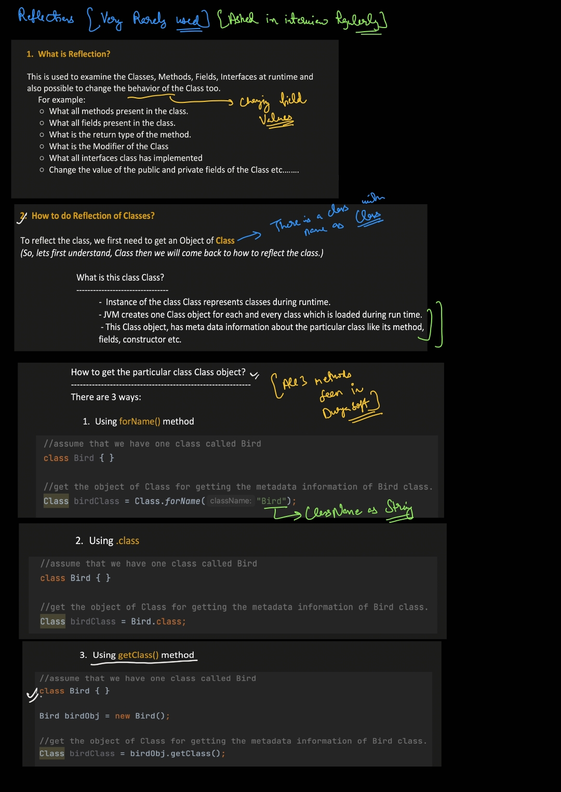
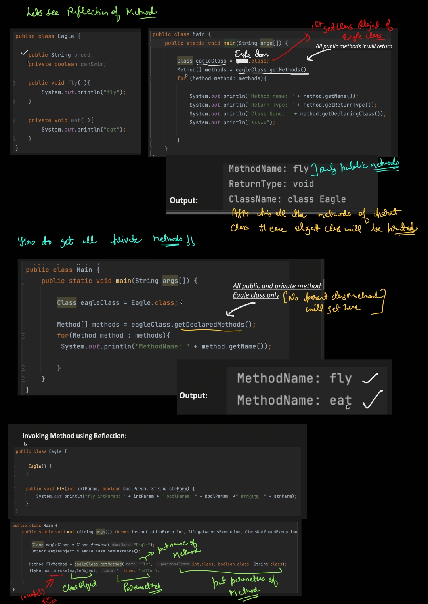

## Reflection in Java

Reflection is a powerful feature in Java that allows a program to **inspect and manipulate its own structure at runtime** — classes, methods, fields, constructors, and more — even if you don't know their names at compile time.

---

### How It Works

Java's reflection API lives in the `java.lang.reflect` package. The entry point is always the `Class` object, which represents a class at runtime.

**Getting a Class object:**
```java
// Three ways to get a Class object
Class<?> c1 = String.class;                    // using .class literal
Class<?> c2 = "hello".getClass();              // from an instance
Class<?> c3 = Class.forName("java.lang.String"); // by fully qualified name
```

### Why using `?`...

Great question! Let's break it down clearly.

## Why `Class<?>` and not `Class<String>` (for example)?

### First, what is `Class<T>`?

`Class` is itself a **generic class** — `Class<T>` where `T` represents the type the Class object describes.

```java
Class<String> c = String.class;   // T = String
Class<Integer> c = Integer.class; // T = Integer
```

---

### So why do we write `Class<?>` ?

The `?` is a **wildcard** — it means *"a Class of some unknown type"*.

We use it in situations where we **don't know or don't care** about the exact type at compile time.

```java
// When you know the type → use Class<T>
Class<String> c = String.class;

// When you DON'T know the type → use Class<?>
Class<?> c = Class.forName("java.lang.String"); // type unknown at compile time
```

---

### Why can't we always use `Class<String>` then?

Because methods like `Class.forName()` return `Class<?>` — the compiler has **no way to know** what type the string `"java.lang.String"` refers to at compile time. It's just a string — it could be anything!

```java
// This would be a compile error!
Class<String> c = Class.forName("java.lang.String"); // ❌ incompatible types

// This works
Class<?> c = Class.forName("java.lang.String");      // ✅
```

---

### `Class<?>` vs `Class` (raw type)

You might wonder — why not just write `Class` without any generics?

```java
Class c = String.class;   // raw type — works but not recommended
Class<?> c = String.class; // wildcard — preferred
```

| | `Class` (raw) | `Class<?>` (wildcard) |
|---|---|---|
| Compile-time safety | ❌ No warnings suppressed | ✅ Explicitly says "unknown type" |
| Intent | Unclear | Clear — unknown but acknowledged |
| Recommended | ❌ | ✅ |

`Class<?>` tells both the compiler and other developers: *"I know this is generic, but the type is intentionally unknown here."*

---

### Simple Mental Model

```
Class<String>  →  "I know exactly it's a String class"
Class<?>       →  "It's some class, but I don't know which type at compile time"
Class          →  "I'm ignoring generics entirely" (avoid this)
```

---

### In short:
- Use **`Class<SpecificType>`** when you know the type at compile time.
- Use **`Class<?>`** when the type is **dynamic or unknown** at compile time — which is very common in reflection, since the whole point of reflection is to work with things you don't know upfront!

---

### What You Can Do With Reflection

**1. Inspect class info**
```java
Class<?> c = String.class;

System.out.println(c.getName());        // java.lang.String
System.out.println(c.getSuperclass());  // class java.lang.Object
System.out.println(c.isInterface());    // false
```

**2. Access Fields**
```java
class Person {
    private String name = "Alice";
}

Person p = new Person();
Field field = Person.class.getDeclaredField("name");
field.setAccessible(true);              // bypass private access
System.out.println(field.get(p));       // Alice
field.set(p, "Bob");                    // modify it!
```

**3. Invoke Methods**
```java
class Calculator {
    private int add(int a, int b) { return a + b; }
}

Calculator calc = new Calculator();
Method method = Calculator.class.getDeclaredMethod("add", int.class, int.class);
method.setAccessible(true);
int result = (int) method.invoke(calc, 3, 5);  // returns 8
```

**4. Call Constructors**
```java
Constructor<?> constructor = String.class.getConstructor(String.class);
String s = (String) constructor.newInstance("Hello via reflection!");
```

**5. Inspect Annotations**
```java
if (MyClass.class.isAnnotationPresent(MyAnnotation.class)) {
    MyAnnotation ann = MyClass.class.getAnnotation(MyAnnotation.class);
}
```

---

### Key Classes in `java.lang.reflect`

| Class | Purpose |
|---|---|
| `Class<?>` | Represents a class or interface |
| `Field` | Represents a class field |
| `Method` | Represents a method |
| `Constructor<?>` | Represents a constructor |
| `Modifier` | Decodes access modifiers (public, private…) |

---

### Common Use Cases

- **Frameworks** — Spring, Hibernate, JUnit all rely heavily on reflection to wire beans, map tables, and discover test methods.
- **Serialization** — Libraries like Gson/Jackson use reflection to read/write object fields automatically.
- **Dependency Injection** — Injecting dependencies without the class knowing about the container.
- **Plugins / Dynamic Loading** — Loading and using classes whose names are only known at runtime.

---

### Downsides to Know

| Concern | Detail |
|---|---|
| **Performance** | Slower than direct calls due to runtime overhead |
| **Security** | `setAccessible(true)` can break encapsulation; restricted in newer Java versions (modules) |
| **Type Safety** | No compile-time checks; errors appear only at runtime |
| **Maintainability** | Harder to read and debug |

---

### Quick Rule of Thumb

> Use reflection **only when necessary** (frameworks, tools, libraries). For regular application code, prefer direct access — it's faster, safer, and cleaner.


     


## Why we need reflection??

Great question! Let me explain **why reflection exists** and when it's actually needed.

---

## The Core Problem Reflection Solves

In normal Java code, **everything is fixed at compile time** — you know exactly what classes, methods, and fields you're calling. But sometimes you need to write code that works with **classes it has never seen before**.

---

## Real-World Scenarios

### 1. Frameworks that work with YOUR classes (Spring, Hibernate)

Spring doesn't know about your classes when it's being written. But it still needs to create objects and inject dependencies into them.

```java
// Your class — Spring has never seen this
@Component
public class UserService {
    @Autowired
    private UserRepository repo;
}
```
```java
// Spring does something like this internally using reflection
Class<?> clazz = Class.forName("com.myapp.UserService");
Object instance = clazz.getDeclaredConstructor().newInstance(); // create object
// then finds @Autowired fields and injects them
```

> Without reflection, Spring would have to know your classes at compile time — **impossible** for a general-purpose framework.

---

### 2. Testing Frameworks (JUnit)

JUnit doesn't know your test methods in advance. It uses reflection to **discover and run** all methods annotated with `@Test`.

```java
// Your test class
public class MyTest {
    @Test
    public void testAddition() { ... }

    @Test
    public void testDivision() { ... }
}
```
```java
// JUnit internally does this
for (Method method : MyTest.class.getMethods()) {
    if (method.isAnnotationPresent(Test.class)) {
        method.invoke(testInstance); // run the test!
    }
}
```

> JUnit discovers and runs your tests **without you ever telling it which methods to call**.

---

### 3. Serialization / JSON Conversion (Gson, Jackson)

These libraries convert any Java object to JSON — without knowing your class structure in advance.

```java
// Your class
public class Person {
    private String name = "Alice";
    private int age = 25;
}

// Gson internally uses reflection to read all fields
Person p = new Person();
String json = gson.toJson(p); // → {"name":"Alice","age":25}
```

> Gson loops through your fields using reflection to build the JSON automatically.

---

### 4. Plugin Systems / Dynamic Class Loading

Imagine an app that loads plugins from external `.jar` files at runtime. You don't know the plugin classes at compile time.

```java
// Load a class from a plugin jar at runtime
Class<?> pluginClass = Class.forName("com.plugin.MyPlugin");
Plugin plugin = (Plugin) pluginClass.getDeclaredConstructor().newInstance();
plugin.execute();
```

> The app just knows the interface (`Plugin`) but the actual implementation comes from outside — **reflection makes this possible**.

---

### 5. Accessing Private Members for Testing/Debugging

Sometimes you need to test a private method or field that you can't expose publicly.

```java
// Access a private method for unit testing
Method privateMethod = MyClass.class.getDeclaredMethod("calculate", int.class);
privateMethod.setAccessible(true);
int result = (int) privateMethod.invoke(myObj, 42);
```

---

## The Big Picture

```
Normal Java Code                  Reflection
──────────────────                ──────────────────────────────
Everything known at               Classes/methods/fields known
compile time                      only at RUNTIME

You call methods                  You DISCOVER and call methods
directly                          dynamically

Fast & type-safe                  Flexible but slower
```

---

## When Should YOU Use Reflection?

| Situation | Use Reflection? |
|---|---|
| Writing a framework or library | ✅ Yes |
| Building a plugin/extension system | ✅ Yes |
| Serialization / deserialization | ✅ Yes |
| Testing private internals | ✅ Sometimes |
| Regular application business logic | ❌ No — use direct calls |
| Performance-critical code | ❌ No — too slow |

---

## One Line Summary

> Reflection is needed when you write **code that works with other code it has never seen** — like frameworks, libraries, and tools that need to be general-purpose and flexible.

# Example

Let's build a **mini dependency injector** from scratch using reflection — just like Spring does internally!

---

## What We're Building

A simple system where:
- You mark a class with `@Component` (so our injector knows about it)
- You mark fields with `@Inject` (so our injector wires them up)
- Our injector **automatically creates objects and injects dependencies**

---

## Step 1 — Create the Annotations

```java
// @Component — marks a class as manageable by our injector
@Retention(RetentionPolicy.RUNTIME)  // available at runtime (needed for reflection)
@Target(ElementType.TYPE)            // applies to classes
public @interface Component {}
```

```java
// @Inject — marks a field to be auto-injected
@Retention(RetentionPolicy.RUNTIME)
@Target(ElementType.FIELD)           // applies to fields
public @interface Inject {}
```

---

## Step 2 — Create Some Classes

```java
@Component
public class Engine {
    public void start() {
        System.out.println("Engine started!");
    }
}
```

```java
@Component
public class Car {
    @Inject
    private Engine engine;  // we want this auto-injected!

    public void drive() {
        engine.start();
        System.out.println("Car is driving!");
    }
}
```

> Notice — `Car` never creates `Engine` itself. It just says *"give me an Engine"* via `@Inject`.

---

## Step 3 — Build the Injector (The Magic Part)

```java
public class Injector {

    public static <T> T getInstance(Class<T> clazz) throws Exception {

        // Step 1: Check if class has @Component
        if (!clazz.isAnnotationPresent(Component.class)) {
            throw new RuntimeException(clazz.getName() + " is not a @Component!");
        }

        // Step 2: Create an instance using reflection
        T instance = clazz.getDeclaredConstructor().newInstance();

        // Step 3: Loop through all fields
        for (Field field : clazz.getDeclaredFields()) {

            // Step 4: Check if field has @Inject
            if (field.isAnnotationPresent(Inject.class)) {

                // Step 5: Recursively create the dependency
                Object dependency = getInstance(field.getType());

                // Step 6: Inject it into the field
                field.setAccessible(true);          // bypass private
                field.set(instance, dependency);    // inject!

                System.out.println("Injected " + field.getType().getSimpleName()
                                 + " into " + clazz.getSimpleName());
            }
        }

        return instance;
    }
}
```

---

## Step 4 — Run It!

```java
public class Main {
    public static void main(String[] args) throws Exception {

        // We just ask for a Car — injector handles everything!
        Car car = Injector.getInstance(Car.class);
        car.drive();
    }
}
```

### Output:
```
Injected Engine into Car
Engine started!
Car is driving!
```

> We **never called `new Engine()`** anywhere in our code — the injector did it automatically! Just like Spring!

---

## How Reflection Powers Each Step

| Step | Reflection API Used | What it does |
|---|---|---|
| Check `@Component` | `isAnnotationPresent()` | Is this class managed? |
| Create object | `getDeclaredConstructor().newInstance()` | `new Car()` dynamically |
| Loop fields | `getDeclaredFields()` | Find all fields in Car |
| Check `@Inject` | `isAnnotationPresent()` | Should this field be injected? |
| Bypass private | `setAccessible(true)` | Unlock private field |
| Inject value | `field.set(instance, value)` | Assign the dependency |

---

## The Full Flow Visually

```
Injector.getInstance(Car.class)
        │
        ├── creates Car instance via reflection
        │
        ├── scans Car's fields
        │       │
        │       └── finds Engine field with @Inject
        │               │
        │               └── Injector.getInstance(Engine.class)  ← recursive!
        │                       │
        │                       └── creates Engine instance
        │
        └── injects Engine into Car's field
                │
                └── returns fully wired Car ✅
```

---

## Key Takeaway

This tiny injector does exactly what Spring's core does — just heavily simplified. Spring adds **singleton caching, circular dependency handling, interface support**, and much more on top of this same reflection foundation.

Let's extend our injector with **singleton support** — so each class is created only once and reused!

---

## The Problem Without Singletons

```java
Car car1 = Injector.getInstance(Car.class);
Car car2 = Injector.getInstance(Car.class);

System.out.println(car1 == car2); // false ❌ — two different objects!
```

Every call creates a **brand new object** — wasteful and sometimes incorrect (imagine two different database connections when you only need one).

---

## The Fix — A Simple Cache (Registry)

We store already-created instances in a **Map**. Before creating a new object, we check if one already exists.

```
First call  → not in cache → create → store in cache → return
Second call → found in cache → return same instance ✅
```

---

## Updated Injector with Singleton Support

```java
import java.lang.reflect.Field;
import java.util.HashMap;
import java.util.Map;

public class Injector {

    // 🗂️ The singleton cache — class → its single instance
    private static final Map<Class<?>, Object> registry = new HashMap<>();

    public static <T> T getInstance(Class<T> clazz) throws Exception {

        // Step 1: Check if class has @Component
        if (!clazz.isAnnotationPresent(Component.class)) {
            throw new RuntimeException(clazz.getName() + " is not a @Component!");
        }

        // Step 2: Already created? Return the cached instance!
        if (registry.containsKey(clazz)) {
            System.out.println("Returning cached " + clazz.getSimpleName());
            return clazz.cast(registry.get(clazz));  // retrieve from cache
        }

        // Step 3: Not in cache — create a new instance
        T instance = clazz.getDeclaredConstructor().newInstance();

        // Step 4: Store in cache BEFORE injecting fields
        //         (important to prevent infinite loops!)
        registry.put(clazz, instance);

        // Step 5: Loop through fields and inject dependencies
        for (Field field : clazz.getDeclaredFields()) {
            if (field.isAnnotationPresent(Inject.class)) {

                // Recursively get dependency (will use cache if available)
                Object dependency = getInstance(field.getType());

                field.setAccessible(true);
                field.set(instance, dependency);

                System.out.println("Injected " + field.getType().getSimpleName()
                                 + " into " + clazz.getSimpleName());
            }
        }

        return instance;
    }

    // Utility to clear the cache (useful for testing)
    public static void reset() {
        registry.clear();
    }
}
```

---

## Run It!

```java
public class Main {
    public static void main(String[] args) throws Exception {

        System.out.println("--- First call ---");
        Car car1 = Injector.getInstance(Car.class);

        System.out.println("\n--- Second call ---");
        Car car2 = Injector.getInstance(Car.class);

        System.out.println("\n--- Same instance? ---");
        System.out.println(car1 == car2); // true ✅
    }
}
```

### Output:
```
--- First call ---
Injected Engine into Car
 
--- Second call ---
Returning cached Car       ← no new object created!

--- Same instance? ---
true ✅
```

---

## Why We Store in Cache BEFORE Injecting Fields

This is a subtle but critical detail. Imagine this situation:

```java
@Component
public class A {
    @Inject B b;   // A depends on B
}

@Component
public class B {
    @Inject A a;   // B depends on A  ← circular!
}
```

Without early caching this causes **infinite recursion**:
```
getInstance(A)
  → creates A
  → needs B → getInstance(B)
      → creates B
      → needs A → getInstance(A)
          → creates A again
          → needs B → getInstance(B)
              → 💥 StackOverflowError
```

With early caching (store before injecting):
```
getInstance(A)
  → creates A
  → stores A in cache  ✅
  → needs B → getInstance(B)
      → creates B
      → stores B in cache  ✅
      → needs A → getInstance(A)
          → found in cache! returns A ✅
      → injects A into B ✅
  → injects B into A ✅
```

---

## Full Picture — How the Cache Works

```
registry (HashMap)
┌─────────────────────────────────┐
│  Car.class    →  car instance   │
│  Engine.class →  engine instance│
└─────────────────────────────────┘

getInstance(Car)   → cache miss → create → store → return
getInstance(Car)   → cache hit  → return same ✅
getInstance(Engine)→ cache hit  → return same ✅
```

---

## What We've Built vs Spring

| Feature | Our Injector | Spring |
|---|---|---|
| `@Component` detection | ✅ | ✅ |
| `@Inject` field injection | ✅ | ✅ |
| Singleton scope | ✅ | ✅ |
| Circular dependency handling | ✅ (basic) | ✅ (advanced) |
| Constructor injection | ❌ | ✅ |
| Interface support | ❌ | ✅ |
| Classpath scanning | ❌ | ✅ |
| Bean lifecycle hooks | ❌ | ✅ |

---

## Key Takeaway

> The singleton cache is just a **HashMap** — but stored before injection to handle circular dependencies. This is exactly the **"three-level cache"** strategy Spring uses internally, just simplified.

Here Inject is doing what `Autowire` do