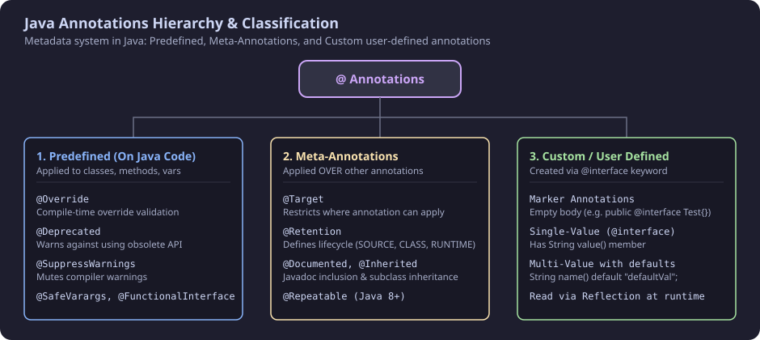
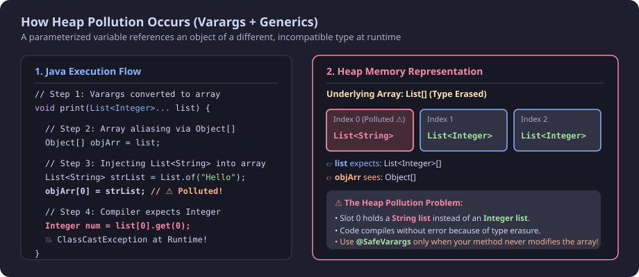
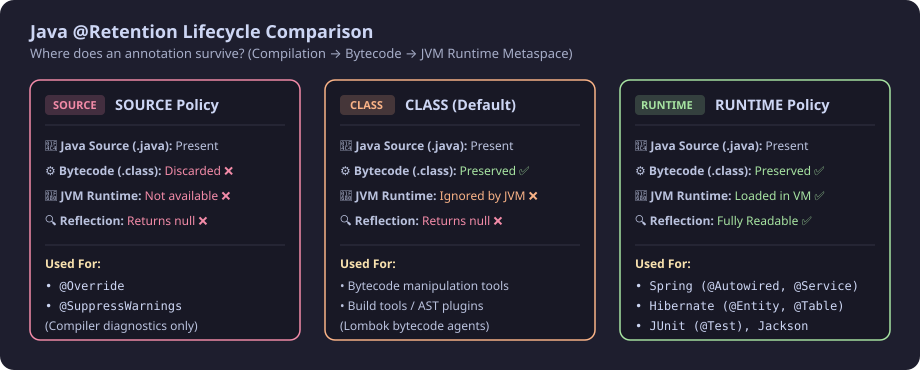
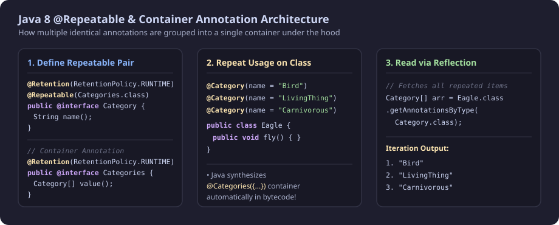

> **Core Connection:** Reflection is the way to access **Metadata**, and an Annotation is a form of **Metadata**. Therefore, **Reflection can be used to inspect and process Annotations at runtime**.

---

## 1. What is an Annotation?

* **Metadata in Code:** An annotation is a mechanism to add **metadata** (data about data) directly to Java source code without modifying the core program logic.
* **Optional Usage:** Annotation usage is purely **optional**; code can compile and run without them unless a framework or compiler checks for them.
* **Runtime Logic:** We can read this metadata at runtime using **Reflection** and execute custom business or framework logic accordingly.
* **Applicable Anywhere:** Annotations can be placed over **Classes, Interfaces, Methods, Fields, Parameters, Constructors, Local Variables, and Packages**.

```java
public interface Bird {
    public boolean fly();
}

public class Eagle implements Bird {
    @Override // Annotation (denoted using @) - optional but beneficial
    public boolean fly() {
        return true;
    }
}
```

---

## 2. Classification / Types of Annotations



Annotations in Java are categorized into:

1. **Predefined Annotations applied to Java Code:**
   * `@Override`
   * `@Deprecated`
   * `@SuppressWarnings`
   * `@FunctionalInterface`
   * `@SafeVarargs`
2. **Predefined Annotations applied to other Annotations (Meta-Annotations):**
   * `@Target`
   * `@Retention`
   * `@Documented`
   * `@Inherited`
   * `@Repeatable` *(Java 8+)*
3. **Custom / User-Defined Annotations:**
   * Created using the `@interface` keyword.

---

## 3. Predefined Annotations on Java Code

### 1. `@Deprecated`
* **Purpose:** Informs developers and the compiler that the annotated class, method, constructor, or field is **obsolete** and no further development/support will occur. A newer alternative should be used instead.
* **Compiler Action:** The compiler raises a **compile-time warning** whenever deprecated code is accessed (often rendered with a strikethrough like `~~dummyMethod()~~`).
* **Target Elements:** `CONSTRUCTOR`, `FIELD`, `LOCAL_VARIABLE`, `METHOD`, `PACKAGE`, `PARAMETER`, `TYPE` *(class, interface, enum)*.

```java
public class Mobile {
    @Deprecated
    public void dummyMethod() {
        // Obsolete implementation
    }
}
```

```java
public class Main {
    public static void main(String[] args) {
        Mobile mobileObj = new Mobile();
        // Compiler emits: "Inspection 'Deprecated API usage' has no quick-fixes"
        mobileObj.dummyMethod(); 
    }
}
```

---

### 2. `@Override`
* **Purpose:** Instructs the compiler to verify that the annotated method actually overrides a method from a parent class or implements a method from an interface.
* **Compiler Action:** If the method signature does not match any parent method, the compiler throws a **compile-time error**.
* **Target Elements:** `METHOD` only.

```java
public interface Bird {
    public boolean fly();
}

public class Eagle implements Bird {
    @Override
    public boolean fly1() { // ❌ Compile-time error: Method does not override from supertype
        return true;
    }
}
```

---

### 3. `@SuppressWarnings`
* **Purpose:** Instructs the compiler to **mute/ignore** specific compiler warnings for the annotated element.
* **Caution:** Warnings should be suppressed with care; suppressing valid compiler warnings (such as raw types or unchecked casts) can lead to runtime exceptions.
* **Target Elements:** `FIELD`, `METHOD`, `PARAMETER`, `CONSTRUCTOR`, `LOCAL_VARIABLE`, `TYPE` *(class, interface, enum)*.

#### Common Warning Keys:
* `"deprecation"` &rarr; Suppresses deprecation warnings.
* `"unused"` &rarr; Suppresses unused method, field, or variable warnings.
* `"unchecked"` &rarr; Suppresses unchecked generic type cast warnings.
* `"all"` &rarr; Suppresses **all** compiler warnings.

```java
public class Main {
    // Suppress deprecation at method level
    @SuppressWarnings("deprecation")
    public static void main(String[] args) {
        Mobile mobileObj = new Mobile();
        mobileObj.dummyMethod(); // No warning shown!
    }

    // Suppress unused warning
    @SuppressWarnings("unused")
    public void unusedMethod() {
        // Will not trigger 'unused method' warning
    }

    // Suppress all warnings
    @SuppressWarnings("all")
    public void executeAll() {
        Mobile m = new Mobile();
        m.dummyMethod();
    }
}
```

---

### 4. `@FunctionalInterface`
* **Purpose:** Designates an interface as a **Functional Interface** (an interface with exactly **one single abstract method**).
* **Compiler Action:** Throws a compile-time error if the interface contains 0 or more than 1 abstract method.
* **Target Elements:** `TYPE` *(interface)*.

```java
@FunctionalInterface
public interface Bird {
    public boolean fly(); // Exactly 1 abstract method ✅
    // public void eat(); // ❌ Adding this triggers: Multiple non-overriding abstract methods found
}
```

---

### 5. `@SafeVarargs`
* **Purpose:** Suppresses compiler warnings regarding potential **Heap Pollution** on methods or constructors accepting generic variable arguments (`varargs` e.g., `List<T>...`).
* **Requirements:**
  * Must be applied to methods that **cannot be overridden** (`static` or `final` methods).
  * In **Java 9+**, it can also be applied to `private` methods.
* **Target Elements:** `CONSTRUCTOR`, `METHOD`.

#### What is Heap Pollution?
Heap pollution occurs when a variable of a parameterized type (e.g., `List<Integer>`) refers to an object that is not of that parameterized type (e.g., `List<String>`). Because Java uses **Type Erasure** and varargs are converted to raw arrays internally (`List[]`), type mismatches can occur at runtime:



#### Safe Usage with `@SafeVarargs`:
```java
import java.util.ArrayList;
import java.util.List;

public class Log {
    @SafeVarargs
    public static void printLogValues(List<Integer>... logNumbersList) {
        // Safe operations: Only reading from varargs without polluting the array
        for (List<Integer> list : logNumbersList) {
            System.out.println(list);
        }
    }
}
```

---

## 4. Meta-Annotations (Annotations Applied Over Other Annotations)

Meta-annotations configure how other annotations behave, where they can be applied, and how long they persist.

```
                    ┌────────────────────────────────────────┐
                    │            Meta-Annotations            │
                    │   (Who defines how annotations work)   │
                    └────────────────────────────────────────┘
```

---

### 1. `@Target`
Specifies the syntactic locations in code where an annotation is allowed to be placed.

* Defined using the `ElementType` enum:
  * `ElementType.TYPE` &rarr; Class, Interface, Enum, Record, Annotation.
  * `ElementType.FIELD` &rarr; Fields and enum constants.
  * `ElementType.METHOD` &rarr; Methods.
  * `ElementType.PARAMETER` &rarr; Method/constructor parameters.
  * `ElementType.CONSTRUCTOR` &rarr; Constructors.
  * `ElementType.LOCAL_VARIABLE` &rarr; Local variables inside methods.
  * `ElementType.ANNOTATION_TYPE` &rarr; Applied to another annotation (Meta-annotation).
  * `ElementType.PACKAGE` &rarr; Package declarations (`package-info.java`).
  * `ElementType.TYPE_PARAMETER` *(Java 8+)* &rarr; Generic type parameter declarations (e.g., `<@Ann T>`).
  * `ElementType.TYPE_USE` *(Java 8+)* &rarr; Any use of a type (e.g., `List<@Ann String>`, casts, `throws`).

```java
// Example: @Override is targeted strictly to methods
@Target(ElementType.METHOD)
public @interface Override {
}

// Example: @SafeVarargs applies to Constructors and Methods
@Target({ElementType.CONSTRUCTOR, ElementType.METHOD})
public @interface SafeVarargs {
}
```

---

### 2. `@Retention`



Defines the **retention policy** (lifecycle) of the annotation—how long Java preserves the metadata.

* Defined using the `RetentionPolicy` enum:
  * **`RetentionPolicy.SOURCE`:**
    * Discarded by the compiler during compilation.
    * **Not** written into the `.class` bytecode file.
    * Used exclusively by the compiler (e.g., `@Override`, `@SuppressWarnings`).
  * **`RetentionPolicy.CLASS` (Default):**
    * Recorded in the `.class` bytecode file by the compiler.
    * **Ignored by the JVM** at runtime (not loaded into Metaspace).
    * Cannot be accessed via standard Reflection. Used by bytecode analysis tools.
  * **`RetentionPolicy.RUNTIME`:**
    * Recorded in the `.class` bytecode and loaded into JVM memory.
    * **Available at runtime and fully readable via Reflection** (`Class.getAnnotation()`).
    * Used by frameworks like Spring, Hibernate, JUnit, Jackson.

#### Comparison Example:

```java
// 1. RUNTIME Retention - Readable by Reflection
@Target(ElementType.TYPE)
@Retention(RetentionPolicy.RUNTIME)
public @interface MyCustomAnnotationWithInherited {
}

@MyCustomAnnotationWithInherited
public class TestClass {
}

public class Main {
    public static void main(String[] args) {
        // Output: @MyCustomAnnotationWithInherited() ✅
        System.out.println(TestClass.class.getAnnotation(MyCustomAnnotationWithInherited.class));
    }
}
```

```java
// 2. Default (CLASS) Retention - NOT readable at Runtime
@Target(ElementType.TYPE)
// Default is RetentionPolicy.CLASS when omitted
public @interface MyClassRetentionAnnotation {
}

@MyClassRetentionAnnotation
public class TestClass2 {
}

public class Main2 {
    public static void main(String[] args) {
        // Output: null ❌ (Discarded at runtime)
        System.out.println(TestClass2.class.getAnnotation(MyClassRetentionAnnotation.class));
    }
}
```

---

### 3. `@Documented`
* **Purpose:** Indicates that elements annotated with this annotation should be included in generated **Javadoc** documentation.
* **Default Behavior:** By default, annotations are omitted from Javadoc output.

```java
@Documented
@Retention(RetentionPolicy.RUNTIME)
@Target({ElementType.CONSTRUCTOR, ElementType.METHOD})
public @interface SafeVarargs {
}
```

When generating Javadoc (`Tools > Generate JavaDoc` in IntelliJ):
* Annotations with `@Documented` (like `@SafeVarargs`) appear in the generated method signature.
* Annotations without `@Documented` (like `@Override`) are excluded from documentation.

---

### 4. `@Inherited`
* **Purpose:** Enables **subclass inheritance** of class-level annotations.
* **Default Behavior:** By default, an annotation applied to a parent class is **not** automatically inherited by child classes.
* **Constraint:** Only applies to annotations with `@Target(ElementType.TYPE)` applied to classes (does not affect interfaces or methods).

```java
@Inherited
@Target(ElementType.TYPE)
@Retention(RetentionPolicy.RUNTIME)
public @interface MyCustomAnnotationWithInherited {
}

@MyCustomAnnotationWithInherited
public class ParentClass {
}

// ChildClass does NOT explicitly have @MyCustomAnnotationWithInherited
public class ChildClass extends ParentClass {
}

public class Main {
    public static void main(String[] args) {
        // Output: @MyCustomAnnotationWithInherited() ✅
        // Because @Inherited is present on the annotation definition!
        System.out.println(ChildClass.class.getAnnotation(MyCustomAnnotationWithInherited.class));
    }
}
```

> **Note:** If `@Inherited` is removed from the annotation definition, `ChildClass.class.getAnnotation(...)` returns `null`.

---

### 5. `@Repeatable` *(Introduced in Java 8)*



* **Purpose:** Allows applying the **same annotation multiple times** on the same declaration.
* **Pre-Java 8 Limitation:** Prior to Java 8, applying duplicate annotations was prohibited and caused a compilation error.

#### How `@Repeatable` Works:
`@Repeatable` requires a **Container Annotation** that holds an array of the repeatable annotation in its `value()` method.

```java
import java.lang.annotation.Repeatable;
import java.lang.annotation.Retention;
import java.lang.annotation.RetentionPolicy;

// Step 1: The Repeatable Annotation pointing to its container
@Repeatable(Categories.class)
@Retention(RetentionPolicy.RUNTIME)
public @interface Category {
    String name();
}

// Step 2: The Container Annotation holding an array of Category
@Retention(RetentionPolicy.RUNTIME)
public @interface Categories {
    Category[] value();
}
```

#### Usage on Class:
```java
@Category(name = "Bird")
@Category(name = "LivingThing")
@Category(name = "carnivorous")
public class Eagle {
    public void fly() {
    }
}
```

#### Reading Repeated Annotations via Reflection:
Use `getAnnotationsByType()` to retrieve all repeated instances in an array:

```java
public class Main {
    public static void main(String[] args) {
        Category[] categoryAnnotationArray = Eagle.class.getAnnotationsByType(Category.class);
        for (Category annotation : categoryAnnotationArray) {
            System.out.println(annotation.name());
        }
    }
}
```

#### Output:
```text
Bird
LivingThing
carnivorous
Process finished with exit code 0
```

---

## 5. User-Defined / Custom Annotations

Custom annotations are declared using the `@interface` keyword.

```java
// Note: @interface defines an annotation type, not a standard Java interface
public @interface MyCustomAnnotation {
}
```

---

### 1. Marker Annotation (Empty Body)
An annotation with no members. Acts as a simple flag/label (e.g., `@Override`, `@Deprecated`).

```java
public @interface MarkerAnnotation {
}

@MarkerAnnotation
public class Eagle {
    public void fly() {
    }
}
```

---

### 2. Annotation with Elements (Members)
Annotation members look like method declarations (no parameters, no body, no throws clause).

* **Allowed Return Types for Elements:**
  1. Primitive data types (`int`, `boolean`, `double`, `char`, `float`, `long`, `byte`, `short`)
  2. `String`
  3. `Class` (or parameterized `Class<?>`)
  4. `Enum` types
  5. Other `Annotation` types
  6. **1-Dimensional Arrays** of any of the above types (e.g., `String[]`, `Category[]`)

```java
public @interface MyCustomAnnotation {
    String name();
}

@MyCustomAnnotation(name = "testing")
public class Eagle {
    public void fly() {
    }
}
```

---

### 3. Annotation with Default Values
Elements can be provided with fallback `default` values using the `default` keyword. Default values **cannot be `null`**.

```java
public @interface MyCustomAnnotation {
    String name() default "hello";
    int priority() default 1;
}

// When default values exist, specifying elements during usage is optional:
@MyCustomAnnotation
public class Eagle {
    public void fly() {
    }
}

// Or override defaults explicitly:
@MyCustomAnnotation(name = "customEagle", priority = 5)
public class Hawk {
}
```

---

## 6. Summary Reference Table

| Category | Annotation | Purpose | Target | Retention |
| :--- | :--- | :--- | :--- | :--- |
| **Code** | `@Override` | Enforces method overriding | `METHOD` | `SOURCE` |
| **Code** | `@Deprecated` | Marks element as obsolete / warning | All targets | `RUNTIME` |
| **Code** | `@SuppressWarnings` | Mutes specific compiler warnings | All targets | `SOURCE` |
| **Code** | `@FunctionalInterface` | Enforces single abstract method | `TYPE` (Interface) | `RUNTIME` |
| **Code** | `@SafeVarargs` | Suppresses heap pollution on varargs | `CONSTRUCTOR`, `METHOD` | `RUNTIME` |
| **Meta** | `@Target` | Restricts placement locations | `ANNOTATION_TYPE` | `RUNTIME` |
| **Meta** | `@Retention` | Sets lifecycle (`SOURCE`, `CLASS`, `RUNTIME`) | `ANNOTATION_TYPE` | `RUNTIME` |
| **Meta** | `@Documented` | Includes annotation in Javadoc | `ANNOTATION_TYPE` | `RUNTIME` |
| **Meta** | `@Inherited` | Subclasses inherit class annotation | `ANNOTATION_TYPE` | `RUNTIME` |
| **Meta** | `@Repeatable` | Allows repeating annotation on same element | `ANNOTATION_TYPE` | `RUNTIME` |
