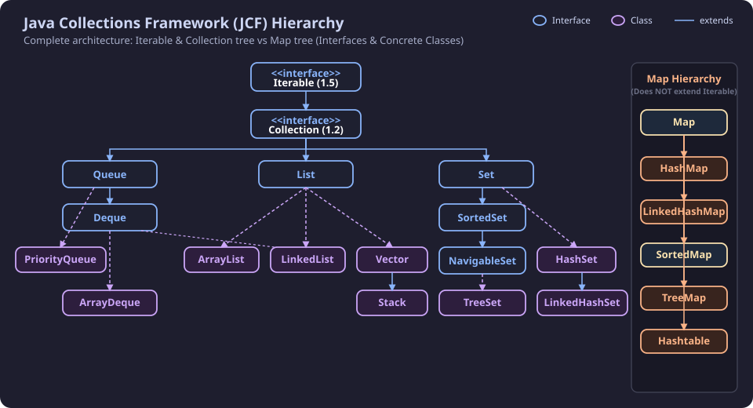
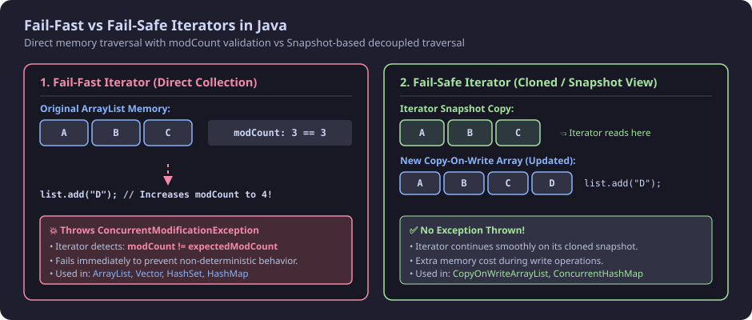
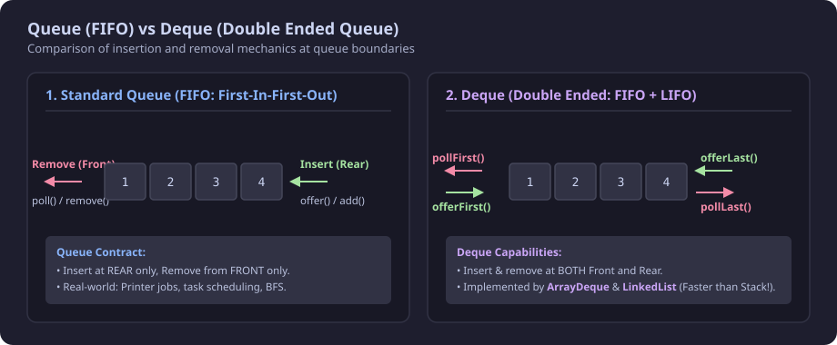
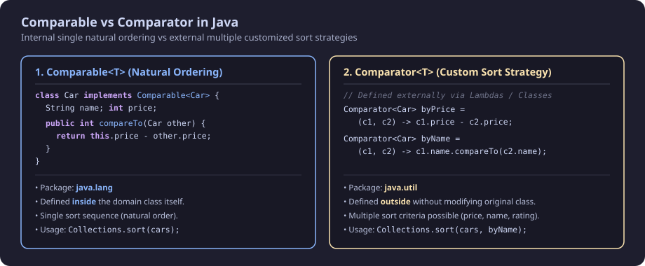
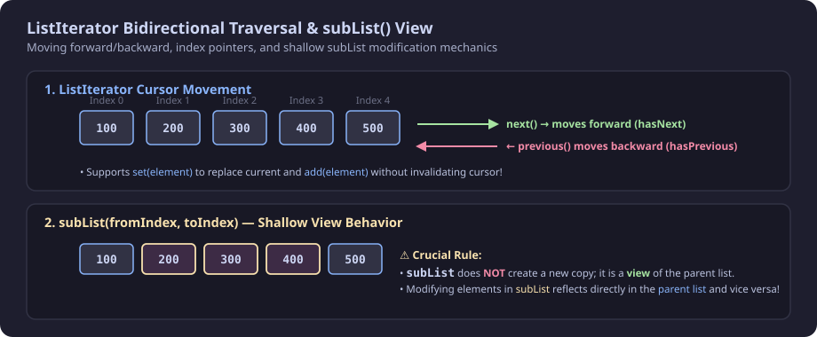

## 1. Introduction: What is Java Collections Framework (JCF)?

* **Added in Java 1.2:** Located in the `java.util` package.
* **Definition:** A **Collection** represents a group of individual objects as a single unit. The framework provides a unified architecture to store, manipulate, insert, update, delete, search, and sort data structures.
* **Why do we need JCF?**
  * Prior to Java 1.2, Java provided legacy container classes like `Array`, `Vector`, and `Hashtable`.
  * **Problem:** There was no common parent interface or standardized API across them. Developers had to remember completely different methods for each structure (e.g., `arr[0] = 1`, `vector.addElement(1)`, `hashtable.put(k, v)`).
  * **Solution (JCF):** Standardized interfaces (`Collection`, `List`, `Queue`, `Set`, `Map`) where the same method names (`add()`, `remove()`, `contains()`, `size()`) work universally across all implementations.

```java
// Before JCF: Inconsistent methods
int[] arr = new int[4];
arr[0] = 1;                    // Array indexing

Vector<Integer> vector = new Vector<>();
vector.add(1);                 // Vector method

// With JCF: Uniform Interface
Collection<Integer> col = new ArrayList<>();
col.add(1);                    // Common method across all collections
```

---

## 2. JCF Architecture & Hierarchy



### Key Hierarchy Points:
1. **`Iterable<T>` (Added in Java 1.5):** Root interface of the collection hierarchy. Declares `iterator()`, `forEach()` (Java 8), and `spliterator()`.
2. **`Collection<E>` (Added in Java 1.2):** Extends `Iterable`. The direct root interface for `List`, `Queue`, and `Set`.
3. **`Map<K, V>` (Separate Hierarchy):** `Map` is **NOT** a subtype of `Collection` or `Iterable` because it works with Key-Value pairs rather than individual elements.

---

## 3. `Iterable` Interface & 3 Ways to Iterate

* **Package:** `java.lang.Iterable`
* **Core Methods:**
  * `iterator()` &rarr; Returns an `Iterator<T>` instance with `hasNext()`, `next()`, `remove()`.
  * `forEach(Consumer<? super T> action)` *(Java 8+)* &rarr; Functional iteration via lambda expressions.

```java
import java.util.ArrayList;
import java.util.Iterator;
import java.util.List;

public class Main {
    public static void main(String[] args) {
        List<Integer> values = new ArrayList<>();
        values.add(1);
        values.add(2);
        values.add(3);
        values.add(4);

        // 1. Using Iterator (Allows safe removal while traversing)
        System.out.println("--- Iterating using Iterator ---");
        Iterator<Integer> valuesIterator = values.iterator();
        while (valuesIterator.hasNext()) {
            int val = valuesIterator.next();
            System.out.println(val);
            if (val == 3) {
                valuesIterator.remove(); // Safely removes element '3'
            }
        }

        // 2. Using Enhanced for-each loop
        System.out.println("--- Iterating using for-each loop ---");
        for (int val : values) {
            System.out.println(val);
        }

        // 3. Using forEach() method with Lambda (Java 8+)
        System.out.println("--- Iterating using forEach method ---");
        values.forEach((Integer val) -> System.out.println(val));
    }
}
```

#### Output:
```text
--- Iterating using Iterator ---
1
2
3
4
--- Iterating using for-each loop ---
1
2
4
--- Iterating using forEach method ---
1
2
4
```

> **Note on `Map`:** You cannot directly write `for (var item : map)` because `Map` does not implement `Iterable`. You must iterate over `map.entrySet()`, `map.keySet()`, or `map.values()`.

---

## 3.1. Fail-Fast vs Fail-Safe Iterators (Deep Dive)



When traversing a collection in Java, modifying the collection concurrently (adding, removing, or updating elements) can lead to unpredictable behavior. Java categorizes iterators into two distinct types based on how they handle such modifications:

---

### 1. Fail-Fast Iterators

* **Mechanism:** Operates **directly on the original collection's memory**.
* **`modCount` Tracking:** The collection maintains an internal integer field called `modCount` (modification count). When an iterator is created, it caches `expectedModCount = modCount`.
* **Behavior:** On every call to `next()` or `hasNext()`, the iterator checks if `modCount == expectedModCount`.
  * If the collection is structurally modified (e.g., calling `list.add()`, `list.remove()`) **without using the iterator's own `iterator.remove()`**, `modCount` changes.
  * The iterator detects the mismatch and **immediately throws `ConcurrentModificationException`**.
* **Collections Using Fail-Fast:** `ArrayList`, `Vector`, `LinkedList`, `HashSet`, `TreeSet`, `HashMap`, `TreeMap`.

#### ❌ Fail-Fast Example (Triggering Exception):
```java
import java.util.ArrayList;
import java.util.Iterator;
import java.util.List;

public class FailFastExample {
    public static void main(String[] args) {
        List<String> list = new ArrayList<>();
        list.add("Apple");
        list.add("Banana");
        list.add("Cherry");

        Iterator<String> iterator = list.iterator();
        while (iterator.hasNext()) {
            String fruit = iterator.next();
            System.out.println("Processing: " + fruit);

            // ❌ Structural modification directly on the List while iterating!
            if (fruit.equals("Banana")) {
                list.add("Dragonfruit"); // Increments modCount!
            }
        }
    }
}
```

#### Output (Exception):
```text
Processing: Apple
Processing: Banana
Exception in thread "main" java.util.ConcurrentModificationException
    at java.base/java.util.ArrayList$Itr.checkForComodification(ArrayList.java:1013)
    at java.base/java.util.ArrayList$Itr.next(ArrayList.java:967)
    at FailFastExample.main(FailFastExample.java:13)
```

#### ✅ How to Safely Remove in Fail-Fast:
Always use `iterator.remove()` instead of `list.remove()`. The iterator updates its internal `expectedModCount` automatically:

```java
Iterator<String> it = list.iterator();
while (it.hasNext()) {
    if (it.next().equals("Banana")) {
        it.remove(); // ✅ Safe! No exception thrown.
    }
}
```

---

### 2. Fail-Safe / Weakly Consistent Iterators

* **Mechanism:** Operates on a **cloned copy / snapshot** of the underlying collection, or relies on lock-free volatile reads (as in concurrent collections).
* **Behavior:** Modifications made to the collection (like `list.add()`) during traversal operate on a newly allocated internal array or structure. The iterator continues traversing its original immutable snapshot.
* **Result:** **Never throws `ConcurrentModificationException`**.
* **Trade-offs:**
  * **Memory Overhead:** Modifying elements allocates new internal arrays (Copy-On-Write).
  * **Eventual Consistency:** The iterator may not reflect real-time elements added after the iterator was created.
* **Collections Using Fail-Safe:** `CopyOnWriteArrayList`, `CopyOnWriteArraySet`, `ConcurrentHashMap`.

#### ✅ Fail-Safe Example (CopyOnWriteArrayList):
```java
import java.util.Iterator;
import java.util.concurrent.CopyOnWriteArrayList;

public class FailSafeExample {
    public static void main(String[] args) {
        CopyOnWriteArrayList<String> list = new CopyOnWriteArrayList<>();
        list.add("Apple");
        list.add("Banana");
        list.add("Cherry");

        Iterator<String> iterator = list.iterator();
        while (iterator.hasNext()) {
            String fruit = iterator.next();
            System.out.println("Processing: " + fruit);

            // ✅ Modifying during iteration does NOT throw exception!
            if (fruit.equals("Banana")) {
                list.add("Dragonfruit"); // Writes to a new copy of array
            }
        }

        System.out.println("Final List after iteration: " + list);
    }
}
```

#### Output:
```text
Processing: Apple
Processing: Banana
Processing: Cherry
Final List after iteration: [Apple, Banana, Cherry, Dragonfruit]
```

> **Notice:** `"Dragonfruit"` was added successfully, but the iterator did not print `"Dragonfruit"` because it was iterating over the original snapshot.

---

### Fail-Fast vs Fail-Safe Comparison Matrix

| Feature | Fail-Fast Iterator | Fail-Safe (Weakly Consistent) Iterator |
| :--- | :--- | :--- |
| **Exception Thrown** | Throws `ConcurrentModificationException` | **No exception thrown** |
| **Data Traversed** | Operates directly on the **original collection** | Operates on a **cloned snapshot / view** |
| **Detection Mechanism**| Compares `modCount == expectedModCount` | Decoupled snapshot / volatile memory segment |
| **Memory Overhead** | Low (Zero additional copying) | Higher (Clones internal array on write) |
| **Performance** | Faster for read-only operations | High read throughput, slower on frequent writes |
| **Modifications Reflected?**| N/A (Fails immediately) | May not reflect newly added elements during traversal |
| **Package** | `java.util` (standard collections) | `java.util.concurrent` (concurrent collections) |
| **Key Examples** | `ArrayList`, `Vector`, `HashSet`, `HashMap` | `CopyOnWriteArrayList`, `ConcurrentHashMap` |

---

## 4. `Collection` Interface Methods

| S.No | Method | Available In | Description |
| :--- | :--- | :--- | :--- |
| 1 | `size()` | Java 1.2 | Returns total number of elements present in the collection |
| 2 | `isEmpty()` | Java 1.2 | Returns `true` if collection has no elements, else `false` |
| 3 | `contains(Object o)` | Java 1.2 | Returns `true` if element exists |
| 4 | `toArray()` | Java 1.2 | Converts collection into an array (`Object[]` or `T[]`) |
| 5 | `add(E e)` | Java 1.2 | Inserts an element into the collection |
| 6 | `remove(Object o)` | Java 1.2 | Removes a single instance of the specified element |
| 7 | `addAll(Collection<? extends E> c)` | Java 1.2 | Inserts all elements from another collection |
| 8 | `removeAll(Collection<?> c)` | Java 1.2 | Removes all elements contained in specified collection |
| 9 | `clear()` | Java 1.2 | Removes all elements from collection |
| 10 | `equals(Object o)` | Java 1.2 | Compares two collections for equality |
| 11 | `stream()` / `parallelStream()` | Java 1.8 | Provides functional data processing pipeline |
| 12 | `iterator()` | Java 1.2 | Returns an iterator over elements |

---

### Index vs Object Removal Gotcha in `List<Integer>`

```java
import java.util.ArrayList;
import java.util.List;
import java.util.Stack;

public class Main {
    public static void main(String[] args) {
        List<Integer> values = new ArrayList<>();
        values.add(2);
        values.add(3);
        values.add(4);

        System.out.println("size: " + values.size());               // size: 3
        System.out.println("isEmpty: " + values.isEmpty());         // isEmpty: false
        System.out.println("contains 5: " + values.contains(5));    // contains: false

        values.add(5);
        System.out.println("added: " + values.contains(5));         // added: true

        // ⚠️ CRITICAL GOTCHA:
        // values.remove(3) treats primitive int as INDEX!
        values.remove(3); // Removes element at index 3 (which is 5)
        System.out.println("removed using index: " + values.contains(5)); // false

        // To remove by VALUE/OBJECT:
        values.remove(Integer.valueOf(3)); // Removes value 3
        System.out.println("removed using object: " + values.contains(3)); // false

        // addAll from Stack
        Stack<Integer> stackValues = new Stack<>();
        stackValues.add(6);
        stackValues.add(7);
        stackValues.add(8);
        values.addAll(stackValues);
        System.out.println("addAll test using containsAll: " + values.containsAll(stackValues)); // true

        // removeAll
        values.remove(Integer.valueOf(7));
        System.out.println("containsAll after removing 1 element: " + values.containsAll(stackValues)); // false

        values.removeAll(stackValues);
        System.out.println("removeAll: " + values.contains(8)); // false

        values.clear();
        System.out.println("clear: " + values.isEmpty()); // true
    }
}
```

---

## 5. Difference between `Collection` and `Collections`

| Feature | `Collection` | `Collections` |
| :--- | :--- | :--- |
| **Type** | Interface (`java.util.Collection`) | Utility Class (`java.util.Collections`) |
| **Purpose** | Root interface implemented by `List`, `Set`, `Queue` | Utility class containing `static` helper algorithms |
| **Instantiation** | Cannot be instantiated directly | Cannot be instantiated (private constructor) |
| **Key Methods** | `add()`, `remove()`, `size()`, `clear()`, `contains()` | `sort()`, `binarySearch()`, `reverse()`, `shuffle()`, `min()`, `max()`, `unmodifiableList()` |

```java
import java.util.ArrayList;
import java.util.Collections;
import java.util.List;

public class Main {
    public static void main(String[] args) {
        List<Integer> values = new ArrayList<>();
        values.add(1);
        values.add(3);
        values.add(2);
        values.add(4);

        System.out.println("max value: " + Collections.max(values)); // 4
        System.out.println("min value: " + Collections.min(values)); // 1

        Collections.sort(values); // In-place sorting
        System.out.println("sorted:");
        values.forEach(val -> System.out.println(val));
    }
}
```

---

## 6. `Queue` Interface & `PriorityQueue`



A **Queue** orders elements in **FIFO (First-In-First-Out)** order. Elements are inserted at the **rear (tail)** and removed from the **front (head)**.

### The 6 Core Queue Methods:

| Operation | Throws Exception (if failed) | Returns Special Value (`false` / `null`) |
| :--- | :--- | :--- |
| **Insert** | `add(e)` *(Throws `IllegalStateException`/`NPE`)* | `offer(e)` *(Returns `false` if capacity full)* |
| **Remove** | `remove()` *(Throws `NoSuchElementException`)* | `poll()` *(Returns `null` if empty)* |
| **Examine** | `element()` *(Throws `NoSuchElementException`)* | `peek()` *(Returns `null` if empty)* |

---

### `PriorityQueue`

* **Internal Structure:** Implemented as a **Binary Heap** (Min-Heap by default).
* **Ordering:** Elements are ordered according to their **Natural Ordering** (e.g., numbers ascending, strings lexicographically) or via a custom **`Comparator`** provided at construction.
* **Null Values:** Null elements are **not allowed** (throws `NullPointerException`).

#### 1. Min Priority Queue (Default):
```java
import java.util.PriorityQueue;

public class MinPriorityQueueExample {
    public static void main(String[] args) {
        // Min Priority Queue (lowest element has highest priority)
        PriorityQueue<Integer> minPQ = new PriorityQueue<>();
        minPQ.add(5);
        minPQ.add(2);
        minPQ.add(8);
        minPQ.add(1);

        // Removal order: 1, 2, 5, 8
        while (!minPQ.isEmpty()) {
            System.out.println("remove from top: " + minPQ.poll());
        }
    }
}
```

#### 2. Max Priority Queue (Using Comparator):
```java
import java.util.PriorityQueue;

public class MaxPriorityQueueExample {
    public static void main(String[] args) {
        // Max Priority Queue: (b - a) or (a, b) -> b.compareTo(a)
        PriorityQueue<Integer> maxPQ = new PriorityQueue<>((Integer a, Integer b) -> b - a);
        maxPQ.add(5);
        maxPQ.add(2);
        maxPQ.add(8);
        maxPQ.add(1);

        // Removal order: 8, 5, 2, 1
        while (!maxPQ.isEmpty()) {
            System.out.println("remove from top: " + maxPQ.poll());
        }
    }
}
```

#### 3. Custom Class with `Comparable` (Natural String Ordering):
When adding custom objects to a `PriorityQueue` without passing a `Comparator`, the class **must implement `Comparable`**, otherwise a `ClassCastException` is thrown at runtime upon insertion.

```java
import java.util.PriorityQueue;

class Student implements Comparable<Student> {
    String name;
    int rank;

    public Student(String name, int rank) {
        this.name = name;
        this.rank = rank;
    }

    // Natural Ordering: Lexicographical / Alphabetical order of String 'name'
    @Override
    public int compareTo(Student other) {
        return this.name.compareTo(other.name);
    }

    @Override
    public String toString() {
        return "Student{name='" + name + "', rank=" + rank + "}";
    }
}

public class PriorityQueueComparableExample {
    public static void main(String[] args) {
        PriorityQueue<Student> pq = new PriorityQueue<>();
        pq.add(new Student("Charlie", 3));
        pq.add(new Student("Alice", 1));
        pq.add(new Student("Bob", 2));
        pq.add(new Student("Daniel", 4));

        System.out.println("--- Polling by Natural Name Order (Alphabetical A-Z) ---");
        while (!pq.isEmpty()) {
            System.out.println(pq.poll());
        }
    }
}
```

#### Output:
```text
--- Polling by Natural Name Order (Alphabetical A-Z) ---
Student{name='Alice', rank=1}
Student{name='Bob', rank=2}
Student{name='Charlie', rank=3}
Student{name='Daniel', rank=4}
```

---

#### 4. Custom Class with `Comparator` (Custom String Ordering Strategies):
If the class does **not** implement `Comparable`, or if you need **multiple different sorting behaviors** (e.g., Reverse Alphabetical Z-A, String Length, or Multi-Field tie-breaking), pass a `Comparator` directly to the `PriorityQueue` constructor:

```java
import java.util.Comparator;
import java.util.PriorityQueue;

class Employee {
    String empName;
    String department;

    public Employee(String empName, String department) {
        this.empName = empName;
        this.department = department;
    }

    @Override
    public String toString() {
        return "Employee{name='" + empName + "', dept='" + department + "'}";
    }
}

public class PriorityQueueComparatorExample {
    public static void main(String[] args) {
        // Strategy 1: Reverse Alphabetical (Z to A) on String 'empName'
        Comparator<Employee> reverseNameComparator = (e1, e2) -> e2.empName.compareTo(e1.empName);

        PriorityQueue<Employee> reversePQ = new PriorityQueue<>(reverseNameComparator);
        reversePQ.add(new Employee("Zara", "IT"));
        reversePQ.add(new Employee("John", "HR"));
        reversePQ.add(new Employee("Alex", "Finance"));
        reversePQ.add(new Employee("Mohit", "Engineering"));

        System.out.println("--- Polling by Reverse Name Order (Z to A) ---");
        while (!reversePQ.isEmpty()) {
            System.out.println(reversePQ.poll());
        }

        // Strategy 2: Multi-Field Sorting (Department Alphabetical, then Name Length)
        Comparator<Employee> multiFieldComparator = Comparator
                .comparing((Employee e) -> e.department)
                .thenComparingInt(e -> e.empName.length());

        PriorityQueue<Employee> multiPQ = new PriorityQueue<>(multiFieldComparator);
        multiPQ.add(new Employee("Alexander", "IT"));
        multiPQ.add(new Employee("Bob", "IT"));
        multiPQ.add(new Employee("Charlie", "Finance"));

        System.out.println("\n--- Polling by Dept then Name Length ---");
        while (!multiPQ.isEmpty()) {
            System.out.println(multiPQ.poll());
        }
    }
}
```

#### Output:
```text
--- Polling by Reverse Name Order (Z to A) ---
Employee{name='Zara', dept='IT'}
Employee{name='Mohit', dept='Engineering'}
Employee{name='John', dept='HR'}
Employee{name='Alex', dept='Finance'}

--- Polling by Dept then Name Length ---
Employee{name='Charlie', dept='Finance'}
Employee{name='Bob', dept='IT'}
Employee{name='Alexander', dept='IT'}
```

---

#### Time & Space Complexity of `PriorityQueue`:
* **`offer()` / `add()`:** $O(\log n)$
* **`poll()` / `remove()`:** $O(\log n)$
* **`peek()` / `element()`:** $O(1)$
* **`remove(arbitraryObject)`:** $O(n)$
* **Space Complexity:** $O(n)$

---

## 7. `Comparable` vs `Comparator` (Deep Dive)



### Sorting Primitives vs Sorting Custom Objects:
* **Primitive Arrays:** `Arrays.sort(primitiveArray)` uses **Dual-Pivot Quicksort** ($O(n \log n)$).
* **Object Arrays & Lists:** `Arrays.sort(objectArray)` and `Collections.sort(list)` use **TimSort** (Hybrid MergeSort + InsertionSort).
* **The Problem with Custom Objects:** If custom objects do not define a comparison strategy, calling `Arrays.sort(carArray)` throws `ClassCastException: Car cannot be cast to java.lang.Comparable`.

---

### Understanding the Comparison Contract:

Both `compareTo(o)` and `compare(o1, o2)` follow the universal 3-way comparison rule:

| Returned Value | Meaning | Action in Sorting Algorithm |
| :--- | :--- | :--- |
| **Negative (`< 0`)** | $v_1 < v_2$ | $v_1$ comes **before** $v_2$ (No swap) |
| **Zero (`== 0`)** | $v_1 == v_2$ | Both are equal in order |
| **Positive (`> 0`)** | $v_1 > v_2$ | $v_1$ comes **after** $v_2$ (Swap occurs) |

* **Ascending Order:** `(a, b) -> a - b` (or `v1 - v2`): If $v_1 > v_2$, result is positive $\implies$ swap $v_2$ before $v_1$.
* **Descending Order:** `(a, b) -> b - a` (or `v2 - v1`): If $v_2 > v_1$, result is positive $\implies$ swap $v_2$ before $v_1$.

---

### 1. `Comparable<T>` (Natural / Self Sorting)
* **Package:** `java.lang.Comparable`
* **Method:** `public int compareTo(T other)`
* **Location:** Written **inside** the domain class.

```java
import java.util.ArrayList;
import java.util.Collections;
import java.util.List;

class Car implements Comparable<Car> {
    String carName;
    String carType;

    public Car(String carName, String carType) {
        this.carName = carName;
        this.carType = carType;
    }

    // Single natural ordering: sort by carName ascending
    @Override
    public int compareTo(Car other) {
        return this.carName.compareTo(other.carName);
    }
}

public class Main {
    public static void main(String[] args) {
        List<Car> cars = new ArrayList<>();
        cars.add(new Car("suv", "petrol"));
        cars.add(new Car("sedan", "diesel"));
        cars.add(new Car("hatchback", "cng"));

        Collections.sort(cars); // Uses compareTo automatically

        for (Car c : cars) {
            System.out.println(c.carName + ".." + c.carType);
        }
    }
}
```

#### Output:
```text
hatchback..cng
sedan..diesel
suv..petrol
```

---

### 2. `Comparator<T>` (Custom / Multiple Sort Strategies)
* **Package:** `java.util.Comparator`
* **Method:** `public int compare(T o1, T o2)`
* **Functional Interface:** Can be written via Lambdas or separate classes without touching the original class.

```java
import java.util.ArrayList;
import java.util.Collections;
import java.util.Comparator;
import java.util.List;

public class Main {
    public static void main(String[] args) {
        List<Car> cars = new ArrayList<>();
        cars.add(new Car("suv", "petrol"));
        cars.add(new Car("sedan", "diesel"));
        cars.add(new Car("hatchback", "cng"));

        // Strategy 1: Sort by Car Name Descending (Lambda)
        Collections.sort(cars, (Car o1, Car o2) -> o2.carName.compareTo(o1.carName));

        // Strategy 2: Sort by Car Type Ascending (Lambda)
        Collections.sort(cars, (Car o1, Car o2) -> o1.carType.compareTo(o2.carType));
    }
}
```

---

### Multi-Field Pair Comparison Example (First Name & Last Name):

```java
import java.util.Arrays;

class Pair implements Comparable<Pair> {
    String firstName;
    String lastName;

    public Pair(String x, String y) {
        this.firstName = x;
        this.lastName = y;
    }

    @Override
    public String toString() {
        return "( " + firstName + " , " + lastName + " )";
    }

    @Override
    public int compareTo(Pair other) {
        // Compare by firstName first; if equal, tie-break with lastName
        if (this.firstName.compareTo(other.firstName) != 0) {
            return this.firstName.compareTo(other.firstName);
        } else {
            return this.lastName.compareTo(other.lastName);
        }
    }
}

public class Main {
    public static void main(String[] args) {
        Pair[] arr = new Pair[4];
        arr[0] = new Pair("raj", "kashup");
        arr[1] = new Pair("rahul", "singh");
        arr[2] = new Pair("reshmi", "dubey");
        arr[3] = new Pair("rahul", "jetli");

        Arrays.sort(arr);

        for (Pair p : arr) {
            System.out.println(p);
        }
    }
}
```

#### Output:
```text
( rahul , jetli )
( rahul , singh )
( raj , kashup )
( reshmi , dubey )
```

---

### Key Differences: `Comparable` vs `Comparator`

| Feature | `Comparable` | `Comparator` |
| :--- | :--- | :--- |
| **Package** | `java.lang` | `java.util` |
| **Method** | `compareTo(T o)` | `compare(T o1, T o2)` |
| **Implementation** | Inside the domain class itself | Outside the class (separate class or Lambda) |
| **Sort Strategies**| Only **one** (Natural Order) | **Multiple** custom strategies |
| **Modifies Class?**| Yes (Requires source code access) | No (Works with closed/library classes) |
| **Usage** | `Collections.sort(list)` | `Collections.sort(list, comparator)` |

---

## 8. `Deque` Interface & `ArrayDeque`

* **Definition:** **D**ouble-**E**nded **Que**ue. Allows insertion, retrieval, and deletion at **both Front and Rear**.
* **Versatility:** Can be used as a **FIFO Queue** or a **LIFO Stack** (faster than `java.util.Stack` and `LinkedList`).

### Methods in `Deque`:

| Operation | Front (Head) - Throws Exception | Front (Head) - Special Value | Rear (Tail) - Throws Exception | Rear (Tail) - Special Value |
| :--- | :--- | :--- | :--- | :--- |
| **Insert** | `addFirst(e)` | `offerFirst(e)` | `addLast(e)` | `offerLast(e)` |
| **Remove** | `removeFirst()` | `pollFirst()` | `removeLast()` | `pollLast()` |
| **Examine** | `getFirst()` | `peekFirst()` | `getLast()` | `peekLast()` |

---

### `ArrayDeque` Usage as Queue and Stack:

```java
import java.util.ArrayDeque;

public class Main {
    public static void main(String[] args) {
        // 1. Used as FIFO Queue
        ArrayDeque<Integer> queue = new ArrayDeque<>();
        queue.addLast(1);
        queue.addLast(5);
        queue.addLast(10);
        System.out.println("Removed from Queue (FIFO): " + queue.removeFirst()); // 1

        // 2. Used as LIFO Stack
        ArrayDeque<Integer> stack = new ArrayDeque<>();
        stack.addFirst(1);
        stack.addFirst(5);
        stack.addFirst(10);
        System.out.println("Removed from Stack (LIFO): " + stack.removeFirst()); // 10
    }
}
```

#### Time Complexity of `ArrayDeque`:
* **Insertion (`addFirst`/`addLast`):** $O(1)$ amortized (resizes when array capacity exceeded).
* **Deletion (`removeFirst`/`removeLast`):** $O(1)$
* **Search / Contains:** $O(n)$
* **Space Complexity:** $O(n)$

---

## 9. `List` Interface & `ArrayList`

A `List` is an **ordered collection** allowing duplicate elements and **random index-based access** ($0$ to $n-1$).

### How `List` Differs from `Queue`:
* In a `Queue`, elements are strictly added at ends and removed at ends.
* In a `List`, elements can be inserted, updated, and accessed **anywhere in between** using integer indices (`add(index, e)`, `get(index)`, `remove(index)`).

---

### `ListIterator` & Bidirectional Traversal



`ListIterator<E>` extends `Iterator<E>` and supports:
* **Backward Traversal:** `hasPrevious()`, `previous()`.
* **Index Queries:** `nextIndex()`, `previousIndex()`.
* **In-place Modifications:** `set(E e)`, `add(E e)`.

```java
import java.util.ArrayList;
import java.util.List;
import java.util.ListIterator;

public class Main {
    public static void main(String[] args) {
        List<Integer> list = new ArrayList<>();
        list.add(100);
        list.add(200);
        list.add(300);

        // Backward Traversal from list end
        ListIterator<Integer> listIterator = list.listIterator(list.size());
        while (listIterator.hasPrevious()) {
            int val = listIterator.previous();
            System.out.println("backward: " + val);
            if (val == 200) {
                listIterator.set(-200); // Modifies element in place
            }
        }
    }
}
```

---

### `subList(fromIndex, toIndex)` Shallow View Behavior:
* `list.subList(fromIndex, toIndex)` returns a **view** (range `[fromIndex, toIndex)`).
* It does **NOT** allocate a new list; changes in `subList` reflect directly in the master list!

```java
List<Integer> master = new ArrayList<>(List.of(10, 20, 30, 40, 50));
List<Integer> sub = master.subList(1, 4); // [20, 30, 40]

sub.set(0, 999);
System.out.println(master); // Outputs: [10, 999, 30, 40, 50] ✅
```

---

## 10. `LinkedList`, `Vector`, and `Stack`

### 1. `LinkedList` (Deep Dive)

* **Internal Structure:** Implemented as a **Doubly Linked List** where each node maintains pointers to both `prev` and `next` nodes.
* **Dual Nature:** Implements both **`List<E>`** and **`Deque<E>`** (and by extension `Queue<E>`).
* **Pros:** Insertions and deletions at ends (`addFirst`, `addLast`, `removeFirst`, `removeLast`) are strictly $O(1)$ without any memory shifting.
* **Cons:** Random index-based access `get(index)` is $O(n)$ because it must traverse node-by-node from the nearest end.

#### All Key Methods of `LinkedList`:

| Category | Method | Description |
| :--- | :--- | :--- |
| **List Operations** | `add(e)`, `add(index, e)` | Inserts element at end or specific index |
| | `get(index)` | Returns element at specified index ($O(n)$) |
| | `set(index, e)` | Replaces element at specified index |
| | `remove(index)`, `remove(Object o)` | Removes element by index or value |
| | `indexOf(o)`, `lastIndexOf(o)` | Returns index of first/last occurrence |
| **Deque / End Operations** | `addFirst(e)`, `addLast(e)` | Inserts element at beginning or end ($O(1)$) |
| | `offerFirst(e)`, `offerLast(e)` | Inserts at front/tail (returns `false` if capacity full) |
| | `getFirst()`, `getLast()` | Retrieves front/tail (throws `NoSuchElementException` if empty) |
| | `peek()`, `peekFirst()`, `peekLast()`| Retrieves front/tail without removing (returns `null` if empty) |
| | `removeFirst()`, `removeLast()` | Removes and returns front/tail (throws exception if empty) |
| | `poll()`, `pollFirst()`, `pollLast()` | Removes and returns front/tail (returns `null` if empty) |
| | `removeFirstOccurrence(o)` | Removes first occurrence of object |
| | `removeLastOccurrence(o)` | Removes last occurrence of object |
| **Stack Operations (LIFO)** | `push(e)` | Pushes element at the top (internally calls `addFirst(e)`) |
| | `pop()` | Pops element from top (internally calls `removeFirst()`) |
| **Utilities** | `descendingIterator()` | Returns reverse iterator from tail to head |
| | `size()`, `isEmpty()`, `clear()` | General collection utilities |

---

#### Comprehensive `LinkedList` Code Example:

```java
import java.util.Iterator;
import java.util.LinkedList;

public class LinkedListAllMethodsExample {
    public static void main(String[] args) {
        LinkedList<String> list = new LinkedList<>();

        // 1. Basic List Additions
        list.add("Java");
        list.add("Python");
        list.add("C++");
        list.add(1, "Go"); // Insert at index 1
        System.out.println("Initial List: " + list);

        // 2. Deque Operations (Front & Tail)
        list.addFirst("Rust");   // Add at front
        list.addLast("Kotlin");  // Add at rear
        System.out.println("After addFirst & addLast: " + list);

        System.out.println("getFirst(): " + list.getFirst()); // Rust
        System.out.println("getLast(): " + list.getLast());   // Kotlin
        System.out.println("peekFirst(): " + list.peekFirst()); // Rust
        System.out.println("peekLast(): " + list.peekLast());   // Kotlin

        // 3. Deque Removals
        System.out.println("removeFirst(): " + list.removeFirst()); // Rust
        System.out.println("removeLast(): " + list.removeLast());   // Kotlin
        System.out.println("After removals: " + list);

        // 4. Index-based Operations
        System.out.println("get(2): " + list.get(2)); // Python
        list.set(2, "TypeScript"); // Replace at index 2
        System.out.println("After set(2, 'TypeScript'): " + list);

        // 5. Stack (LIFO) Operations via LinkedList
        list.push("Swift"); // Pushes to front
        System.out.println("After push('Swift'): " + list);
        System.out.println("pop(): " + list.pop()); // Removes front (Swift)

        // 6. Occurrence-based Removal
        list.add("Java"); // Duplicate
        System.out.println("With duplicate: " + list);
        list.removeFirstOccurrence("Java");
        System.out.println("After removeFirstOccurrence('Java'): " + list);

        // 7. Descending Iterator (Reverse Traversal)
        System.out.print("Reverse Traversal: ");
        Iterator<String> descIt = list.descendingIterator();
        while (descIt.hasNext()) {
            System.out.print(descIt.next() + " -> ");
        }
        System.out.println("null");
    }
}
```

#### Output:
```text
Initial List: [Java, Go, Python, C++]
After addFirst & addLast: [Rust, Java, Go, Python, C++, Kotlin]
getFirst(): Rust
getLast(): Kotlin
peekFirst(): Rust
peekLast(): Kotlin
removeFirst(): Rust
removeLast(): Kotlin
After removals: [Java, Go, Python, C++]
get(2): Python
After set(2, 'TypeScript'): [Java, Go, TypeScript, C++]
After push('Swift'): [Swift, Java, Go, TypeScript, C++]
pop(): Swift
With duplicate: [Java, Go, TypeScript, C++, Java]
After removeFirstOccurrence('Java'): [Go, TypeScript, C++, Java]
Reverse Traversal: Java -> C++ -> TypeScript -> Go -> null
```

---

### 2. `Vector` (Legacy Synchronized List)
* Same resizable array concept as `ArrayList`.
* **Thread-Safe:** All methods are marked `synchronized` (acquires object lock on every operation).
* **Performance:** Slower due to locking overhead. Replaced in modern Java by `ArrayList` or `CopyOnWriteArrayList`.

---

### 3. `Stack` (Deep Dive)

* **Definition:** Represents a **LIFO (Last-In-First-Out)** stack of objects.
* **Inheritance:** Directly extends **`Vector<E>`**, meaning `Stack` inherits all dynamic array capabilities and thread synchronization from `Vector`.
* **Modern Alternative:** The Java documentation explicitly recommends using **`ArrayDeque`** for single-threaded stacks and **`ConcurrentLinkedDeque`** for concurrent stacks because `Stack` has unnecessary synchronization overhead.

#### All 5 Core Methods of `Stack`:

| Method | Return Type | Description |
| :--- | :--- | :--- |
| **`push(E item)`** | `E` | Pushes an item onto the top of this stack |
| **`pop()`** | `E` | Removes and returns the object at the top (throws `EmptyStackException` if empty) |
| **`peek()`** | `E` | Looks at the object at the top without removing it (throws `EmptyStackException` if empty) |
| **`empty()`** | `boolean` | Tests if this stack is empty (returns `true` if empty, `false` otherwise) |
| **`search(Object o)`** | `int` | Returns the **1-based position** of object from the top of the stack (returns `-1` if not found) |

---

#### Comprehensive `Stack` Code Example:

```java
import java.util.EmptyStackException;
import java.util.Stack;

public class StackAllMethodsExample {
    public static void main(String[] args) {
        Stack<String> stack = new Stack<>();

        // 1. empty() on newly created stack
        System.out.println("is stack empty initially? " + stack.empty()); // true

        // 2. push(E item)
        stack.push("Bottom Plate (1)");
        stack.push("Middle Plate (2)");
        stack.push("Top Plate (3)");
        System.out.println("Stack after pushes: " + stack);
        System.out.println("is stack empty now? " + stack.empty()); // false

        // 3. peek() - View top element without removing
        System.out.println("peek() top element: " + stack.peek()); // Top Plate (3)

        // 4. search(Object o) - 1-based index from the TOP of the stack
        // Top Plate (3) is at position 1
        // Middle Plate (2) is at position 2
        // Bottom Plate (1) is at position 3
        System.out.println("search('Top Plate (3)'): " + stack.search("Top Plate (3)"));       // 1
        System.out.println("search('Middle Plate (2)'): " + stack.search("Middle Plate (2)")); // 2
        System.out.println("search('Bottom Plate (1)'): " + stack.search("Bottom Plate (1)")); // 3
        System.out.println("search('Unknown Plate'): " + stack.search("Unknown Plate"));       // -1

        // 5. pop() - Remove from top (LIFO)
        System.out.println("\nPopping elements:");
        while (!stack.empty()) {
            System.out.println("popped: " + stack.pop());
        }

        // 6. Exception handling on empty stack pop/peek
        try {
            stack.pop(); // Throws EmptyStackException
        } catch (EmptyStackException e) {
            System.out.println("\nCaught EmptyStackException: Cannot pop from an empty stack!");
        }

        // 7. Inherited Vector Methods on Stack
        stack.push("A");
        stack.push("B");
        stack.push("C");
        System.out.println("\nUsing inherited Vector methods on Stack:");
        System.out.println("size(): " + stack.size());        // 3
        System.out.println("get(0) [by array index]: " + stack.get(0)); // A
    }
}
```

#### Output:
```text
is stack empty initially? true
Stack after pushes: [Bottom Plate (1), Middle Plate (2), Top Plate (3)]
is stack empty now? false
peek() top element: Top Plate (3)
search('Top Plate (3)'): 1
search('Middle Plate (2)'): 2
search('Bottom Plate (1)'): 3
search('Unknown Plate'): -1

Popping elements:
popped: Top Plate (3)
popped: Middle Plate (2)
popped: Bottom Plate (1)

Caught EmptyStackException: Cannot pop from an empty stack!

Using inherited Vector methods on Stack:
size(): 3
get(0) [by array index]: A
```

---

## 11. Master Summary & Comparison Matrix

| Collection | Underlying Data Structure | Ordered? | Allows Null? | Allows Duplicates? | Thread-Safe? | Thread-Safe Version |
| :--- | :--- | :--- | :--- | :--- | :--- | :--- |
| **`ArrayList`** | Resizable Array | Yes (Insertion order) | Yes | Yes | No | `CopyOnWriteArrayList` / `Collections.synchronizedList()` |
| **`LinkedList`** | Doubly Linked List | Yes (Insertion order) | Yes | Yes | No | `ConcurrentLinkedDeque` |
| **`Vector`** | Resizable Array | Yes (Insertion order) | Yes | Yes | **Yes** | Built-in |
| **`Stack`** | Resizable Array | Yes (LIFO) | Yes | Yes | **Yes** | Built-in |
| **`PriorityQueue`**| Min-Heap (Array) | No (Priority order) | **No** | Yes | No | `PriorityBlockingQueue` |
| **`ArrayDeque`** | Circular Resizable Array | Yes (Insertion order) | **No** | Yes | No | `ConcurrentLinkedDeque` |
| **`HashSet`** | Hash Table (`HashMap`) | No | Yes (1 max) | **No** | No | `ConcurrentHashMap.newKeySet()` |
| **`TreeSet`** | Red-Black Tree | Yes (Sorted order) | **No** | **No** | No | `Collections.synchronizedSortedSet()` |
