## Notes

 
 

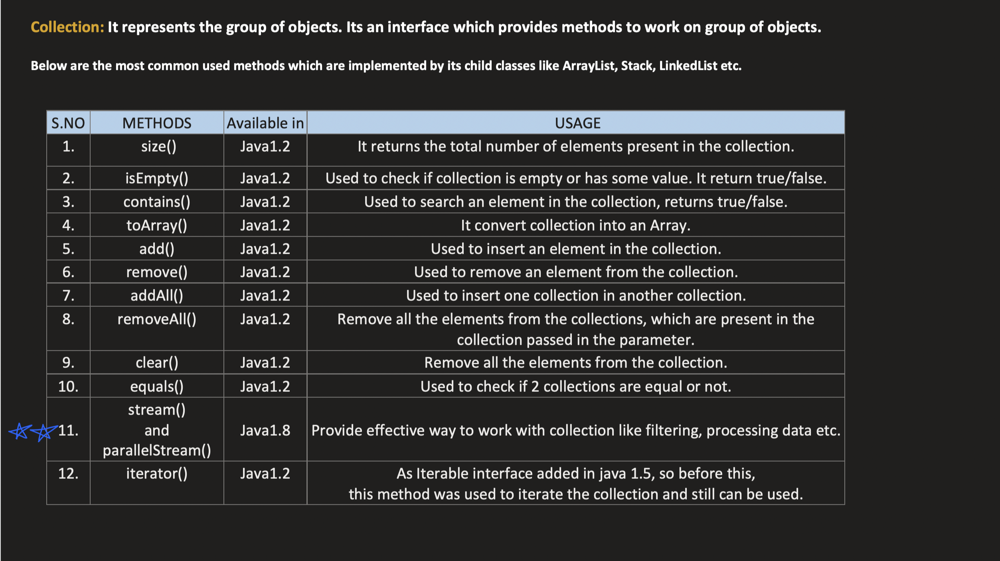

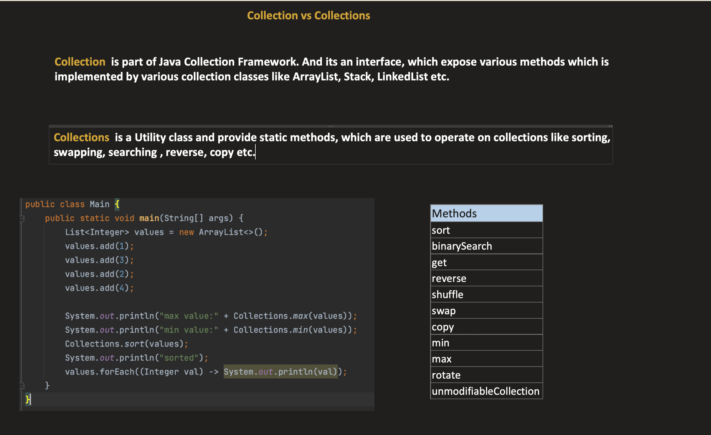


 
 

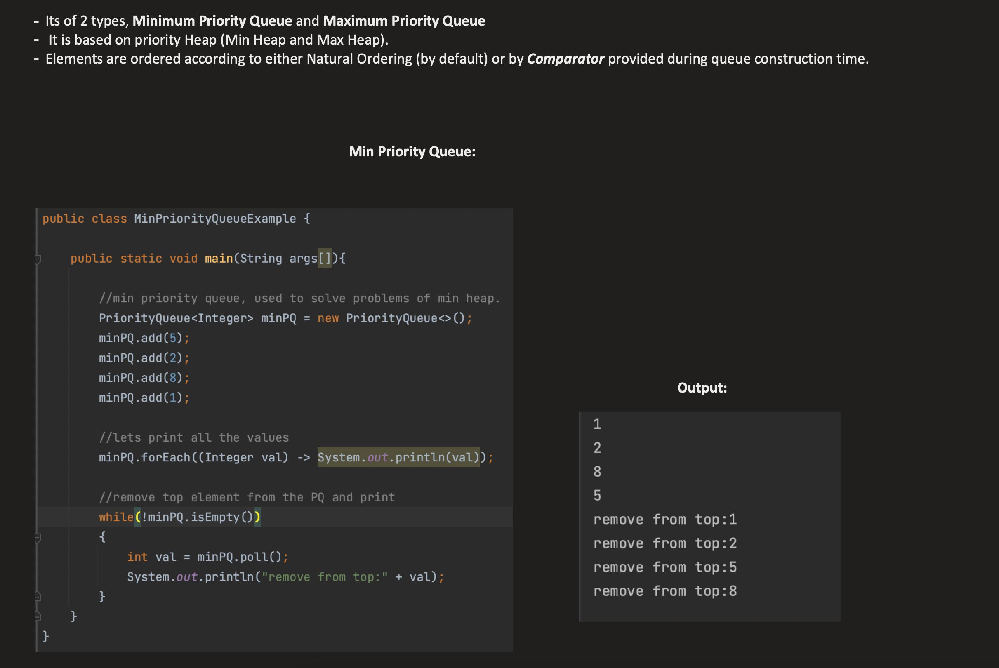

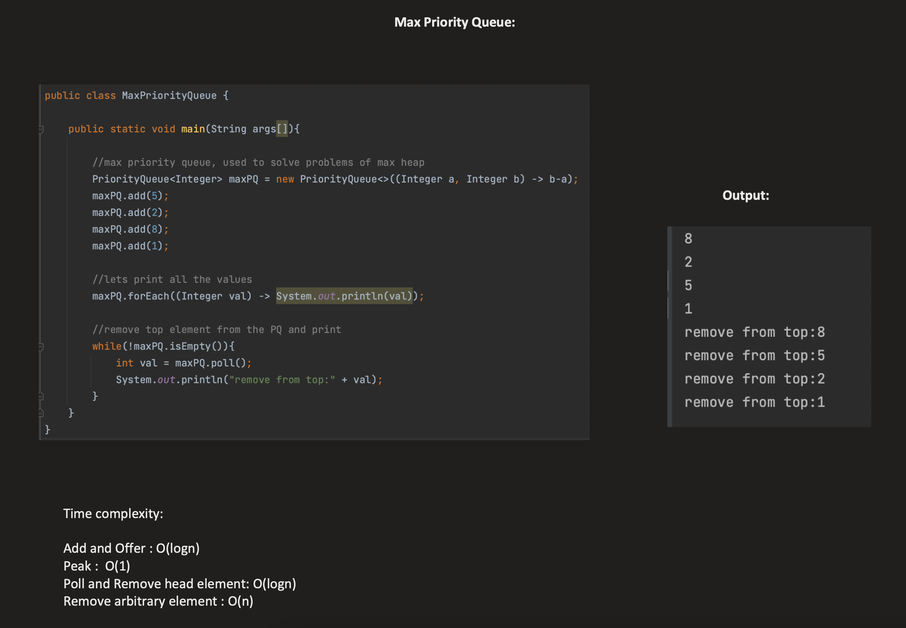

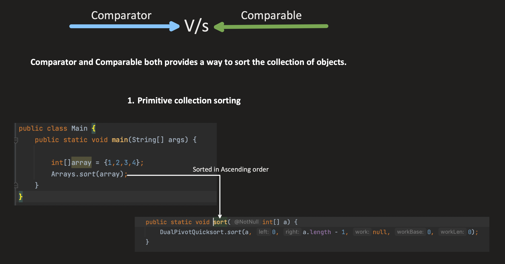

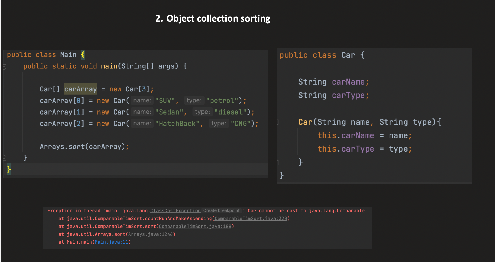

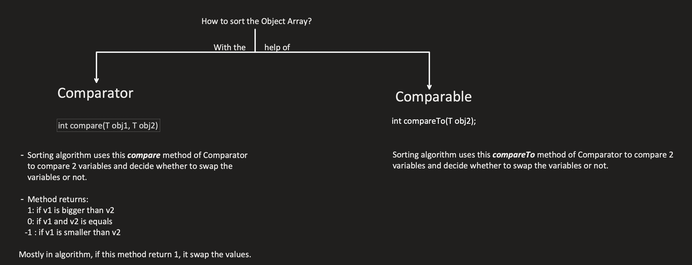


## Comparable vs Comparator in Java

These are two interfaces used for **sorting objects**, but they differ in approach and use case.

---

### `Comparable` — Natural Ordering (self-sorting)

The class **itself** defines how its objects should be compared. It implements `compareTo()` inside the class.

```java
class Student implements Comparable<Student> {
    String name;
    int age;

    Student(String name, int age) {
        this.name = name;
        this.age = age;
    }

    @Override
    public int compareTo(Student other) {
        return this.age - other.age; // sort by age (ascending)
    }
}

// Usage
List<Student> list = Arrays.asList(new Student("Alice", 22), new Student("Bob", 19));
Collections.sort(list); // uses compareTo automatically
```

---

### `Comparator` — Custom/External Ordering

Defined **outside** the class. Useful when you want multiple sort strategies or can't modify the class.

```java
class Student {
    String name;
    int age;
    Student(String name, int age) { this.name = name; this.age = age; }
}

// Multiple comparators
Comparator<Student> byName = (a, b) -> a.name.compareTo(b.name);
Comparator<Student> byAge  = (a, b) -> a.age - b.age;

Collections.sort(list, byName); // sort by name
Collections.sort(list, byAge);  // sort by age
```

---

### Key Differences

| Feature | `Comparable` | `Comparator` |
|---|---|---|
| Package | `java.lang` | `java.util` |
| Method | `compareTo(T o)` | `compare(T o1, T o2)` |
| Defined in | The class itself | A separate class / lambda |
| Sort strategies | Only **one** (natural order) | **Multiple** possible |
| Modifies original class? | Yes | No |
| Used with | `Collections.sort(list)` | `Collections.sort(list, comparator)` |

---

### Return Value Convention (both interfaces)

| Return | Meaning |
|---|---|
| `negative` | first object is **less than** second |
| `0` | both are **equal** |
| `positive` | first object is **greater than** second |

---

### When to Use Which?

- **`Comparable`** → when there's one natural, obvious ordering (e.g., numbers by value, strings alphabetically)
- **`Comparator`** → when you need multiple orderings, or the class is from a library you can't modify

---


 
 

 

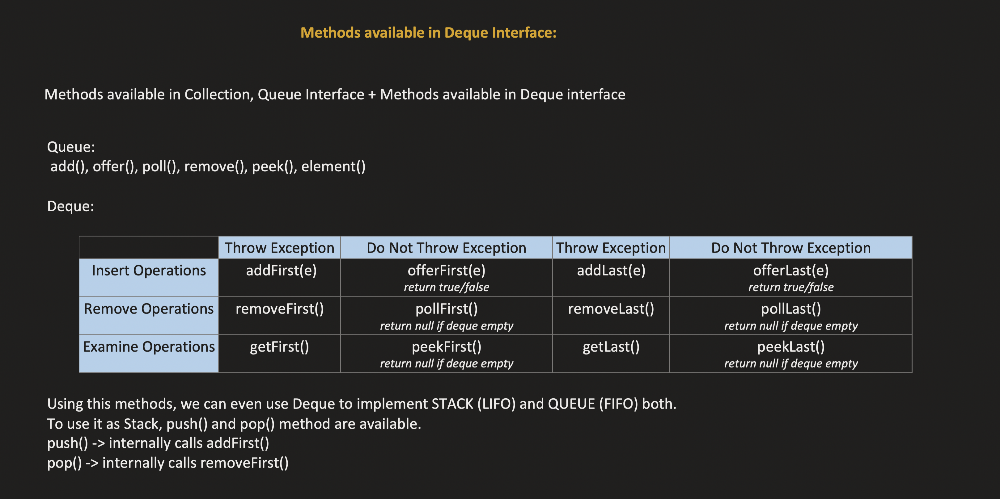

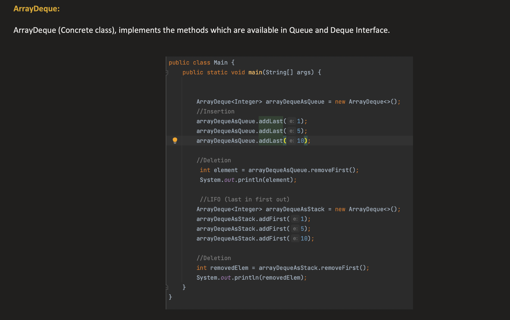

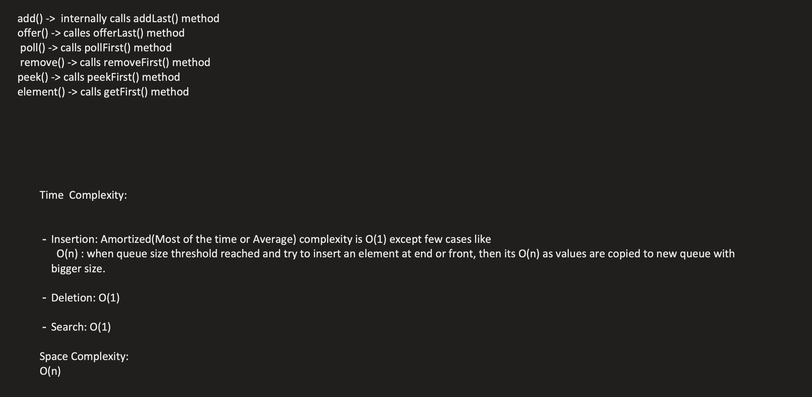

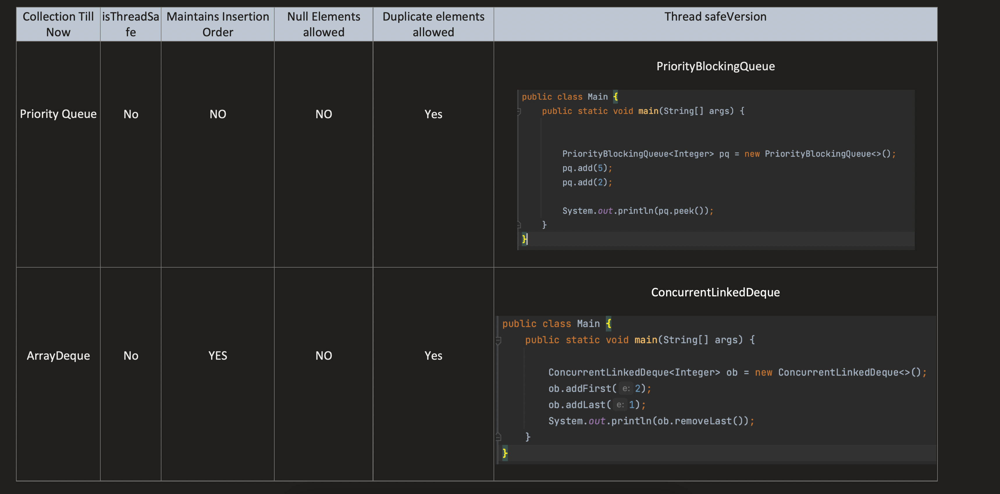


 
 

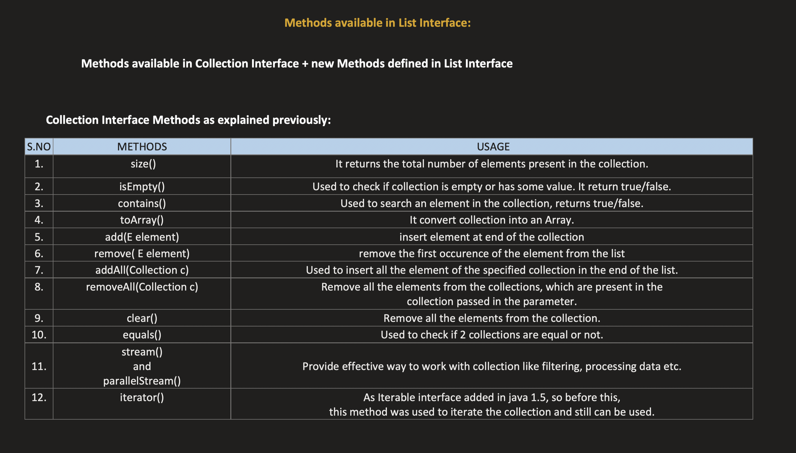
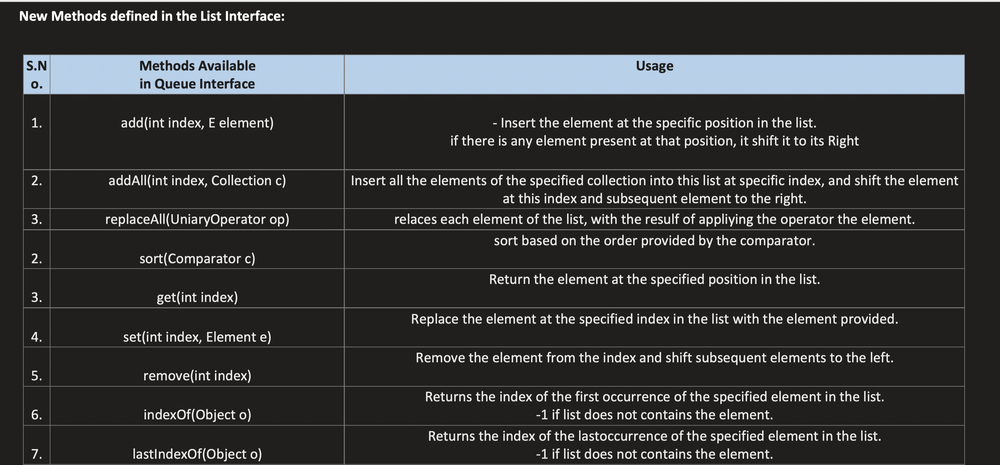
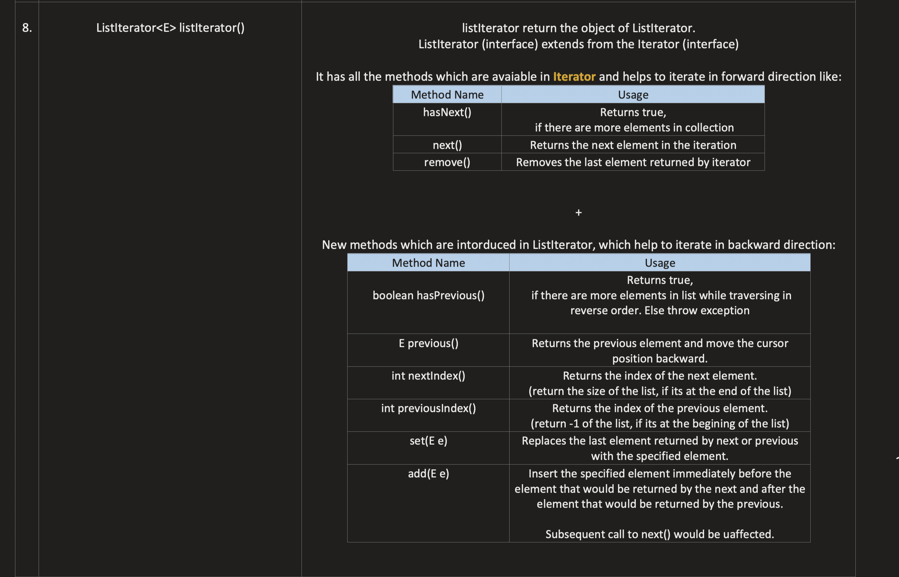
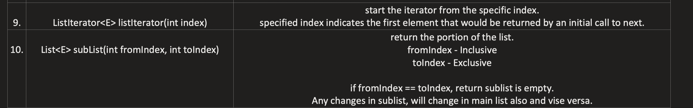


   