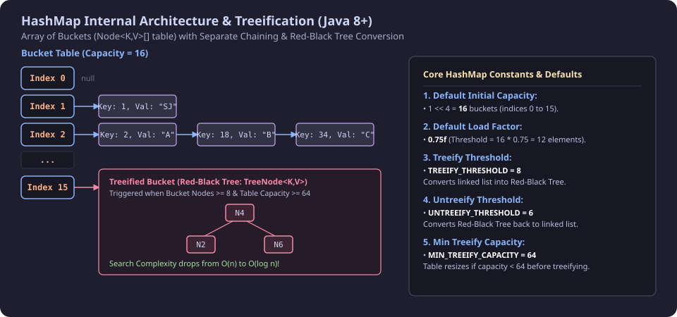
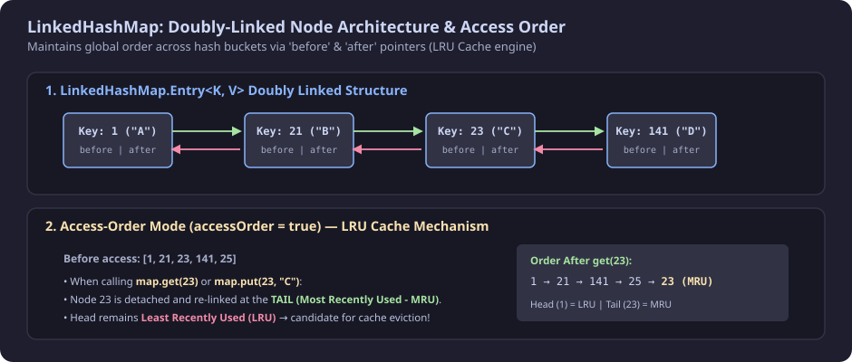
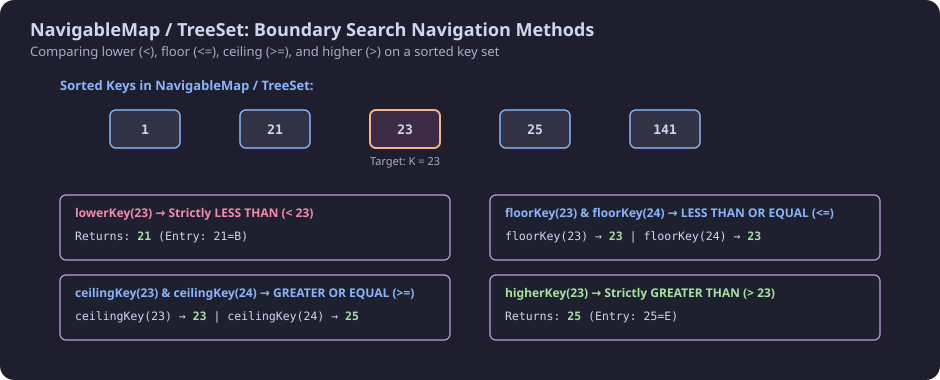
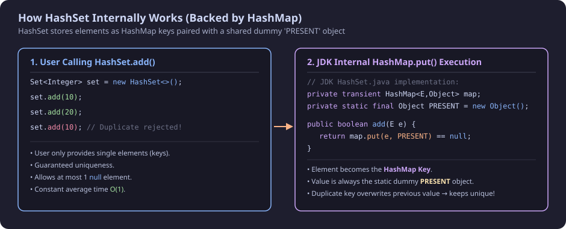

## 1. Why is `Map` NOT Part of the `Collection` Hierarchy?

> **🔥 Frequently Asked Interview Question:** *Why does `Map` not extend `Collection` or `Iterable` in Java?*

* **Different Core Contracts:**
  * **`Collection<E>`** represents a group of **individual elements** (single objects: `add(E e)`, `contains(Object o)`).
  * **`Map<K, V>`** represents a mapping of **Key-Value pairs** (`put(K key, V value)`, `get(Object key)`).
* **Incompatible Method Signatures:** Methods in `Collection` like `add(e)` or `remove(e)` make no sense for key-value mappings where both key and value must be supplied.
* **Key Uniqueness vs Value Duplication:** In a Map, keys must be unique, while values can be duplicate. `Collection` methods deal with only values.
* **Iteration Mechanism:** Since `Map` does not implement `Iterable`, you cannot directly iterate a Map using `for (var item : map)`. You must access views via:
  1. `map.keySet()` &rarr; Returns `Set<K>` (Iterable)
  2. `map.values()` &rarr; Returns `Collection<V>` (Iterable)
  3. `map.entrySet()` &rarr; Returns `Set<Map.Entry<K, V>>` (Iterable)

---

## 2. `Map` Architecture & Implementations

```
                     ┌──────────────────┐
                     │   Map (Java 1.2) │
                     └─────────┬────────┘
           ┌───────────────────┼───────────────────┐
           ▼                   ▼                   ▼
    ┌─────────────┐     ┌──────────────┐    ┌──────────────┐
    │  SortedMap  │     │   HashMap    │    │  Hashtable   │
    └──────┬──────┘     └──────┬───────┘    └──────────────┘
           ▼                   ▼
    ┌──────────────┐    ┌──────────────┐
    │ NavigableMap │    │LinkedHashMap │
    └──────┬───────┘    └──────────────┘
           ▼
    ┌──────────────┐
    │   TreeMap    │
    └──────────────┘
```

### Core Implementations Overview:
1. **`HashMap`:** Hash table-based. No ordering guaranteed. Allows **one `null` key** and multiple `null` values. Unsynchronized (not thread-safe).
2. **`LinkedHashMap`:** Extends `HashMap`. Maintains **Insertion Order** or **Access Order** (used for LRU Caches).
3. **`TreeMap`:** Red-Black Tree-based. Maintains elements in **Natural Sorted Order** or custom `Comparator` order. Keys cannot be `null`.
4. **`Hashtable`:** Legacy thread-safe synchronized Map. **Does NOT allow `null` keys or `null` values**. Slower due to method-level locking.

---

## 3. Methods in `Map` Interface & `Map.Entry` Sub-Interface

| S.No | Method | Return Type | Description |
| :--- | :--- | :--- | :--- |
| 1 | `size()` | `int` | Returns number of key-value mappings present |
| 2 | `isEmpty()` | `boolean` | Returns `true` if map contains no mappings |
| 3 | `containsKey(Object key)` | `boolean` | Returns `true` if map contains specified key |
| 4 | `containsValue(Object value)` | `boolean` | Returns `true` if one or more keys map to specified value |
| 5 | `get(Object key)` | `V` | Returns value mapped to key, or `null` if key not found |
| 6 | `put(K key, V value)` | `V` | Inserts mapping. Overwrites previous value if key already exists |
| 7 | `remove(Object key)` | `V` | Removes mapping for specified key |
| 8 | `putAll(Map<? extends K, ? extends V> m)` | `void` | Copies all mappings from specified map |
| 9 | `clear()` | `void` | Removes all mappings from map |
| 10 | `keySet()` | `Set<K>` | Returns a `Set` view of all keys (changes reflect in map) |
| 11 | `values()` | `Collection<V>` | Returns a `Collection` view of all values |
| 12 | `entrySet()` | `Set<Map.Entry<K, V>>` | Returns a `Set` view of all key-value entries |
| 13 | `putIfAbsent(K key, V value)` | `V` | Inserts mapping only if key is not already present |
| 14 | `getOrDefault(Object key, V defaultValue)`| `V` | Returns mapped value, or default value if key is absent |

---

### The `Map.Entry<K, V>` Sub-Interface:
Represents a single key-value pair container inside the map:
* `getKey()` &rarr; Returns the key of this entry.
* `getValue()` &rarr; Returns the value of this entry.
* `setValue(V value)` &rarr; Replaces the value in this entry.
* `hashCode()` & `equals(Object o)` &rarr; Standard entry equality.

---

### Iterating Over a Map: `entrySet()` vs `keySet()` (With Complete Examples)

> **💡 Best Practice / Interview Tip:**
> * Always prefer **`map.entrySet()`** when you need both Keys and Values. It retrieves both in a single iteration step without redundant hash lookup overhead.
> * Using **`map.keySet()`** and calling `map.get(key)` in a loop causes an unnecessary second hash lookup for each key ($O(1)$ per key, but double the operations).

```java
import java.util.HashMap;
import java.util.Iterator;
import java.util.Map;
import java.util.Set;

public class MapIterationExample {
    public static void main(String[] args) {
        Map<Integer, String> studentMap = new HashMap<>();
        studentMap.put(101, "Alice");
        studentMap.put(102, "Bob");
        studentMap.put(103, "Charlie");
        studentMap.put(104, "Daniel");

        // ==========================================
        // 1. Iterating using entrySet() [RECOMMENDED]
        // ==========================================
        System.out.println("=== 1. entrySet() with Enhanced for-each ===");
        for (Map.Entry<Integer, String> entry : studentMap.entrySet()) {
            Integer rollNo = entry.getKey();
            String name = entry.getValue();
            System.out.println("Roll No: " + rollNo + " -> Name: " + name);
        }

        System.out.println("\n=== 2. entrySet() with Iterator (Safe Removal/Modification) ===");
        Iterator<Map.Entry<Integer, String>> entryIterator = studentMap.entrySet().iterator();
        while (entryIterator.hasNext()) {
            Map.Entry<Integer, String> entry = entryIterator.next();
            if (entry.getKey() == 102) {
                entry.setValue("Robert"); // Modify value in-place!
            }
            System.out.println("Key: " + entry.getKey() + ", Value: " + entry.getValue());
        }

        // ==========================================
        // 2. Iterating using keySet()
        // ==========================================
        System.out.println("\n=== 3. keySet() with Enhanced for-each ===");
        Set<Integer> keys = studentMap.keySet();
        for (Integer key : keys) {
            // Note: map.get(key) performs an additional hash lookup
            String value = studentMap.get(key);
            System.out.println("Key: " + key + " | Value: " + value);
        }

        System.out.println("\n=== 4. keySet() with Iterator ===");
        Iterator<Integer> keyIterator = studentMap.keySet().iterator();
        while (keyIterator.hasNext()) {
            Integer key = keyIterator.next();
            System.out.println("Processing key: " + key + " (Value = " + studentMap.get(key) + ")");
        }
    }
}
```

#### Output:
```text
=== 1. entrySet() with Enhanced for-each ===
Roll No: 101 -> Name: Alice
Roll No: 102 -> Name: Bob
Roll No: 103 -> Name: Charlie
Roll No: 104 -> Name: Daniel

=== 2. entrySet() with Iterator (Safe Removal/Modification) ===
Key: 101, Value: Alice
Key: 102, Value: Robert
Key: 103, Value: Charlie
Key: 104, Value: Daniel

=== 3. keySet() with Enhanced for-each ===
Key: 101 | Value: Alice
Key: 102 | Value: Robert
Key: 103 | Value: Charlie
Key: 104 | Value: Daniel

=== 4. keySet() with Iterator ===
Processing key: 101 (Value = Alice)
Processing key: 102 (Value = Robert)
Processing key: 103 (Value = Charlie)
Processing key: 104 (Value = Daniel)
```

---

## 4. Internal Working and Design of `HashMap`



### 1. Internal Data Structure (`Node<K, V>[] table`)
`HashMap` stores data in an internal array of nodes:
```java
transient Node<K,V>[] table; // Bucket array
```

Each `Node<K, V>` is a singly linked list node implementing `Map.Entry<K, V>`:
```java
static class Node<K,V> implements Map.Entry<K,V> {
    final int hash;     // Computed 32-bit hash code
    final K key;        // The Key
    V value;            // The Value
    Node<K,V> next;     // Pointer to next collided node (Separate Chaining)
}
```

---

### 2. Core Constants & Default Parameters:

| Constant | Value | Description |
| :--- | :--- | :--- |
| `DEFAULT_INITIAL_CAPACITY` | `1 << 4` ($16$) | Initial number of buckets in the table array ($0$ to $15$) |
| `MAXIMUM_CAPACITY` | `1 << 30` ($2^{30}$) | Maximum capacity of the hash table |
| `DEFAULT_LOAD_FACTOR` | `0.75f` | Ratio threshold determining when capacity will expand |
| `TREEIFY_THRESHOLD` | `8` | Bucket linked list length at which it converts to Red-Black Tree |
| `UNTREEIFY_THRESHOLD` | `6` | Tree size at which it converts back to Linked List upon shrinkage |
| `MIN_TREEIFY_CAPACITY` | `64` | Minimum table capacity before treeifying (resizes table if $< 64$) |

---

### 3. Step-by-Step Hashing & Index Calculation:
When you execute `map.put(key, value)`:

1. **Hash Calculation (`hash(key)`):**
   ```java
   static final int hash(Object key) {
       int h;
       return (key == null) ? 0 : (h = key.hashCode()) ^ (h >>> 16);
   }
   ```
   *(XORs higher 16 bits with lower 16 bits to reduce collisions).*
2. **Bucket Index Computation:**
   $$\text{Index} = (n - 1) \ \& \ \text{hash}$$
   *(Bitwise AND with $n - 1$ where $n = \text{table.length}$, equivalent to $\text{hash} \pmod n$).*

---

### 4. Collision Resolution (Separate Chaining & Java 8 Treeification):
* **Collision:** Occurs when two distinct keys yield the exact same bucket index.
* **Before Java 8:** Collisions were chained purely as a Singly Linked List ($O(n)$ search time).
* **In Java 8+:** 
  * If bucket linked list length reaches **`TREEIFY_THRESHOLD = 8`** and table capacity is at least **$64$**, the bucket converts from a Linked List into a **Red-Black Tree (`TreeNode<K, V>`)**.
  * Search complexity in a heavy collision bucket drops from **$O(n)$ to $O(\log n)$**!

---

### 5. Load Factor & Rehashing:
* **Threshold Formula:**
  $$\text{Threshold} = \text{Capacity} \times \text{Load Factor} = 16 \times 0.75 = 12$$
* When the total number of entries in the map exceeds $12$:
  1. A new array of double capacity ($32$) is allocated.
  2. **Rehashing:** All existing entries are re-indexed into the new array.

---

### 6. Comprehensive `HashMap` Code Example:

```java
import java.util.Collection;
import java.util.HashMap;
import java.util.Map;
import java.util.Set;

public class HashMapCompleteExample {
    public static void main(String[] args) {
        Map<Integer, String> rollNumberVsNameMap = new HashMap<>();

        // 1. put(K, V) - Allows null key and null value
        rollNumberVsNameMap.put(null, "TEST");
        rollNumberVsNameMap.put(0, null);
        rollNumberVsNameMap.put(1, "A");
        rollNumberVsNameMap.put(2, "B");

        // 2. putIfAbsent(K, V)
        rollNumberVsNameMap.putIfAbsent(null, "test"); // Not added (null key exists)
        rollNumberVsNameMap.putIfAbsent(0, "ZERO");     // Overwrites null value with "ZERO"
        rollNumberVsNameMap.putIfAbsent(3, "C");        // Added

        // 3. Iterating via entrySet()
        System.out.println("--- Iterating via entrySet() ---");
        for (Map.Entry<Integer, String> entry : rollNumberVsNameMap.entrySet()) {
            System.out.println("Key: " + entry.getKey() + " value: " + entry.getValue());
        }

        // 4. Checking state and retrieval
        System.out.println("\nisEmpty(): " + rollNumberVsNameMap.isEmpty());       // false
        System.out.println("size(): " + rollNumberVsNameMap.size());             // 5
        System.out.println("containsKey(3): " + rollNumberVsNameMap.containsKey(3)); // true
        System.out.println("get(1): " + rollNumberVsNameMap.get(1));             // A
        System.out.println("getOrDefault(9): " + rollNumberVsNameMap.getOrDefault(9, "default value")); // default value

        // 5. remove(key)
        rollNumberVsNameMap.remove(null);
        System.out.println("\nAfter remove(null):");
        for (Map.Entry<Integer, String> entry : rollNumberVsNameMap.entrySet()) {
            System.out.println("Key: " + entry.getKey() + " value: " + entry.getValue());
        }

        // 6. Iterating via keySet()
        System.out.println("\n--- Iterating via keySet() ---");
        Set<Integer> keys = rollNumberVsNameMap.keySet();
        for (Integer key : keys) {
            System.out.println("Key: " + key);
        }

        // 7. Iterating via values()
        System.out.println("\n--- Iterating via values() ---");
        Collection<String> values = rollNumberVsNameMap.values();
        for (String val : values) {
            System.out.println("value: " + val);
        }
    }
}
```

#### Output:
```text
--- Iterating via entrySet() ---
Key: null value: TEST
Key: 0 value: ZERO
Key: 1 value: A
Key: 2 value: B
Key: 3 value: C

isEmpty(): false
size(): 5
containsKey(3): true
get(1): A
getOrDefault(9): default value

After remove(null):
Key: 0 value: ZERO
Key: 1 value: A
Key: 2 value: B
Key: 3 value: C

--- Iterating via keySet() ---
Key: 0
Key: 1
Key: 2
Key: 3

--- Iterating via values() ---
value: ZERO
value: A
value: B
value: C
```

---

## 5. `LinkedHashMap` (Insertion Order & Access Order / LRU Cache)



`LinkedHashMap` extends `HashMap`, but maintains a **doubly-linked list** across all of its entries using `before` and `after` pointers.

### Two Ordering Modes:
1. **Insertion-Order (Default, `accessOrder = false`):**
   * Iteration order matches the exact sequence in which keys were inserted into the map.
2. **Access-Order (`accessOrder = true`):**
   * Enabled via constructor: `new LinkedHashMap<>(capacity, loadFactor, true);`
   * Every time `get(key)` or `put(key, value)` is invoked on an existing key, that entry is unlinked and moved to the **TAIL** of the doubly linked list (**Most Recently Used - MRU**).
   * The **HEAD** of the list always contains the **Least Recently Used (LRU)** element &rarr; Ideal for implementing **LRU Caches**!

---

### `LinkedHashMap` Code Example:

```java
import java.util.LinkedHashMap;
import java.util.Map;

public class LinkedHashMapExample {
    public static void main(String[] args) {
        // 1. Insertion-Order (Default)
        System.out.println("--- LinkedHashMap (Insertion Order) ---");
        Map<Integer, String> insertionMap = new LinkedHashMap<>();
        insertionMap.put(1, "A");
        insertionMap.put(21, "B");
        insertionMap.put(23, "C");
        insertionMap.put(141, "D");
        insertionMap.put(25, "E");

        insertionMap.forEach((k, v) -> System.out.println(k + ":" + v));

        // 2. Access-Order Mode (LRU Ordering)
        System.out.println("\n--- LinkedHashMap (Access Order = true) ---");
        LinkedHashMap<Integer, String> accessMap = new LinkedHashMap<>(16, 0.75f, true);
        accessMap.put(1, "A");
        accessMap.put(21, "B");
        accessMap.put(23, "C");
        accessMap.put(141, "D");
        accessMap.put(25, "E");

        // Accessing key 23 moves it to the TAIL (MRU)
        accessMap.get(23);

        accessMap.forEach((k, v) -> System.out.println(k + ":" + v));
    }
}
```

#### Output:
```text
--- LinkedHashMap (Insertion Order) ---
1:A
21:B
23:C
141:D
25:E

--- LinkedHashMap (Access Order = true) ---
1:A
21:B
141:D
25:E
23:C
```
> **Notice:** Key `23` moved to the very end after being accessed!

---

### `HashMap` vs `LinkedHashMap`: Direct Comparison

#### Why Do Their Iteration Orders Differ?

1. **`HashMap` (Bucket-Driven Order):**
   * Stores entries in an array of buckets (`Node<K, V>[] table`).
   * When you iterate, `HashMap` scans the bucket array sequentially from index $0$ to $15$.
   * **Result:** Iteration order depends purely on the key's hash code and bucket distribution, **not** when it was inserted.

2. **`LinkedHashMap` (Pointer-Driven Order):**
   * Inherits the bucket array from `HashMap`, but each node has two extra references: `before` and `after`.
   * All entries form a global **Doubly-Linked List**.
   * When you iterate, `LinkedHashMap` walks the doubly-linked list from `head` to `tail`.
   * **Result:** Guaranteed exact **Insertion Order** (or Access Order).

---

#### Side-by-Side Code Example:

```java
import java.util.HashMap;
import java.util.LinkedHashMap;
import java.util.Map;

public class HashMapVsLinkedHashMapExample {
    public static void main(String[] args) {
        // Same keys inserted in identical sequence: 1, 21, 23, 141, 25

        // ==========================================
        // 1. LinkedHashMap (Preserves Insertion Order)
        // ==========================================
        System.out.println("=== LinkedHashMap Output ===");
        Map<Integer, String> linkedHashMap = new LinkedHashMap<>();
        linkedHashMap.put(1, "A");
        linkedHashMap.put(21, "B");
        linkedHashMap.put(23, "C");
        linkedHashMap.put(141, "D");
        linkedHashMap.put(25, "E");

        for (Map.Entry<Integer, String> entry : linkedHashMap.entrySet()) {
            System.out.println(entry.getKey() + " : " + entry.getValue());
        }

        // ==========================================
        // 2. HashMap (Order Depends on Bucket Index)
        // ==========================================
        System.out.println("\n=== HashMap Output ===");
        Map<Integer, String> hashMap = new HashMap<>();
        hashMap.put(1, "A");
        hashMap.put(21, "B");
        hashMap.put(23, "C");
        hashMap.put(141, "D");
        hashMap.put(25, "E");

        for (Map.Entry<Integer, String> entry : hashMap.entrySet()) {
            System.out.println(entry.getKey() + " : " + entry.getValue());
        }
    }
}
```

#### Output:
```text
=== LinkedHashMap Output ===
1 : A
21 : B
23 : C
141 : D
25 : E

=== HashMap Output ===
1 : A
21 : B
23 : C
25 : E
141 : D
```

> **Observation:** 
> * In **`LinkedHashMap`**, key `141` printed before `25` because `141` was inserted first.
> * In **`HashMap`**, key `25` printed before `141` because `(25 & 15) = index 9`, whereas `(141 & 15) = index 13`. `HashMap` printed bucket $9$ before bucket $13$!

---

#### Key Differences Summary:

| Feature | `HashMap` | `LinkedHashMap` |
| :--- | :--- | :--- |
| **Class Hierarchy** | Direct `Map` implementation | Subclass of `HashMap` (`extends HashMap<K, V>`) |
| **Underlying Structure** | Array of Buckets + Singly Linked List / RB Tree | Array of Buckets + **Doubly-Linked List** (`before`/`after`) |
| **Iteration Order** | **No Order Guarantee** (Bucket index order) | **Predictable Order** (Insertion Order or Access Order) |
| **Memory Overhead** | Low (`hash, key, value, next`) | Higher (Extra `before` and `after` pointers per node) |
| **Performance** | Slightly faster `put`/`remove` | Slightly slower `put`/`remove` (must rewire pointers) |
| **Iteration Speed** | Iterates over total `capacity` (including empty buckets) | Iterates over exact `size` (only active entries via pointers) |
| **Best Used For** | General fast key-value lookups | Where order matters, maintaining history, building **LRU Caches** |

---

## 6. `SortedMap`, `NavigableMap`, and `TreeMap`



* **Internal Structure:** `TreeMap` is implemented as a **Red-Black Tree** (Self-balancing Binary Search Tree).
* **Ordering:** Automatically sorts keys in **Ascending (Natural) Order** or via a custom **`Comparator`**.
* **Complexity:** Guarantees **$O(\log n)$** time for `containsKey`, `get`, `put`, and `remove`.
* **Null Keys:** **Does NOT allow `null` keys** (throws `NullPointerException`).

---

### `SortedMap` Methods:
* `firstKey()` &rarr; Returns lowest key (e.g., $5$).
* `lastKey()` &rarr; Returns highest key (e.g., $21$).
* `headMap(toKey)` &rarr; Returns view of keys strictly $< toKey$.
* `tailMap(fromKey)` &rarr; Returns view of keys $\ge fromKey$.

---

### `NavigableMap` Boundary Navigation Methods:

| Method | Comparison | Description |
| :--- | :--- | :--- |
| **`lowerKey(K key)`** / `lowerEntry(K key)` | $< key$ | Greatest key strictly less than given key |
| **`floorKey(K key)`** / `floorEntry(K key)` | $\le key$ | Greatest key less than or equal to given key |
| **`ceilingKey(K key)`** / `ceilingEntry(K key)`| $\ge key$ | Least key greater than or equal to given key |
| **`higherKey(K key)`** / `higherEntry(K key)` | $> key$ | Least key strictly greater than given key |
| **`pollFirstEntry()`** | Removes Head | Removes and returns lowest entry ($O(\log n)$) |
| **`pollLastEntry()`** | Removes Tail | Removes and returns highest entry ($O(\log n)$) |
| **`descendingMap()`** | Reverse View | Returns reverse-order view of this map |

---

### `TreeMap` & `NavigableMap` Code Example:

```java
import java.util.NavigableMap;
import java.util.TreeMap;

public class TreeMapCompleteExample {
    public static void main(String[] args) {
        NavigableMap<Integer, String> map = new TreeMap<>();
        map.put(1, "A");
        map.put(21, "B");
        map.put(23, "C");
        map.put(25, "E");
        map.put(141, "D");

        System.out.println("Ascending TreeMap: " + map);

        // Boundary Query Methods
        System.out.println("lowerEntry(23): " + map.lowerEntry(23));       // 21=B  (< 23)
        System.out.println("lowerKey(23): " + map.lowerKey(23));           // 21
        System.out.println("floorEntry(24): " + map.floorEntry(24));       // 23=C  (<= 24)
        System.out.println("ceilingEntry(24): " + map.ceilingEntry(24));   // 25=E  (>= 24)
        System.out.println("higherEntry(23): " + map.higherEntry(23));     // 25=E  (> 23)
        System.out.println("firstEntry(): " + map.firstEntry());           // 1=A
        System.out.println("lastEntry(): " + map.lastEntry());             // 141=D

        // Polling Entries
        System.out.println("pollFirstEntry(): " + map.pollFirstEntry());   // 1=A (Removed)
        System.out.println("pollLastEntry(): " + map.pollLastEntry());     // 141=D (Removed)
        System.out.println("After polling: " + map);

        // Sub-map Views
        System.out.println("headMap(23, true): " + map.headMap(23, true)); // <= 23
        System.out.println("tailMap(23, true): " + map.tailMap(23, true)); // >= 23
        System.out.println("descendingMap(): " + map.descendingMap());
    }
}
```

#### Output:
```text
Ascending TreeMap: {1=A, 21=B, 23=C, 25=E, 141=D}
lowerEntry(23): 21=B
lowerKey(23): 21
floorEntry(24): 23=C
ceilingEntry(24): 25=E
higherEntry(23): 25=E
firstEntry(): 1=A
lastEntry(): 141=D
pollFirstEntry(): 1=A
pollLastEntry(): 141=D
After polling: {21=B, 23=C, 25=E}
headMap(23, true): {21=B, 23=C}
tailMap(23, true): {23=C, 25=E}
descendingMap(): {25=E, 23=C, 21=B}
```

---

## 7. The `Set` Interface & Internals (Backed by `Map`)



### Properties of `Set`:
1. **Uniqueness:** Cannot contain duplicate elements.
2. **Null Elements:** Allows at most **one `null` element** in `HashSet` / `LinkedHashSet`. `TreeSet` does not allow `null`.
3. **No Index Access:** Does not support positional indexing like `list.get(i)`.

---

### The Internal Secret of `HashSet`:
> **💡 Question:** *How does `HashSet` ensure element uniqueness internally?*

* `HashSet` is **a wrapper around `HashMap`**!
* Inside `HashSet.java`:
  ```java
  private transient HashMap<E, Object> map;
  private static final Object PRESENT = new Object(); // Dummy constant

  public boolean add(E e) {
      return map.put(e, PRESENT) == null;
  }
  ```
* Every `set.add(element)` call internally performs `map.put(element, PRESENT)`.
* Since `HashMap` keys are strictly unique, adding an existing element simply overwrites the dummy value and returns `false`!

---

### Mathematical Set Operations:

| Operation | Java Method | Description |
| :--- | :--- | :--- |
| **Union** | `set1.addAll(set2)` | Combines all elements from both sets (duplicates removed) |
| **Intersection** | `set1.retainAll(set2)` | Keeps only elements that exist in **both** sets |
| **Difference** | `set1.removeAll(set2)` | Removes all elements of `set2` from `set1` |

```java
import java.util.HashSet;
import java.util.Set;

public class SetOperationsExample {
    public static void main(String[] args) {
        // 1. UNION
        Set<Integer> set1 = new HashSet<>(Set.of(12, 11, 33, 4));
        Set<Integer> set2 = new HashSet<>(Set.of(11, 9, 88, 10, 5, 12));
        set1.addAll(set2);
        System.out.println("Union: " + set1);

        // 2. INTERSECTION
        Set<Integer> s1 = new HashSet<>(Set.of(12, 11, 33, 4));
        Set<Integer> s2 = new HashSet<>(Set.of(11, 9, 88, 10, 5, 12));
        s1.retainAll(s2);
        System.out.println("Intersection: " + s1);

        // 3. DIFFERENCE (s1 - s2)
        Set<Integer> diff1 = new HashSet<>(Set.of(12, 11, 33, 4));
        Set<Integer> diff2 = new HashSet<>(Set.of(11, 9, 88, 10, 5, 12));
        diff1.removeAll(diff2);
        System.out.println("Difference (diff1 - diff2): " + diff1);
    }
}
```

#### Output:
```text
Union: [33, 4, 5, 88, 9, 10, 11, 12]
Intersection: [11, 12]
Difference (diff1 - diff2): [33, 4]
```

---

## 8. `LinkedHashSet` & `TreeSet`

### 1. `LinkedHashSet`:
* **Internally Backed By:** `LinkedHashMap<E, Object>`.
* **Maintains Insertion Order:** Unlike `HashSet`, traversing a `LinkedHashSet` always yields elements in the exact order they were inserted.
* **Access Order:** `LinkedHashSet` never exposes access order (it is fixed to insertion order).

```java
import java.util.LinkedHashSet;
import java.util.Set;

public class LinkedHashSetExample {
    public static void main(String[] args) {
        Set<Integer> set = new LinkedHashSet<>();
        set.add(2);
        set.add(77);
        set.add(82);
        set.add(63);
        set.add(5);

        // Guaranteed to print in insertion order: [2, 77, 82, 63, 5]
        System.out.println("LinkedHashSet: " + set);
    }
}
```

---

### 2. `TreeSet`:
* **Internally Backed By:** `NavigableMap<E, Object>` (`TreeMap`).
* **Sorted Order:** Elements are stored in ascending sorted order according to their natural ordering or a provided `Comparator`.
* **Complexity:** $O(\log n)$ for `add`, `remove`, `contains`.

```java
import java.util.TreeSet;

public class TreeSetExample {
    public static void main(String[] args) {
        TreeSet<Integer> treeSet = new TreeSet<>();
        treeSet.add(2);
        treeSet.add(77);
        treeSet.add(82);
        treeSet.add(63);
        treeSet.add(5);

        // Automatically sorted: [2, 5, 63, 77, 82]
        System.out.println("TreeSet (Sorted): " + treeSet);
    }
}
```

---

## 9. Thread Safety in Maps & Sets

* **Non-Thread-Safe Classes:** `HashMap`, `LinkedHashMap`, `TreeMap`, `HashSet`, `LinkedHashSet`, `TreeSet`.
* If multiple threads concurrently modify a `HashMap` while another thread iterates, it throws `ConcurrentModificationException` (or corrupts bucket pointers in legacy pre-Java 8).

### Thread-Safe Alternatives:

| Standard Collection | Synchronized Wrapper (Legacy) | Modern High-Throughput Concurrent Alternative |
| :--- | :--- | :--- |
| `HashMap` | `Collections.synchronizedMap(map)` | **`ConcurrentHashMap<K, V>`** (Lock-striping / CAS) |
| `LinkedHashMap` | `Collections.synchronizedMap(linkedMap)`| `Collections.synchronizedMap(new LinkedHashMap<>())` |
| `TreeMap` | `Collections.synchronizedSortedMap(treeMap)`| **`ConcurrentSkipListMap<K, V>`** |
| `HashSet` | `Collections.synchronizedSet(set)` | **`ConcurrentHashMap.newKeySet()`** |
| `TreeSet` | `Collections.synchronizedSortedSet(treeSet)`| **`ConcurrentSkipListSet<E>`** |

---

## 10. Master Summary Matrix for Maps & Sets

| Data Structure | Underlying Structure | Order Guarantee | Allows Null Key? | Allows Null Value? | Thread-Safe? | Time Complexity (Avg) |
| :--- | :--- | :--- | :--- | :--- | :--- | :--- |
| **`HashMap`** | Array of Nodes (Linked List + RB Tree) | No order | **Yes (1 max)** | **Yes** | No | $O(1)$ |
| **`LinkedHashMap`** | Hash Table + Doubly Linked List | Insertion / Access | **Yes (1 max)** | **Yes** | No | $O(1)$ |
| **`TreeMap`** | Red-Black Tree | Natural / Comparator | **No** | **Yes** | No | $O(\log n)$ |
| **`Hashtable`** | Hash Table (Synchronized) | No order | **No** | **No** | **Yes** | $O(1)$ (Synchronized) |
| **`ConcurrentHashMap`**| Segmented / CAS Bucket Nodes | No order | **No** | **No** | **Yes** | $O(1)$ (Lock-Free Read) |
| **`HashSet`** | Backed by `HashMap` | No order | **Yes (1 max)** | N/A | No | $O(1)$ |
| **`LinkedHashSet`**| Backed by `LinkedHashMap` | Insertion order | **Yes (1 max)** | N/A | No | $O(1)$ |
| **`TreeSet`** | Backed by `NavigableMap` (`TreeMap`)| Sorted order | **No** | N/A | No | $O(\log n)$ |