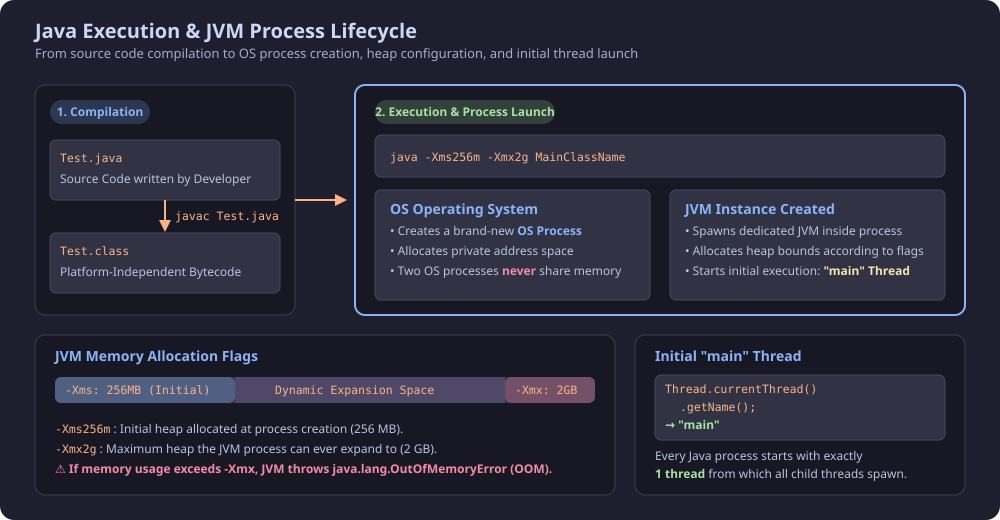
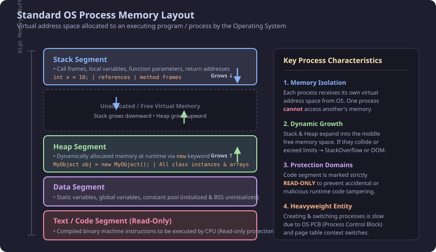
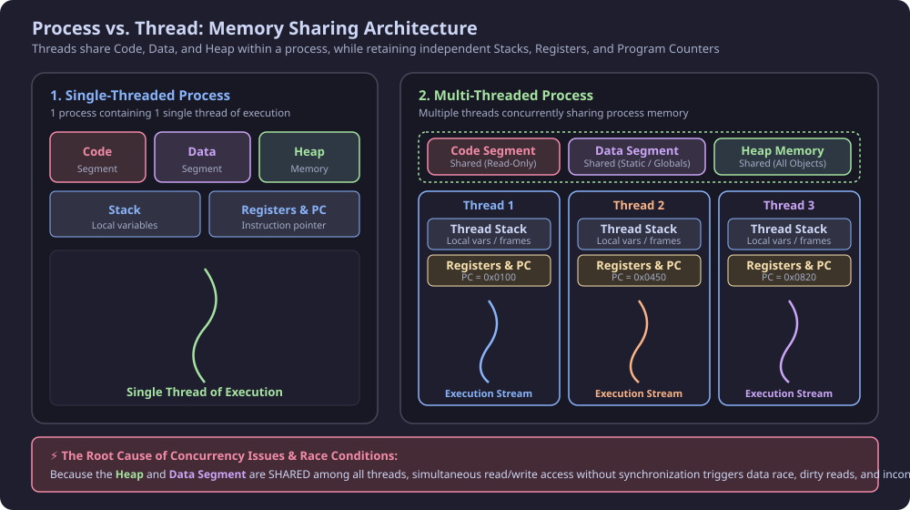
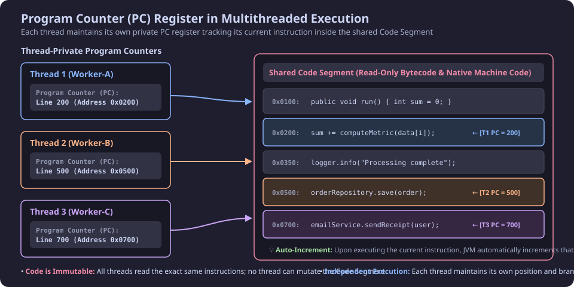
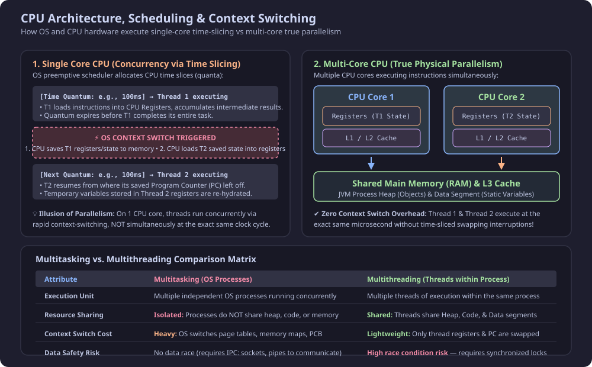

# Introduction to Multithreading: Process and Thread Architecture
Multithreading is a core capability of the Java platform that enables concurrent and parallel execution of code to maximize CPU core utilization, improve application responsiveness, and handle high-throughput workloads efficiently.

---

## 1. What is a Process vs. What is a Thread?

### 1.1 Process (Heavyweight Execution Unit)
* **Definition:** A **Process** is an instance of a program in active execution managed by the Operating System (OS).
* **Isolation:** Every process has its own isolated memory address space allocated by the OS (including Heap, Stack, Code, and Data segments).
* **Zero Resource Sharing:** Two distinct processes **never** directly share memory or resources. Inter-Process Communication (IPC)—such as sockets, pipes, or files—is required to communicate between processes.

### 1.2 Thread (Lightweight Execution Unit)
* **Definition:** A **Thread** is often called a *lightweight process*. It represents the smallest sequence of programmed instructions that can be managed and scheduled independently by the CPU / OS scheduler.
* **Coexistence:** A single process can contain multiple threads running concurrently.
* **Initial Thread:** When a Java process starts, the JVM automatically spawns an initial thread called the **`main` thread**. Additional worker threads can be spawned from this `main` thread.

```java
public class MultithreadingLearning {
    public static void main(String[] args) {
        // Inspecting the name of the initial thread automatically created by JVM
        System.out.println("Thread Name: " + Thread.currentThread().getName());
    }
}
```

**Console Output:**
```text
Thread Name: main
```

---

## 2. Compilation, Execution & JVM Process Lifecycle

When running a Java application, execution proceeds through two major phases:

1. **Compilation (`javac Test.java`):**
   * The Java compiler translates readable source code into platform-independent bytecode (`Test.class`).
2. **Execution (`java -Xms256m -Xmx2g Test`):**
   * The OS creates a brand-new **OS Process**.
   * Inside this process, a dedicated **JVM instance** is initialized.
   * The JIT (Just-In-Time) compiler and bytecode interpreter translate bytecode into native machine instructions stored in the process's **Code Segment**.
   * The JVM allocates heap memory within the bounds configured by JVM startup flags.

### JVM Heap Configuration Flags: `-Xms` and `-Xmx`

When launching a process, the JVM allows fine-grained control over physical heap memory allocation:

| Flag | Name | Purpose | Example |
| :--- | :--- | :--- | :--- |
| **`-Xms<size>`** | Initial Heap Size | Heap memory allocated immediately upon process creation | `-Xms256m` (allocates 256 MB) |
| **`-Xmx<size>`** | Maximum Heap Size | Upper ceiling of heap memory that the JVM process can dynamically expand to | `-Xmx2g` (caps heap at 2 GB) |

> [!WARNING]
> **OutOfMemoryError Boundary:**
> Even if the host physical machine has 64 GB of RAM, if the process exceeds its `-Xmx` limit (e.g., exceeds 2 GB), the JVM will throw `java.lang.OutOfMemoryError: Java heap space`.



---

## 3. Standard OS Process Memory Layout

Under modern operating systems, every process receives an independent virtual address space mapped onto physical RAM:

1. **Stack Segment (Grows Downward &darr;):**
   * Stores method invocation frames, function arguments, local primitive variables, and references to objects.
2. **Heap Segment (Grows Upward &uarr;):**
   * Stores all dynamically created runtime objects instantiated via the `new` operator.
3. **Free Virtual Memory:**
   * The unallocated address space between Stack and Heap. Both segments grow toward each other as memory demands increase.
4. **Data Segment:**
   * Holds initialized global and `static` variables, constants, and the application's static pool.
5. **Text / Code Segment (Read-Only):**
   * Contains compiled native machine instructions to be fetched and executed by the CPU.
   * Marked strictly **read-only** by the OS memory management unit (MMU) to prevent memory tampering.



---

## 4. Process vs. Thread Memory Sharing Architecture

In a single-threaded program, one process contains exactly one thread of execution that owns the entire stack and register context. In a **multithreaded program**, memory is partitioned into **shared regions** and **thread-private regions**:

### 4.1 Shared Segments (Accessible by All Threads in the Process)
* **Code Segment:** All threads in the same process execute from the same compiled bytecode/machine code base. Because it is read-only, threads cannot modify the code.
* **Data Segment:** Holds static variables and global state. Any thread can read and modify this segment.
* **Heap Memory:** All objects created at runtime via `new` reside in the shared heap. Any thread holding a reference can read or mutate heap objects.

> [!IMPORTANT]
> **Root Cause of Race Conditions & Concurrency Bugs:**
> Because the **Heap** and **Data Segment** are shared across threads, simultaneous uncoordinated reads and writes by multiple threads result in dirty reads, data corruption, and race conditions. This is why **synchronization, locks (`synchronized`, `ReentrantLock`), and thread-safe data structures** are necessary.

### 4.2 Thread-Private Segments (Isolated per Thread)
* **Thread Stack:** Each thread possesses its own private stack that tracks its active call stack, method execution frames, and local variables. Thread A cannot access local variables on Thread B's stack.
* **Registers:** Used by the CPU to store intermediate arithmetic calculations, operand values, and state required for JIT optimizations.
* **Program Counter (PC) Register:** Tracks the exact memory address of the next instruction each thread will execute.

#### 💡 Code Example: Demonstrating Thread Stack Isolation vs. Shared Memory

The following example proves that **local variables live on the thread's private stack** and are 100% isolated, while **static/heap variables are shared** among all threads:

```java
public class ThreadStackIsolationDemo {

    // 1. SHARED VARIABLE (Lives in Data Segment / Heap memory)
    // Accessible and mutable by all threads -> Causes race conditions without synchronization!
    private static int sharedCounter = 0;

    public static void executeTask() {
        // 2. LOCAL VARIABLE (Lives on each Thread's PRIVATE STACK)
        // Each thread gets its own independent copy allocated in its method frame.
        int localStackCounter = 0;

        for (int i = 0; i < 3; i++) {
            localStackCounter++;  // Modifies ONLY this thread's private stack frame
            sharedCounter++;      // Modifies the SHARED global variable

            System.out.println(String.format(
                "[%s] -> Private Stack 'localStackCounter': %d | Shared 'sharedCounter': %d",
                Thread.currentThread().getName(),
                localStackCounter,
                sharedCounter
            ));

            try {
                Thread.sleep(50); // Pause briefly to allow interleaving
            } catch (InterruptedException e) {
                Thread.currentThread().interrupt();
            }
        }
    }

    public static void main(String[] args) {
        // Create two distinct threads running the exact same method
        Thread threadA = new Thread(ThreadStackIsolationDemo::executeTask, "Thread-A");
        Thread threadB = new Thread(ThreadStackIsolationDemo::executeTask, "Thread-B");

        threadA.start();
        threadB.start();
    }
}
```

**Sample Output:**
```text
[Thread-A] -> Private Stack 'localStackCounter': 1 | Shared 'sharedCounter': 1
[Thread-B] -> Private Stack 'localStackCounter': 1 | Shared 'sharedCounter': 2
[Thread-A] -> Private Stack 'localStackCounter': 2 | Shared 'sharedCounter': 3
[Thread-B] -> Private Stack 'localStackCounter': 2 | Shared 'sharedCounter': 4
[Thread-A] -> Private Stack 'localStackCounter': 3 | Shared 'sharedCounter': 5
[Thread-B] -> Private Stack 'localStackCounter': 3 | Shared 'sharedCounter': 6
```

> [!TIP]
> **Why Local Variables are Always Inherently Thread-Safe:**
> Notice how both `Thread-A` and `Thread-B` independently count from `1 -> 2 -> 3` for `localStackCounter`. Neither thread can read, write, or overwrite the other's local stack variables because each thread has its own dedicated physical call stack. Conversely, `sharedCounter` climbs to `6` because it resides in the shared process address space.



---

## 5. The Program Counter (PC) in Multithreaded Execution

In a multithreaded application, different threads may be executing completely different methods or different lines of code simultaneously:

* **Instruction Pointer:** Each thread maintains its own dedicated **Program Counter (PC)** register managed by the JVM.
* **Navigation:** Thread 1 might have its PC set to `0x0200` (calculating a metric), Thread 2's PC might point to `0x0500` (saving to a repository), and Thread 3's PC might point to `0x0700` (sending a notification).
* **Auto-Increment:** As each instruction completes, the JVM automatically increments that thread's PC to point to the next instruction in sequence.



---

## 6. CPU Hardware Architecture, Scheduling & Context Switching

### 6.1 Single-Core CPU: Concurrency via Time Slicing
On a single CPU core, threads do not execute simultaneously at the exact same clock tick. Instead, the OS preemptive scheduler creates the **illusion of parallelism** via rapid **Time Slicing**:

1. **Time Quantum:** The scheduler grants Thread 1 a brief execution window (e.g., 10–50ms).
2. **Register Usage:** Thread 1 loads machine instructions and variables into CPU registers and computes temporary results.
3. **Quantum Expiration & Context Switch:**
   * The timer interrupt fires; Thread 1's time slice is exhausted.
   * **State Preservation:** The CPU saves Thread 1's registers, program counter, and flag registers into memory (Thread Control Block / context).
   * **State Restoration:** The CPU loads Thread 2's previously saved registers and program counter into the physical CPU core.
   * **Resumption:** Thread 2 resumes execution exactly where it was previously interrupted.

### 6.2 Multi-Core CPU: True Physical Parallelism
When the machine has multiple CPU cores (e.g., Core 1 and Core 2):
* Thread 1 runs on Core 1, and Thread 2 runs on Core 2 **simultaneously** at the exact same physical clock cycle.
* There is no need for time-sliced context switching between those two threads, achieving maximum throughput.



---

## 7. Multitasking vs. Multithreading Comparison

| Feature | Multitasking (Processes) | Multithreading (Threads) |
| :--- | :--- | :--- |
| **Execution Entity** | Multiple independent OS processes | Multiple threads within the same process |
| **Address Space** | Each process has isolated, private address space | Threads share the same address space (Heap, Code, Data) |
| **Resource Sharing** | No shared memory; requires explicit IPC (sockets, pipes) | Heap and static data are shared natively |
| **Creation & Destruction** | Heavyweight; significant OS overhead | Lightweight; faster to spawn and tear down |
| **Context Switch Overhead** | High; OS must switch page tables, memory maps, PCB | Low; only CPU registers, stack pointers, and PC are swapped |
| **Safety & Isolation** | High; crash in one process does not crash another | Low; an uncaught exception or memory corruption can affect the entire JVM process |
| **Concurrency Hazards** | None inside memory (isolated) | Race conditions, deadlocks, data races require careful synchronization |

---

## 8. Benefits & Challenges of Multithreading

### Benefits
1. **Improved Performance via Parallelism:** Heavy computational tasks can be split across multiple CPU cores to reduce total execution time.
2. **Enhanced Responsiveness:** In web servers and GUI applications, background tasks (I/O, database queries) run on worker threads, keeping the main request or UI thread responsive.
3. **Resource Efficiency:** Threads consume significantly less memory and CPU context-switching overhead than creating separate OS processes.

### Challenges & Concurrency Pitfalls
1. **Race Conditions:** Occur when multiple threads concurrently read and write shared data without synchronization, leading to inconsistent state.
2. **Deadlocks:** Occur when two or more threads are blocked forever, each waiting for a lock held by the other.
3. **Synchronization Overhead:** Excessive locking and thread contention can cause thread starvation, high latency, and negate multithreading performance benefits.
4. **Complex Debugging & Testing:** Non-deterministic thread scheduling makes reproducing and diagnosing race conditions challenging.

---

## 9. Memory Segment Quick Reference

| Segment | Shared Among Threads? | Mutable at Runtime? | Managed By | Purpose |
| :--- | :---: | :---: | :--- | :--- |
| **Code Segment** | **Yes** | ❌ Read-Only | OS / JVM ClassLoader | Stores compiled bytecode & native machine instructions |
| **Data Segment** | **Yes** | ✔ Yes | JVM Static Initializer | Stores `static` variables, global constants, class metadata |
| **Heap Memory** | **Yes** | ✔ Yes | JVM Garbage Collector | Stores all objects created via `new`, instance fields, arrays |
| **Thread Stack** | ❌ **No (Per Thread)** | ✔ Yes | JVM Thread Execution | Stores method stack frames, primitive local variables, object references |
| **Registers** | ❌ **No (Per Thread)** | ✔ Yes | CPU / JIT Compiler | Holds immediate operands, temporary evaluation results, context state |
| **Program Counter (PC)** | ❌ **No (Per Thread)** | ✔ Yes | CPU / JVM Scheduler | Stores address of the next instruction to execute; auto-increments |