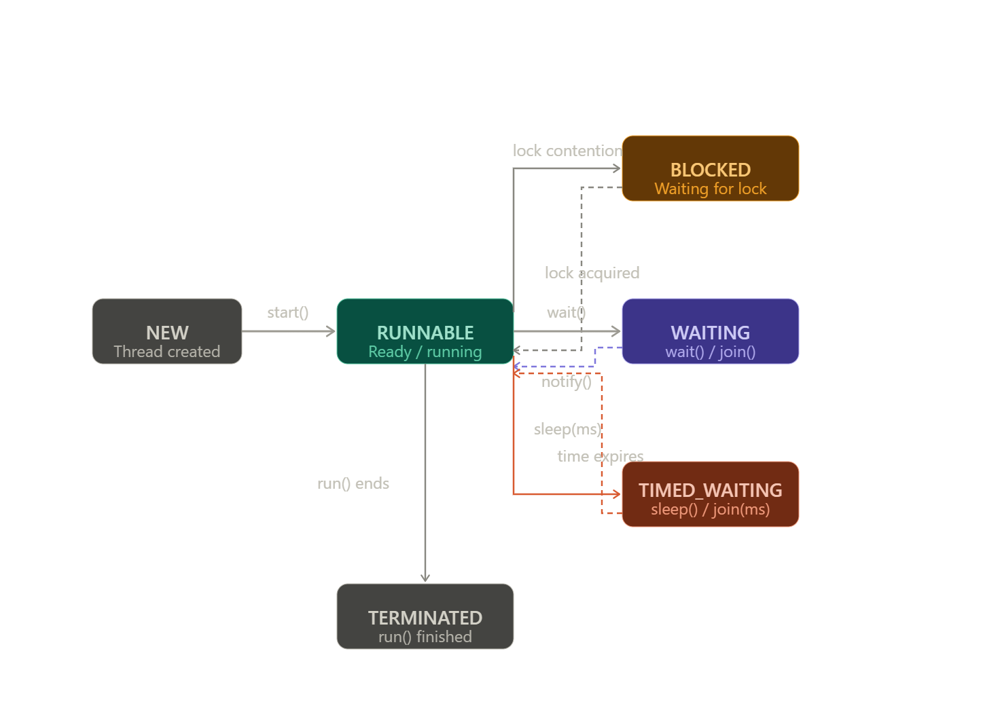
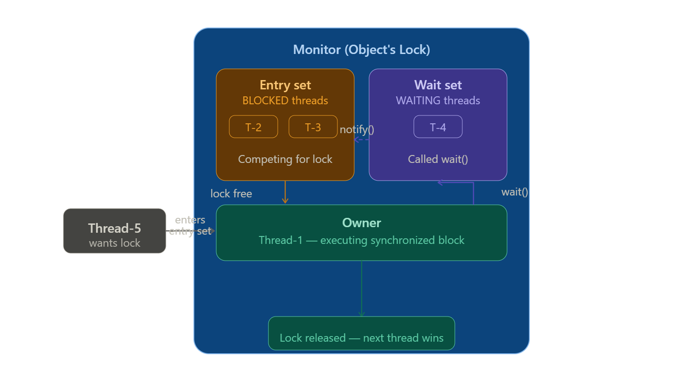

     


## Thread Lifecycle — In Depth

---

### The 6 States of a Thread

Java's `Thread.State` enum defines **6 states** a thread can be in during its lifetime:

```
NEW → RUNNABLE → BLOCKED
                 WAITING        → TERMINATED
                 TIMED_WAITING
```

---
---

### Visual FlowNow let's walk through each state in detail.


---

### State 1: NEW

A thread is in the `NEW` state the moment it is created but **before `start()` is called**.

```java
Thread t = new Thread(() -> System.out.println("Hello"));
// t is in NEW state here
System.out.println(t.getState()); // NEW
```

The JVM has created the thread object in memory but has not allocated any OS-level thread resources yet. The thread is just a Java object at this point — no actual execution has begun.

---

### State 2: RUNNABLE

Once `start()` is called, the thread moves to `RUNNABLE`. This state actually covers **two sub-phases**:

- **Ready** — the thread is waiting for the CPU scheduler to pick it up
- **Running** — the thread is actively executing on the CPU

Java doesn't separate these into two states because it's the OS scheduler's job to decide, not the JVM's.

```java
Thread t = new Thread(() -> {
    System.out.println("State inside run: " + Thread.currentThread().getState());
    // prints RUNNABLE (it's running right now)
});
t.start();
System.out.println("State after start: " + t.getState()); // RUNNABLE
```

---

### State 3: BLOCKED

A thread enters `BLOCKED` when it tries to enter a `synchronized` block or method, **but another thread already holds that lock**.

```java
Object lock = new Object();

Thread t1 = new Thread(() -> {
    synchronized (lock) {
        try { Thread.sleep(3000); } catch (InterruptedException e) {}
    }
});

Thread t2 = new Thread(() -> {
    synchronized (lock) {        // t2 tries to enter — but t1 holds the lock!
        System.out.println("t2 inside synchronized block");
    }
});

t1.start();
Thread.sleep(100); // let t1 acquire the lock first
t2.start();
Thread.sleep(100); // let t2 try and get blocked

System.out.println("t2 state: " + t2.getState()); // BLOCKED
```

**Output:**
```
t2 state: BLOCKED
```

The moment t1 releases the lock, t2 moves back to `RUNNABLE` and then enters the block.

---

### State 4: WAITING

A thread enters `WAITING` when it calls one of these with **no timeout**:

- `object.wait()`
- `thread.join()`
- `LockSupport.park()`

It stays there **indefinitely** until another thread wakes it up via `notify()`, `notifyAll()`, or `join()` completes.

```java
Object lock = new Object();

Thread t1 = new Thread(() -> {
    synchronized (lock) {
        try {
            System.out.println("t1 going to WAITING...");
            lock.wait();           // enters WAITING — releases lock
            System.out.println("t1 woken up! Back to RUNNABLE.");
        } catch (InterruptedException e) {}
    }
});

Thread t2 = new Thread(() -> {
    try { Thread.sleep(1000); } catch (InterruptedException e) {}
    synchronized (lock) {
        System.out.println("t2 calling notify()...");
        lock.notify();             // wakes t1
    }
});

t1.start();
Thread.sleep(200);
System.out.println("t1 state: " + t1.getState()); // WAITING
t2.start();
```

**Output:**
```
t1 going to WAITING...
t1 state: WAITING
t2 calling notify()...
t1 woken up! Back to RUNNABLE.
```

---

### State 5: TIMED_WAITING

Similar to `WAITING` but the thread **automatically wakes up after a time limit** even if no one notifies it.

Caused by:
- `Thread.sleep(ms)`
- `object.wait(ms)`
- `thread.join(ms)`
- `LockSupport.parkNanos()`

```java
Thread t = new Thread(() -> {
    try {
        System.out.println("Going to sleep...");
        Thread.sleep(3000);        // TIMED_WAITING for 3 seconds
        System.out.println("Woke up automatically!");
    } catch (InterruptedException e) {}
});

t.start();
Thread.sleep(500); // let t fall asleep first
System.out.println("t state: " + t.getState()); // TIMED_WAITING
```

**Output:**
```
Going to sleep...
t state: TIMED_WAITING
Woke up automatically!
```

---

### State 6: TERMINATED

A thread reaches `TERMINATED` when its `run()` method finishes — either normally or by throwing an uncaught exception.

```java
Thread t = new Thread(() -> {
    System.out.println("Thread doing work...");
    // run() ends here naturally
});

t.start();
t.join(); // wait for t to finish
System.out.println("t state: " + t.getState()); // TERMINATED
System.out.println("Is alive: " + t.isAlive());  // false
```

**Output:**
```
Thread doing work...
t state: TERMINATED
Is alive: false
```

A terminated thread **cannot be restarted**. Calling `start()` again throws `IllegalThreadStateException`.

---

### Complete Example — Observing All States

```java
public class LifecycleDemo {
    public static void main(String[] args) throws InterruptedException {
        Object lock = new Object();

        Thread t = new Thread(() -> {
            try {
                // Will be RUNNABLE here
                Thread.sleep(1000);           // → TIMED_WAITING
                synchronized (lock) {
                    lock.wait();              // → WAITING
                }
            } catch (InterruptedException e) {}
        });

        System.out.println("1. " + t.getState());    // NEW

        t.start();
        System.out.println("2. " + t.getState());    // RUNNABLE

        Thread.sleep(200);
        System.out.println("3. " + t.getState());    // TIMED_WAITING

        Thread.sleep(1000);
        System.out.println("4. " + t.getState());    // WAITING

        synchronized (lock) { lock.notify(); }       // wake it up

        t.join();
        System.out.println("5. " + t.getState());    // TERMINATED
    }
}
```

**Output:**
```
1. NEW
2. RUNNABLE
3. TIMED_WAITING
4. WAITING
5. TERMINATED
```

---

### Quick Reference

| State | Trigger | Exits When |
|---|---|---|
| `NEW` | `new Thread()` | `start()` is called |
| `RUNNABLE` | `start()` called | Gets CPU / loses CPU / blocks |
| `BLOCKED` | Waiting for `synchronized` lock | Lock is released by other thread |
| `WAITING` | `wait()` / `join()` (no timeout) | `notify()` / other thread finishes |
| `TIMED_WAITING` | `sleep(ms)` / `wait(ms)` / `join(ms)` | Timer expires or notified early |
| `TERMINATED` | `run()` completes or throws | Cannot exit — final state |

---

Want to move on to **ExecutorService & Thread Pools** next — the modern way Java manages threads in real applications?


## how does calling .start() actually execute your lambda recipe?

This is a classic "under the hood" JVM question, and it involves a little bit of Java source code magic and the Operating System.

Here is exactly what happens step-by-step.

Step 1: Storing the Recipe
When you create the Thread and pass your lambda, you are using this constructor: new Thread(Runnable target).

Inside the Thread class, Java takes your lambda and saves it into a private variable called target.


```java
// Inside java.lang.Thread
private Runnable target; // This holds your lambda!

public Thread(Runnable target) {
    this.target = target;
}
```
Step 2: The .start() Magic (Native OS Call)
When you call myThread.start(), it does not immediately call your lambda. Instead, start() does some heavy lifting. It checks to make sure the thread isn't already running, and then it calls a hidden method called start0().
start0() is a native method (written in C/C++). It talks directly to your computer's Operating System (like Windows or Linux) and says: "Hey OS, please allocate memory and create a brand new, physical thread for me."

Step 3: The OS Triggers .run()
Once the Operating System has created the actual background thread and the CPU is ready to give it some processing time, the OS tells the JVM to wake up.

The JVM responds by automatically calling the Thread object's internal .run() method on that brand new background thread.

Step 4: Executing Your Lambda
If you look at the actual source code for java.lang.Thread, the run() method looks exactly like this:

```java
@Override
public void run() {
    // If you passed a lambda (Runnable) into the constructor...
    if (target != null) {
        // ...execute it right now!
        target.run(); 
    }
}
```
Boom. That target.run() is the exact moment your lambda recipe is finally executed.

⚠️ The Ultimate Interview Question: start() vs run()
Because of this architecture, interviewers love to ask: "What happens if I call myThread.run() directly instead of myThread.start()?"

If you call myThread.run() directly, the code will execute... but it will not run in a new thread.
Because you bypassed the .start() method, you never talked to the Operating System to create a background thread. Your lambda will just execute like a normal method call on the main thread, freezing your application until it finishes.

You must call .start() to transfer that responsibility to the Operating System!

   


 ## Monitor Lock — In Depth

---

### What is a Monitor Lock?

In Java, **every single object** has a built-in hidden lock attached to it called a **monitor lock** (also called an **intrinsic lock** or **object lock**).

You don't create it. You don't see it. It's automatically there the moment any object is created.

```java
Object obj    = new Object(); // has a monitor lock
String str    = new String(); // has a monitor lock
BankAccount b = new BankAccount(); // has a monitor lock
int[] arr     = new int[5];  // has a monitor lock
// EVERY object in Java has one
```

Think of it like a **toilet door lock** — the toilet (object) has exactly one lock. Only one person (thread) can be inside at a time. Others wait outside until it's free.

---

### Why Does It Exist?

Without a monitor lock, multiple threads accessing shared data simultaneously cause **race conditions** (as we saw earlier). The monitor lock is Java's built-in solution — it guarantees **only one thread executes a critical section at a time**.

---

### How It Works Internally

Every object in the JVM has a **object header** in memory. Inside that header is a section called the **mark word** which stores monitor lock information:

```
Object in memory:
┌─────────────────────────────────┐
│         Object Header           │
│  ┌──────────────────────────┐   │
│  │  Mark Word               │   │
│  │  - Lock state            │   │
│  │  - Thread ID (if locked) │   │
│  │  - Lock count            │   │
│  └──────────────────────────┘   │
│  - Class pointer                │
├─────────────────────────────────┤
│         Instance Fields         │
│  - balance = 1000               │
│  - name = "Alice"               │
└─────────────────────────────────┘
```

---

### Acquiring the Monitor Lock

When a thread hits a `synchronized` block, it tries to **acquire** the monitor lock of that object:

```java
synchronized (someObject) {
    // thread owns the monitor lock of someObject here
    // do critical work
} // lock released automatically here
```

**Step by step:**

```
Thread tries to acquire lock
        │
        ▼
   Is lock free?
   ┌────┴────┐
  YES       NO
   │         │
   ▼         ▼
Acquires   Thread enters
lock &     BLOCKED state
enters     and waits in
block      entry set queue
   │         │
   │    lock released
   │         │
   └────┬────┘
        ▼
   Thread exits block
   & releases lock
```

---

### Entry Set and Wait Set

Every monitor has two internal queues:

```
Monitor of Object X:
┌──────────────────────────────────┐
│                                  │
│   ENTRY SET (BLOCKED threads)    │
│   [ Thread-B, Thread-C ]        │  ← waiting to acquire lock
│                                  │
│   WAIT SET (WAITING threads)     │
│   [ Thread-D ]                  │  ← called wait(), gave up lock
│                                  │
│   OWNER: Thread-A               │  ← currently holds the lock
│                                  │
└──────────────────────────────────┘
```

- **Entry Set** — threads trying to enter a `synchronized` block (BLOCKED state)
- **Wait Set** — threads that called `wait()` and voluntarily gave up the lock (WAITING state)
- **Owner** — the one thread currently holding the lock

---

### Seeing Monitor Lock in Action

```java
class MonitorDemo {
    private int count = 0;

    public synchronized void increment() {
        // 'this' object's monitor lock is acquired here
        System.out.println(Thread.currentThread().getName()
            + " owns the lock. count = " + count);
        try { Thread.sleep(1000); } catch (InterruptedException e) {}
        count++;
        System.out.println(Thread.currentThread().getName()
            + " releasing lock. count = " + count);
        // lock released when method exits
    }
}

public class Main {
    public static void main(String[] args) {
        MonitorDemo demo = new MonitorDemo();

        Thread t1 = new Thread(demo::increment, "Thread-A");
        Thread t2 = new Thread(demo::increment, "Thread-B");
        Thread t3 = new Thread(demo::increment, "Thread-C");

        t1.start();
        t2.start();
        t3.start();
    }
}
```

**Output:**
```
Thread-A owns the lock. count = 0    ← A acquires lock
// (1 second — B and C are BLOCKED in entry set)
Thread-A releasing lock. count = 1   ← A releases lock
Thread-B owns the lock. count = 1    ← B acquires lock (C still BLOCKED)
// (1 second)
Thread-B releasing lock. count = 2
Thread-C owns the lock. count = 2    ← C acquires lock
// (1 second)
Thread-C releasing lock. count = 3
```

All three threads take turns — never overlapping. That's the monitor lock enforcing order.

---

### `synchronized` Method vs `synchronized` Block — Which Object's Lock?

This is where people get confused. Let's be very precise:

**`synchronized` instance method — locks `this`:**
```java
class Counter {
    public synchronized void increment() {
        // acquires lock on 'this' (the Counter instance)
        count++;
    }

    // exactly the same as:
    public void increment() {
        synchronized (this) {
            count++;
        }
    }
}
```

**`synchronized` static method — locks the Class object:**
```java
class Counter {
    public static synchronized void reset() {
        // acquires lock on Counter.class (the Class object)
        // NOT on any instance — applies across ALL instances
        staticCount = 0;
    }

    // exactly the same as:
    public static void reset() {
        synchronized (Counter.class) {
            staticCount = 0;
        }
    }
}
```

**`synchronized` block — locks whatever object you specify:**
```java
class Counter {
    private final Object lockA = new Object();
    private final Object lockB = new Object();

    public void methodA() {
        synchronized (lockA) { // only lockA's monitor is acquired
            // Thread can still enter methodB() simultaneously
        }
    }

    public void methodB() {
        synchronized (lockB) { // only lockB's monitor is acquired
            // completely independent of methodA's lock
        }
    }
}
```

---

### Monitor Lock is Per-Object, Not Per-Method

One critical thing to understand — the lock belongs to the **object**, not the method:

```java
class BankAccount {
    private int balance = 1000;

    public synchronized void deposit(int amt) {
        balance += amt;
    }

    public synchronized void withdraw(int amt) {
        balance -= amt;
    }

    public synchronized int getBalance() {
        return balance;
    }
}

BankAccount alice = new BankAccount();
BankAccount bob   = new BankAccount();
```

```
alice object  ──has──▶  Monitor Lock A
bob object    ──has──▶  Monitor Lock B

Thread-1 holds Lock A → can call alice.deposit(), alice.withdraw(), alice.getBalance()
                         but BLOCKS if Thread-2 also tries alice.deposit()

Thread-2 can freely call bob.deposit() — that's Lock B, completely separate!
```

**Proof with code:**
```java
public class Main {
    public static void main(String[] args) {
        BankAccount alice = new BankAccount();
        BankAccount bob   = new BankAccount();

        // Thread-1 works on alice — holds alice's monitor lock
        Thread t1 = new Thread(() -> {
            synchronized (alice) {
                System.out.println("T1: locked alice");
                try { Thread.sleep(2000); } catch (InterruptedException e) {}
                System.out.println("T1: releasing alice");
            }
        });

        // Thread-2 works on bob — completely different lock, no blocking!
        Thread t2 = new Thread(() -> {
            synchronized (bob) {
                System.out.println("T2: locked bob (not blocked by T1!)");
                try { Thread.sleep(2000); } catch (InterruptedException e) {}
                System.out.println("T2: releasing bob");
            }
        });

        // Thread-3 also wants alice — will be BLOCKED by T1
        Thread t3 = new Thread(() -> {
            synchronized (alice) {
                System.out.println("T3: locked alice (had to wait for T1!)");
            }
        });

        t1.start(); t2.start(); t3.start();
    }
}
```

**Output:**
```
T1: locked alice
T2: locked bob (not blocked by T1!)   ← runs immediately, different lock
// (2 seconds pass — T3 is BLOCKED)
T1: releasing alice
T3: locked alice (had to wait for T1!) ← only now can T3 enter
T2: releasing bob
```

---

### Reentrant Nature of Monitor Lock

Java's monitor lock is **reentrant** — a thread that already owns a lock can acquire it again without deadlocking itself.

```java
class ReentrantDemo {
    public synchronized void outer() {
        System.out.println("Entered outer()");
        inner(); // calls another synchronized method on same object
    }

    public synchronized void inner() {
        // same thread, same lock — Java allows this!
        System.out.println("Entered inner()");
    }
}

public class Main {
    public static void main(String[] args) {
        new ReentrantDemo().outer();
    }
}
```

**Output:**
```
Entered outer()
Entered inner()
```

Internally the JVM tracks a **lock count**:

```
Thread-A calls outer()  → acquires lock, count = 1
Thread-A calls inner()  → same thread, count = 2 (re-entry allowed)
inner() returns         → count = 1
outer() returns         → count = 0, lock released
```

Without reentrancy, calling `inner()` from `outer()` would deadlock — the thread would wait for itself to release the lock it's already holding.

---

### `wait()` and `notify()` — Inside the Monitor

`wait()` and `notify()` work **through the monitor** — that's why they must be called inside `synchronized`:

```java
class MonitorWaitDemo {
    private boolean ready = false;

    public synchronized void producer() throws InterruptedException {
        System.out.println("Producer: working...");
        Thread.sleep(1000);
        ready = true;
        System.out.println("Producer: done, calling notify()");
        notify();
        // lock is NOT released by notify() — it's released when
        // this synchronized method returns
        System.out.println("Producer: method returning, lock released");
    }

    public synchronized void consumer() throws InterruptedException {
        while (!ready) {
            System.out.println("Consumer: not ready, calling wait()");
            wait(); // releases lock AND moves thread to wait set
            System.out.println("Consumer: woken up, re-acquired lock");
        }
        System.out.println("Consumer: processing!");
    }
}

public class Main {
    public static void main(String[] args) {
        MonitorWaitDemo demo = new MonitorWaitDemo();

        new Thread(() -> {
            try { demo.consumer(); } catch (InterruptedException e) {}
        }).start();

        new Thread(() -> {
            try { demo.producer(); } catch (InterruptedException e) {}
        }).start();
    }
}
```

**Output:**
```
Consumer: not ready, calling wait()       ← consumer releases lock via wait()
Producer: working...                      ← producer acquires lock now
Producer: done, calling notify()          ← moves consumer to entry set
Producer: method returning, lock released ← lock actually released here
Consumer: woken up, re-acquired lock      ← consumer gets lock from entry set
Consumer: processing!
```

**The exact flow of `wait()`:**
```
1. Thread calls wait() inside synchronized block
2. Thread is moved from OWNER → WAIT SET
3. Lock count drops to 0 — lock is RELEASED
4. Other threads can now acquire the lock
5. When notify() is called → thread moves from WAIT SET → ENTRY SET
6. Thread competes for lock like any other blocked thread
7. Once lock acquired → thread continues after wait()
```

---

### Monitor Lock vs `ReentrantLock` — Key Differences

| Feature | Monitor Lock (`synchronized`) | `ReentrantLock` |
|---|---|---|
| How to use | Built-in keyword | Explicit `lock()` / `unlock()` |
| Auto release | ✅ Yes (on exit/exception) | ❌ Must call `unlock()` in `finally` |
| Try to acquire | ❌ No | ✅ `tryLock()` |
| Timeout | ❌ No | ✅ `tryLock(2, TimeUnit.SECONDS)` |
| Fairness | ❌ No guarantee | ✅ `new ReentrantLock(true)` |
| Multiple conditions | ❌ One wait set only | ✅ Multiple `Condition` objects |
| Interruptible wait | ❌ No | ✅ `lockInterruptibly()` |

---

### Visualizing the Full Monitor Structure---




### The Golden Rules of Monitor Lock

```
1. Every Java object has exactly ONE monitor lock
2. Only ONE thread can own the monitor at a time
3. synchronized method   → locks 'this'
   synchronized static   → locks ClassName.class
   synchronized (obj)    → locks obj
4. wait() RELEASES the lock — sleep() does NOT
5. notify() does NOT release the lock immediately
   — it moves thread from wait set to entry set
   — lock is released when synchronized block exits
6. Monitor lock is REENTRANT — same thread can re-enter
7. Lock is ALWAYS released on exit, even if exception thrown
```

---

