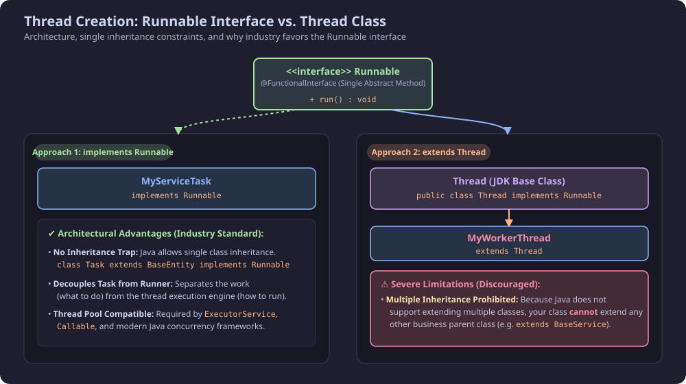
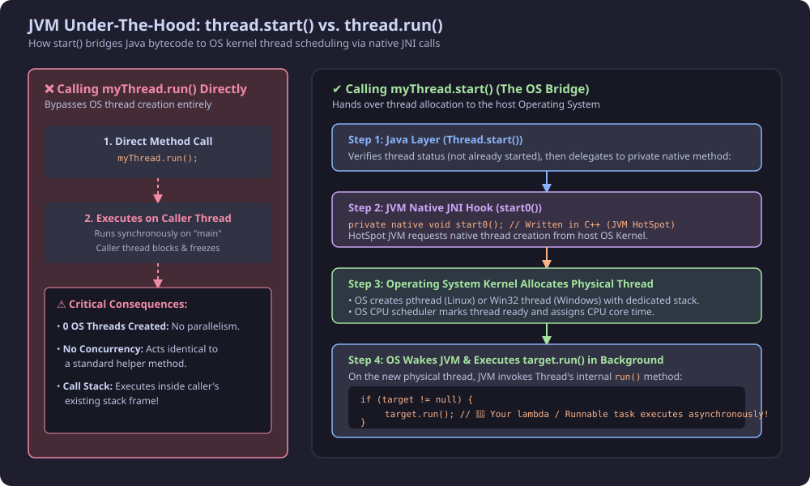
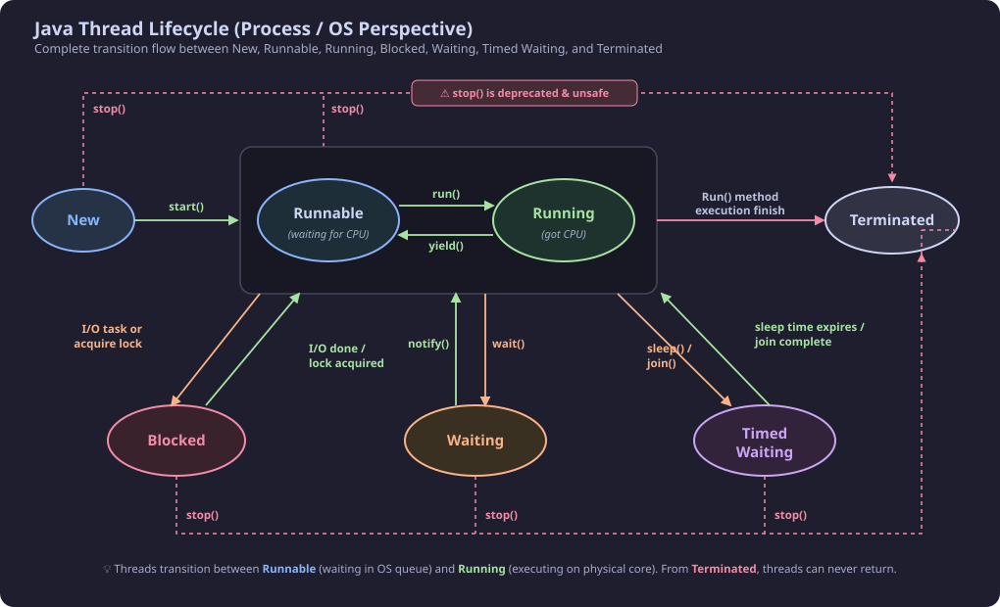
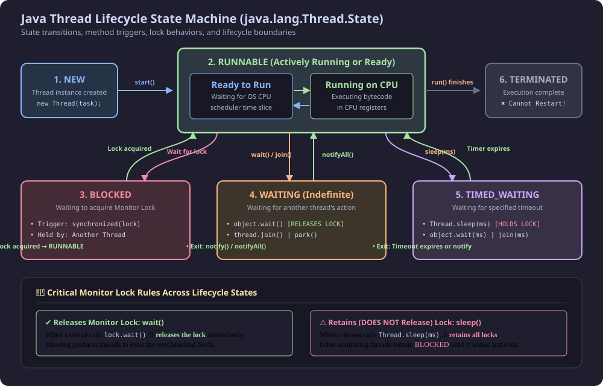
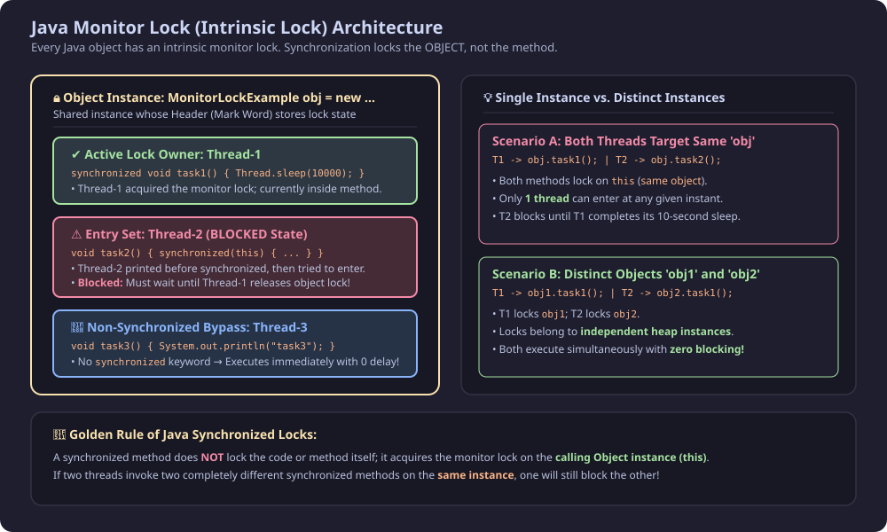
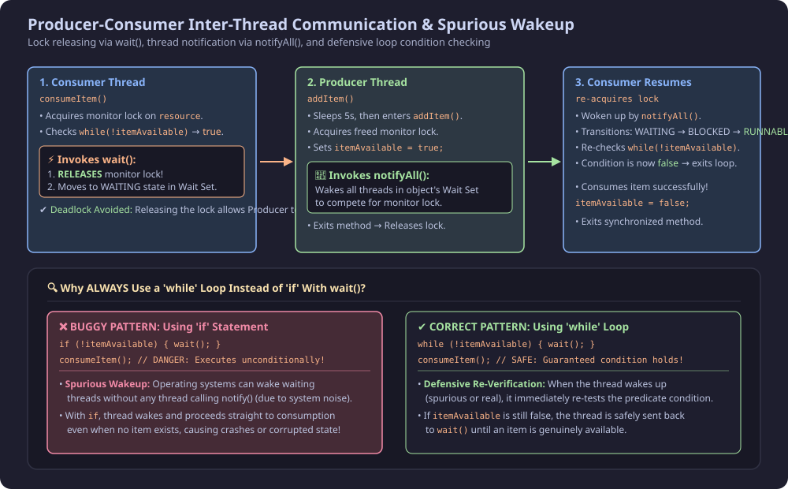

Multithreading in Java is built around two fundamental abstractions: **Thread execution engines** and **object-level monitor locks**. Understanding how threads transition through their lifecycle states, how the JVM bridges Java calls to native OS threads, and how monitor locks coordinate shared state is essential for writing robust, concurrent Java applications.

---

## 1. Thread Creation Mechanisms: `Runnable` vs. `Thread` Class

In Java, there are two primary ways to define and spawn a custom thread:

1. **Implementing `java.lang.Runnable`** (Recommended / Industry Standard)
2. **Extending `java.lang.Thread`**

```
                 <<interface>>
                   Runnable
                 ┌──────────┐
                 │ + run()  │
                 └────┬─────┘
                      │
        ┌─────────────┴─────────────┐
        │ implements                │ implements
        ▼                           ▼
┌───────────────┐           ┌───────────────┐
│ MyServiceTask │           │    Thread     │
└───────────────┘           └───────┬───────┘
                                    │ extends
                                    ▼
                            ┌───────────────┐
                            │ MyWorkerClass │
                            └───────────────┘
```

### 1.1 Why Two Different Approaches? (The Single Inheritance Constraint)

> [!IMPORTANT]
> **🔥 Frequently Asked Interview Question:** *Why does Java provide both `Runnable` and `Thread`, and which should you prefer?*
>
> * **Java's Single Inheritance Rule:** A Java class can extend **only one superclass**, but can implement **multiple interfaces**.
> * If your class extends `Thread`, it **cannot extend any other business class** (e.g., `extends BaseService`).
> * By implementing `Runnable`, your class remains free to inherit from domain superclasses while also implementing other interfaces (e.g., `implements Runnable, Serializable`).
> * **Separation of Concerns:** `Runnable` represents the **task** (what code to execute), while `Thread` represents the **worker** (the physical execution engine). Decoupling them allows tasks to be executed by thread pools (`ExecutorService`), `CompletableFuture`, or virtual threads.

---

### 1.2 Approach 1: Implementing `Runnable` (Best Practice)

```java
// Step 1: Define a class implementing Runnable
public class MultithreadingLearning implements Runnable {
    @Override
    public void run() {
        System.out.println("Code executed by: " + Thread.currentThread().getName());
    }
}

// Step 2: Pass Runnable instance to Thread constructor and start
public class Main {
    public static void main(String[] args) {
        System.out.println("Main thread starts: " + Thread.currentThread().getName());

        MultithreadingLearning task = new MultithreadingLearning();
        Thread worker = new Thread(task); // Thread wraps the Runnable target
        worker.start();

        // Modern Java (Lambda shorthand):
        Thread lambdaWorker = new Thread(() -> {
            System.out.println("Lambda executed by: " + Thread.currentThread().getName());
        });
        lambdaWorker.start();

        System.out.println("Main thread finishes: " + Thread.currentThread().getName());
    }
}
```

---

### 1.3 Approach 2: Extending `Thread` Class

```java
// Step 1: Subclass Thread and override run()
public class ThreadCreationUsingThreadClass extends Thread {
    @Override
    public void run() {
        System.out.println("Direct subclass executed by: " + Thread.currentThread().getName());
    }
}

// Step 2: Instantiate subclass directly
public class Test {
    public static void main(String[] args) {
        ThreadCreationUsingThreadClass t1 = new ThreadCreationUsingThreadClass();
        t1.start(); // Directly calls overridden run() on background thread
    }
}
```

---

### 1.4 How `Thread.run()` Works Under the Hood

Inside the OpenJDK source code (`java.lang.Thread`), the `run()` method is implemented as follows:

```java
// Inside java.lang.Thread
private Runnable target; // Stores your lambda or Runnable object

public Thread(Runnable target) {
    this.target = target;
}

@Override
public void run() {
    // If you passed a Runnable target into constructor, execute it:
    if (target != null) {
        target.run();
    }
    // If subclassed Thread and didn't override run(), does nothing!
}
```



---

## 2. JVM Under-The-Hood: `thread.start()` vs. `thread.run()`

> [!WARNING]
> **🔥 The Ultimate Interview Question:** *What happens if you call `myThread.run()` directly instead of `myThread.start()`?*

Calling `myThread.run()` executes the code like a **standard synchronous method call** on the calling thread (e.g., `main`). **Zero OS threads are created**, no concurrency is achieved, and the caller blocks until execution finishes.

Calling `myThread.start()` triggers the JVM's native bridge to spawn an operating system thread:

1. **Step 1 — Java Layer Validation:** `start()` checks that the thread state is `NEW`. If already started, it throws `IllegalThreadStateException`.
2. **Step 2 — Native JNI Method Call:** `start()` invokes a private native method `start0()`:
   ```java
   private native void start0();
   ```
3. **Step 3 — Operating System Thread Allocation:** Written in C/C++ inside the JVM HotSpot engine, `start0()` calls the host OS kernel (e.g., `pthread_create` on Linux, `CreateThread` on Windows) to allocate a native thread stack and program counter.
4. **Step 4 — Background Execution:** The OS scheduler assigns CPU time slices to the newly allocated native thread. The OS signals the JVM, which invokes `Thread.run()`, ultimately triggering `target.run()` in the background.



---

## 3. The 6 Java Thread Lifecycle States (`java.lang.Thread.State`)

Java defines exactly 6 distinct thread lifecycle states in the `java.lang.Thread.State` enum:




---

### State 1: `NEW`
* **Condition:** The thread object is instantiated in JVM heap memory (`new Thread()`), but `start()` has **not yet been called**.
* **Resources:** Only the Java object exists. No physical OS kernel thread or call stack has been allocated.
* **State Check:** `thread.getState() == Thread.State.NEW`.

```java
Thread t = new Thread(() -> System.out.println("Running"));
System.out.println(t.getState()); // NEW
```

---

### State 2: `RUNNABLE` (Ready to Run / Waiting for CPU)
* **Condition:** `start()` has been invoked, or a thread has transitioned back from `BLOCKED`, `WAITING`, or `TIMED_WAITING`.
* **Behavior:** The thread has been allocated OS kernel resources and is placed in the operating system scheduler's **Ready Queue**, actively waiting for CPU core time slices.
* **State Check:** `thread.getState() == Thread.State.RUNNABLE`.

```java
Thread t = new Thread(() -> {
    System.out.println("Inside run: " + Thread.currentThread().getState()); // RUNNABLE
});
t.start();
System.out.println("After start: " + t.getState()); // RUNNABLE
```

---

### State 2b / Operating Sub-State: `RUNNING` (Actively Executing on CPU)
* **Condition:** The OS scheduler assigns a CPU core to the thread, and its bytecode instructions are actively processed by physical CPU registers.
* **Transitions to & from `RUNNING`:**
  1. **`Runnable` &#8594; `Running`:** OS scheduler selects the thread from the Ready Queue and dispatches it onto an available CPU core (triggers `run()`).
  2. **`Running` &#8594; `Runnable`:**
     * **Time Slicing / Preemption:** The thread exhausts its allocated CPU time quantum and is placed back into the Ready Queue.
     * **`Thread.yield()`:** The thread voluntarily hints to the OS scheduler that it is willing to surrender its current CPU time slice to allow other ready threads of equal priority to execute.
  3. **`Running` &#8594; `Terminated`:** When the `run()` method finishes executing all instructions normally or terminates due to an uncaught exception.
  4. **`Running` &#8594; Suspended (`Blocked` / `Waiting` / `Timed Waiting`):** Occurs when the thread requests I/O, needs a busy monitor lock, or invokes `wait()` / `sleep()`.

> [!NOTE]
> **JVM Enum vs. OS Reality:**
> In the Java API (`java.lang.Thread.State`), both **Ready (Runnable)** and **Running** are unified under the single state `Thread.State.RUNNABLE`. This design choice is because modern operating systems context-switch threads hundreds of times per second, making it impractical for the JVM to accurately query whether a thread is on a core at any exact nanosecond. Architecturally, however, the distinction between **waiting for CPU** and **executing on CPU** is vital.

---

### State 3: `BLOCKED`
* **Condition:** A thread attempts to enter a `synchronized` method or block, but the **monitor lock is currently held by another thread**.
* **Exit:** Automatically transitions back to `RUNNABLE` once the lock owner exits the synchronized block and this thread successfully acquires the monitor lock.

```java
Object lock = new Object();

Thread t1 = new Thread(() -> {
    synchronized (lock) {
        try { Thread.sleep(3000); } catch (InterruptedException e) {}
    }
});

Thread t2 = new Thread(() -> {
    synchronized (lock) { // Blocked here while t1 holds lock
        System.out.println("t2 entered synchronized block");
    }
});

t1.start();
Thread.sleep(100); // Ensure t1 acquires lock first
t2.start();
Thread.sleep(100);

System.out.println("t2 state: " + t2.getState()); // BLOCKED
```

---

### State 4: `WAITING` (Indefinite Wait)
* **Condition:** A thread voluntarily suspends its execution **without any timeout limit**.
* **Triggers:**
  * `object.wait()` &mdash; **Releases the object's monitor lock!**
  * `thread.join()` &mdash; Waits indefinitely for target thread to terminate.
  * `LockSupport.park()` &mdash; Suspends current thread for synchronization primitives.
* **Exit:** Transitions back to `RUNNABLE` when another thread calls `object.notify()`, `object.notifyAll()`, or `LockSupport.unpark()`.

```java
Object lock = new Object();

Thread t1 = new Thread(() -> {
    synchronized (lock) {
        try {
            System.out.println("t1 waiting for signal...");
            lock.wait(); // Releases lock and enters WAITING state
            System.out.println("t1 notified! Resumed.");
        } catch (InterruptedException e) {}
    }
});

Thread t2 = new Thread(() -> {
    try { Thread.sleep(1000); } catch (InterruptedException e) {}
    synchronized (lock) {
        System.out.println("t2 notifying waiting threads...");
        lock.notify(); // Wakes up t1
    }
});

t1.start();
Thread.sleep(200);
System.out.println("t1 state: " + t1.getState()); // WAITING
t2.start();
```

---

### State 5: `TIMED_WAITING` (Timed Wait)
* **Condition:** The thread suspends execution for a **specified maximum duration**.
* **Triggers:**
  * `Thread.sleep(milliseconds)` &mdash; **Does NOT release any monitor locks!**
  * `object.wait(timeout)` &mdash; Releases the monitor lock; wakes on timeout or notification.
  * `thread.join(timeout)`
  * `LockSupport.parkNanos()` / `parkUntil()`
* **Exit:** Automatically returns to `RUNNABLE` when the timer expires or when notified prematurely.

```java
Thread t = new Thread(() -> {
    try {
        Thread.sleep(2000); // TIMED_WAITING
    } catch (InterruptedException e) {}
});

t.start();
Thread.sleep(300);
System.out.println("t state: " + t.getState()); // TIMED_WAITING
```

---

### State 6: `TERMINATED`
* **Condition:** The thread has completed its `run()` method, either naturally or due to an uncaught exception.
* **Lifecycle End:** Once terminated, the thread cannot be resurrected or restarted. Calling `start()` on a terminated thread throws `IllegalThreadStateException`.
* **State Check:** `thread.isAlive() == false`.

---

### 3.1 Comprehensive Lifecycle Demonstration

```java
public class LifecycleDemo {
    public static void main(String[] args) throws InterruptedException {
        Object lock = new Object();

        Thread t = new Thread(() -> {
            try {
                // 1. Thread will be RUNNABLE while executing
                Thread.sleep(500); // 2. TIMED_WAITING
                synchronized (lock) {
                    lock.wait();   // 3. WAITING (Releases lock)
                }
            } catch (InterruptedException e) {}
        });

        System.out.println("1. Initial state: " + t.getState()); // NEW

        t.start();
        System.out.println("2. After start: " + t.getState());   // RUNNABLE

        Thread.sleep(200);
        System.out.println("3. During sleep: " + t.getState());  // TIMED_WAITING

        Thread.sleep(600);
        System.out.println("4. During wait: " + t.getState());   // WAITING

        synchronized (lock) {
            lock.notify(); // Wake up thread
        }

        t.join();
        System.out.println("5. After completion: " + t.getState()); // TERMINATED
    }
}
```

**Output:**
```text
1. Initial state: NEW
2. After start: RUNNABLE
3. During sleep: TIMED_WAITING
4. During wait: WAITING
5. After completion: TERMINATED
```

> [!CAUTION]
> **Why `Thread.stop()`, `suspend()`, and `resume()` are Deprecated:**
> In early Java versions, `Thread.stop()` allowed abruptly terminating a thread. It was deprecated because it immediately releases all locked monitors, leaving shared objects in corrupted, inconsistent states. Threads must always be stopped gracefully using volatile cancellation flags or `Thread.interrupt()`.



---

## 4. Java Monitor Lock (Intrinsic Lock) Architecture

### 4.1 What is a Monitor Lock?
In Java, **every single Object created on the heap possesses an intrinsic Monitor Lock**. When a thread enters a `synchronized` block or method:
1. It must first acquire the monitor lock belonging to the specified object.
2. If another thread already holds that object's lock, incoming threads are placed in that object's **Entry Set** in the `BLOCKED` state.
3. Upon exiting the synchronized block, the thread releases the monitor lock, allowing one of the blocked threads to acquire it.

### 4.2 Critical Rule: Lock Belongs to the OBJECT, Not the Method!

> [!IMPORTANT]
> A common misconception is that `synchronized` locks the method. **It does not.** It locks the **target object instance (`this`)**.
> * If `Thread-1` calls `synchronized task1()` on `obj`, and `Thread-2` calls `synchronized task2()` on the **same `obj`**, `Thread-2` will be **BLOCKED**, even though `task1` and `task2` are completely different methods!
> * Non-synchronized methods (e.g., `task3()`) do not require the monitor lock and execute immediately without delay.

```java
public class MonitorLockExample {

    // Synchronized method 1: Holds lock for 10 seconds
    public synchronized void task1() {
        try {
            System.out.println("inside task1 - lock acquired by: " + Thread.currentThread().getName());
            Thread.sleep(10000); // 10 seconds
        } catch (Exception e) {}
    }

    // Method with synchronized block on 'this'
    public void task2() {
        System.out.println("task2 before synchronized by: " + Thread.currentThread().getName());
        synchronized (this) {
            System.out.println("task2 inside synchronized by: " + Thread.currentThread().getName());
        }
    }

    // Non-synchronized method: Bypasses monitor lock
    public void task3() {
        System.out.println("task3 executed immediately by: " + Thread.currentThread().getName());
    }
}
```

```java
public class Main {
    public static void main(String[] args) {
        MonitorLockExample obj = new MonitorLockExample();

        Thread t1 = new Thread(obj::task1, "Thread-1");
        Thread t2 = new Thread(obj::task2, "Thread-2");
        Thread t3 = new Thread(obj::task3, "Thread-3");

        t1.start(); // Acquires monitor lock on 'obj' and sleeps for 10s
        t2.start(); // Prints 'before synchronized', then BLOCKS on 'obj'
        t3.start(); // Does not need lock -> Runs IMMEDIATELY!
    }
}
```

**Console Output Sequence:**
```text
inside task1 - lock acquired by: Thread-1
task2 before synchronized by: Thread-2
task3 executed immediately by: Thread-3
... (10 seconds delay while Thread-1 holds lock) ...
task2 inside synchronized by: Thread-2
```

### 4.3 Same Instance vs. Distinct Instances

* **Contention (`t1` on `obj`, `t2` on `obj`):** Both threads compete for the exact same lock on the same heap object &rarr; mutual exclusion occurs.
* **No Contention (`t1` on `obj1`, `t2` on `obj2`):** Each object has its own separate monitor lock in heap memory &rarr; both threads execute concurrently with zero waiting!



---

## 5. Inter-Thread Communication: `wait()`, `notifyAll()`, and Spurious Wakeups

When threads coordinate on shared resources (such as Producer-Consumer architectures), they communicate using methods inherited from `java.lang.Object`:

* **`wait()`:** Causes current thread to wait until another thread calls `notify()` or `notifyAll()`.
* **`notify()`:** Wakes up a single arbitrary thread waiting in the object's monitor wait set.
* **`notifyAll()`:** Wakes up all threads waiting in the object's monitor wait set.

> [!NOTE]
> `wait()`, `notify()`, and `notifyAll()` can **ONLY** be called from within a `synchronized` context on that specific object. Calling them without holding the monitor lock throws `IllegalMonitorStateException`.

---

### 5.1 Why `wait()` Avoids Deadlocks (Releasing the Lock)

Consider a Producer and a Consumer:
1. Consumer enters `consumeItem()`, acquires the monitor lock.
2. The item queue is empty. If Consumer were to sleep with `Thread.sleep()`, it would retain the monitor lock. The Producer could never enter `addItem()` to produce items, resulting in a **Deadlock**!
3. **The Solution:** Calling `wait()` atomically **releases the monitor lock** and places the Consumer thread into the object's **Wait Set**.
4. The Producer can now acquire the freed monitor lock, add the item, and invoke `notifyAll()`.

---

### 5.2 The Producer-Consumer Implementation

```java
public class SharedResource {
    private boolean itemAvailable = false;

    // Producer method
    public synchronized void addItem() {
        itemAvailable = true;
        System.out.println("Item added by: " + Thread.currentThread().getName() + " -> Notifying waiting threads");
        notifyAll(); // Wakes up waiting consumers
    }

    // Consumer method
    public synchronized void consumeItem() {
        System.out.println("Consume method invoked by: " + Thread.currentThread().getName());

        // DEFENSIVE CODING: Always check condition in a while loop!
        while (!itemAvailable) {
            try {
                System.out.println("Item not ready. " + Thread.currentThread().getName() + " is waiting...");
                wait(); // RELEASES monitor lock and sleeps in Wait Set
            } catch (InterruptedException e) {
                Thread.currentThread().interrupt();
            }
        }

        System.out.println("Item successfully consumed by: " + Thread.currentThread().getName());
        itemAvailable = false; // Reset state
    }
}
```

```java
public class ProducerConsumerDemo {
    public static void main(String[] args) {
        SharedResource resource = new SharedResource();

        // Producer task: Sleeps 5 seconds, then produces
        Thread producer = new Thread(() -> {
            try {
                System.out.println("Producer sleeping for 5s before producing...");
                Thread.sleep(5000);
            } catch (InterruptedException e) {}
            resource.addItem();
        }, "Producer-Thread");

        // Consumer task: Tries to consume immediately
        Thread consumer = new Thread(() -> {
            resource.consumeItem();
        }, "Consumer-Thread");

        consumer.start();
        producer.start();
    }
}
```

**Console Output:**
```text
Consume method invoked by: Consumer-Thread
Item not ready. Consumer-Thread is waiting...
Producer sleeping for 5s before producing...
... (5 seconds pass) ...
Item added by: Producer-Thread -> Notifying waiting threads
Item successfully consumed by: Consumer-Thread
```

---

### 5.3 Why ALWAYS Use `while (!condition)` Instead of `if (!condition)`?

> [!IMPORTANT]
> **🔥 The "Spurious Wakeup" Phenomenon:**
> A waiting thread can occasionally wake up from `wait()` **without** any explicit call to `notify()` or `notifyAll()`. This is known as a **spurious wakeup**, caused by operating system kernel scheduling interrupts and noise.
>
> * **If you use `if (!condition)`:** If a spurious wakeup occurs, the thread resumes past the `if` block and proceeds straight to consuming data that does not exist &rarr; **NullPointerExceptions or corrupted state**!
> * **If you use `while (!condition)`:** Upon waking (whether spurious or real), the thread re-evaluates the boolean condition. If the item is still not available, it is safely sent right back to `wait()`.



---

## 6. Quick Reference: `wait()` vs. `sleep()` Comparison

| Feature | `object.wait()` | `Thread.sleep(ms)` |
| :--- | :--- | :--- |
| **Origin Class** | `java.lang.Object` | `java.lang.Thread` |
| **Monitor Lock Behavior** | **Releases** the object's monitor lock | **Retains** all acquired monitor locks |
| **Execution Context** | Must be called inside `synchronized` block/method | Can be called anywhere |
| **Wakeup Mechanism** | Wakes on `notify()` / `notifyAll()` or timeout | Wakes when timer expires or `interrupt()` |
| **Target State** | Enters `WAITING` or `TIMED_WAITING` | Enters `TIMED_WAITING` |
| **Primary Use Case** | Inter-thread coordination and signaling | Introducing deliberate processing pauses |

---

## 7. Lifecycle States Summary Matrix

| State | Trigger | Monitor Lock Released? | Transition Out Condition |
| :--- | :--- | :---: | :--- |
| **`NEW`** | `new Thread()` | N/A | `start()` invoked |
| **`RUNNABLE` (Ready)** | `start()`, lock acquired, notified | N/A | Dispatched by CPU scheduler &#8594; `RUNNING` |
| **`RUNNING` (Got CPU)** | CPU scheduler allocates core | N/A | Preemption, `yield()`, I/O, `wait()`, `sleep()`, or finishes |
| **`BLOCKED`** | Contending for `synchronized` lock | No | Lock holder exits synchronized block |
| **`WAITING`** | `wait()`, `join()`, `park()` | **Yes** (via `wait()`) | `notify()`, `notifyAll()`, or target thread finishes |
| **`TIMED_WAITING`** | `sleep(ms)`, `wait(ms)`, `join(ms)` | **No** (for `sleep`), **Yes** (for `wait`) | Timer expires or signal received |
| **`TERMINATED`** | `run()` finishes or uncaught exception | N/A | Terminal state &mdash; cannot transition out |
