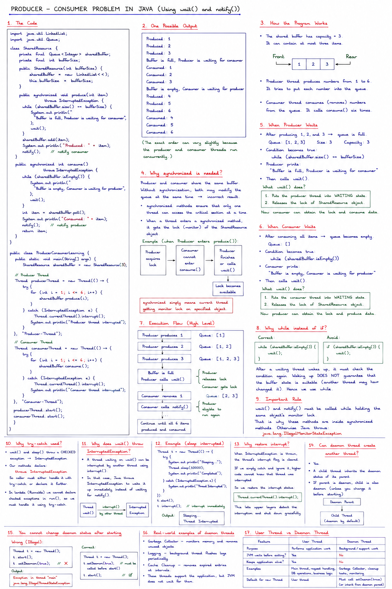
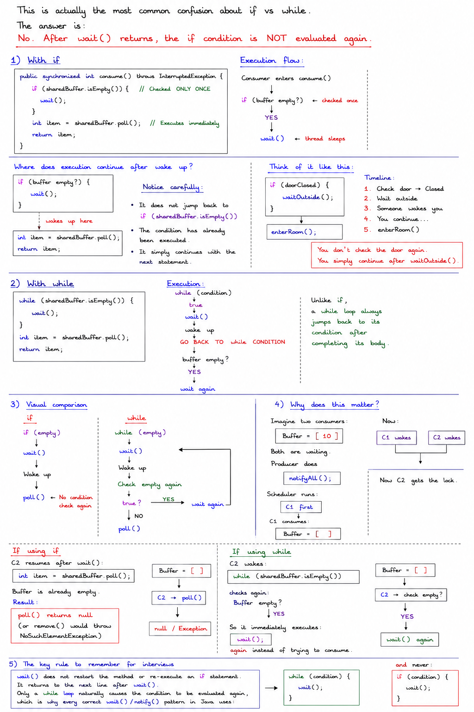
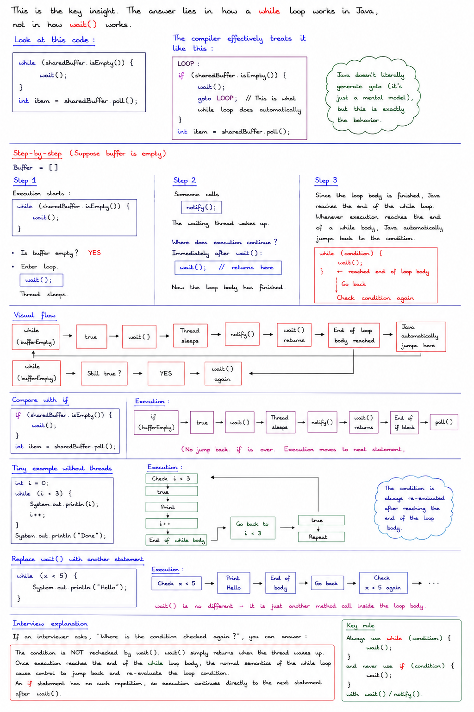
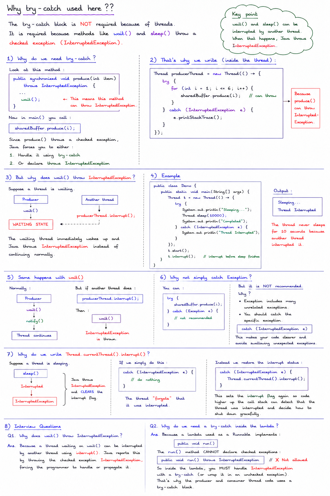
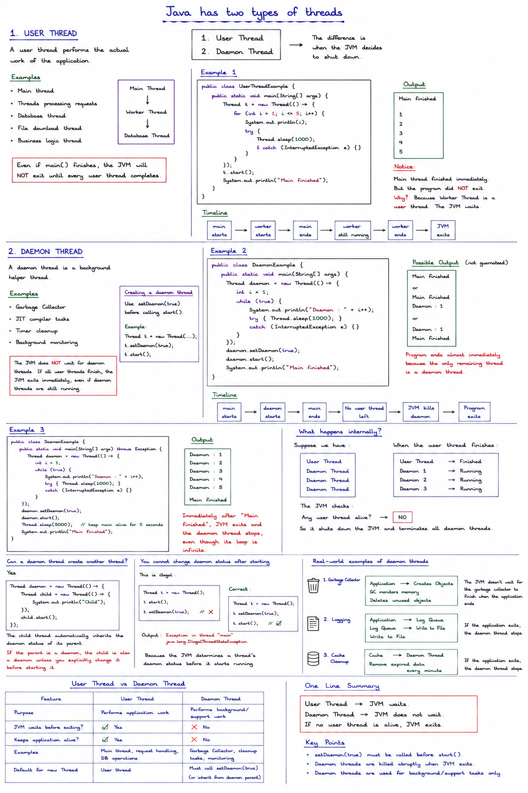
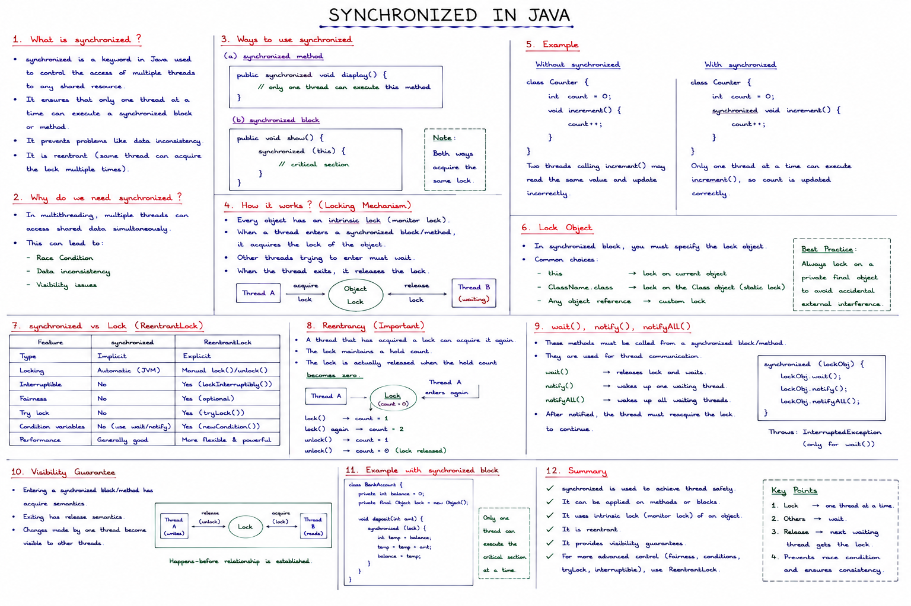

# Notes

  


```java
import java.util.LinkedList;
import java.util.Queue;

class SharedResource {

    private final Queue<Integer> sharedBuffer;
    private final int bufferSize;

    public SharedResource(int bufferSize) {
        sharedBuffer = new LinkedList<>();
        this.bufferSize = bufferSize;
    }

    public synchronized void produce(int item)
            throws InterruptedException {

        // If the buffer is full, the producer must wait.
        while (sharedBuffer.size() == bufferSize) {
            System.out.println(
                    "Buffer is full, Producer is waiting for consumer"
            );

            wait();
        }

        sharedBuffer.add(item);

        System.out.println("Produced: " + item);

        // Notify the consumer because data is now available.
        notify();
    }

    public synchronized int consume()
            throws InterruptedException {

        // If the buffer is empty, the consumer must wait.
        while (sharedBuffer.isEmpty()) {
            System.out.println(
                    "Buffer is empty, Consumer is waiting for producer"
            );

            wait();
        }

        int item = sharedBuffer.poll();

        System.out.println("Consumed: " + item);

        // Notify the producer because space is now available.
        notify();

        return item;
    }
}

public class ProducerConsumerLearning {

    public static void main(String[] args) {

        SharedResource sharedBuffer = new SharedResource(3);

        // Creating producer thread using a lambda expression.
        Thread producerThread = new Thread(() -> {
            try {
                for (int i = 1; i <= 6; i++) {
                    sharedBuffer.produce(i);
                }
            } catch (InterruptedException e) {
                Thread.currentThread().interrupt();
                System.out.println("Producer thread interrupted");
            }
        }, "Producer-Thread");

        // Creating consumer thread using a lambda expression.
        Thread consumerThread = new Thread(() -> {
            try {
                for (int i = 1; i <= 6; i++) {
                    sharedBuffer.consume();
                }
            } catch (InterruptedException e) {
                Thread.currentThread().interrupt();
                System.out.println("Consumer thread interrupted");
            }
        }, "Consumer-Thread");

        producerThread.start();
        consumerThread.start();
    }
}
```

## Output 

One possible output is:

```text
Produced: 1
Produced: 2
Produced: 3
Buffer is full, Producer is waiting for consumer
Consumed: 1
Consumed: 2
Consumed: 3
Buffer is empty, Consumer is waiting for producer
Produced: 4
Produced: 5
Produced: 6
Consumed: 4
Consumed: 5
Consumed: 6
```



# If vs while




---



---

### 2 threads one prints even value and other print odd value we want to print output as 

```text 
1
2
3
4
5
6
7
8
9
10
```

```java
class SharedResource {
    private int i = 1;
    private boolean oddTurn = true;

    public synchronized void printOdd() throws InterruptedException {
        while (!oddTurn) {
            wait();
        }

        System.out.println(i + " printed by " +
                           Thread.currentThread().getName());

        i++;
        oddTurn = false;
        notify();
    }

    public synchronized void printEven() throws InterruptedException {
        while (oddTurn) {
            wait();
        }

        System.out.println(i + " printed by " +
                           Thread.currentThread().getName());

        i++;
        oddTurn = true;
        notify();
    }
}

public class Main {
    public static void main(String[] args) throws InterruptedException {
        SharedResource resource = new SharedResource();

        Thread t1 = new Thread(() -> {
            for (int count = 0; count < 5; count++) {
                try {
                    resource.printOdd();
                } catch (InterruptedException e) {
                    Thread.currentThread().interrupt();
                    return;
                }
            }
        }, "T1");

        Thread t2 = new Thread(() -> {
            for (int count = 0; count < 5; count++) {
                try {
                    resource.printEven();
                } catch (InterruptedException e) {
                    Thread.currentThread().interrupt();
                    return;
                }
            }
        }, "T2");

        t1.start();
        t2.start();

        t1.join();
        t2.join();
    }
}
```

Output

```text

1 printed by T1
2 printed by T2
3 printed by T1
4 printed by T2
5 printed by T1
6 printed by T2
7 printed by T1
8 printed by T2
9 printed by T1
10 printed by T2
```

  




---

## Creating a daemon thread

Use

```java
setDaemon(true)
```

before calling `start()`.

Example

```java
Thread t = new Thread(...);

t.setDaemon(true);

t.start();
```

---


---

# Interview questions

### Q1. What happens if only daemon threads remain?

The JVM exits immediately and all daemon threads are terminated.

---

### Q2. Is the main thread a daemon thread?

No. The `main` thread is a **user thread**.

---

### Q3. Can a daemon thread prevent JVM shutdown?

No. Daemon threads never keep the JVM alive.

---

### Q4. Why is the Garbage Collector a daemon thread?

Because it is a background service. It helps the application but should not prevent the JVM from exiting once all user work is done.

---

### Q5. When should you use daemon threads?

Use daemon threads for **background services** such as:
- Cache cleanup
- Periodic monitoring
- Metrics collection
- Heartbeat tasks
- Temporary housekeeping

Avoid using daemon threads for tasks that **must complete**, such as saving user data or processing payments, because they can be stopped abruptly when the JVM exits.


----
