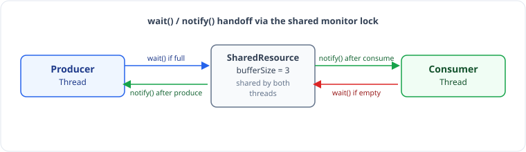
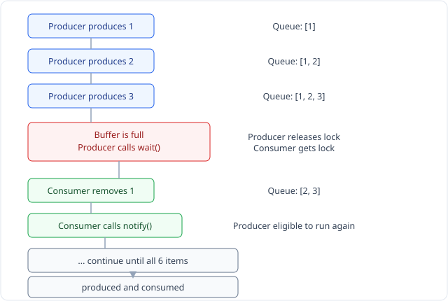
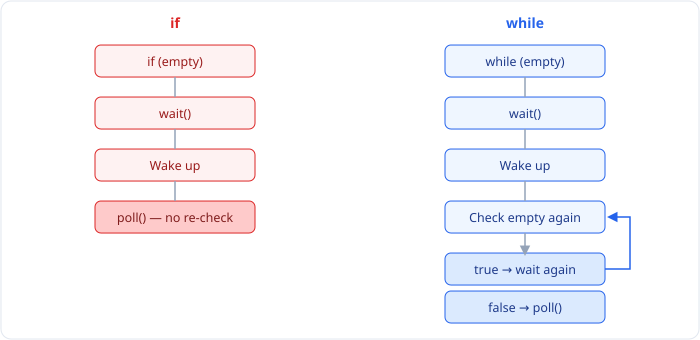
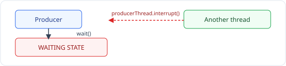

##  Implement PRODUCER CONSUMER Problem

**Question:**

Two threads, a producer and a consumer, share a common, fixed-size buffer as a queue.
The producer's job is to generate data and put it into the buffer, while the consumer's job is to consume the data from the buffer.
The problem is to make sure that the producer won't produce data if the buffer is full, and the consumer won't consume data if the buffer is empty.


```java
import java.util.LinkedList;
import java.util.Queue;

class SharedResource {

    private final Queue<Integer> sharedBuffer;
    private final int bufferSize;

    public SharedResource(int bufferSize) {
        sharedBuffer = new LinkedList<>();
        this.bufferSize = bufferSize;
    }

    public synchronized void produce(int item)
            throws InterruptedException {

        // If the buffer is full, the producer must wait.
        while (sharedBuffer.size() == bufferSize) {
            System.out.println(
                    "Buffer is full, Producer is waiting for consumer"
            );

            wait();
        }

        sharedBuffer.add(item);

        System.out.println("Produced: " + item);

        // Notify the consumer because data is now available.
        notify();
    }

    public synchronized int consume()
            throws InterruptedException {

        // If the buffer is empty, the consumer must wait.
        while (sharedBuffer.isEmpty()) {
            System.out.println(
                    "Buffer is empty, Consumer is waiting for producer"
            );

            wait();
        }

        int item = sharedBuffer.poll();

        System.out.println("Consumed: " + item);

        // Notify the producer because space is now available.
        notify();

        return item;
    }
}

public class ProducerConsumerLearning {

    public static void main(String[] args) {

        SharedResource sharedBuffer = new SharedResource(3);

        // Creating producer thread using a lambda expression.
        Thread producerThread = new Thread(() -> {
            try {
                for (int i = 1; i <= 6; i++) {
                    sharedBuffer.produce(i);
                }
            } catch (InterruptedException e) {
                Thread.currentThread().interrupt();
                System.out.println("Producer thread interrupted");
            }
        }, "Producer-Thread");

        // Creating consumer thread using a lambda expression.
        Thread consumerThread = new Thread(() -> {
            try {
                for (int i = 1; i <= 6; i++) {
                    sharedBuffer.consume();
                }
            } catch (InterruptedException e) {
                Thread.currentThread().interrupt();
                System.out.println("Consumer thread interrupted");
            }
        }, "Consumer-Thread");

        producerThread.start();
        consumerThread.start();
    }
}
```

## Output 

One possible output is:

```text
Produced: 1
Produced: 2
Produced: 3
Buffer is full, Producer is waiting for consumer
Consumed: 1
Consumed: 2
Consumed: 3
Buffer is empty, Consumer is waiting for producer
Produced: 4
Produced: 5
Produced: 6
Consumed: 4
Consumed: 5
Consumed: 6
```

**Walkthrough notes (from the annotated code):**
- Both `produce()` and `consume()` are `synchronized` — one thread locks `this` (the `SharedResource` object) at a time.
- In `produce()`: if `sharedBuffer.size() == bufferSize` → buffer is full → call `wait()`. After adding an item, call `notify()` so a waiting consumer can consume.
- In `consume()`: if the buffer is empty → call `wait()` and wait for the producer to produce. After removing an item, call `notify()` so a waiting producer can produce.
- The producer thread and consumer thread both operate on the **same** `SharedResource` instance, created with `bufferSize = 3`.

- Trace of the run: producer produces 1, 2, 3 → buffer full → producer waits (releases the lock) → consumer consumes 1, 2, 3 → buffer empty → consumer waits (releases the lock) → producer produces 4, 5, 6 → consumer consumes 4, 5, 6. After that, both threads race for the lock, so the exact interleaving of output can vary depending on which thread wins the lock.




### 3. How the program works

- The shared buffer has capacity = 3. It can contain at most three items.
- Producer thread produces numbers from 1 to 6. It tries to put each number into the queue.
- Consumer thread consumes (removes) numbers from the queue. It calls `consume()` six times.


### 4. Why `synchronized` is needed

Producer and consumer share the same buffer. Without synchronization, both may modify the queue at the same time → incorrect result.

- `synchronized` methods ensure that only one thread can access the critical section at a time.
- When a thread enters a `synchronized` method, it gets the lock (monitor) of the `SharedResource` object.

> `synchronized` simply means the current thread is getting the monitor lock on the specified object.


### 5. When Producer waits

- After producing 1, 2, and 3 → queue is full. `Queue: [1, 2, 3]  Size: 3  Capacity: 3`
- Condition becomes true: `while (sharedBuffer.size() == bufferSize)`
- Producer prints `"Buffer is full, Producer is waiting for consumer"`, then calls `wait()`.

What `wait()` does:
1. Puts the producer thread into **WAITING** state.
2. Releases the lock of the `SharedResource` object.

Now the consumer can obtain the lock and consume data.

### 6. When Consumer waits

- After consuming all items → queue becomes empty. `Queue: []`
- Condition becomes true: `while (sharedBuffer.isEmpty())`
- Consumer prints `"Buffer is empty, Consumer is waiting for producer"`, then calls `wait()`.

What `wait()` does:
1. Puts the consumer thread into **WAITING** state.
2. Releases the lock of the `SharedResource` object.

Now the producer can obtain the lock and produce data.

### 7. Execution Flow (High Level)



### 8. Why `while` instead of `if`?

After a waiting thread wakes up, it must check the condition again. Waking up does **NOT** guarantee that the buffer state is still suitable (another thread may have changed it). Hence we use `while`.

**Correct:**
```java
while (sharedBuffer.isEmpty()) {
    wait();
}
```

**Avoid:**
```java
if (sharedBuffer.isEmpty()) {
    wait();
}
```
Discussed later on this note only very clearly.

### 9. Important Rule

> `wait()` and `notify()` must be called while holding the same object's monitor lock. That is why these methods are inside `synchronized` methods. Otherwise Java throws `java.lang.IllegalMonitorStateException`.

### 10. Why try-catch used?

- `wait()` and `sleep()` throw a **checked** exception → `InterruptedException`.
- Our methods declare `throws InterruptedException`, so the caller must either handle it with try-catch or declare it further.
- In a lambda (`Runnable`), we cannot declare checked exceptions in `run()`, so we must handle it using try-catch.

### 11. Why does `wait()` throw `InterruptedException`?

A thread waiting on `wait()` can be interrupted by another thread using `interrupt()`. In that case, Java throws `InterruptedException` to wake it up immediately instead of waiting for `notify()`.

### 12. Example (sleep interrupted)

```java
Thread t = new Thread(() -> {
    try {
        System.out.println("Sleeping...");
        Thread.sleep(10000);
        System.out.println("Completed");
    } catch (InterruptedException e) {
        System.out.println("Thread Interrupted");
    }
});
t.start();
t.interrupt(); // interrupt immediately
```

Output:
```text
Sleeping...
Thread Interrupted
```

### 13. Why restore interrupt?

When `InterruptedException` is thrown, the thread's interrupt flag is cleared. If we simply catch and ignore it, higher code cannot know the thread was interrupted. So we restore the interrupt status:

```java
Thread.currentThread().interrupt();
```

This lets upper layers detect the interruption and shut down gracefully.

### 14. Can a daemon thread create another thread?

- Yes.
- A child thread inherits the daemon status of its parent.
- If the parent is daemon, the child is also daemon (unless you change it before starting).

### 15. You cannot change daemon status after starting

**Wrong (Illegal):**
```java
Thread t = new Thread(...);
t.start();
t.setDaemon(true); // ❌ throws IllegalThreadStateException
```

**Correct:**
```java
Thread t = new Thread(...);
t.setDaemon(true); // must be called before start()
t.start();
```

### 16. Real-world examples of daemon threads

- **Garbage Collector** — monitors memory and removes unused objects.
- **Logging** — background thread flushes logs periodically.
- **Cache Cleanup** — removes expired entries at intervals.

These threads support the application, but the JVM does not wait for them.

### 17. User Thread vs Daemon Thread

| Feature | User Thread | Daemon Thread |
|---|---|---|
| Purpose | Performs application work | Background / support work |
| JVM waits before exiting? | Yes | No |
| Keeps application alive? | Yes | No |
| Examples | Main thread, request handling, DB operations | Garbage Collector, cleanup tasks, monitoring |
| Default for new Thread | User thread | Must call `setDaemon(true)` (or inherit from daemon parent) |

# If vs while

This is actually the most common confusion about `if` vs `while`.

**The answer is: No. After `wait()` returns, the `if` condition is NOT evaluated again.**

### 1) With `if`

```java
public synchronized int consume() throws InterruptedException {
    if (sharedBuffer.isEmpty()) { // checked ONLY ONCE
        wait();
    }
    int item = sharedBuffer.poll(); // executes immediately
    return item;
}
```

Execution flow: Consumer enters `consume()` → `if (buffer empty?)` (checked once) → YES → `wait()` (thread sleeps).

Where does execution continue after wake up? It does **not** jump back to `if (sharedBuffer.isEmpty())`. The condition has already been executed — it simply continues with the next statement (`int item = sharedBuffer.poll();`).


### 2) With `while`

```java
while (sharedBuffer.isEmpty()) {
    wait();
}
int item = sharedBuffer.poll();
return item;
```

Execution: `while (condition)` → true → `wait()` → wake up → **GO BACK TO while CONDITION** → buffer empty? → YES → wait again ...

Unlike `if`, a `while` loop always jumps back to its condition after completing its body.

### 3) Visual comparison



### 4) Why does this matter?

Imagine two consumers, both waiting, on `Buffer = [10]`. Producer calls `notifyAll()`. Scheduler runs C1 first: C1 consumes → `Buffer = []`. Now C2 wakes.

**If using `if`:** C2 resumes right after `wait()` → `int item = sharedBuffer.poll();` — buffer is already empty. Result: `poll()` returns `null` (or `remove()` would throw `NoSuchElementException`).

**If using `while`:** C2 wakes → loop jumps back to `while (sharedBuffer.isEmpty())` → checks again → buffer empty → `YES` → it immediately calls `wait()` again instead of trying to consume.

### 5) The key rule to remember for interviews

> `wait()` does not restart the method or re-execute an `if` statement. It returns to the next line after `wait()`. Only a `while` loop naturally causes the condition to be evaluated again, which is why every correct `wait()`/`notify()` pattern in Java uses:
> ```java
> while (condition) {
>     wait();
> }
> ```
> and never:
> ```java
> if (condition) {
>     wait();
> }
> ```

---


# Why try-catch used here?

The try-catch block is **NOT** required because of threads. It is required because methods like `wait()` and `sleep()` throw a **checked exception** (`InterruptedException`).

> **Key point:** `wait()` and `sleep()` can be interrupted by another thread. When that happens, Java throws `InterruptedException`.

### 1) Why do we need try-catch?

```java
public synchronized void produce(int item)
        throws InterruptedException {
    // ...
    wait(); // this means this method can throw InterruptedException
}
```

Now in `main()` you call `sharedBuffer.produce(i);`. Since `produce()` throws a checked exception, Java forces you to either:
1. Handle it using try-catch, or
2. Declare `throws InterruptedException` further.

### 2) That's why we write (inside the thread)

```java
Thread producerThread = new Thread(() -> {
    try {
        for (int i = 1; i <= 6; i++) {
            sharedBuffer.produce(i); // can throw InterruptedException
        }
    } catch (InterruptedException e) {
        e.printStackTrace();
    }
});
```

Because `produce()` can throw `InterruptedException`.

### 3) But why does `wait()` throw `InterruptedException`?

Suppose a thread is waiting: `Producer → wait() → WAITING STATE`. If another thread calls `producerThread.interrupt();`, the waiting thread immediately wakes up and Java throws `InterruptedException` instead of continuing normally.



### 4) Example

```java
public class Demo {
    public static void main(String[] args) {
        Thread t = new Thread(() -> {
            try {
                System.out.println("Sleeping...");
                Thread.sleep(10000);
                System.out.println("Completed");
            } catch (InterruptedException e) {
                System.out.println("Thread Interrupted");
            }
        });
        t.start();
        t.interrupt(); // interrupt before sleep finishes
    }
}
```

Output: `Sleeping...` then `Thread Interrupted`. The thread never sleeps for 10 seconds because another thread interrupted it.

### 5) Same happens with `wait()`

Normally: `Producer → wait() → notify() → Thread continues`.

But if another thread does `producerThread.interrupt();`, then: `wait() → InterruptedException is thrown`.

### 6) Why not simply `catch (Exception e)`?

You *can* write:
```java
try {
    sharedBuffer.produce(i);
} catch (Exception e) { // not recommended
}
```
But it is **NOT recommended** because:
- `Exception` includes many unrelated exceptions.
- You should catch the specific exception: `catch (InterruptedException e)`.

This makes your code clearer and avoids swallowing unexpected exceptions.

### 7) Why do we write `Thread.currentThread().interrupt()`?

Suppose a thread is sleeping (`sleep()`). If it is interrupted, Java throws `InterruptedException` **and clears** the interrupt flag.

If we simply do:
```java
catch (InterruptedException e) {
    // do nothing
}
```
the thread "forgets" that it was interrupted. Instead we restore the interrupt status:
```java
catch (InterruptedException e) {
    Thread.currentThread().interrupt();
}
```
This sets the interrupt flag again so code higher up the call stack can detect that the thread was interrupted and decide how to shut down gracefully.

### 8) Interview Questions

**Q1. Why does `wait()` throw `InterruptedException`?**
Ans. Because a thread waiting on `wait()` can be interrupted by another thread using `interrupt()`. Java reports this by throwing the checked exception `InterruptedException`, forcing the programmer to handle or propagate it.

**Q2. Why do we need a try-catch inside the lambda?**
Ans. Because a lambda used as a `Runnable` implements `public void run()`. The `run()` method **cannot** declare checked exceptions:
```java
public void run() throws InterruptedException // ❌ Not allowed
```
So inside the lambda, you must handle `InterruptedException` with a try-catch (or wrap it in an unchecked exception). That's why the producer and consumer thread code uses a try-catch block.

---

# Producer Consumer Like Interview Question

## 2 threads one prints even value and other print odd value we want to print output as 

```text 
1
2
3
4
5
6
7
8
9
10
```

```java
class SharedResource {
    private int i = 1;
    private boolean oddTurn = true;

    public synchronized void printOdd() throws InterruptedException {
        while (!oddTurn) {
            wait();
        }

        System.out.println(i + " printed by " +
                           Thread.currentThread().getName());

        i++;
        oddTurn = false;
        notify();
    }

    public synchronized void printEven() throws InterruptedException {
        while (oddTurn) {
            wait();
        }

        System.out.println(i + " printed by " +
                           Thread.currentThread().getName());

        i++;
        oddTurn = true;
        notify();
    }
}

public class Main {
    public static void main(String[] args) throws InterruptedException {
        SharedResource resource = new SharedResource();

        Thread t1 = new Thread(() -> {
            for (int count = 0; count < 5; count++) {
                try {
                    resource.printOdd();
                } catch (InterruptedException e) {
                    Thread.currentThread().interrupt();
                    return;
                }
            }
        }, "T1");

        Thread t2 = new Thread(() -> {
            for (int count = 0; count < 5; count++) {
                try {
                    resource.printEven();
                } catch (InterruptedException e) {
                    Thread.currentThread().interrupt();
                    return;
                }
            }
        }, "T2");

        t1.start();
        t2.start();

        t1.join();
        t2.join();
    }
}
```

Output

```text

1 printed by T1
2 printed by T2
3 printed by T1
4 printed by T2
5 printed by T1
6 printed by T2
7 printed by T1
8 printed by T2
9 printed by T1
10 printed by T2
```

## Why Stop, Resume, Suspend methods are deprecated?

- **STOP**: Terminates the thread abruptly. No lock release, no resource clean up happens. → This is the problem with `stop()`.
- **SUSPEND**: Puts the thread on hold (suspended) temporarily. No lock is released either — this also does not release the lock.
- **RESUME**: Used to resume the execution of a suspended thread.

Both of these operations could lead to issues like deadlock.

- On `wait()`, the thread releases **all** its locks so that another thread can acquire the lock.
- With `suspend()`/`resume()`, the thread dies (is suspended) without releasing the lock, so it can lead to **deadlock**.
- `notify()` is used in place of `resume()`.
- `suspend()`/`resume()` work in a pair, and so do `wait()`/`notify()` — but only `wait()`/`notify()` release the lock instead.

### THREAD PRIORITY

- Priorities are integers ranging from 1 to 10.
  - `1` → low priority
  - `10` → highest priority
- Even if we set the thread priority at creation, it's **not guaranteed** to follow any specific order — it's just a hint to the thread scheduler about which thread to execute next (not a strict rule).
- When a new thread is created, it inherits the priority of its parent thread.
- We can set a custom priority using the `setPriority(int priority)` method.

> Never rely on thread priority.

## JOIN

- When the `JOIN` method is invoked on a thread object, the current thread will be blocked and waits for the specific thread to finish.
- It is helpful when we want to coordinate between threads or to ensure we complete a certain task before moving ahead.

## Daemon Thread

Daemon is something which is running in async manner.

## Java has two types of threads

| | |
|---|---|
| 1. User Thread | The difference is when the JVM decides to shut down. |
| 2. Daemon Thread | |


Till now we were using User Thread. In code you need to use `setDaemon(true)` to make a thread a Daemon Thread.

- Main thread is a User Thread.
- Daemon thread is alive till there is any one User Thread.
- If no User Thread, the Daemon Thread will be deleted.

```java
public class Main {
    public static void main(String[] args) {
        SharedResource resource = new SharedResource();

        System.out.println("Main thread started");

        Thread th1 = new Thread(() -> {
            System.out.println("Thread1 calling produce method");
            resource.produce();
        });

        th1.setDaemon(true); // set before start()
        th1.start();

        try {
            System.out.println("Main thread is waiting for thread1 to finish now");
            th1.join();
        } catch (Exception e) {

        }
        System.out.println("Main thread is finishing its work");
    }
}
```

*Till now it was a User Thread — see `setDaemon(true)` above.*


### 1. USER THREAD

A user thread performs the actual work of the application.

**Examples:** Main thread · Threads processing requests · Database thread · File download thread · Business logic thread

> Even if `main()` finishes, the JVM will **NOT** exit until every user thread completes.

**Example 1**

```java
public class UserThreadExample {
    public static void main(String[] args) {
        Thread t = new Thread(() -> {
            for (int i = 1; i <= 5; i++) {
                System.out.println(i);
                try {
                    Thread.sleep(1000);
                } catch (InterruptedException e) {}
            }
        });
        t.start();
        System.out.println("Main finished");
    }
}
```

Output:
```text
Main finished
1
2
3
4
5
```

**Notice:** Main thread finished immediately. But the program did **NOT** exit. Why? Because Worker Thread is a **user thread**. The JVM waits.


### 2. DAEMON THREAD

A daemon thread is a background helper thread.

**Examples:** Garbage Collector · JIT compiler tasks · Timer cleanup · Background monitoring

**Creating a daemon thread:** Use `setDaemon(true)` before calling `start()`.
```java
Thread t = new Thread(...);
t.setDaemon(true);
t.start();
```

> The JVM does **NOT** wait for daemon threads. If all user threads finish, the JVM exits immediately, even if daemon threads are still running.

**Example 2**

```java
public class DaemonExample {
    public static void main(String[] args) {
        Thread daemon = new Thread(() -> {
            int i = 1;
            while (true) {
                System.out.println("Daemon: " + i++);
                try { Thread.sleep(1000); }
                catch (InterruptedException e) {}
            }
        });
        daemon.setDaemon(true);
        daemon.start();
        System.out.println("Main finished");
    }
}
```

Possible Output (not guaranteed):
```text
Main finished
```
or
```text
Main finished
Daemon: 1
```
or
```text
Daemon: 1
Main finished
```

> Program ends almost immediately because the only remaining thread is a daemon thread.

**Example 3**

```java
public class DaemonExample {
    public static void main(String[] args) throws Exception {
        Thread daemon = new Thread(() -> {
            int i = 1;
            while (true) {
                System.out.println("Daemon: " + i++);
                try { Thread.sleep(1000); }
                catch (InterruptedException e) {}
            }
        });
        daemon.setDaemon(true);
        daemon.start();
        Thread.sleep(5000); // keep main alive for 5 seconds
        System.out.println("Main finished");
    }
}
```

Output:
```text
Daemon: 1
Daemon: 2
Daemon: 3
Daemon: 4
Daemon: 5
Main finished
```

> Immediately after "Main finished", the JVM exits and the daemon thread stops, even though its loop is infinite.

**What happens internally?**

Suppose we have: `User Thread`, `Daemon Thread`, `Daemon Thread`, `Daemon Thread`.

When the user thread finishes:

| Thread | State |
|---|---|
| User Thread | Finished |
| Daemon 1 | Running |
| Daemon 2 | Running |
| Daemon 3 | Running |

The JVM checks: *Any user thread alive?* → **NO** → so it shuts down the JVM and terminates all daemon threads.

**Can a daemon thread create another thread?**

Yes.
```java
Thread daemon = new Thread(() -> {
    Thread child = new Thread(() -> {
        System.out.println("Child");
    });
    child.start();
});
```
The child thread automatically inherits the daemon status of its parent. If the parent is a daemon, the child is also a daemon unless you explicitly change it before starting it.

**You cannot change daemon status after starting**

This is illegal:
```java
Thread t = new Thread(...);
t.start();
t.setDaemon(true); // ❌
```
Correct:
```java
Thread t = new Thread(...);
t.setDaemon(true); // ✅
t.start();
```
Output: `Exception in thread "main" java.lang.IllegalThreadStateException`

Because the JVM determines a thread's daemon status before it starts running.

**Real-world examples of daemon threads**

1. **Garbage Collector** — Application → Creates Objects; GC monitors memory; Deletes unused objects. The JVM doesn't wait for the garbage collector to finish when the application ends.
2. **Logging** — Application → Log Queue; Log Queue → Write to File; Write to File. If the application exits, the daemon thread stops.
3. **Cache Cleanup** — Cache → Daemon Thread; Remove expired data every minute. If the application exits, the daemon thread stops.

**User Thread vs Daemon Thread**

| Feature | User Thread | Daemon Thread |
|---|---|---|
| Purpose | Performs application work | Performs background/support work |
| JVM waits before exiting? | ✅ Yes | ❌ No |
| Keeps application alive? | ✅ Yes | ❌ No |
| Examples | Main thread, request handling, DB operations | Garbage Collector, cleanup tasks, monitoring |
| Default for new Thread | User thread | Must call `setDaemon(true)` (or inherit from daemon parent) |

**One Line Summary**

> User Thread → JVM waits.
> Daemon Thread → JVM does not wait.
> If no user thread is alive, JVM exits.

**Key Points**
- `setDaemon(true)` must be called before `start()`.
- Daemon threads are killed abruptly when JVM exits.
- Daemon threads are used for background/support tasks only.


---

# Interview questions

### Q1. What happens if only daemon threads remain?

The JVM exits immediately and all daemon threads are terminated.

---

### Q2. Is the main thread a daemon thread?

No. The `main` thread is a **user thread**.

---

### Q3. Can a daemon thread prevent JVM shutdown?

No. Daemon threads never keep the JVM alive.

---

### Q4. Why is the Garbage Collector a daemon thread?

Because it is a background service. It helps the application but should not prevent the JVM from exiting once all user work is done.

---

### Q5. When should you use daemon threads?

Use daemon threads for **background services** such as:
- Cache cleanup
- Periodic monitoring
- Metrics collection
- Heartbeat tasks
- Temporary housekeeping

Avoid using daemon threads for tasks that **must complete**, such as saving user data or processing payments, because they can be stopped abruptly when the JVM exits.


