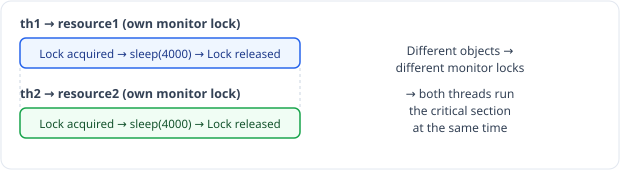
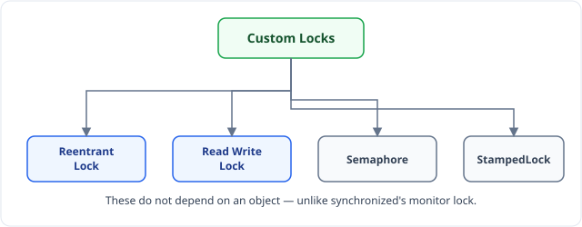
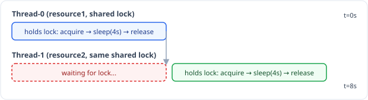
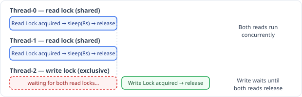

Till now we have seen the `synchronized` block, which strictly monitors the lock on the critical section. The monitor lock depends on the **object**.

```java
// Synchronized/SharedResource.java
package JavaPractice.Synchronized;

public class SharedResource {

    boolean isAvailable = false;

    public synchronized void producer() { // synchronized on method
        try {
            System.out.println("Lock acquired by: " + Thread.currentThread().getName());
            isAvailable = true;
            Thread.sleep(4000); // sleep for 4 sec
        } catch (Exception e) {

        }
        System.out.println("Lock release by: " + Thread.currentThread().getName());
    }
}
```

```java
// Synchronized/Main.java
package JavaPractice.Synchronized;

public class Main {

    public static void main(String args[]) {

        SharedResource resource1 = new SharedResource();
        Thread th1 = new Thread(() -> {
            resource1.producer();
        });

        SharedResource resource2 = new SharedResource();
        Thread th2 = new Thread(() -> {
            resource2.producer();
        });

        th1.start();
        th2.start();
    }
}
```

When `th1` enters the critical section, the monitor lock is applied to *this* `SharedResource` object, i.e. `resource1`. `th2` calls the same `producer()` method but through **object 2** (`resource2`), so it will be able to enter the critical section too — a new monitor lock is also applied to `resource2`. Both threads will be able to go inside the critical section, as the monitor lock is applied to the **object**.



**Output (not shown in the source notes for this program — expected output):**
```text
Lock acquired by: Thread-0
Lock acquired by: Thread-1
Lock release by: Thread-0
Lock release by: Thread-1
```
> Since `resource1` and `resource2` are different objects, each gets its own monitor lock, so neither thread blocks the other — the exact interleaving of the four lines can vary, but both threads run `producer()` concurrently.

Now we want: same object, different object — no matter — only 1 thread should be able to go inside the critical section. Now `synchronized` will not work, so we use **Custom Locks**.



These do not depend on an object. First, let's see **Reentrant Lock**.

## ReentrantLock

### Example 1

```java
// ReentrantLock/SharedResource.java
public class SharedResource {

    boolean isAvailable = false;
    ReentrantLock lock = new ReentrantLock();

    public void producer() {
        try {
            lock.lock(); // acquire lock
            System.out.println("Lock acquired by: " + Thread.currentThread().getName());
            isAvailable = true;
            Thread.sleep(4000);
        } catch (Exception e) {

        } finally {
            // we put it in finally as lock must be released whatever happens, even if there is an Exception
            lock.unlock();
            System.out.println("Lock release by: " + Thread.currentThread().getName());
        }
    }
}
```

```java
// ReentrantLock/Main.java
public class Main {

    public static void main(String args[]) {

        SharedResource resource = new SharedResource();
        Thread th1 = new Thread(() -> {
            resource.producer();
        });

        Thread th2 = new Thread(() -> {
            resource.producer();
        });

        th1.start();
        th2.start();
    }
}
```

Here it is **not** dependent on an object.

**Output :**
```text
Lock acquired by: Thread-0
Lock release by: Thread-0
Lock acquired by: Thread-1
Lock release by: Thread-1
```
> Both threads share the same `resource` object and therefore the same `ReentrantLock`, so they run one after another — same pattern as Example 2 below.

### Example 2 — same lock, different objects

```java
// ReentrantLock/SharedResource.java
public class SharedResource {

    boolean isAvailable = false;

    public void producer(ReentrantLock lock) {
        try {
            lock.lock();
            System.out.println("Lock acquired by: " + Thread.currentThread().getName());
            isAvailable = true;
            Thread.sleep(4000);
        } catch (Exception e) {

        } finally {
            lock.unlock();
            System.out.println("Lock release by: " + Thread.currentThread().getName());
        }
    }
}
```

```java
// ReentrantLock/Main.java
public class Main {

    public static void main(String args[]) {

        ReentrantLock lock = new ReentrantLock();

        SharedResource resource1 = new SharedResource();
        Thread th1 = new Thread(() -> {
            resource1.producer(lock);
        });

        SharedResource resource2 = new SharedResource();
        Thread th2 = new Thread(() -> {
            resource2.producer(lock);
        });

        th1.start();
        th2.start();
    }
}
```

See, we're passing on **different objects** (`resource1`, `resource2`) — but we're passing the **same `ReentrantLock`**.

**Output:**
```text
Lock acquired by: Thread-0
Lock release by: Thread-0
Lock acquired by: Thread-1
Lock release by: Thread-1

Process finished with exit code 0
```

> Even though different objects, until Thread-0 releases the lock, Thread-1 is unable to acquire it.



Different objects, but we want only 1 thread to acquire the lock. Next is **Read-Write lock** — before going into that, we must know about **Shared lock (S)** and **Exclusive lock (X)**.

- **Shared lock** is for **read**.
- **Exclusive lock** is for **both read & write**.


- This says if T1 acquires a **shared** lock, can T2 acquire a **shared** lock too? → allowed.
- This says if T1 acquires a **shared** lock, can T2 acquire an **exclusive** lock? → **Not allowed**.
- This says if T1 acquires an **exclusive** lock, can T2 get a **shared** lock? → **Not allowed**.

**Exclusive lock** can only be acquired on a resource when there is no other lock — even a shared lock should not be there.

Also, on an **exclusive** lock, no other thread can acquire a shared lock or exclusive lock, as with an exclusive lock we can change values!!

So the only combination possible & allowed is **Shared–Shared**. All others are just not allowed.

## ReadWriteLock

**ReadLock:** more than 1 thread can acquire the read lock → **Shared lock**.
**WriteLock:** only 1 thread can acquire the write lock → **Exclusive lock**.

```java
// ReadWriteLock/SharedResource.java
public class SharedResource {

    boolean isAvailable = false;

    public void producer(ReadWriteLock lock) {
        try {
            lock.readLock().lock();
            System.out.println("Read Lock acquired by: " + Thread.currentThread().getName());
            Thread.sleep(8000);
        } catch (Exception e) {

        } finally {
            lock.readLock().unlock();
            System.out.println("Read Lock release by: " + Thread.currentThread().getName());
        }
    }

    public void consume(ReadWriteLock lock) {
        try {
            lock.writeLock().lock();
            System.out.println("Write Lock acquired by: " + Thread.currentThread().getName());
            isAvailable = false;
        } catch (Exception e) {

        } finally {
            lock.writeLock().unlock();
            System.out.println("Write Lock release by: " + Thread.currentThread().getName());
        }
    }
}
```


```java
// ReadWriteLock/Main.java
public class Main {

    public static void main(String args[]) {

        SharedResource resource = new SharedResource();
        ReadWriteLock lock = new ReentrantReadWriteLock(); // interface / implementation

        Thread th1 = new Thread(() -> {
            resource.producer(lock);
        });

        Thread th2 = new Thread(() -> {
            resource.producer(lock);
        });

        SharedResource resource1 = new SharedResource();
        Thread th3 = new Thread(() -> {
            resource1.consume(lock);
        });

        th1.start();
        th2.start();
        th3.start();
    }
}
```

`ReadWriteLock` is the **interface**, `ReentrantReadWriteLock` is the **implementation**.


`producer()` puts a **read lock**, `consume()` puts a **write lock**.

`th1` & `th2` are both putting a shared (read) lock, so it's allowed — they can run freely. But `th3` is putting an exclusive (write) lock, so it will only be acquired once all shared (read) locks have been unlocked.



**Output:**
```text
Read Lock acquired by: Thread-0
Read Lock acquired by: Thread-1
Read Lock release by: Thread-0
Read Lock release by: Thread-1
Write Lock acquired by: Thread-2
Write Lock release by: Thread-2

Process finished with exit code 0
```

> Exclusive lock is applied only when both shared locks are released.

`ReadWriteLock` is used when reads are very high as compared to writes, e.g. 1000 reads & 10 writes — then you can use it.

### What if we try to write after acquiring a Read Lock?

Depending on how it is attempted, there are two distinct scenarios:

#### Scenario 1: Modifying shared state directly inside a `readLock` block

```java
public void producer(ReadWriteLock lock) {
    try {
        lock.readLock().lock();
        isAvailable = true; // ⚠️ Writing state while holding only a Read Lock!
    } finally {
        lock.readLock().unlock();
    }
}
```

- **Compiler / Runtime behavior:** Neither the compiler nor the JVM throws an exception. A lock is just a synchronization coordinator, not a memory permission system.
- **Problem:** `readLock()` is a **shared lock** — multiple threads can hold it simultaneously. If multiple threads write (or read while another writes) at the same time, this causes **race conditions, dirty reads, lost updates, and memory visibility issues**, completely breaking thread safety.

#### Scenario 2: Attempting to upgrade from `readLock()` to `writeLock()` (Lock Upgrading)

```java
public void producer(ReadWriteLock lock) {
    try {
        lock.readLock().lock();

        // Attempting to upgrade to writeLock:
        lock.writeLock().lock(); // ❌ DEADLOCK! Thread freezes forever here
        isAvailable = true;
        lock.writeLock().unlock();

    } finally {
        lock.readLock().unlock();
    }
}
```

- **Result:** **Immediate Deadlock**.
- **Why?** In Java's `ReentrantReadWriteLock`, **Lock Upgrading is NOT supported**. To acquire a `writeLock()`, there must be zero active read locks. However, the calling thread itself is holding a read lock and waiting for all read locks to clear before it can proceed — causing it to wait on itself forever.

#### Summary Rules for `ReentrantReadWriteLock`

| Operation | Allowed? | Result |
|---|:---:|---|
| **Write variable under `readLock()`** | Allowed by JVM | ❌ Severe **Race Conditions & Data Inconsistency** |
| **Upgrade (`ReadLock` → `WriteLock`)** | ❌ No | 🛑 **Deadlock** (thread hangs indefinitely) |
| **Downgrade (`WriteLock` → `ReadLock`)** | ✅ Yes | Safe and fully supported in Java |
