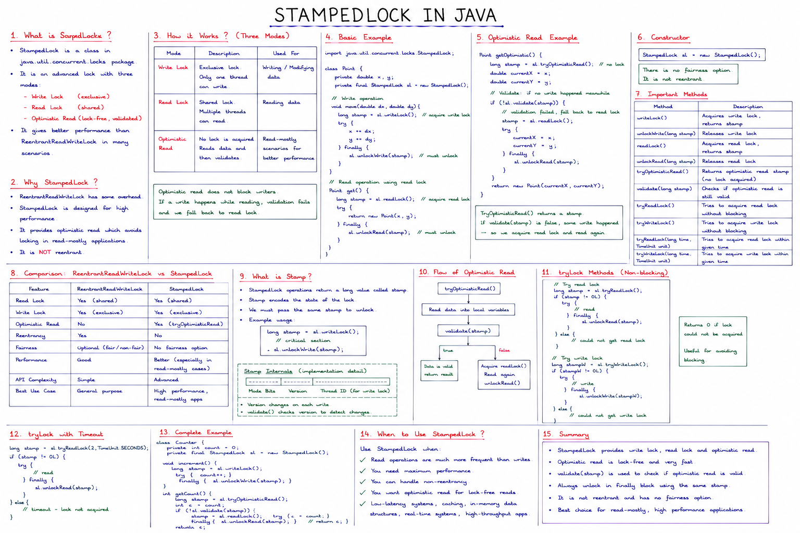

 


## The Code

```java
public class SharedResource {
    boolean isAvailable = false;
    StampedLock lock = new StampedLock();

    public void producer() {
        long stamp = lock.readLock();
        try {
            System.out.println("Read Lock acquired by: " + Thread.currentThread().getName());
            isAvailable = true;
            Thread.sleep(6000);
        } catch (Exception e) {
        } finally {
            lock.unlockRead(stamp);
            System.out.println("Read Lock release by: " + Thread.currentThread().getName());
        }
    }

    public void consume() {
        long stamp = lock.writeLock();
        try {
            System.out.println("Write Lock acquired by: " + Thread.currentThread().getName());
            isAvailable = false;
        } catch (Exception e) {
        } finally {
            lock.unlockWrite(stamp);
            System.out.println("Write Lock release by: " + Thread.currentThread().getName());
        }
    }
}

public class Main {
    public static void main(String[] args) {
        SharedResource resource = new SharedResource();

        Thread th1 = new Thread(() -> resource.producer());
        Thread th2 = new Thread(() -> resource.producer());
        Thread th3 = new Thread(() -> resource.consume());

        th1.start();
        th2.start();
        th3.start();
    }
}
```

## First, an Important Naming Gotcha

Despite the method names, notice what each actually does:
- **`producer()`** acquires the **read lock** (`lock.readLock()`)
- **`consume()`** acquires the **write lock** (`lock.writeLock()`)

This is backwards from what the names suggest (you'd expect a "producer" to write and a "consumer" to read), but the *behavior* of the program is entirely determined by which lock type is actually called — so let's trace it based on that.

## What Happens, Step by Step

### 1. `th1` and `th2` both call `producer()` → both take the **read lock**

`StampedLock`'s read lock is **shared** — multiple threads can hold it at the same time, just like `ReadWriteLock`. So `th1` and `th2` don't block each other at all; both acquire a read-lock stamp almost immediately:

```
Read Lock acquired by: Thread-0
Read Lock acquired by: Thread-1
```
(the exact order between these two is not guaranteed — it's a race between two independently scheduled threads)

Both threads then set `isAvailable = true` and call `Thread.sleep(6000)` — so both sit inside the `try` block, **holding their read locks, for 6 seconds**.

### 2. `th3` calls `consume()` → wants the **write lock**

The write lock is **exclusive** — it cannot be granted while *any* read lock is currently held. Since `th1` and `th2` are both mid-read (sleeping, but still holding their stamps), `th3` **blocks** the moment it calls `lock.writeLock()`. Nothing prints yet for `th3` — it's just waiting.

### 3. After ~6 seconds, `th1` and `th2` finish sleeping and release

```
Read Lock release by: Thread-0
Read Lock release by: Thread-1
```
(again, order between these two isn't guaranteed — whichever thread's sleep timer fires first releases first)

### 4. Only now can `th3` finally acquire the write lock

The instant both read locks are gone, `th3`'s blocked `writeLock()` call succeeds:

```
Write Lock acquired by: Thread-2
Write Lock release by: Thread-2
```

`consume()` has no `sleep()`, so it acquires, sets `isAvailable = false`, and releases almost instantaneously once it finally gets the lock.

## Full Likely Output

```
Read Lock acquired by: Thread-0
Read Lock acquired by: Thread-1
    ... (6 second pause while both hold read locks) ...
Read Lock release by: Thread-0
Read Lock release by: Thread-1
Write Lock acquired by: Thread-2
Write Lock release by: Thread-2
```

The two `Read Lock acquired`/`release` lines could print in either order relative to each other (`Thread-0`/`Thread-1` racing), but the **write lock lines are always last**, and there's always a visible ~6 second gap before them — that ordering is guaranteed by the locking semantics, not by luck.

## The One Real Bug Worth Flagging

`isAvailable = true;` is being written **while only holding a read lock**. That's a misuse of the contract `StampedLock` expects: read locks are meant for *read-only* access — multiple threads are allowed to hold them concurrently specifically because they're assumed not to mutate shared state. Here, `th1` and `th2` both write to `isAvailable` simultaneously while both only holding "shared" read locks — that's a genuine data race, even though in this specific case both threads happen to write the *same* value (`true`), so the bug doesn't visibly manifest. If `producer()` ever needed to write a thread-specific value instead of a constant, this exact pattern would silently corrupt state — a good thing to point out if this shows up in an interview or code review context.


  

# `StampedLock` — `readLock()` vs `tryOptimisticRead()`

## The Core Distinction

| | `readLock()` | `tryOptimisticRead()` |
|---|---|---|
| Type of lock | **Pessimistic** — actually acquires a lock | **Optimistic** — acquires nothing, just checks a version stamp |
| Blocks writers? | Yes — a writer waiting for a write lock will block while readers hold read locks | **No** — a writer can proceed immediately, even while "optimistic readers" are mid-read |
| Blocks other readers? | No — multiple threads can hold read locks simultaneously | N/A — nothing is held at all |
| Cost | Some overhead — updates internal reader-count state | Extremely cheap — just reads a `long` stamp, no CAS/lock bookkeeping in the common case |
| Safety after use | Guaranteed consistent for as long as you hold it | **Must be validated** afterward — the data you read might have been concurrently modified |

## How `readLock()` Works

```java
StampedLock lock = new StampedLock();

long stamp = lock.readLock();   // blocks if a writer currently holds the write lock
try {
    // safe to read shared state here — guaranteed no writer can modify it
    // while this stamp is held
} finally {
    lock.unlockRead(stamp);
}
```

This behaves like a traditional `ReadWriteLock`'s read lock: multiple readers can hold it concurrently, but a writer requesting the write lock will wait until all current readers release theirs (and, depending on internal fairness/starvation-avoidance logic, new readers might briefly be blocked too, to prevent writer starvation). It's a **real lock** — the data is genuinely protected while you hold the stamp.

## How `tryOptimisticRead()` Works

```java
long stamp = lock.tryOptimisticRead();   // NON-blocking, no actual lock taken

// read shared fields into local variables
int x = sharedX;
int y = sharedY;

if (!lock.validate(stamp)) {
    // a write occurred during our read — stamp is now invalid, fall back
    stamp = lock.readLock();   // acquire a real read lock instead
    try {
        x = sharedX;
        y = sharedY;
    } finally {
        lock.unlockRead(stamp);
    }
}
// now x, y are guaranteed consistent
```

`tryOptimisticRead()` doesn't block anyone and doesn't get blocked by anyone — it just returns a **stamp representing the lock's current version**. You then read whatever fields you need **without any protection at all** — a writer could be actively modifying that data at the exact same moment. Once you're done reading, you call `lock.validate(stamp)`, which checks: *"has a write lock been acquired (and released) since I got this stamp?"* If yes, your reads might be torn/inconsistent, and you must **discard them and retry** — typically by falling back to a real `readLock()`.

## Why This Trade-off Exists

The whole point of the optimistic path is **speed under the common case where writes are rare**. A traditional read lock still has to do bookkeeping — incrementing/decrementing a reader count, potentially interacting with a queue of waiting writers, memory synchronization for that shared counter. `tryOptimisticRead()` skips all of that: it's just reading a `volatile long` and comparing it later. When writes are infrequent (the scenario `StampedLock` is designed for), this is dramatically faster than acquiring a real lock every time.

The cost is that you, the caller, take on responsibility for **validating and retrying** — the JVM/lock isn't protecting your read at all; it's just giving you a cheap way to detect, after the fact, whether you got lucky or need to redo the work properly.

## Concrete Example — Why Validation Matters

```java
class Point {
    private double x, y;
    private final StampedLock lock = new StampedLock();

    double distanceFromOrigin() {
        long stamp = lock.tryOptimisticRead();
        double curX = x, curY = y;   // read WITHOUT any protection

        if (!lock.validate(stamp)) {
            stamp = lock.readLock();   // fallback: real lock
            try {
                curX = x;
                curY = y;
            } finally {
                lock.unlockRead(stamp);
            }
        }
        return Math.sqrt(curX * curX + curY * curY);
    }

    void move(double deltaX, double deltaY) {
        long stamp = lock.writeLock();
        try {
            x += deltaX;
            y += deltaY;
        } finally {
            lock.unlockWrite(stamp);
        }
    }
}
```

Without the `validate()` check, `distanceFromOrigin()` could read a **stale `x` paired with a fresh `y`** (or vice versa) if `move()` runs concurrently mid-read — producing a nonsensical distance that never actually corresponded to any real state of the point. `validate()` is what catches that: if `move()`'s write lock was acquired and released anywhere between your `tryOptimisticRead()` and `validate()` call, the stamp is stale, and you know to redo the read properly.

## Why Writers Are Never Blocked by Optimistic Readers

Since `tryOptimisticRead()` doesn't register itself as holding anything, a writer calling `writeLock()` has **no reason to wait** for it — as far as the lock's internal state is concerned, no reader exists at all. This is precisely why writers get much better throughput under `StampedLock`'s optimistic mode compared to a standard `ReadWriteLock`, where even one long-running reader can starve out a waiting writer. The trade-off is pushed entirely onto the reader: it might have to retry, possibly more than once under heavy write contention, but writers are never held up by it.

## Quick Mental Model

- **`readLock()`** = "I'm claiming this data is mine to read right now — writers, wait your turn." Safe, but has locking overhead and can block writers.
- **`tryOptimisticRead()`** = "I'll just peek at the data and hope nobody's mid-write. I'll double check afterward, and redo it properly if I got unlucky." Fast, never blocks anyone, but requires you to handle the retry logic yourself.

## When to Use Which

| Scenario | Recommended |
|---|---|
| Reads vastly outnumber writes, and reads are cheap to redo | `tryOptimisticRead()` with fallback to `readLock()` |
| Writes are frequent, or the read logic is expensive/has side effects (can't safely be discarded and retried) | `readLock()` directly — avoid optimistic mode, since frequent invalidation would mean redoing expensive work repeatedly |
| You need guaranteed no-writer-interference for the whole duration of a multi-step read | `readLock()` — optimistic mode only validates that no write happened *between* your read and your validate call, not that none happens after |


   

