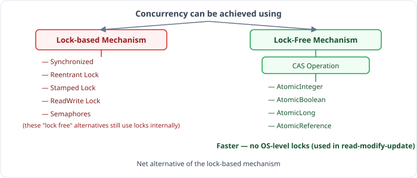
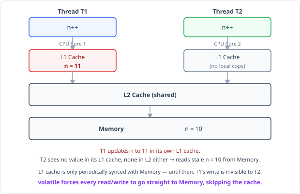
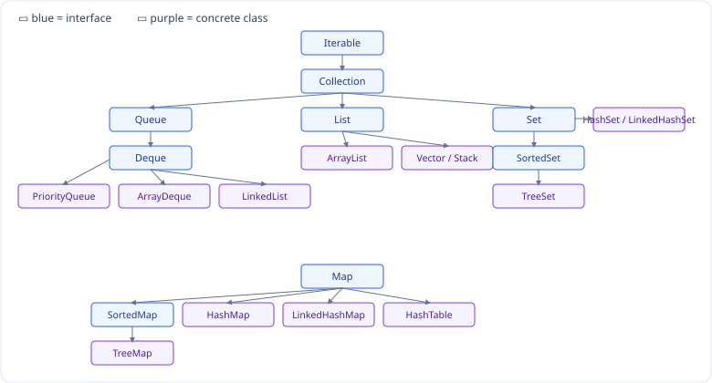

## Lock-Based vs Lock-Free Mechanisms



- **Lock-based mechanism:** `synchronized`, `ReentrantLock`, `StampedLock`, `ReadWriteLock`, `Semaphore`. (These "seem like locks", and they *are* locks.)
- **Lock-free mechanism:** the **CAS operation** (compare-and-swap), which backs `AtomicInteger`, `AtomicBoolean`, `AtomicLong`, `AtomicReference` — used in very specific use cases (see "Atomic Variables" below). Lock-free is the fast alternative to lock-based mechanisms: no locks here.

### The CAS technique — 3 main parameters

It's a low-level operation. It's atomic. And all modern processors support it in hardware.

- **Memory location:** where the variable is stored.
- **Expected Value:** the value that should currently be present at that memory location.
- **New Value:** the value to be written to memory, *only if* the current value matches the expected value.

```
CAS(Memory, ExpectedValue, NewValue)

1. Load    R1 = #[Memory]                       // read current value into a register
2. Compare R1 & ExpectedValue
   2.1 if they match → write NewValue to #[Memory]
```
> Only if the comparison passes does the update happen — first compare, then swap.

### The ABA problem, traced at this low level

```
CAS(M1, 10, 12)
1. Read    #[M1]
2. Compare #[M1] to 10
   2.1 if equal → update to 12

M1 is 10 initially.
T1 runs line 1 → reads M1 = 10.
Meanwhile some other thread changes the value to 12, and then back to 10.
Now T1 runs line 2 → compares [10 == 10] — but the 10 currently in memory is
NOT the original 10 T1 first saw; it went 10 → 12 → 10. The comparison still
passes, so T1's update goes through even though the value secretly changed
in between.

This is solved by adding a version number or a timestamp too — solved by
AtomicStampedReference.
```

---

## Atomic Variables

### What ATOMIC means

It means **single**, or **"all or nothing."**

### Demo 1 — single thread (correct)

```java
public class SharedResource {
    int counter;

    public void increment() {
        counter++;
    }

    public int get() {
        return counter;
    }
}
```

```java
public class Main {
    public static void main(String[] args) {
        SharedResource resource = new SharedResource();
        for (int i = 0; i < 400; i++) {
            resource.increment();
        }
        System.out.println(resource.get());
    }
}
```

Output:
```text
400
Process finished with exit code 0
```
> Only 1 thread is involved, so `counter++` never races with itself — the result is correct.

### Demo 2 — two threads (race condition)

Same `SharedResource` as above (plain `int counter`, **not** synchronized), but now driven by two threads:

```java
public class Main {
    public static void main(String[] args) {
        SharedResource resource = new SharedResource();

        Thread t1 = new Thread(() -> {
            for (int i = 0; i < 200; i++) {
                resource.increment();
            }
        });

        Thread t2 = new Thread(() -> {
            for (int i = 0; i < 200; i++) {
                resource.increment();
            }
        });

        t1.start();
        t2.start();

        try {
            t1.join();
            t2.join();
        } catch (Exception e) {

        }

        System.out.println(resource.get());
    }
}
```

Output (one actual run from the source notes):
```text
371
Process finished with exit code 0
```
> Expected `400` (200 + 200), got `371` — this happens when both threads read the same value, increment it independently, and one thread's write overwrites the other's, losing updates. Because it's a genuine race condition, re-running this program can print a different number each time (anything ≤ 400), never reliably 400.

### 2 solutions

**1. Using a lock, like `synchronized`**

```java
public class SharedResource {
    int counter;

    public synchronized void increment() {
        counter++;
    }

    public int get() {
        return counter;
    }
}
```

**2. Using a lock-free operation, like `AtomicInteger`**

```java
public class SharedResource {
    AtomicInteger counter = new AtomicInteger(0);

    public void increment() {
        counter.incrementAndGet(); // internally uses CAS
    }

    public int get() {
        return counter.get();
    }
}
```
> `AtomicInteger`'s internal value is itself declared `volatile`. You don't hand-roll the increment logic — you just call the methods it already provides (`incrementAndGet()`, `compareAndSet()`, ...).

Both fixes now print `400` reliably for both the single-thread and two-thread versions.

### When to reach for Atomic — the Read-Modify-Update pattern

Atomic types are meant for use cases with exactly 3 steps:
1. **Read**
2. **Modify**
3. **Update**

`incrementAndGet()` is doing exactly this internally (see "How `incrementAndGet()` Works Internally" above). Because the underlying value is `volatile`, it is always read fresh from **memory**, never from a stale CPU cache (more on this in the `volatile` section below).

This CAS technique is implemented at the C/C++ level, and Java's atomic types just wrap it:
- for `int` → `AtomicInteger`
- for `boolean` → `AtomicBoolean`
- for an object reference → `AtomicReference`

These are only meant for the simple Read-Modify-Update scenario — anything more elaborate (multiple related fields, multi-step operations) is a job for a real lock instead.


### Visual — How CAS Works

```
Thread 1 wants to change counter: 0 → 1

STEP 1: Read current value
        Memory: [0]
        Thread 1 expects: 0

STEP 2: Compare
        current(0) == expected(0) ✅ MATCH!

STEP 3: Swap
        Memory: [0] → [1]
        Returns: true ✅


─────────────────────────────────────────

Thread 2 ALSO wants to change counter: 0 → 1
(But Thread 1 already changed it to 1)

STEP 1: Read current value
        Memory: [1]
        Thread 2 expects: 0

STEP 2: Compare
        current(1) == expected(0) ❌ NO MATCH!

STEP 3: Do nothing, RETRY
        Memory: [1]  unchanged
        Returns: false → retry with new expected value
```


### What if Thread 1 pauses right after STEP 1?

Natural question: Thread 1 does STEP 1 (reads `0`), then gets **paused** by the OS before it reaches STEP 2/3. Meanwhile Thread 2 runs completely — reads `0`, writes `1`. Now Thread 1 resumes, still holding `expected = 0` from before the pause. Does it blindly overwrite Thread 2's change?

**No.** STEP 2 (compare) and STEP 3 (swap) are not looking at what Thread 1 *remembers* — they check the **actual, current value sitting in memory right now**, at the exact instant the CPU executes the CAS instruction:

```
Memory: [0]

Thread 1: STEP 1 → reads 0, expected = 0
Thread 1: ⏸ PAUSED by the OS (before STEP 2/3)

Thread 2: STEP 1 → reads 0, expected = 0
Thread 2: STEP 2 → compare(0, 0) ✅ MATCH
Thread 2: STEP 3 → swap → Memory: [0] → [1] → returns true

Thread 1: ▶ RESUMES, still holds its old expected = 0
Thread 1: STEP 2 → compare(currentMemory=1, expected=0) ❌ NO MATCH
Thread 1: STEP 3 → do nothing → returns false

→ Thread 1 does NOT overwrite Thread 2's change.
→ Thread 1 must retry: re-read (now 1) → recompute → CAS(1, 2)
```

So a pause between "read" and "compare-and-swap" only ever wastes that attempt — it can never cause Thread 1 to stomp on Thread 2's write with stale data, because the comparison is always against the live value, not a memory snapshot from before the pause.

**So then why bother reading in STEP 1 at all, if the compare doesn't trust it anyway?**

Because the read isn't there to make CAS *safe* — CAS's atomicity does that regardless of how stale your read was. The read is there so the thread has **something to compute with**:

- `newValue` (e.g. `current + 1`) can't be invented out of thin air — the thread needs to know *some* current value first, in order to add 1 to it.
- `expected` is simply "whatever I just read" — it's the thread's best guess at what's still in memory, and it exists purely so CAS has something to check the live value against.

So STEP 1 gives the thread a guess to work with (`expected`, `newValue`); STEP 2/3 (the actual CAS) is the referee that only lets the swap through if that guess is still correct. If the guess went stale (like in the pause scenario above), CAS simply rejects it and the thread reads again to form a fresh guess. That loop — *guess, try, and only retry if wrong* — is exactly what "optimistic" means: you don't lock anything to make your guess safe, you just let CAS verify it cheaply at the last moment.

**The one case where this silently "succeeds" anyway:** if, while Thread 1 was paused, the value gets changed *and then changed back* to exactly what Thread 1 originally expected (`0 → 1 → 0`). Then Thread 1's stale `expected = 0` coincidentally matches the live value again, and the swap goes through — even though something did happen in between. That's precisely the **ABA problem** covered above, and it's why `AtomicStampedReference` exists: it makes the compare check a version/stamp too, so `0 → 1 → 0` no longer looks unchanged.

---


**Atomic vs `volatile` in one line:** `Atomic` → thread safe. `volatile` on its own → **not** thread safe (it only fixes visibility, not atomicity — see below).

---

## `volatile`



- `T1` runs `n++` on CPU Core 1 and updates its own **L1 cache** to `n = 11`.
- `T2` runs `n++` on CPU Core 2. Its own L1 cache has no value for `n`, and the shared L2 cache hasn't been synced either — so `T2` falls all the way back to reading `n = 10` from main **Memory**. It has picked up **stale data**.
- L1 cache is only *periodically* synced with memory — there's a window where `T1`'s update sits only in its own L1 cache, invisible to every other core.

`volatile` fixes exactly this: it makes sure every read and write of that variable goes **straight to memory** — no CPU cache in between. After marking a variable `volatile`, `T1` updates memory directly and `T2` reads from memory directly, so `T2` can never pick up old/stale data again.

- `volatile` guarantees that a change made by one thread **must be visible** to other threads.
- This is **not related to thread safety** at all — it only fixes visibility, not atomicity. Two threads can still both read the same value and race to write it back (the `counter++` problem from the very top of this note is not solved by `volatile` alone).
- **Best practice:** combine `Atomic` (for atomicity) with the fact that its internal value is already `volatile` (for visibility) — which is exactly what `AtomicInteger` and friends give you for free.

---

## Concurrent Collections



These are the relative **thread-safe versions** of the regular collection classes:

| Collection | Concurrent Collection | Lock used internally |
|---|---|---|
| `PriorityQueue` | `PriorityBlockingQueue` | `ReentrantLock` |
| `LinkedList` | `ConcurrentLinkedDeque` | Compare-and-swap operation |
| `ArrayDeque` | `ConcurrentLinkedDeque` | Compare-and-swap operation |
| `ArrayList` | `CopyOnWriteArrayList` | `ReentrantLock` |
| `HashSet` | `newKeySet()` method inside `ConcurrentHashMap` | Synchronized |
| `TreeSet` | `Collections.synchronizedSortedSet(...)` | Synchronized |
| `LinkedHashSet` | `Collections.synchronizedSet(...)` | Synchronized |
| `Queue` interface | `ConcurrentLinkedQueue` | Compare-and-swap operation |


---


---

### This is Why It's Called "Optimistic Locking"

| | Synchronized (Pessimistic) | CAS (Optimistic) |
|---|---|---|
| Assumption | Conflict WILL happen | Conflict is RARE |
| Strategy | Lock first, then work | Work first, retry if failed |
| Threads blocked? | Yes | No — they spin/retry |
| OS involvement | Yes (context switch) | No — pure CPU instruction |

---

### The One Famous Problem: ABA

```
Memory: [A]

Thread 1 reads → expects A
Thread 2 changes A → B → A  (back to A!)
Thread 1 does CAS(A, newVal) → sees A → SUCCESS ✅ (but value secretly changed!)
```

Thread 1 thinks nothing changed, but it actually did. Java solves this with **`AtomicStampedReference`** which tracks a **version number** (a "stamp") alongside the value — CAS then has to match on *both* the value and the stamp, so a value that went `A → B → A` still fails the check because the stamp moved on:

```java
// CAS checks BOTH value AND stamp (version)
AtomicStampedReference<Integer> ref = new AtomicStampedReference<>(10, 0); // value=10, stamp=0

int[] stampHolder = new int[1];
int value = ref.get(stampHolder);          // get value AND stamp

ref.compareAndSet(10, 20, stampHolder[0], stampHolder[0] + 1);
//                old new  oldStamp         newStamp
// Even if the value looks the same, a mismatched stamp exposes the hidden A→B→A change
```

---

### Summary

```
1. Thread reads current value → this becomes "expected"
2. Thread computes new value
3. CAS checks: is memory STILL == expected?
   ├── YES → swap atomically ✅
   └── NO  → someone else changed it, retry from step 1 ❌
```


### AtomicInteger — Most Common

```java
import java.util.concurrent.atomic.AtomicInteger;

AtomicInteger counter = new AtomicInteger(0);

// Basic operations
counter.get();                  // read value → 0
counter.set(10);                // set value  → 10
counter.getAndIncrement();      // return THEN increment (i++)
counter.incrementAndGet();      // increment THEN return (++i)
counter.getAndDecrement();      // return THEN decrement
counter.getAndAdd(5);           // return THEN add 5
counter.addAndGet(5);           // add 5 THEN return

// THE CAS operation directly
boolean success = counter.compareAndSet(10, 20);
// if current == 10, set to 20, return true
// if current != 10, do nothing, return false
```

---

### AtomicBoolean

```java
import java.util.concurrent.atomic.AtomicBoolean;

AtomicBoolean flag = new AtomicBoolean(false);

flag.get();                         // read → false
flag.set(true);                     // set value
flag.getAndSet(true);               // return old, set new

// CAS
boolean success = flag.compareAndSet(false, true);
// if current == false → set to true  → return true  ✅
// if current == true  → do nothing   → return false ❌
```

**Classic use case — run something ONLY ONCE across threads:**

```java
AtomicBoolean initialized = new AtomicBoolean(false);

// Multiple threads call this simultaneously
public void initialize() {
    // Only ONE thread will win the CAS
    if (initialized.compareAndSet(false, true)) {
        // only this thread enters — others get false
        System.out.println("Initializing...");
        setup();
    }
    // other threads skip silently
}
```

---

### AtomicLong & AtomicReference

```java
// AtomicLong — same as AtomicInteger but for long
AtomicLong bigCounter = new AtomicLong(0L);
bigCounter.incrementAndGet();
bigCounter.compareAndSet(0L, 100L);


// AtomicReference — CAS for any object
AtomicReference<String> ref = new AtomicReference<>("initial");

ref.get();                                    // "initial"
ref.set("updated");
ref.compareAndSet("initial", "updated");      // swap if matches
ref.getAndSet("newValue");                    // return old, set new

// Example — thread safe config update
AtomicReference<Config> config = new AtomicReference<>(oldConfig);

Config newConfig = new Config(...);
boolean updated = config.compareAndSet(oldConfig, newConfig);
// Only updates if nobody else changed it first
```

---

---

## Optimistic vs Pessimistic Locking

### One Line Each

| | One Line |
|---|---|
| **Pessimistic Locking** | **"Something WILL go wrong"** — lock first, then work |
| **Optimistic Locking** | **"Nothing WILL go wrong"** — work first, check at the end |

---

## Pessimistic Locking in Java

> **Lock the resource BEFORE doing work — nobody else can touch it**

### Using synchronized

```java
public class BankAccount {
    private int balance = 1000;

    // Lock acquired before method runs
    // Only 1 thread at a time
    public synchronized void withdraw(int amount) {
        // Thread-2 BLOCKED here until Thread-1 finishes
        if (balance >= amount) {
            balance -= amount;
            System.out.println("Withdrawn: " + amount
                + " | Balance: " + balance
                + " | Thread: " + Thread.currentThread().getName());
        }
    }
}
```

### Using ReentrantLock

```java
public class BankAccount {
    private int balance = 1000;
    private ReentrantLock lock = new ReentrantLock();

    public void withdraw(int amount) {
        lock.lock();  // ← LOCK FIRST — pessimistic
        try {
            // only 1 thread here at a time
            // others BLOCKED at lock.lock()
            if (balance >= amount) {
                balance -= amount;
                System.out.println("Withdrawn: " + amount
                    + " Balance: " + balance);
            }
        } finally {
            lock.unlock();  // always unlock
        }
    }
}
```

### What happens internally

```
Thread-1 → lock.lock()  → gets lock → enters
Thread-2 → lock.lock()  → BLOCKED — waits outside
Thread-3 → lock.lock()  → BLOCKED — waits outside

Thread-1 finishes → lock.unlock()
Thread-2 → gets lock → enters
Thread-3 → BLOCKED — waits

→ Strictly one at a time
→ No two threads ever work together
```

---

## Optimistic Locking in Java

> **Work without locking — but verify at the end using version/stamp**

### Using AtomicInteger — compareAndSet (CAS)

```java
public class BankAccount {

    // AtomicInteger uses CAS internally — optimistic locking
    private AtomicInteger balance = new AtomicInteger(1000);

    public void withdraw(int amount) {
        while (true) {
            int currentBalance = balance.get();      // read current value
            int newBalance = currentBalance - amount; // compute new value

            if (newBalance < 0) {
                System.out.println("Insufficient balance");
                return;
            }

            // compareAndSet = optimistic check
            // "only update if value is STILL what I read"
            // if another thread changed it → returns false → retry
            if (balance.compareAndSet(currentBalance, newBalance)) {
                // ✅ success — no one changed value between read and update
                System.out.println("Withdrawn: " + amount
                    + " Balance: " + newBalance);
                return;
            }
            // ❌ someone else changed it → loop again → retry
            System.out.println("Conflict! Retrying...");
        }
    }
}
```

### Using AtomicStampedReference — with Version Number

```java
// Prevents ABA problem
// ABA = value changes 1000→900→1000 — looks same but changed twice

AtomicStampedReference<Integer> balance =
    new AtomicStampedReference<>(1000, 0);
//                                 ↑    ↑
//                              value  version(stamp)

public void withdraw(int amount) {
    while (true) {
        int[] stampHolder = new int[1];
        int currentBalance = balance.get(stampHolder);  // get value + version
        int currentStamp = stampHolder[0];

        int newBalance = currentBalance - amount;

        // update only if BOTH value AND version match
        if (balance.compareAndSet(
                currentBalance, newBalance,
                currentStamp, currentStamp + 1)) {
            // ✅ success — version matched too
            System.out.println("Withdrawn: " + amount);
            return;
        }
        // ❌ version mismatch → retry
    }
}
```

### What does `balance.get(stampHolder)` return?

`AtomicStampedReference<V>.get(int[] stampHolder)` returns the **value** (`V`, here `Integer` → auto-unboxed into `currentBalance`), and — as a side effect — writes the **current stamp** into `stampHolder[0]`. A Java method can only directly return one thing, but here we need the value *and* its version fetched together as one consistent, atomic snapshot (two separate calls — one for value, one for stamp — could race: the value could change between them). Passing a 1-element array and letting the method fill it in is the standard pre-`record`/pre-tuple Java trick for "returning two things at once."

### Step by step

1. `while (true)` — this is the retry loop, same shape as every other CAS example in this note.
2. `balance.get(stampHolder)` — atomically snapshot **both** the current balance and its current stamp (version) together. `currentBalance` and `currentStamp` are now a matched pair from the same instant.
3. `newBalance = currentBalance - amount` — compute the new value from what was just read.
4. `balance.compareAndSet(currentBalance, newBalance, currentStamp, currentStamp + 1)` — this is the atomic check-and-swap. It only succeeds if **both**:
   - the live value is still `currentBalance` (nobody else changed the balance since step 2), **and**
   - the live stamp is still `currentStamp` (nobody else touched it at all, even if they somehow put the value back to the same number — the ABA case).

   If both match, it atomically writes `newBalance` as the value and bumps the stamp to `currentStamp + 1` (every successful write moves the version forward, so a value can never "look unchanged" twice).
5. If it fails (value changed, or just the stamp moved), `compareAndSet` returns `false`, we don't `return`, and the `while (true)` loop goes around again — re-reading the now-current value+stamp and retrying, exactly like every optimistic-locking example above.

### A real gotcha hiding in this exact code

`AtomicStampedReference<Integer>.compareAndSet` compares the value with `==` (**reference** equality), not `.equals()` (**value** equality) — you can see this if you look at the JDK source. That's fine as long as `currentBalance` stays the *exact same `Integer` object* `get()` handed you. But this code does:

```java
int currentBalance = balance.get(stampHolder);  // ← unboxes Integer to int, discards the object reference!
```

Later, `balance.compareAndSet(currentBalance, ...)` has to re-box that `int` back into a *brand new* `Integer` object (autoboxing). For balances outside Java's small-integer cache (`-128..127`), that new `Integer` is a **different object** than the one actually stored inside `balance` — so `expectedReference == current.reference` is `false` even though the numbers match, `compareAndSet` returns `false` every single time, and this loop would spin forever without ever succeeding for a real balance like `1000`.

**Fix:** don't unbox — keep the exact `Integer` reference `get()` gave you, and pass that same reference back in:

```java
public void withdraw(int amount) {
    while (true) {
        int[] stampHolder = new int[1];
        Integer currentBalance = balance.get(stampHolder);  // keep the Integer reference itself
        int currentStamp = stampHolder[0];

        Integer newBalance = currentBalance - amount; // arithmetic auto-unboxes, result is boxed once

        if (balance.compareAndSet(
                currentBalance, newBalance,   // same object identity as what get() returned
                currentStamp, currentStamp + 1)) {
            System.out.println("Withdrawn: " + amount);
            return;
        }
    }
}
```
Now `currentBalance` is literally the same object the internal `pair.reference` points to (if nothing changed), so the identity check behaves correctly; if another thread swapped in a different `Integer`, `currentBalance` is no longer that object, `==` correctly fails, and we retry — which is the behavior the original code was trying to express.

### Worked example — 5 threads racing on one balance

Full runnable version (with the `Integer` fix applied, plus per-attempt logging):

```java
import java.util.concurrent.atomic.*;

class Bank {
    AtomicStampedReference<Integer> balance =
        new AtomicStampedReference<>(1000, 0);

    public void withdraw(int amount) {
        for (int i = 0; ; i++) {
            int[] stampHolder = new int[1];
            Integer currentBalance = balance.get(stampHolder);
            int currentStamp = stampHolder[0];

            System.out.println(Thread.currentThread().getName() + " trial : " + i
                + " balance : " + currentBalance + " Stamp : " + currentStamp);

            Integer newBalance = currentBalance - amount;

            if (balance.compareAndSet(currentBalance, newBalance, currentStamp, currentStamp + 1)) {
                System.out.println("Withdrawn by : " + Thread.currentThread().getName()
                    + " amount : " + amount + " Updated to :" + newBalance);
                return;
            } else {
                System.out.println("Transaction failed by : " + Thread.currentThread().getName()
                    + " trial : " + i);
            }
        }
    }
}

public class Codechef {
    public static void main(String[] args) {
        Bank b = new Bank();
        Thread t1 = new Thread(() -> b.withdraw(10));
        Thread t2 = new Thread(() -> b.withdraw(20));
        Thread t3 = new Thread(() -> b.withdraw(30));
        Thread t4 = new Thread(() -> b.withdraw(40));
        Thread t5 = new Thread(() -> b.withdraw(50));
        t1.start(); t2.start(); t3.start(); t4.start(); t5.start();
    }
}
```

One real run printed (thread → amount, by creation order: `Thread-0`=10, `Thread-1`=20, `Thread-2`=30, `Thread-3`=40, `Thread-4`=50):

```text
Thread-2 trial : 0 balance : 1000 Stamp : 0
Thread-3 trial : 0 balance : 1000 Stamp : 0
Thread-4 trial : 0 balance : 1000 Stamp : 0
Transaction failed by : Thread-4 trial : 0
Thread-4 trial : 1 balance : 960 Stamp : 1
Thread-0 trial : 0 balance : 1000 Stamp : 0
Transaction failed by : Thread-0 trial : 0
Thread-0 trial : 1 balance : 910 Stamp : 2
Thread-1 trial : 0 balance : 1000 Stamp : 0
Transaction failed by : Thread-1 trial : 0
Thread-1 trial : 1 balance : 900 Stamp : 3
Withdrawn by : Thread-1 amount : 20 Updated to :880
Withdrawn by : Thread-3 amount : 40 Updated to :960
Withdrawn by : Thread-0 amount : 10 Updated to :900
Transaction failed by : Thread-2 trial : 0
Thread-2 trial : 1 balance : 880 Stamp : 4
Withdrawn by : Thread-2 amount : 30 Updated to :850
Withdrawn by : Thread-4 amount : 50 Updated to :910
```

**Why the print order looks jumbled even though the logic is correct:** two different things are happening —
1. the actual `compareAndSet` (a real, instant state change), and
2. the `println` that *reports* it — an ordinary statement that runs sometime *after* the CAS, whenever the OS scheduler next gives that thread CPU time.

A thread can win its CAS and then get preempted before it reaches its own `println`, letting several other threads run (and print) in the meantime. So console order = order the `println` calls happened to execute in, **not** the order the balance actually changed in.

Reconstructing the *real* order of successful updates (by checking what value+stamp each retry actually read next):

```
(1000, 0) → Thread-3 wins, −40 → (960, 1)   [Thread-4's retry later reads exactly (960, 1)]
(960, 1)  → Thread-4 wins, −50 → (910, 2)   [Thread-0's retry later reads exactly (910, 2)]
(910, 2)  → Thread-0 wins, −10 → (900, 3)   [Thread-1's retry later reads exactly (900, 3)]
(900, 3)  → Thread-1 wins, −20 → (880, 4)   [Thread-2's retry later reads exactly (880, 4)]
(880, 4)  → Thread-2 wins, −30 → (850, 5)   ← final balance
```

`1000 − 10 − 20 − 30 − 40 − 50 = 850` ✅ — matches the true final state. But Thread-3 (which won the *very first* race) doesn't print its "Withdrawn by" line until near the end, and Thread-4 (which won *second*) prints dead last — both got delayed after their CAS succeeded, before the scheduler let them execute their own `println`. Nothing about the data is out of order; only the *reporting* of it is, because there's no synchronization forcing prints to happen in the same order as the events they describe.

## When Each Strategy Wins

### Low Contention (few threads, rare conflicts)

```
OPTIMISTIC WINS ✅

Thread1: READ → WORK → CAS ✅  (rarely fails)
Thread2: READ → WORK → CAS ✅  (rarely fails)
Thread3: READ → WORK → CAS ✅  (rarely fails)

→ All succeed on first try, no waiting, very fast!

PESSIMISTIC here is wasteful:
→ You're locking "just in case" but conflicts never happen
→ Unnecessary overhead of acquiring/releasing locks
```

### High Contention (many threads, frequent conflicts)

```
PESSIMISTIC WINS ✅

OPTIMISTIC here is wasteful:
Thread1: RETRY RETRY RETRY RETRY...  ← wasting CPU spinning
Thread2: RETRY RETRY RETRY RETRY...  ← wasting CPU spinning
Thread3: RETRY RETRY RETRY RETRY...  ← wasting CPU spinning

→ Too many retries = CPU burns doing useless work (spin waste)

PESSIMISTIC here is better:
→ Threads sleep while waiting (no CPU waste)
→ Orderly one-by-one execution
```

### Database Optimistic Locking (version column)

```java
// Entity with version field
@Entity
public class Account {
    int balance;

    @Version               // JPA optimistic lock
    int version;           // auto incremented on each update
}

// Thread 1 reads:  balance=100, version=5
// Thread 2 reads:  balance=100, version=5

// Thread 1 updates: balance=200, version=5→6 ✅
// Thread 2 updates: balance=150, version=5→6 ❌
//   WHERE version=5 finds nothing (it's now 6!)
//   → OptimisticLockException thrown → retry!

// No row was ever locked — just verified before committing
```

---

## Optimistic vs Pessimistic — Summary Table

| | Pessimistic | Optimistic |
|---|---|---|
| Assumption | Conflicts WILL happen | Conflicts are RARE |
| Mechanism | Lock **before** working | No lock — verify (CAS) **after** working |
| Other threads while one works | **Blocked** (sleep, wait) | **Run freely** in parallel |
| Conflict handling | Prevented upfront — can't even start | Detected via failed CAS → retry |
| CPU usage while "waiting" | Low — blocked threads sleep | Higher — threads spin/retry |
| Retry logic needed? | No | Yes |
| Risk | Deadlock possible | ABA problem, (rare) livelock |
| Performance, low contention | Slower — unnecessary locking | Faster — no lock overhead |
| Performance, high contention | Stable | Slower — many retries |
| Best for | High contention | Low–medium contention |
| Java examples | `synchronized`, `ReentrantLock` | `AtomicInteger`, `AtomicLong`, `AtomicReference`, `AtomicStampedReference` |
| Database examples | `SELECT ... FOR UPDATE` | Version column (`@Version`) |

---

## When to Use Which

| Situation | Use | Why |
|---|---|---|
| **Low contention** — threads rarely conflict | **Optimistic** | No lock overhead — faster |
| **High contention** — threads often conflict | **Pessimistic** | Too many retries in optimistic |
| Simple counter / flag | **Optimistic** (`AtomicInteger`) | CAS is faster than a lock |
| Complex multi-step operation | **Pessimistic** | Need all steps locked together |
| Read heavy, write rare | **Optimistic** | Reads never conflict |
| Write heavy, frequent conflicts | **Pessimistic** | Avoid retry storm |
| Bank transfer (debit + credit) | **Pessimistic** | Multi-step — must be atomic |
| Hit counter / view count | **Optimistic** | Simple increment — CAS is perfect |

---
