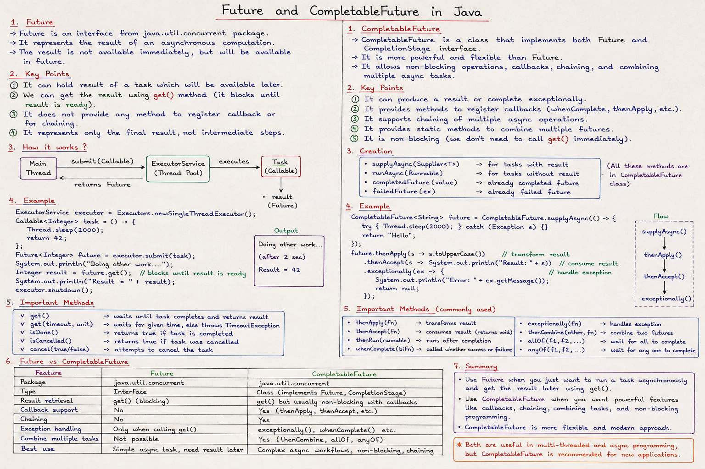

# Notes




## Future & Callable in Java

### The Problem They Solve

In Java, `Runnable` can run tasks in threads but **can't return a result or throw checked exceptions**. `Future` and `Callable` were introduced in Java 5 to fix this.

---

### Callable

Like `Runnable`, but it **returns a value** and **can throw exceptions**.

```java
// Runnable - no return value
Runnable r = () -> System.out.println("done");

// Callable - returns a value
Callable<Integer> c = () -> {
    return 42; // can also throw checked exceptions
};
```

| Feature | Runnable | Callable |
|---|---|---|
| Return value | ❌ `void` | ✅ Generic type `V` |
| Checked exceptions | ❌ | ✅ |
| Method | `run()` | `call()` |

---

## Callable Interface in Java

---

### What is it?

`Callable` is a functional interface in `java.util.concurrent` — similar to `Runnable` but with **two key differences**:

```java
// Runnable
public interface Runnable {
    void run();           // no return, no exception
}

// Callable
public interface Callable<V> {
    V call() throws Exception;  // returns a value, can throw checked exception
}
```

---

### The Core Difference

| Feature | Runnable | Callable |
|---|---|---|
| Return value | ❌ void | ✅ any type `<V>` |
| Throws checked exception | ❌ No | ✅ Yes |
| Used with | `Thread`, `ExecutorService` | `ExecutorService` only |
| Result holder | ❌ None | ✅ `Future<V>` |

---

### Basic Example

```java
import java.util.concurrent.Callable;

Callable<Integer> task = () -> {
    System.out.println("Task running...");
    return 42;           // returns a value
};

Integer result = task.call();  // direct call (no threading yet)
System.out.println(result);    // 42
```

---

### Real Use — With ExecutorService + Future

`Callable` is almost always used with an **ExecutorService**, and the result is wrapped in a **`Future`**:

```java
import java.util.concurrent.*;

public class Main {
    public static void main(String[] args) throws Exception {

        ExecutorService executor = Executors.newSingleThreadExecutor();

        Callable<Integer> task = () -> {
            Thread.sleep(2000);   // simulate long work
            return 100;
        };

        Future<Integer> future = executor.submit(task);  // non-blocking submit

        System.out.println("Doing other work...");       // runs immediately

        Integer result = future.get();  // BLOCKS here until result is ready
        System.out.println("Result: " + result);         // Result: 100

        executor.shutdown();
    }
}
```

**Timeline:**
```
Main thread: submit task → "Doing other work..." → future.get() → waits → prints 100
Worker thread:                                       sleeping 2s → returns 100
```

---

### Future Methods

```java
future.get()                  // blocks until result is ready
future.get(3, TimeUnit.SECONDS)  // blocks max 3 seconds, else TimeoutException
future.isDone()               // true if completed (success or failure)
future.isCancelled()          // true if cancelled
future.cancel(true)           // attempt to cancel
```

---

### Exception Handling

Since `call()` can throw checked exceptions, they get **wrapped** in `ExecutionException`:

```java
Callable<Integer> riskyTask = () -> {
    if (true) throw new Exception("Something went wrong!");
    return 1;
};

Future<Integer> future = executor.submit(riskyTask);

try {
    future.get();
} catch (ExecutionException e) {
    System.out.println("Task failed: " + e.getCause().getMessage());
    // Task failed: Something went wrong!
}
```

---

### Multiple Callables — invokeAll

```java
List<Callable<Integer>> tasks = List.of(
    () -> 10,
    () -> 20,
    () -> 30
);

List<Future<Integer>> futures = executor.invokeAll(tasks);

for (Future<Integer> f : futures) {
    System.out.println(f.get());  // 10, 20, 30
}
```

---

### With Method Reference (like your earlier question)

```java
class MyClass {
    Integer compute() {
        return 99;
    }
}

MyClass obj = new MyClass();
Callable<Integer> task = obj::compute;  // method reference as Callable
```

---

### Summary

```
Callable<V>
    │
    ├── call() returns V         ← unlike Runnable's void run()
    ├── can throw Exception      ← unlike Runnable
    ├── submitted to ExecutorService via submit()
    │
    └── returns Future<V>
            ├── future.get()     → blocks, returns result
            ├── future.isDone()  → check completion
            └── future.cancel()  → cancel the task
```

Use `Callable` whenever your thread needs to **return a result** or **throw a checked exception**.


### Future

A `Future<V>` is a **handle to a result that isn't ready yet** — it represents the *promise* of a value from an async computation.

```java
ExecutorService executor = Executors.newFixedThreadPool(2);

Callable<Integer> task = () -> {
    Thread.sleep(2000);   // simulate long computation
    return 100 + 200;
};

Future<Integer> future = executor.submit(task);  // starts async

// Do other work here while task runs in background...
System.out.println("Task submitted, doing other stuff...");

Integer result = future.get();  // blocks until result is ready
System.out.println("Result: " + result);  // 300
```

---


 They(Callable and Future) are **linked by the same type `V`**.

---

```java
Callable<Integer>  →  executor.submit()  →  Future<Integer>
         ↑                                          ↑
     same V                                      same V
```

---

### See it clearly:

```java
Callable<String> task = () -> "Hello";   // V = String, call() returns String

Future<String> future = executor.submit(task);  // Future<String> matches

String result = future.get();   // get() returns String
System.out.println(result);     // Hello
```

Whatever type `Callable` is parameterized with → `Future` holds that **same type** → `future.get()` returns that **same type**.

---

### Think of it this way:

```
Callable<V>         →    Future<V>
    call() : V      →    get()   : V
```

`Future` is just a **box** that will eventually hold whatever `Callable` returns. Same `V`, always.

### Key Future Methods

```java
future.get();                          // block until done (can throw)
future.get(3, TimeUnit.SECONDS);       // block with timeout
future.isDone();                       // non-blocking check
future.isCancelled();                  // was it cancelled?
future.cancel(true);                   // attempt to cancel
```

---


 The name **`Future`** describes **WHEN** the value is available, not what it is.

---

### The Problem Without Future

```java
Callable<Integer> task = () -> {
    Thread.sleep(5000);   // takes 5 seconds
    return 42;
};
```

The result `42` doesn't exist **right now** — it exists **in the future**.

So how does `executor.submit()` return something immediately if the value isn't ready yet?

---

### Future is a Promise/Placeholder

```
executor.submit(task)  →  returns IMMEDIATELY with Future<Integer>
                                        ↓
                              "I promise the result
                               will be here eventually,
                               come back and call get()"
```

```java
Future<Integer> future = executor.submit(task);  // instant, doesn't wait

// ... do other work ...

Integer value = future.get();  // NOW you wait for the actual value
```

---

### Why not just `V`?

If it just returned `V` directly:

```java
Integer result = executor.submit(task);  // would have to BLOCK for 5 seconds here
                                         // no parallelism at all!
```

**`Future<V>` lets you:**
- Submit the task → get a placeholder immediately
- Do other work meanwhile
- Fetch the real value only when you need it

---

### In Simple Words

```
V        →  the value itself  (exists NOW)
Future<V>→  a ticket for V    (exists NOW, value comes LATER)
```

Like a restaurant:
- You order food → waiter gives you a **token** (Future) immediately
- You sit, talk, relax (do other work)
- You present the token when food is ready → get your food (V)

##  if we do this(below code) main thread will sleep for 5 sec so it will make no difference whether v or future v??

```java
Callable<Integer> task = () -> {
    Thread.sleep(5000);   // takes 5 seconds
    return 42;
};
```

NO! The lambda body runs on the **worker thread**, not the main thread!

---

### Who runs what:

```java
// MAIN THREAD writes this lambda, but does NOT run it yet
Callable<Integer> task = () -> {
    Thread.sleep(5000);   // worker thread sleeps, NOT main thread
    return 42;
};

// MAIN THREAD just hands it off and gets Future immediately
Future<Integer> future = executor.submit(task);  // main thread doesn't sleep here

// MAIN THREAD continues freely
System.out.println("I am free!");  // prints immediately

// MAIN THREAD only waits here when it explicitly asks for result
Integer val = future.get();  // main thread waits here if result not ready yet
```

---

### Timeline:

```
Main Thread:    submit → "I am free!" → ... → future.get() → got 42!
                  ↓                               ↑
Worker Thread:  sleeping 5 seconds  →  returns 42
```

---

### Key Point

```java
Callable<Integer> task = () -> { ... };
```

This line just **defines** the task. Nothing runs here — it's just a recipe.

Only when you do `executor.submit(task)` does the **worker thread** pick it up and execute it. Main thread never touches the lambda body.


### Real-World Example — Parallel API Calls

```java
ExecutorService pool = Executors.newFixedThreadPool(3);

// Submit all tasks simultaneously
Future<String> userFuture    = pool.submit(() -> fetchUser(userId));
Future<String> orderFuture   = pool.submit(() -> fetchOrders(userId));
Future<String> profileFuture = pool.submit(() -> fetchProfile(userId));

// All 3 run in PARALLEL — collect results
String user    = userFuture.get();
String orders  = orderFuture.get();
String profile = profileFuture.get();

pool.shutdown();
```

Without `Future`, you'd have to fetch them **sequentially**, taking 3× longer.

---

### Limitations of Future → Use CompletableFuture

`Future` has pain points:
- `get()` **blocks** the calling thread
- Can't chain callbacks (do X *then* Y)
- Can't combine multiple futures easily

Java 8 introduced `CompletableFuture` to solve this:

```java
CompletableFuture.supplyAsync(() -> fetchUser(id))
    .thenApply(user -> transform(user))       // chain
    .thenAccept(result -> save(result))        // consume
    .exceptionally(ex -> handleError(ex));     // error handling
```

---

### Summary

| Concept | Role |
|---|---|
| `Callable<V>` | A task that **returns V** and can throw exceptions |
| `Future<V>` | A **receipt** for the eventual result of a `Callable` |
| `ExecutorService.submit()` | Accepts a `Callable`, returns a `Future` |
| `future.get()` | Waits and retrieves the result |

**Use them when:** you need to run tasks asynchronously, get results back, run tasks in parallel, or impose timeouts on long-running operations.

      


## CompletableFuture in Java

### Why CompletableFuture?

`Future` forces you to **block** with `.get()` and can't be chained. `CompletableFuture` (Java 8+) is a fully **non-blocking, composable** async pipeline.

---

### Creating a CompletableFuture

```java
// runAsync - no return value (like Runnable)
CompletableFuture<Void> cf1 = CompletableFuture.runAsync(() -> {
    System.out.println("Running async...");
});

// supplyAsync - returns a value (like Callable)
CompletableFuture<Integer> cf2 = CompletableFuture.supplyAsync(() -> {
    return 42;
});

// With a custom thread pool (recommended in production)
ExecutorService pool = Executors.newFixedThreadPool(4);
CompletableFuture<Integer> cf3 = CompletableFuture.supplyAsync(() -> 42, pool);
```

> By default it uses **ForkJoinPool.commonPool()**

---

### The 3 Core Chaining Methods

```java
CompletableFuture.supplyAsync(() -> "hello")

    // thenApply → transform the result (like map)
    .thenApply(s -> s.toUpperCase())          // "HELLO"

    // thenAccept → consume result, returns Void
    .thenAccept(s -> System.out.println(s))   // prints "HELLO"

    // thenRun → run something, ignores result
    .thenRun(() -> System.out.println("Done!"));
```

| Method | Input | Output | Use when |
|---|---|---|---|
| `thenApply` | result | new result | transform |
| `thenAccept` | result | void | consume |
| `thenRun` | nothing | void | side effect |

---

## completableFuture and Future are return types???

Yes! Both are return types but `CompletableFuture` is much more powerful. Let me break it down:

---

### Future — Basic, Limited

```java
Future<Integer> future = executor.submit(task);

Integer val = future.get();  // BLOCKS main thread, that's it
```

**Problems with Future:**
- `get()` always blocks — you can't say "when done, do this"
- Can't chain multiple tasks
- Can't combine two futures together
- Can't manually complete it

---

### CompletableFuture — Powerful, Non-Blocking

```java
CompletableFuture<Integer> cf = CompletableFuture.supplyAsync(() -> {
    Thread.sleep(5000);
    return 42;
});

// Instead of blocking, you say "when done, do THIS"
cf.thenAccept(val -> System.out.println("Got: " + val));

System.out.println("Main thread free!");  // prints immediately
```

---

### Key Difference

```
Future<V>             →   "go check if result is ready"  (you go to it)
CompletableFuture<V>  →   "call me when result is ready" (it comes to you)
```

---

### CompletableFuture Powers

**1. Chain tasks:**
```java
CompletableFuture.supplyAsync(() -> 10)
    .thenApply(val -> val * 2)       // 20
    .thenApply(val -> val + 5)       // 25
    .thenAccept(System.out::println); // prints 25
```

**2. Combine two futures:**
```java
CompletableFuture<Integer> f1 = CompletableFuture.supplyAsync(() -> 10);
CompletableFuture<Integer> f2 = CompletableFuture.supplyAsync(() -> 20);

f1.thenCombine(f2, (a, b) -> a + b)
  .thenAccept(System.out::println);  // 30
```

**3. Handle exceptions:**
```java
CompletableFuture.supplyAsync(() -> {
    throw new RuntimeException("Failed!");
})
.exceptionally(ex -> {
    System.out.println("Error: " + ex.getMessage());
    return 0;  // fallback value
});
```

**4. Manually complete:**
```java
CompletableFuture<Integer> cf = new CompletableFuture<>();
cf.complete(99);  // manually set the value
System.out.println(cf.get());  // 99
```

---

### Comparison Table

| Feature | Future | CompletableFuture |
|---|---|---|
| Get result | `get()` blocks | `thenAccept()` non-blocking |
| Chain tasks | ❌ | ✅ `thenApply()` |
| Combine futures | ❌ | ✅ `thenCombine()` |
| Exception handling | ❌ | ✅ `exceptionally()` |
| Manual complete | ❌ | ✅ `complete()` |
| Non-blocking | ❌ | ✅ |

---

### In Simple Words

```
Future<V>            →  a ticket, you must go CHECK yourself (blocking)
CompletableFuture<V> →  a ticket, it NOTIFIES you when ready (non-blocking)
                         + you can chain, combine, handle errors
```

`CompletableFuture` also **implements `Future`** — so it is a Future, just a much smarter one.


### Chaining — Do X then Y then Z

```java
CompletableFuture<String> pipeline = CompletableFuture
    .supplyAsync(() -> fetchUserId())          // Step 1: get ID
    .thenApply(id -> fetchUser(id))            // Step 2: get User
    .thenApply(user -> user.getName())         // Step 3: extract name
    .thenApply(name -> "Hello, " + name);      // Step 4: format

System.out.println(pipeline.get());  // "Hello, Alice"
```

Each step runs **after** the previous completes — clean, no nested callbacks.

---

### Combining Two Futures

```java
// thenCombine — run BOTH in parallel, combine results
CompletableFuture<String> userFuture  = CompletableFuture.supplyAsync(() -> fetchUser());
CompletableFuture<String> orderFuture = CompletableFuture.supplyAsync(() -> fetchOrders());

CompletableFuture<String> combined = userFuture.thenCombine(
    orderFuture,
    (user, orders) -> "User: " + user + ", Orders: " + orders
);

System.out.println(combined.get());
```

```java
// thenCompose — chain futures that return a future (flatMap)
CompletableFuture<String> result = CompletableFuture
    .supplyAsync(() -> getUserId())
    .thenCompose(id -> fetchUserAsync(id));  // fetchUserAsync returns CF
```

| Method | Use when |
|---|---|
| `thenCombine` | Two **independent** tasks, merge results |
| `thenCompose` | Second task **depends** on first's result |

---

### Waiting for Multiple Futures

```java
CompletableFuture<String> f1 = CompletableFuture.supplyAsync(() -> fetchUser());
CompletableFuture<String> f2 = CompletableFuture.supplyAsync(() -> fetchOrders());
CompletableFuture<String> f3 = CompletableFuture.supplyAsync(() -> fetchProfile());

// allOf — wait for ALL to complete
CompletableFuture<Void> all = CompletableFuture.allOf(f1, f2, f3);
all.get();  // blocks until all done
System.out.println(f1.get() + f2.get() + f3.get());

// anyOf — return as soon as the FASTEST one completes
CompletableFuture<Object> fastest = CompletableFuture.anyOf(f1, f2, f3);
System.out.println(fastest.get());
```

---

### Error Handling

```java
CompletableFuture<Integer> cf = CompletableFuture
    .supplyAsync(() -> {
        if (true) throw new RuntimeException("Something broke!");
        return 42;
    })

    // exceptionally — recover from error with a fallback value
    .exceptionally(ex -> {
        System.out.println("Error: " + ex.getMessage());
        return -1;  // fallback
    });

System.out.println(cf.get());  // -1
```

```java
// handle — runs whether success OR failure (like finally)
.handle((result, ex) -> {
    if (ex != null) return "Error: " + ex.getMessage();
    return "Success: " + result;
});

// whenComplete — side-effect only, doesn't change result
.whenComplete((result, ex) -> {
    if (ex != null) log.error("Failed", ex);
    else log.info("Got: " + result);
});
```

| Method | Changes result? | Runs when |
|---|---|---|
| `exceptionally` | ✅ (on error) | Only on failure |
| `handle` | ✅ | Always |
| `whenComplete` | ❌ | Always |

---

### Async Variants (`*Async` suffix)

Every chaining method has an `Async` version that runs the **next step on a different thread**:

```java
CompletableFuture.supplyAsync(() -> fetchData())
    .thenApply(d -> transform(d))       // same thread as previous
    .thenApplyAsync(d -> save(d))       // runs on ForkJoinPool thread
    .thenApplyAsync(d -> notify(d), pool); // runs on custom pool
```

Use `*Async` when the next step is also **heavy/blocking**.

---

### Full Real-World Example

```java
ExecutorService pool = Executors.newFixedThreadPool(4);

CompletableFuture<String> result = CompletableFuture
    .supplyAsync(() -> fetchUserFromDB(userId), pool)
    .thenCombine(
        CompletableFuture.supplyAsync(() -> fetchOrdersFromDB(userId), pool),
        (user, orders) -> buildResponse(user, orders)
    )
    .thenApply(response -> toJson(response))
    .exceptionally(ex -> "{\"error\": \"" + ex.getMessage() + "\"}")
    .whenComplete((res, ex) -> log.info("Request done"));

System.out.println(result.get(5, TimeUnit.SECONDS));
pool.shutdown();
```

---

### Future vs CompletableFuture

| Feature | `Future` | `CompletableFuture` |
|---|---|---|
| Blocking `.get()` | Always | Optional |
| Chaining | ❌ | ✅ |
| Error handling | ❌ | ✅ |
| Combine futures | ❌ | ✅ |
| Manual completion | ❌ | ✅ `.complete(val)` |
| Callbacks | ❌ | ✅ |

`CompletableFuture` is the **go-to for async programming** in modern Java — it gives you the full power of non-blocking, composable pipelines without callback hell.


     