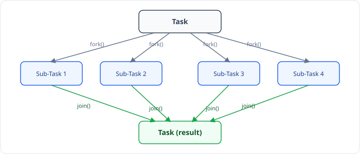
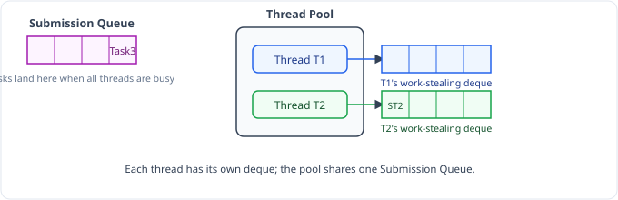
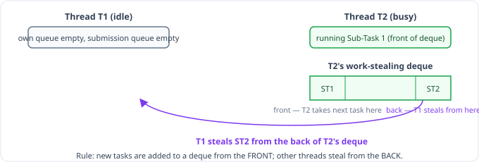

Till now we were creating a custom Thread Pool by providing minThreads, maxThreads, Queue, and so on.

> `Executors` provides factory methods which we can use to create a Thread Pool Executor. Present in the `java.util.concurrent` package.

## 1. Fixed ThreadPoolExecutor

`newFixedThreadPool` method creates a thread pool executor with a fixed number of threads. (Min == Max here.)

| | |
|---|---|
| Min and Max Pool | Same |
| Queue Size | Unbounded Queue |
| Thread Alive when idle | Yes — even when a thread is idle, it stays alive |
| When to use | Exact info: how many async tasks are needed |
| Disadvantage | Not good when workload is heavy, as it will lead to limited concurrency |

```java
// fixed thread pool executor
ExecutorService poolExecutor1 = Executors.newFixedThreadPool(5); // static method
poolExecutor1.submit(() -> "this is the async task");
```

- Used when we have exact info that there are only this many tasks.
- Not used when the workload is very heavy.
- A heavy workload can instead be handled by providing the correct info in a customized Thread Pool.

## 2. Cached ThreadPoolExecutor

`newCachedThreadPool` method creates a thread pool that creates a new thread as needed (dynamically).

| | |
|---|---|
| Min and Max Pool | Min: 0, Max: `Integer.MAX_VALUE` — initially 0 threads |
| Queue Size | Blocking Queue with size 0 — so no threads sit in the queue |
| Thread Alive when idle | 60 seconds — threads live up to 60 seconds if idle |
| When to use | Good for handling bursts of short-lived tasks |
| Disadvantage | Many long-lived tasks submitted rapidly can make the ThreadPool create so many threads that memory usage increases |

```java
// cached thread pool executor
ExecutorService poolExecutor = Executors.newCachedThreadPool();
poolExecutor.submit(() -> "this is the async task");
```

- Used for short-lived tasks (small tasks).
- If you submit long-lived tasks, many threads get created, which can cause a memory issue.

## 3. Single Thread Executor

`newSingleThreadExecutor` creates an Executor with just a single worker thread.

| | |
|---|---|
| Min and Max Pool | Min: 1, Max: 1 — only 1 thread |
| Queue Size | Unbounded Queue |
| Thread Alive when idle | Yes |
| When to use | When you need to process tasks sequentially |
| Disadvantage | No concurrency at all |

## WorkStealing Pool Executor

- It creates a **Fork-Join Pool Executor**.
- The number of threads depends on the available processors, or we can specify it in the parameter.
- There are 2 queues:
  - **Submission Queue**
  - **Work-Stealing Queue** for each thread (it's a Deque)
- Steps:
  - If all threads are busy, a task is placed in the **Submission Queue** (whenever we call `submit()`, tasks go into the submission queue only).
  - Say task1 is picked by ThreadA. If 2 subtasks are created using `fork()`, subtask1 will be executed by ThreadA only, and subtask2 is put into ThreadA's work-stealing queue.
  - If any other thread becomes free, and there is no task in the Submission Queue, it can **"STEAL"** the task from another thread's work-stealing queue.
- A task can be split into multiple smaller sub-tasks. For that, the task should extend:
  - `RecursiveTask` — when a subtask needs to return a value
  - `RecursiveAction` — otherwise
- We can create a Fork-Join Pool using the `newWorkStealingPool` method in `ExecutorService`, or by calling `ForkJoinPool.commonPool()`.

### How fork() / join() work

A big task is divided into smaller tasks by `fork()`, and by calling `join()` you wait for each subtask to finish, and then the subtasks are joined.



Much like the Divide & Conquer approach — it helps to do more parallelism. Earlier, one thread was doing the task; now multiple threads are doing the task. This is done by the WorkStealing Pool Executor. Here, each thread has its own deque called the **Work-Stealing Queue**, and the other queue where tasks are put is called the **Submission Queue**.

### Walkthrough example



- Task1 is taken by Thread1 & Task2 by Thread2.
- Suppose Task2 can be divided further, and Thread2 takes it. Now Task3 comes — both threads are busy, so it goes to the Submission Queue.
- As Task2 can be divided further, it is split into 2 subtasks, SubTask1 (ST1) and SubTask2 (ST2), which are put in the Work-Stealing Queue of Task2 (i.e. Thread2's queue).
- SubTask ST1 is run first by Thread2, and ST2 sits in Thread2's queue.
- Task1 completes, so Thread1 checks its own Work-Stealing Queue first — that's empty — then the Submission Queue, so Thread1 now works on Task3. Task3 also completes, so Thread1 is free.
- Now Thread1 checks, in order:
  1. Its own Work-Stealing Queue → No task.
  2. The Submission Queue → Empty too.
  3. The other, busy thread's (Thread2's) Work-Stealing Queue → it can steal that task! Thread2 is busy with a task, and ST2 is sitting there, so ST2 is claimed by Thread1.
- So: `Thread1 → ST2`, `Thread2 → ST1` — this is called **stealing**.



> A free thread can steal a subtask of a busy thread.

Q1 → How do you divide a task? Q2 → How do you put a task in the Work-Stealing Queue?

### ForkJoinPool example

```java
public class ExecutorsUtilityExample {

    public static void main(String args[]) {

        ForkJoinPool pool = ForkJoinPool.commonPool(); // get Fork Join Pool
        Future<Integer> futureObj = pool.submit(new ComputeSumTask(0, 100));
        try {
            System.out.println(futureObj.get());
        } catch (Exception e) {

        }
    }
}

class ComputeSumTask extends RecursiveTask<Integer> {

    int start;
    int end;

    ComputeSumTask(int start, int end) {
        this.start = start;
        this.end = end;
    }

    @Override
    protected Integer compute() { // provide implementation here — we do recursion

        if (end - start <= 4) { // base case
            int totalSum = 0;
            for (int i = start; i <= end; i++) {
                totalSum += i;
            }
            return totalSum;
        } else {
            // split the task
            int mid = (start + end) / 2;
            ComputeSumTask leftTask = new ComputeSumTask(start, mid);
            ComputeSumTask rightTask = new ComputeSumTask(mid + 1, end);

            // fork the subtasks for parallel execution — divides the task for parallel execution
            leftTask.fork();
            rightTask.fork();

            // combine the results of subtasks — else just basic recursion; join() waits for the subtask to finish
            int leftResult = leftTask.join();
            int rightResult = rightTask.join();

            // combine the results
            return leftResult + rightResult;
        }
    }
}
```

**Output (not shown in the source notes — expected output for this program):**
```text
5050
```
> `ComputeSumTask(0, 100)` sums every integer from 0 to 100 via divide-and-conquer, which equals `0 + 1 + ... + 100 = 100 * 101 / 2 = 5050`, regardless of how the work is split or which thread runs which piece.

### More notes on Work-Stealing

- One of the subtasks continues to run on the same thread that forked it; the rest are put in that thread's Work-Stealing Queue.
- `join()` waits for the subtask to finish.
- On `submit()`, a task goes to the Submission Queue.
- On `fork()`, a task (subtask) goes to the Work-Stealing Queue.
- Free threads steal from another thread's Work-Stealing Queue.
- By default, it creates a number of threads equal to the number of cores. If you provide the number of threads as min/max, then the thread count is that number.
- The Work-Stealing Queue is a **Deque**: other threads steal from the **back**, but tasks are added to it from the **front**!
