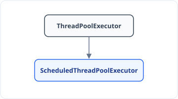

**Shutdown:**
- Initiates orderly shutdown of the ExecutorService.
- After calling 'Shutdown', Executor will not accept new task submission.
- Already Submitted tasks, will continue to execute.
- No interruption in these — not a force to stop ThreadPool Execution.

**AwaitTermination:**
- It's an Optional functionality. Return true/false.
- It is used after calling 'Shutdown' method.
- Blocks calling thread for specific timeout period, and wait for ExecutorService shutdown.
- Return true, if ExecutorService gets shutdown within specific timeout else false.
- In `shutdown()`, calling the method doesn't wait for Executor Service to shutdown.
- Used when we need to do something after ThreadPool Shutdown.

**shutdownNow:**
- Best effort attempt to stop/interrupt the actively executing tasks.
- Halt the processing of tasks which are waiting.
- Return the list of tasks which are awaiting execution.
- All tasks, whether waiting or in progress, will be halted — or the task will not be completed fully which are executing.
- `shutdownNow()` shuts down the ThreadPool Executor as soon as possible.

**Scenario1: Task submission after Shutdown**

```java
public static void main(String args[]) {

    ExecutorService poolObj = Executors.newFixedThreadPool(5);
    poolObj.submit(() -> {
        System.out.println("Thread going to start its work");
    });

    poolObj.shutdown();

    poolObj.submit(() -> {
        System.out.println("Thread going to start its work");
    });

}
```

```text
Exception in thread "main" java.util.concurrent.RejectedExecutionException: Task java.util.concurrent.FutureTask@494b9385 rejected
    at java.util.concurrent.AbstractExecutorService.submit(AbstractExecutorService.java:112)
```


**Scenario2: Shutdown do not impact the already submitted task**

```java
public static void main(String args[]) {

    ExecutorService poolExecutorObj = Executors.newFixedThreadPool(5);
    poolExecutorObj.submit(() -> {
        try {
            Thread.sleep(5000);
        } catch (Exception e) {

        }
        System.out.println("new task");
    });

    poolExecutorObj.shutdown();
    System.out.println("Main thread unblocked and finished processing");
}
```

**Scenario3: usage of 'awaitTermination'**

```java
public static void main(String args[]) {

    ExecutorService poolExecutorObj = Executors.newFixedThreadPool(5);
    poolExecutorObj.submit(() -> {
        try {
            Thread.sleep(6000);
        } catch (Exception e) {

        }
        System.out.println("new task");
    });

    poolExecutorObj.shutdown();
    try {
        boolean isExecutorTerminated = poolExecutorObj.awaitTermination(3, TimeUnit.SECONDS);
        System.out.println("Main thread, isExecutorTerminated: " + isExecutorTerminated);
    } catch (Exception e) {

    }
}
```
- Main thread waits for 3 seconds & checks whether the pool is shut down or not.


## ScheduledThreadPoolExecutor

Helps to schedule the tasks.



- Core Pool Size is what we provide; new Threads beyond that → 0.

**All methods of ThreadPoolExecutor +**

| S.No. | Method Name | Description |
|---|---|---|
| 1. | `schedule(Runnable command, long delay, TimeUnit unit)` | Schedules a Runnable task after specific delay.<br>Only one time task runs. |
| 2. | `schedule(Callable<V> callable, long delay, TimeUnit unit)` | Schedules a Callable task after specific delay.<br>Only one time task runs. |
| 3. | `scheduleAtFixedRate(Runnable command, long initialDelay, long period, TimeUnit unit)` | Schedules a Runnable task for repeated execution with fixed rate.<br>We can use cancel method to stop this repeated task.<br>Also lets say, if thread1 is taking too much time to complete the task and next task is ready to run, till previous task will not get completed, new task can not be start (it will wait in queue). |
| 4. | `scheduleWithFixedDelay(Runnable command, long initialDelay, long delay, TimeUnit unit)` | Schedules a Runnable task for repeated execution with a fixed delay<br>(Means next task delay counter start only after previous one task completed) |

- `schedule(() -> "hello", 3, TimeUnit.Seconds)` — after 3 seconds, run this task once.
- `Callable` returns a value, `Runnable` — Not.
- (for method 3) 1st have the initial delay, & then after every 5 sec it will run.
- (for method 4) here, delay then starts after the previous task is completed.


**Ex1**
```java
public class ExecutorsUtilityExample {

    public static void main(String args[]) {

        ScheduledExecutorService poolObj = Executors.newScheduledThreadPool(5);

        poolObj.schedule(() -> {
            System.out.println("hello");
        }, 5, TimeUnit.SECONDS);
    }
}
```

**Ex2**
```java
public static void main(String args[]) {

    ScheduledExecutorService poolObj = Executors.newScheduledThreadPool(5);

    Future<String> futureObj = poolObj.schedule(() -> {
        return "hello";
    }, 5, TimeUnit.SECONDS);

    try {
        System.out.println(futureObj.get());
    } catch (Exception e) {

    }
}
```

**Ex3**
```java
public static void main(String args[]) {

    ScheduledExecutorService poolObj = Executors.newScheduledThreadPool(5);

    Future<?> futureObj = poolObj.scheduleAtFixedRate(() -> {
        try {
            Thread.sleep(6000);
        } catch (Exception e) {

        }
        System.out.println("hello");
    }, 3, 5, TimeUnit.SECONDS);
}
```
- initial Delay: 3sec, & then after every 5sec gap it will put new task.


**Ex4**
```java
public static void main(String args[]) {

    ScheduledExecutorService poolObj = Executors.newScheduledThreadPool(5);

    Future<?> futureObj = poolObj.scheduleAtFixedRate(() -> {
        System.out.println("Thread picked the task");

        try {
            Thread.sleep(6000);
        } catch (Exception e) {

        }
        System.out.println("Thread completed the task");
    }, 1, 3, TimeUnit.SECONDS);
}
```
- Initial Delay: 1sec & after that every 3sec gap it will put new task.

```text
/Library/Java/JavaVirtualMachines/zulu-8...
Thread picked the task        → Task1
Thread completed the task
Thread picked the task
```
- These two lines come together, as: Task1 needs 6sec & next task comes up at 1+3=4sec, but at t=4sec thread was busy, so Task will wait till t=6, & when Task1 completed, Task2 will be scheduled.

b) If it was `scheduleWithFixedDelay`, than t=6 Task1 completed, from there Delay starts, so Task2 will be scheduled at 6+3=9.


