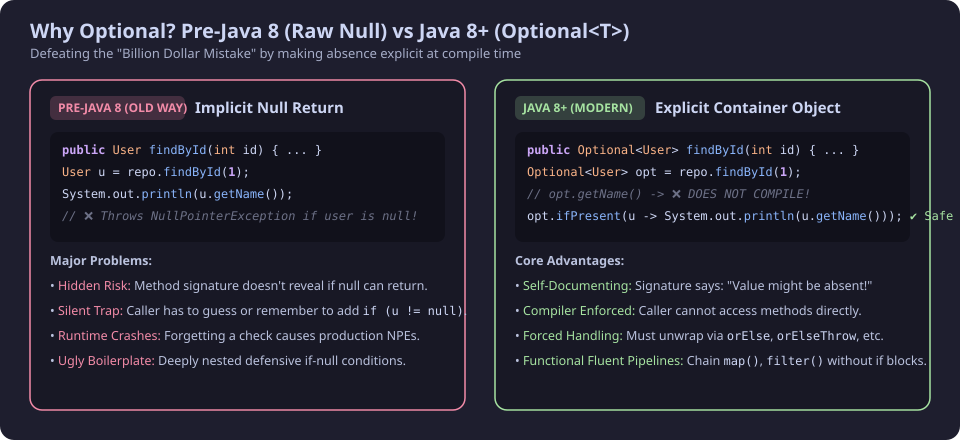
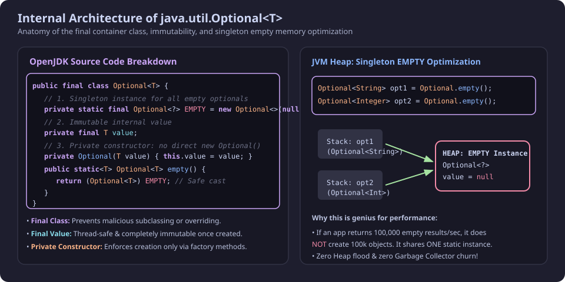
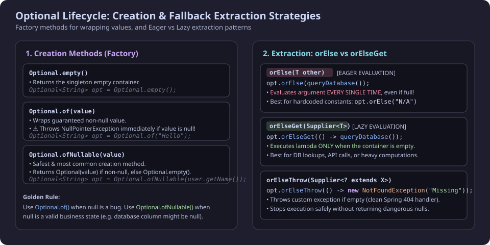
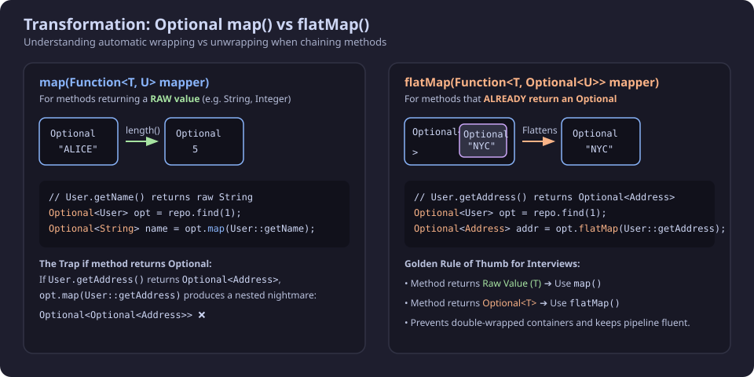
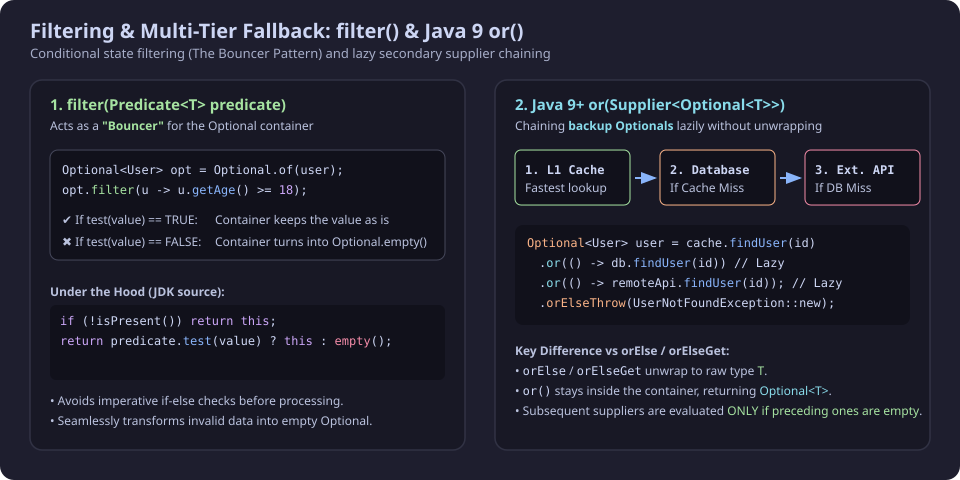
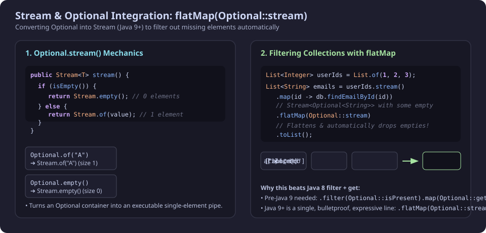
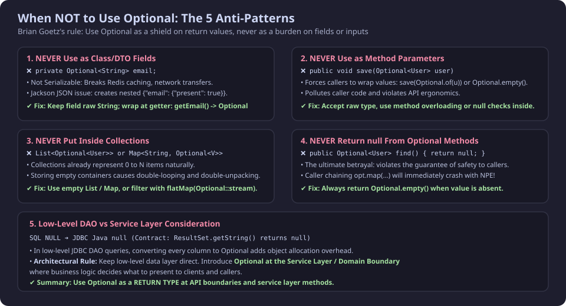

## 1. Why Optional? The Problem & Philosophy

In 1965, British computer scientist Sir Tony Hoare invented the `null` reference while designing the ALGOL W language. Decades later, he famously described it as his **"Billion Dollar Mistake"**:

> *"I call it my billion-dollar mistake. It was the invention of the null reference in 1965... This has led to innumerable errors, vulnerabilities, and system crashes, which have probably caused a billion dollars of pain and damage in the last forty years."*

### The Pre-Java 8 Problem (Implicit Nulls)
Before Java 8, if a method looked up data (e.g. from a database or cache), it returned `null` whenever data was missing.

```java
// Pre-Java 8
User user = userRepository.findByEmail("alice@example.com");

// If Alice does not exist, user is null.
// The next line crashes in production with NullPointerException (NPE):
System.out.println(user.getName());
```

**Why was this terrible?**
- **Hidden Contract:** The method signature `User findByEmail(String email)` did **not** tell the caller whether the return value could be `null`.
- **Silent Traps:** The caller had to guess, inspect the implementation, or rely on documentation.
- **Defensive Pollution:** Code became cluttered with deeply nested `if (user != null)` checks.

---

### The Java 8 Solution (`Optional<T>`)
Introduced in Java 8, `Optional<T>` is an immutable single-value container that **either contains a single non-null value of type `T` or contains nothing (empty)**.

```java
// Java 8+
Optional<User> userOpt = userRepository.findByEmail("alice@example.com");

// Compilation error if you try: userOpt.getName(); ❌ (Compiler prevents direct access)
// You are forced to handle absence safely:
userOpt.ifPresent(u -> System.out.println(u.getName())); // ✔ Safe
```



---

### Frequently Asked Question: "If we still use `if`, what is the advantage?"

Engineers often ask:
> *"Earlier we wrote `if (user != null)`. With Optional, we can still write `if (userOptional.isPresent())`. What did we actually gain?"*

```java
// Pre-Java 8
User user = repo.findById(1);
if (user != null) {
    System.out.println(user.getName());
}

// Java 8 with isPresent()
Optional<User> userOptional = repo.findById(1);
if (userOptional.isPresent()) {
    User user = userOptional.get();
    System.out.println(user.getName());
}
```

The three major advantages are:

1. **Self-Documenting API Contract:**
   - With `User findById(int id)`, the return type gives zero indication whether `null` can return.
   - With `Optional<User> findById(int id)`, the API explicitly communicates: *"The requested user may or may not exist. You must be prepared for an empty result."*

2. **Compiler-Enforced Safety:**
   - Calling `user.getName()` on a raw object compiles fine and fails at runtime.
   - Calling `userOptional.getName()` fails at **compile-time**. The compiler refuses to compile until you unwrap the container.

3. **Rich Functional Pipelines (Eliminating `if` entirely):**
   - You don't have to write `if (opt.isPresent())` (which is considered a code smell). You can use fluent pipelines:
   ```java
   repo.findById(1)
       .map(User::getName)
       .filter(name -> !name.isBlank())
       .ifPresent(System.out::println);
   ```

---

## 2. Internal Architecture of `java.util.Optional<T>`

Let us inspect the actual OpenJDK source code for `java.util.Optional<T>`:

```java
package java.util;

public final class Optional<T> {
    
    /**
     * Common singleton instance for empty().
     */
    private static final Optional<?> EMPTY = new Optional<>(null);

    /**
     * If non-null, the value; if null, indicates no value is present.
     */
    private final T value;

    /**
     * Private constructor prevents direct instantiation via 'new'.
     */
    private Optional(T value) {
        this.value = value;
    }

    /**
     * Returns the singleton empty Optional instance.
     */
    public static<T> Optional<T> empty() {
        @SuppressWarnings("unchecked")
        Optional<T> t = (Optional<T>) EMPTY;
        return t;
    }

    public boolean isPresent() {
        return value != null;
    }

    // Java 11+
    public boolean isEmpty() {
        return value == null;
    }
}
```



### Architectural Highlights

1. **`final class` & `final` Field (Immutability & Thread Safety):**
   - By making `Optional<T>` `final`, Java prevents any subclass from overriding methods or altering safety invariants.
   - The field `private final T value` guarantees that once an `Optional` is created, its state can never be modified. It is inherently thread-safe.

2. **Private Constructor:**
   - You cannot write `new Optional<String>("abc")`. All instances must be created via static factory methods (`of`, `ofNullable`, `empty`).

3. **The Static Singleton `EMPTY` Memory Optimization:**
   - If an application processes millions of database queries that return empty results, creating `new Optional<>(null)` each time would flood the JVM heap and trigger frequent Garbage Collection (GC) pauses.
   - Instead, Java initializes **exactly one static instance** (`EMPTY`) when the class is loaded.
   - When you call `Optional.empty()`, Java simply returns this pre-created singleton.

4. **Type Erasure & the Safe Unchecked Cast:**
   - `EMPTY` is stored as `Optional<?>` (wildcard).
   - In `empty()`, Java performs `(Optional<T>) EMPTY`. Because Java uses **Type Erasure** (generic types are erased to `Object` at runtime) and the internal value is `null`, casting to any `Optional<T>` is completely type-safe at runtime.

```java
Optional<String> emptyStr = Optional.empty();
Optional<Integer> emptyInt = Optional.empty();

// Both reference the exact same memory address in the JVM heap:
System.out.println(emptyStr == emptyInt); // prints: true
```

---

## 3. Creating & Inspecting Optionals

### Factory Methods for Creation

| Factory Method | Parameter | Behavior | When to Use |
| :--- | :--- | :--- | :--- |
| `Optional.empty()` | None | Returns the shared singleton empty `Optional`. | When explicitly signaling no result. |
| `Optional.of(T value)` | Non-null `T` | Wraps `value`. Throws `NullPointerException` immediately if `value == null`. | When `null` is unexpected and indicates a bug (Fail-Fast). |
| `Optional.ofNullable(T value)` | Nullable `T` | Returns `Optional.of(value)` if non-null, else `Optional.empty()`. | **Standard choice.** When wrapping raw database/API values that might be null. |

```java
// 1. Guaranteed empty
Optional<String> emptyBox = Optional.empty();

// 2. Guaranteed non-null
Optional<String> nameBox = Optional.of("Alice");
// Optional.of(null); // ❌ Throws NullPointerException immediately!

// 3. Nullable value
String rawDbEmail = getEmailFromDb(); // could be null
Optional<String> emailBox = Optional.ofNullable(rawDbEmail); // ✔ Safe
```

---

### Inspection Methods

```java
Optional<String> opt = Optional.ofNullable(fetchData());

// 1. isPresent() -> returns true if value is non-null
if (opt.isPresent()) {
    System.out.println("Value exists!");
}

// 2. isEmpty() (Java 11+) -> returns true if value is null
if (opt.isEmpty()) {
    System.out.println("Container is empty.");
}
```

---

## 4. Extracting Values: Eager vs. Lazy Evaluation (`orElse` vs. `orElseGet`)

When extracting data from an `Optional`, you must provide a fallback plan for the empty case.



### 1. `get()` (The Dangerous Direct Access)
```java
T get()
```
- Returns the wrapped value if present.
- **Throws `NoSuchElementException`** if the container is empty.
- **Rule:** Avoid calling `.get()` directly unless you have already verified `isPresent()` or are in unit tests where missing data represents a test failure.

---

### 2. `orElse(T other)` (Eager Evaluation)
```java
T orElse(T other)
```
- Returns the wrapped value if present; otherwise returns `other`.
- **Eager Evaluation:** The argument passed to `orElse(...)` is **evaluated immediately**, before `orElse()` even checks whether the Optional is empty or full.

```java
Optional<User> cachedUser = cache.findUser("alice");

// ⚠️ WARNING: fetchUserFromDb() executes EVERY SINGLE TIME,
// even if cachedUser is already present in cache!
User user = cachedUser.orElse(fetchUserFromDb("alice"));
```

---

### 3. `orElseGet(Supplier<? extends T> supplier)` (Lazy Evaluation)
```java
T orElseGet(Supplier<? extends T> supplier)
```
- Takes a functional `Supplier<T>` (`() -> T`).
- **Lazy Evaluation:** Java **only executes** the Supplier if the Optional is actually empty.

```java
Optional<User> cachedUser = cache.findUser("alice");

// ✔ OPTIMAL: fetchUserFromDb() executes ONLY IF cachedUser is empty.
User user = cachedUser.orElseGet(() -> fetchUserFromDb("alice"));
```

---

### Deep Dive: Value vs. Behavior (The Pizza Analogy)

| Approach | Code | Analogy | Performance Impact |
| :--- | :--- | :--- | :--- |
| **`orElse(...)`** *(Eager)* | `opt.orElse(queryDb())` | Ordering a pizza **before** knowing if dinner is cooked at home. If dinner is ready, you throw the pizza away. | **Wasteful:** Unnecessary database queries, network I/O, and CPU allocation. |
| **`orElseGet(...)`** *(Lazy)* | `opt.orElseGet(() -> queryDb())` | Saving the pizzeria's phone number. You **only order** if the fridge is completely empty. | **Optimal:** Zero overhead when data is already present. |

> [!TIP]
> **Rule of Thumb:**
> - Use `orElse("default")` when the fallback is a simple hardcoded constant/literal (e.g. `""`, `"Unknown"`, `0`).
> - Use `orElseGet(() -> computeDefault())` whenever the fallback involves method calls, database access, object allocation, or computation.

---

### 4. `orElseThrow(Supplier<? extends X> exceptionSupplier)`
```java
T orElseThrow(Supplier<? extends X> exceptionSupplier) throws X
```
- Returns the value if present, or throws the custom exception produced by the Supplier.
- Standard pattern in Spring Boot service layers for throwing domain/REST exceptions:

```java
@Service
public class UserService {
    @Autowired
    private UserRepository userRepository;

    public User getUserById(Long id) {
        return userRepository.findById(id)
            .orElseThrow(() -> new ResourceNotFoundException("User not found with id: " + id));
    }
}
```

---

## 5. Conditional Execution: `ifPresent()` & `ifPresentOrElse()`

Instead of writing imperative `if-else` blocks, Optional provides functional consumers to run side-effects safely.

### 1. `ifPresent(Consumer<? super T> action)`
Runs the `Consumer` only if a value is present.

```java
// Pre-Java 8
User user = userRepository.findByUsername("alice");
if (user != null) {
    user.setLastLogin(LocalDateTime.now());
    userRepository.save(user);
}

// Java 8+ Fluent Way
userRepository.findByUsername("alice")
    .ifPresent(user -> {
        user.setLastLogin(LocalDateTime.now());
        userRepository.save(user);
    });
```

---

### 2. `ifPresentOrElse(Consumer<? super T> action, Runnable emptyAction)` *(Java 9+)*
Executes the first action (`Consumer`) if present, or the fallback action (`Runnable`) if empty.

```java
// Why Runnable for the second parameter?
// Because the container is empty, there is no object to pass to the function.
// Hence, it takes a 0-argument Runnable: () -> void

discountRepository.findByCode("SUMMER50")
    .ifPresentOrElse(
        code -> applyDiscountToCart(code),                  // Consumer: runs if present
        () -> logger.warn("Invalid discount code entered!") // Runnable: runs if empty
    );
```

---

## 6. Transforming Values: `map()` vs. `flatMap()` vs. `filter()`

The transformation methods in `Optional` work identically to their counterparts in Java Streams, but operate on a container of **0 or 1 item**.



---

### 1. `map(Function<? super T, ? extends U> mapper)`
- Takes a function that transforms a raw value `T` into `U`.
- Automatically wraps the resulting `U` into a new `Optional<U>`.

```java
// OpenJDK Implementation of map():
public <U> Optional<U> map(Function<? super T, ? extends U> mapper) {
    Objects.requireNonNull(mapper);
    if (!isPresent()) {
        return empty(); // If source is empty, do nothing
    } else {
        // Apply function to the raw value and safely re-wrap
        return Optional.ofNullable(mapper.apply(value));
    }
}
```

#### The Two Built-in Safety Nets of `map()`:
1. **Empty Source:** If the source `Optional` is empty, `map()` never invokes your function; it immediately returns `Optional.empty()`.
2. **Null Result:** If your function executes and returns `null` (e.g. `user.getEmail()` is null), `Optional.ofNullable(null)` intercepts it and safely converts it to `Optional.empty()`.

```java
Optional<User> userOpt = Optional.of(new User("Bob", null)); // Bob has no email

// Crash-proof chaining:
int emailLength = userOpt
    .map(User::getEmail)   // Returns null -> map turns this into Optional.empty()
    .map(String::length)   // Sees empty container -> skipped completely!
    .orElse(0);            // Returns fallback: 0
```

---

### 2. `flatMap(Function<? super T, ? extends Optional<? extends U>> mapper)`
- Used when the mapping function **itself already returns an `Optional`**.
- Prevents nested containers (`Optional<Optional<T>>`) by flattening them into a single `Optional<T>`.

```java
class Address {
    private String city;
    public String getCity() { return city; }
}

class User {
    private Address address;
    // Getter explicitly returns Optional because address is optional
    public Optional<Address> getAddress() {
        return Optional.ofNullable(this.address);
    }
}
```

#### The `map()` Trap vs. `flatMap()` Solution:

```java
Optional<User> userOpt = userRepository.findById(1);

// ❌ USING map(): results in nested Optional<Optional<Address>>
Optional<Optional<Address>> nested = userOpt.map(User::getAddress);

// ✔ USING flatMap(): flattens into a clean Optional<Address>
Optional<Address> addressOpt = userOpt.flatMap(User::getAddress);

// Full Fluent Pipeline:
String city = userOpt
    .flatMap(User::getAddress) // Returns Optional<Address>
    .map(Address::getCity)     // Returns Optional<String> (getCity returns raw String)
    .orElse("Unknown City");
```

---

### 3. `filter(Predicate<? super T> predicate)` (The Bouncer Pattern)



- Evaluates the condition in the `Predicate`.
- If condition is `true`, the `Optional` retains its value.
- If condition is `false` (or the `Optional` was already empty), it turns into `Optional.empty()`.

```java
// OpenJDK Implementation:
public Optional<T> filter(Predicate<? super T> predicate) {
    Objects.requireNonNull(predicate);
    if (!isPresent()) {
        return this;
    } else {
        return predicate.test(value) ? this : empty();
    }
}
```

#### Example: Business Validation Without `if` Statements
```java
public String getAdultUserName(Long userId) {
    return userRepository.findById(userId)
        .filter(user -> user.getAge() >= 18) // Bouncer: drops minors
        .map(User::getName)
        .orElse("Access Denied: User is not an adult");
}
```

---

### The "Big Four" Functional Interfaces in Optional

| Interface | Method Signature | Method Name | Optional Method Using It | Analogy |
| :--- | :--- | :--- | :--- | :--- |
| `Supplier<T>` | `() -> T` | `T get()` | `orElseGet()`, `orElseThrow()` | **The Factory:** Produces data on demand. |
| `Consumer<T>` | `T -> void` | `void accept(T t)` | `ifPresent()`, `ifPresentOrElse()` | **The Sink:** Consumes data, returns nothing. |
| `Predicate<T>`| `T -> boolean` | `boolean test(T t)` | `filter()` | **The Bouncer:** Tests a condition. |
| `Function<T, R>`| `T -> R` | `R apply(T t)` | `map()`, `flatMap()` | **The Transformer:** Converts `T` to `R`. |

---

## 7. Advanced Fallback Chaining: Java 9 `or()` Method

Introduced in Java 9, `or()` allows you to supply a fallback `Optional` **without unwrapping the value**.

```java
public Optional<T> or(Supplier<? extends Optional<? extends T>> supplier) {
    Objects.requireNonNull(supplier);
    if (isPresent()) {
        return this; // Fast path: return existing container
    } else {
        @SuppressWarnings("unchecked")
        Optional<T> r = (Optional<T>) supplier.get(); // Slow path: execute fallback supplier
        return Objects.requireNonNull(r);
    }
}
```

### Multi-Tier Fallback Pipeline (Cache ➔ DB ➔ Remote API)
```java
public Optional<User> findUser(String userId) {
    return cacheService.findUser(userId)              // 1. Check L1 Memory Cache
        .or(() -> databaseRepo.findUser(userId))      // 2. Fallback to Database if Cache miss
        .or(() -> remoteAuthClient.findUser(userId)); // 3. Fallback to Remote API if DB miss
}
```

**Why is this brilliant?**
- **Short-Circuiting:** If the user is found in the cache, the database and remote API suppliers **never execute**.
- **Container Continuity:** You stay within `Optional<User>` throughout the entire resolution lifecycle.

---

## 8. Streams & Optional Synergy: `Optional.stream()`

Prior to Java 9, extracting valid values from a collection of Optionals required cumbersome two-step filtering:

```java
// Pre-Java 9 (Ugly & Clunky)
List<Optional<String>> optionalList = getOptionalList();

List<String> results = optionalList.stream()
    .filter(Optional::isPresent) // 1. Filter full boxes
    .map(Optional::get)          // 2. Open boxes (Risky)
    .collect(Collectors.toList());
```

---

### The Modern Way: `Optional.stream()` + `flatMap()` *(Java 9+)*

```java
// OpenJDK Implementation:
public Stream<T> stream() {
    if (isEmpty()) {
        return Stream.empty(); // Returns 0-element stream
    } else {
        return Stream.of(value); // Returns 1-element stream
    }
}
```



By combining `Optional.stream()` with `Stream.flatMap()`, missing values simply vanish into thin air:

```java
List<Integer> userIds = List.of(1, 2, 3, 4, 5);

List<String> activeEmails = userIds.stream()
    .map(userRepo::findEmailById)   // Returns Stream<Optional<String>>
    .flatMap(Optional::stream)      // Flattens into Stream<String> & automatically discards empties!
    .toList();
```

---

## 9. Deep Dive: Stream Execution Engine & Pipeline Internals

Understanding how Streams process data under the hood reveals why `flatMap(Optional::stream)` is so efficient.

### 1. Horizontal vs. Vertical Execution (Lazy Evaluation)

In traditional collection operations, processing is **horizontal** (entire collection is transformed before moving to the next stage).

Java Streams execute **vertically**: a single element moves through the entire pipeline before the stream touches the next element.

```java
List<Integer> numbers = List.of(1, 2, 3, 4, 5, 6, 7, 8, 9, 10);

List<Integer> result = numbers.stream()
    .map(n -> n * 2)
    .filter(n -> n > 10)
    .limit(2)
    .toList();
```

```
Vertical Execution Timeline:
- Item 1 (1)  -> map(2)  -> filter(2 > 10? No)  -> Dropped
- Item 2 (2)  -> map(4)  -> filter(4 > 10? No)  -> Dropped
- ...
- Item 6 (6)  -> map(12) -> filter(12 > 10? Yes) -> limit (Count: 1)
- Item 7 (7)  -> map(14) -> filter(14 > 10? Yes) -> limit (Count: 2) -> LIMIT REACHED!
- Items 8, 9, 10 are NEVER processed. Stream terminates immediately.
```

---

### 2. The Internal Sink Architecture (`StatelessOp` & `ChainedReference`)

Inside `java.util.stream.ReferencePipeline`:

```java
// Stream map() internals
@Override
public final <R> Stream<R> map(Function<? super P_OUT, ? extends R> mapper) {
    return new StatelessOp<P_OUT, R>(this, StreamShape.REFERENCE, StreamOpFlag.NOT_SORTED) {
        @Override
        Sink<P_OUT> opWrapSink(int flags, Sink<R> sink) {
            return new Sink.ChainedReference<P_OUT, R>(sink) {
                @Override
                public void accept(P_OUT u) {
                    downstream.accept(mapper.apply(u)); // Executes lambda & pushes down
                }
            };
        }
    };
}
```

```java
// Stream flatMap() internals
@Override
public final <R> Stream<R> flatMap(Function<? super P_OUT, ? extends Stream<? extends R>> mapper) {
    return new StatelessOp<P_OUT, R>(this, StreamShape.REFERENCE, StreamOpFlag.NOT_SORTED) {
        @Override
        Sink<P_OUT> opWrapSink(int flags, Sink<R> sink) {
            return new Sink.ChainedReference<P_OUT, R>(sink) {
                @Override
                public void accept(P_OUT u) {
                    try (Stream<? extends R> result = mapper.apply(u)) {
                        if (result != null) {
                            // THE FLATTENING ENGINE:
                            // Iterates over mini-stream and pumps individual items downstream
                            result.sequential().forEach(downstream);
                        }
                    }
                }
            };
        }
    };
}
```

---

## 10. When NOT to Use Optional: The 5 Anti-Patterns

Brian Goetz (Java Language Architect) explicitly designed `Optional` for one specific purpose: **as a method return type to represent possible absence**.

Using it elsewhere violates Java idioms and damages performance.



---

### 1. NEVER Use `Optional` as a Class or DTO Field
```java
// ❌ ANTI-PATTERN:
public class UserDTO implements Serializable {
    private String name;
    private Optional<String> middleName; // WRONG!
}
```

#### Why this is destructive:
1. **`Optional` is NOT `Serializable`:** `Optional` does not implement `java.io.Serializable`. Attempting to save this object to Redis, write it to disk, or pass it between distributed microservices will throw `NotSerializableException`.
2. **Jackson JSON Serialization Complications:** Default JSON serializers serialize `Optional` fields as nested objects: `{"middleName": {"present": true}}` instead of `{"middleName": "Paul"}`.
3. **Memory Overhead:** Wrapping every field creates redundant wrapper objects on the JVM heap, increasing memory footprint and GC pressure.

```java
// ✔ CORRECT APPROACH:
public class UserDTO implements Serializable {
    private String name;
    private String middleName; // Keep the field raw

    // Wrap in Optional ONLY at the getter level if desired:
    public Optional<String> getMiddleName() {
        return Optional.ofNullable(this.middleName);
    }
}
```

---

### 2. NEVER Use `Optional` as a Method Parameter
```java
// ❌ ANTI-PATTERN:
public void sendNotification(User user, Optional<String> customMessage) { ... }

// Callers are burdened with wrapping parameters:
service.sendNotification(user, Optional.of("Hello"));
service.sendNotification(user, Optional.empty());
```

```java
// ✔ CORRECT APPROACH: Use method overloading or standard null checks
public void sendNotification(User user) {
    sendNotification(user, null);
}

public void sendNotification(User user, String customMessage) {
    if (customMessage != null) { ... }
}
```

---

### 3. NEVER Put `Optional` Inside Collections
```java
// ❌ ANTI-PATTERN:
List<Optional<User>> userList;
Map<String, Optional<Order>> orderMap;
```
- A collection's primary purpose is already to hold 0 to N items.
- If an item is missing, **do not store it in the collection**. An empty `List` or missing `Map` key naturally represents absence without double wrapping.

---

### 4. NEVER Return `null` From a Method Returning `Optional`
```java
// ❌ THE ULTIMATE BETRAYAL:
public Optional<User> findUser(Long id) {
    if (dbConnectionFailed) {
        return null; // NEVER DO THIS!
    }
    return Optional.of(user);
}
```
- The entire purpose of returning `Optional` is guaranteeing to the caller: *"You will never get an NPE from this method call."*
- If you return `null`, chaining `.map()` or `.orElse()` crashes immediately with an NPE. Always return `Optional.empty()`.

---

### 5. Architectural Placement: Low-Level DAO vs. Service Layer

In low-level JDBC / DAO implementations:
- SQL `NULL` naturally maps to Java `null` (`resultSet.getString("column")` returns `null`).
- Wrapping every individual SQL column inside an `Optional` in JDBC row mappers introduces unnecessary object allocations.
- **Architectural Guideline:** Keep raw JDBC/DAO mapper layers straightforward. Expose `Optional` at **Service Layer boundaries and high-level Domain Repositories (like Spring Data JPA `findById()`)**, where business logic decides what to present to clients.

---

## 11. Master Cheat Sheet & Interview Quick Reference

### Method Decision Matrix

```
                      Do you have an Optional<T>?
                                   │
       ┌───────────────────────────┴───────────────────────────┐
       ▼                                                       ▼
Want to TRANSFORM data?                                Want to EXTRACT data?
       │                                                       │
       ├─ Function returns raw value U:                        ├─ Simple constant fallback:
       │  ➔ .map(Function<T, U>)                               │  ➔ .orElse(defaultValue)
       │                                                       │
       ├─ Function returns Optional<U>:                        ├─ Expensive computation fallback:
       │  ➔ .flatMap(Function<T, Optional<U>>)                 │  ➔ .orElseGet(() -> compute())
       │                                                       │
       ├─ Want to filter by boolean condition:                 ├─ Throw custom error if absent:
       │  ➔ .filter(Predicate<T>)                              │  ➔ .orElseThrow(MyException::new)
       │                                                       │
       ├─ Want to chain a secondary Optional:                  └─ Execute side-effect if present:
       │  ➔ .or(() -> secondaryOptional)                         ➔ .ifPresent(Consumer<T>)
       │
       └─ Want to integrate with Streams:
          ➔ .stream()
```

---

### Summary of Golden Rules

1. **Use as Return Type Only:** Use `Optional` to indicate that a method may produce an absent result.
2. **Never Pass as Parameter:** Don't burden API callers with creating `Optional` instances.
3. **Never Use as Fields:** Keep fields raw and `Serializable`.
4. **Never Return `null`:** Always return `Optional.empty()` instead of raw `null`.
5. **Favor `orElseGet()` over `orElse()`:** Prevent unnecessary computation of fallback values.
6. **Use `flatMap(Optional::stream)`:** Cleanly filter out empty Optionals when processing collections in Streams.