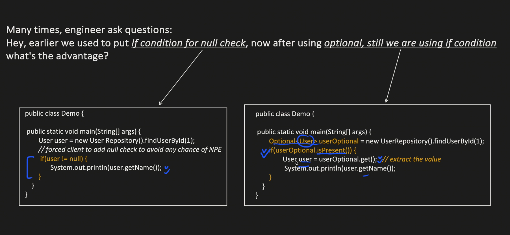
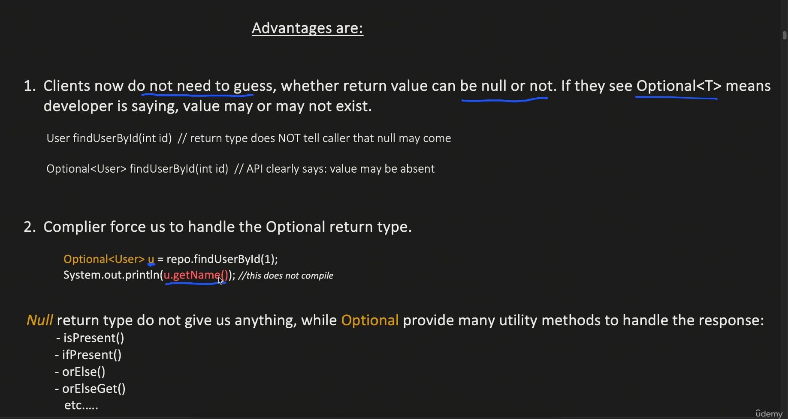

# Optional

# Why optional

The short answer is: To defeat the `NullPointerException` (NPE), which is famously known in computer science as the "Billion Dollar Mistake."

Introduced in Java 8, `Optional<T>` is a container object that may or may not contain a non-null value. You use it primarily as a method return type to explicitly communicate to whoever is calling the method: *"Hey, I might not find what you're looking for, so you better be prepared to handle an empty result."*

Here is why `Optional` is highly favored in modern Java and Spring Boot, especially in interviews.

### 1. It Reveals Intent (Self-Documenting Code)
Before Java 8, if you called a method like `findUserByEmail("test@test.com")`, it returned a `User` object. But what if the user wasn't in the database? It returned `null`.

* **The problem:** The method signature didn't tell you it could return `null`. You had to guess, read the documentation, or learn the hard way when your app crashed.
* When you change the return type to `Optional<User>`, the compiler and the method signature explicitly force the developer to acknowledge that the result might be absent.

### 2. It Forces Safe Unwrapping
When you get an `Optional`, you can't just call `.getName()` on it directly. You have to "unwrap" it first, which forces you to write code that handles the empty scenario.

**The Old Way (Dangerous):**
```java
User user = userRepository.findByEmail("bob@gmail.com");
// If bob doesn't exist, the next line throws a NullPointerException and crashes your app.
System.out.println(user.getName());
```
The Optional Way (Safe):

```java
Optional<User> userOptional = userRepository.findByEmail("bob@gmail.com");
// You are forced to deal with it elegantly:
userOptional.ifPresent(user -> System.out.println(user.getName()));
```
### 3. It Enables Clean, Functional Pipelines

Optional provides functional methods that let you chain operations together without writing ugly, deeply nested if (user != null) blocks.

This is where Optional really shines in Spring Boot Service layers:


```java
// Spring Data JPA returns an Optional by default for findById()
public User getUser(Long id) {
    return userRepository.findById(id)
        .orElseThrow(() -> new ResourceNotFoundException("User not found with ID: " + id));
}
```

In one line of code, you tried to fetch a user, and if they weren't there, you threw a custom exception that your Global Exception Handler can catch and turn into a clean 404 Not Found JSON response.

### 4. Common Methods You Must Know
If an interviewer asks you about `Optional`, they expect you to know these methods:

* **`.isPresent()`**: Returns `true` if a value exists (though using this with `if` statements is often considered an anti-pattern because it's just the old `!= null` check in disguise).
* **`.ifPresent(Consumer)`**: Executes the block of code only if the value is there.
* **`.orElse(T other)`**: Returns the value if present, otherwise returns a default value you provide.
* **`.orElseThrow(Supplier)`**: Returns the value if present, otherwise throws an exception.

---

### ⚠️ The Interview Trap: How NOT to use Optional
Interviewers love to check if you actually understand the tool or if you just use it blindly. 

**Rule of thumb:** `Optional` should almost exclusively be used as a **return type**.

* **Do not** use `Optional` as a parameter to a method (e.g., `public void printName(Optional<String> name)`). It makes calling the method clunky.
* **Do not** use `Optional` for fields inside a Java class or DTO. It is not `Serializable`, so it can cause issues.


# * **Do not** use `Optional` for fields inside a Java class or DTO. It is not `Serializable`, so it can cause issues.Why?

This is one of the most common "gotcha" questions in Java interviews. To understand why putting `Optional` as a class field is a bad idea, we need to break down the concept of "Serialization" and look at the original intent of the Java architects.

Here is exactly why it causes issues and how you should handle it instead.

### 1. What does "Serializable" mean?
In Java, `Serializable` is a marker interface. When a class implements it, you are telling the Java Virtual Machine (JVM): *"It is safe to convert this object into a stream of bytes."* Why would you want to convert an object into bytes?

* **Caching:** Saving an object to a cache like Redis.
* **Network Transfer:** Sending an object from one microservice to another.
* **File Storage:** Saving the state of an object to a physical file.

### 2. The Core Problem: `Optional` is not Serializable
The creators of Java (specifically Brian Goetz, Java's Language Architect) made a deliberate design choice: they **did not** make `java.util.Optional` implement the `Serializable` interface.

If you create a class like this:

```java
public class UserDTO implements Serializable {
    private String username;
    private Optional<String> middleName; // Anti-pattern!
}
```

And then your Spring Boot app tries to cache this `UserDTO` in Redis or pass it across a network, the JVM will immediately crash and throw a `NotSerializableException`. The entire process fails just because that one field is an `Optional`.

### 3. The Jackson (JSON) Complication
DTOs (Data Transfer Objects) are specifically designed to be converted into JSON by Jackson (which we talked about earlier).
* By default, Jackson doesn't know how to handle an `Optional` field. If you try to serialize an `Optional` into JSON, Jackson will treat it like a normal Java object and try to serialize its internal properties. 
* You end up with weird, nested JSON like `{"middleName": {"present": true}}` instead of just `{"middleName": "Paul"}`.

**(Note: You can force Jackson to understand `Optional` by registering the `Jdk8Module`, but adding extra configuration just to support an anti-pattern is bad practice).**

### 4. The Architect's Intent
The Java designers created `Optional` with one very strict purpose: **To be a method return type.** It was designed to act as a temporary wrapper to prevent `NullPointerException`s right at the moment a method returns a value. 

It was **never** meant to be a permanent data structure stored inside a class's memory space. Using it as a field wastes memory because you are wrapping a simple reference (like a String) inside a whole separate wrapper object.

---

### The Correct Way to Handle This
Keep your class fields simple and "raw". If a field can be null, just let it be null.

**Bad Practice:**


```java
public class User {
    private Optional<String> nickname; // Don't do this
}
```
Good Practice:

```java
public class User {
    private String nickname; // Keep the field normal

    // If you REALLY want to protect the caller of this method, 
    // wrap the field in an Optional at the getter level.
    public Optional<String> getNickname() {
        return Optional.ofNullable(this.nickname);
    }
}
```

In the "Good Practice" example, the data is stored normally (meaning it can be serialized and cached without errors), but you still give the safety of Optional to anyone who calls getNickname().

Here is a complete cheat sheet of the most important `Optional` methods, categorized by what they do.

But see now too we using if condition 



The advantage is we are telling that it can be null !!They need not guess whether it can be null or not!!





```java
package com.mohit;

import java.util.Optional;

public class Main {
   
    static class User {
        private String name;
        private String email;

        public User(String name, String email) {
            this.name = name;
            this.email = email;
        }

        public String getName() {
            return name;
        }

        // INTERVIEW TRICK: A getter that returns an Optional
        // This is exactly when you are forced to use flatMap()
        public Optional<String> getEmail() {
            return Optional.ofNullable(email);
        }
    }

    // 2. Simulating a Database Repository
    static class UserRepository {
        public Optional<User> findById(int id) {
            if (id == 1) {
                return Optional.of(new User("Alice", "alice@example.com"));
            } else if (id == 2) {
                return Optional.of(new User("Bob", null)); // Bob exists, but has no email
            }
            return Optional.empty(); // User not found (Database miss)
        }
    }
    public static void main(String[] args) {
        UserRepository repository = new UserRepository();

        System.out.println("--- 1. Basic Extraction ---");

        // Scenario A: User exists
        User user1 = repository.findById(1).orElseThrow(() -> new RuntimeException("User not found"));
        System.out.println("Found User 1: " + user1.getName());

        // Scenario B: User is missing, provide a fallback
        User defaultUser = repository.findById(99).orElse(new User("Guest Worker", null));
        System.out.println("Missing User 99 defaults to: " + defaultUser.getName());


        System.out.println("\n--- 2. map() vs flatMap() ---");

        Optional<User> optAlice = repository.findById(1);

        // map() is used when the method returns a raw value (String)
        // optAlice.map(User::getName) returns Optional<String>
        String alicesName = optAlice.map(User::getName).orElse("Unknown");
        System.out.println("Alice's Name via map(): " + alicesName);

        // flatMap() is used when the method ALREADY returns an Optional<String>.
        // If you used map(User::getEmail), you would get Optional<Optional<String>> (a nested nightmare).
        // flatMap "flattens" it into a single Optional<String>.
        String alicesEmail = optAlice.flatMap(User::getEmail).orElse("No Email Provided");
        System.out.println("Alice's Email via flatMap(): " + alicesEmail);


        System.out.println("\n--- 3. Handling Null Data Gracefully ---");

        // Bob exists, but his email is null in the database.
        // Instead of crashing with a NullPointerException, Optional protects us.
        String bobsEmail = repository.findById(2)
                .flatMap(User::getEmail)
                .orElse("default@company.com");

        System.out.println("Bob's Email (Fallback triggered): " + bobsEmail);


        System.out.println("\n--- 4. The Clean Pipeline (No if-statements) ---");

        // This is how a Senior writes business logic.
        // "Find user 1, get their email, check if it contains 'example', and if so, print it."
        repository.findById(1)
                .flatMap(User::getEmail)
                .filter(email -> email.contains("@example.com"))
                .ifPresent(email -> System.out.println("Valid Email Verified: " + email));
    
    }
}


/*
Output:
--- 1. Basic Extraction ---
Found User 1: Alice
Missing User 99 defaults to: Guest Worker

--- 2. map() vs flatMap() ---
Alice's Name via map(): Alice
Alice's Email via flatMap(): alice@example.com

--- 3. Handling Null Data Gracefully ---
Bob's Email (Fallback triggered): default@company.com

--- 4. The Clean Pipeline (No if-statements) ---
Valid Email Verified: alice@example.com

 */
```
What to look for when you run it:

Notice how there is not a single if (user != null) or if (email != null) anywhere in the main method. The Optional pipeline handles all the null checks invisibly, making the code completely crash-proof.

see ` optAlice.map(User::getName).orElse("Unknown");`
Here is the straightforward breakdown of exactly what `User::getName` is and how `map()` uses it behind the scenes.

### 1. What is `User::getName`?
`User::getName` is called a **Method Reference**. It is essentially just a shortcut (syntactic sugar) for a **Lambda Expression**.

When you write `User::getName`, you are not actually calling the method right then and there. Instead, you are passing the *instructions* on how to call the method.

These two lines of code do the exact same thing:

```java
// The Lambda way:
optAlice.map(user -> user.getName());

// The Method Reference way (cleaner):
optAlice.map(User::getName);
```
Both of them mean: *"Here is a function. If you give this function a `User` object, it will call `.getName()` on it and give you back a `String`."*

### 2. How `map()` executes it step-by-step
The `map()` function is smart. It controls *when* and *if* that method actually gets called.

Here is the exact timeline of what happens when Java runs `optAlice.map(User::getName).orElse("Unknown")`:

* **Check the Box:** `map()` looks inside `optAlice` (which is an `Optional<User>`).
* **If the box is EMPTY:** `map()` ignores your `User::getName` instructions completely. It just creates a new empty box (`Optional.empty()`) and passes it down the chain. This prevents a `NullPointerException`!
* **If the box has a USER:** * `map()` takes the `User` out of the box.
    * It finally executes your instructions: `user.getName()`.
    * Let's say the name is `"Alice"`.
    * `map()` takes `"Alice"` and packages it into a brand new box: `Optional<String>`.
* **The Finish Line:** The pipeline reaches `.orElse("Unknown")`. It looks at the `Optional<String>`. If it contains `"Alice"`, it returns `"Alice"`. If it received an empty box from step 2, it returns `"Unknown"`.

### 3. The "Old Way" vs The "New Way"
To really appreciate what this one line of code is doing, look at how much code you would have to write to achieve the exact same safe logic without `Optional` and `map`:

**The Old Java Way (Pre-Java 8):**
```java
String alicesName;
User user = repository.findById(1);

if (user != null) {
    if (user.getName() != null) {
        alicesName = user.getName();
    } else {
        alicesName = "Unknown";
    }
} else {
    alicesName = "Unknown";
}
```
New way

```java
String alicesName = optAlice.map(User::getName).orElse("Unknown");
```
By passing `User::getName` into map(), you are handing over the responsibility of doing all those messy null checks to the Optional class.
, the map() function is playing the role of a safety inspector. It acts as a shield between your object and the method you want to run on it.

### Safety Net 1: Is the Box Empty?
Before `map()` even looks at the function you passed it (`User::getName`), it checks the `Optional` it was called on (`optAlice`).

* **If `optAlice` is `Optional.empty()`** (i.e., the User was not found in the DB): `map()` says, *"There is no User here. I cannot run `.getName()` on nothing."* It immediately aborts and returns a new `Optional.empty()`. It never even attempts to execute your function.

### Safety Net 2: Did the Function Return Null?
Let's say `optAlice` actually contains a `User` object, so `map()` pulls the `User` out and executes your function: `user.getName()`. 

What happens if the User exists in the database, but their name column is null?

* **If `user.getName()` returns `null`:** `map()` is smart enough to handle this. It takes that `null` value and packages it into an `Optional.empty()`.
* **If `user.getName()` returns `"Alice"`:** `map()` packages `"Alice"` into an `Optional<String>`.

### 1. Creating an Optional
These are static methods used to wrap your data inside an `Optional` object.

| Method | Return Type | Purpose & Example |
| :--- | :--- | :--- |
| `Optional.empty()` | `Optional<T>` | Creates an empty `Optional`.<br>`Optional<String> emptyOpt = Optional.empty();` |
| `Optional.of(T value)` | `Optional<T>` | Creates an `Optional` with a non-null value. Throws `NPE` if value is null.<br>`Optional<String> opt = Optional.of("Hello");` |
| `Optional.ofNullable(T value)` | `Optional<T>` | Creates an `Optional`. If the value is null, it safely returns an empty `Optional`.<br>`Optional<String> opt = Optional.ofNullable(user.getName());` |

### 2. Checking the Value
Used to verify if the container actually holds data.

| Method | Return Type | Purpose & Example |
| :--- | :--- | :--- |
| `isPresent()` | `boolean` | Returns `true` if a value exists, otherwise `false`.<br>`if (opt.isPresent()) { ... }` |
| `isEmpty()` *(Java 11+)* | `boolean` | Returns `true` if the `Optional` is empty.<br>`if (opt.isEmpty()) { ... }` |

### 3. Extracting the Value (Safely)
These methods get the data out of the `Optional`, providing fallbacks if it is empty.

| Method | Return Type | Purpose & Example |
| :--- | :--- | :--- |
| `get()` | `T` | Returns the value. Throws `NoSuchElementException` if empty. *(Avoid using this directly)*.<br>`String name = opt.get();` |
| `orElse(T other)` | `T` | Returns the value if present, otherwise returns the exact default value you provide.<br>`String name = opt.orElse("Unknown User");` |
| `orElseGet(Supplier)` | `T` | Returns the value, or executes a function to generate a default value (better for performance).<br>`String name = opt.orElseGet(() -> fetchDefaultName());` |
| `orElseThrow(Supplier)` | `T` | Returns the value, or throws an exception you specify.<br>`User u = opt.orElseThrow(() -> new RuntimeException("Not Found"));` |

### 4. Executing Code based on Presence
Used to run logic only when the data is actually there, avoiding `if` statements.

| Method | Return Type | Purpose & Example |
| :--- | :--- | :--- |
| `ifPresent(Consumer)` | `void` | Executes a block of code only if the value exists.<br>`opt.ifPresent(name -> System.out.println(name));` |
| `ifPresentOrElse(Consumer, Runnable)` *(Java 9+)* | `void` | Executes the first block if present, or the second block if empty.<br>`opt.ifPresentOrElse(n -> print(n), () -> print("Empty"));` |

### 5. Transforming the Value
Used to modify the data inside the `Optional` without breaking the chain.

| Method | Return Type | Purpose & Example |
| :--- | :--- | :--- |
| `map(Function)` | `Optional<U>` | Transforms the value and wraps it in a new `Optional`.<br>`Optional<Integer> length = opt.map(String::length);` |
| `flatMap(Function)` | `Optional<U>` | Like `map`, but used when the transformation function already returns an `Optional`.<br>`Optional<String> upper = opt.flatMap(this::getOptionalUpper);` |
| `filter(Predicate)` | `Optional<T>` | Keeps the value if it matches a condition, otherwise returns an empty `Optional`.<br>`Optional<String> shortName = opt.filter(n -> n.length() < 5);` |

A classic interview question is asking developers to explain the exact difference between `map()` and `flatMap()` since they look almost identical.


