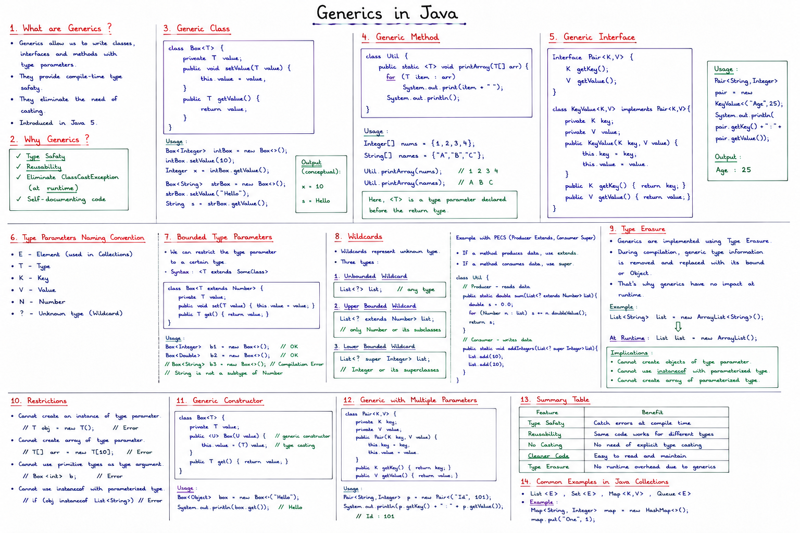
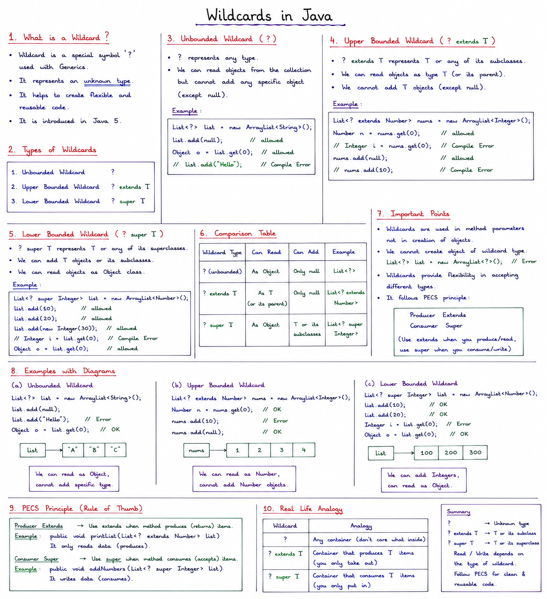
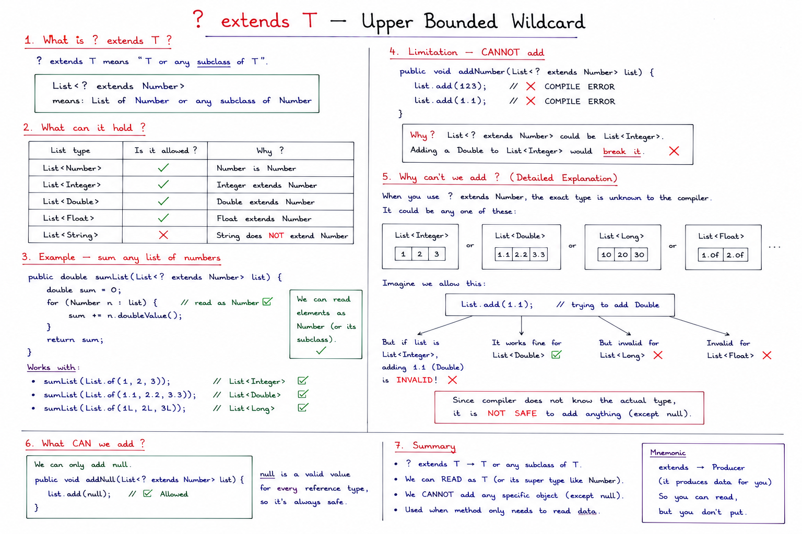
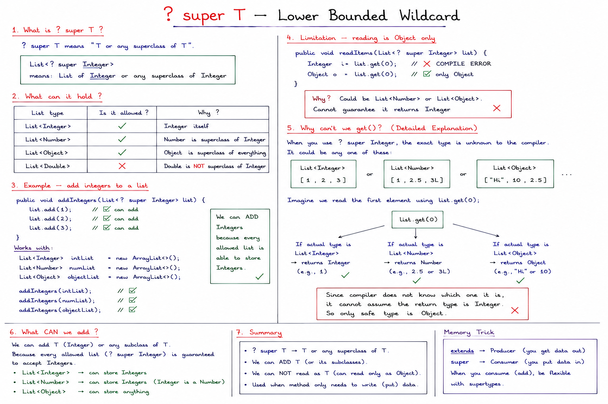
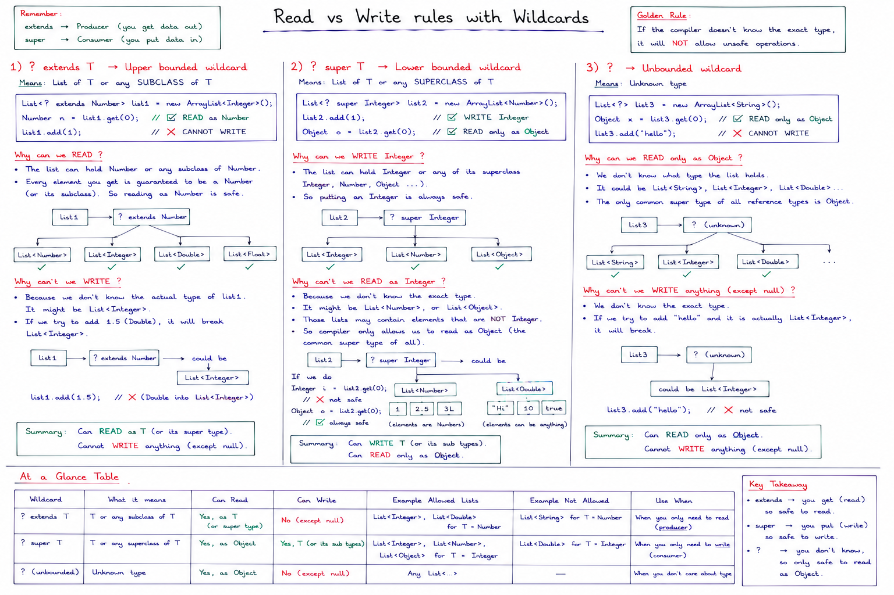

# Generics



---

## What Problem Do Generics Solve?

### Before Generics (Java 1.4 and earlier)

```java
// ArrayList stored everything as Object
List list = new ArrayList();
list.add("Hello");
list.add(123);
list.add(new User());

// Getting items back — need casting
String s = (String) list.get(0);  // manual cast ❌
Integer i = (Integer) list.get(1); // manual cast ❌

// Runtime crash — no compile time safety
String s = (String) list.get(1);  // ClassCastException at RUNTIME ❌
// 123 cannot be cast to String
// You only find out when app is running ❌
```

### After Generics (Java 5+)

```java
// Tell the list what type it holds
List<String> list = new ArrayList<String>();
list.add("Hello");   // ✅
list.add(123);       // ❌ COMPILE ERROR — caught immediately
list.add(new User()); // ❌ COMPILE ERROR — caught immediately

// Getting items back — no casting needed
String s = list.get(0);  // ✅ no cast needed
```

**Generics move errors from RUNTIME to COMPILE TIME.**


---

## Type Parameter Naming Conventions

```java
T   →  Type             (most common, general purpose)
E   →  Element          (used in collections like List<E>)
K   →  Key              (used in maps like Map<K, V>)
V   →  Value            (used in maps like Map<K, V>)
N   →  Number           (used for number types)
R   →  Return type      (used in functions)
S,U,V → 2nd, 3rd, 4th types when multiple needed

// Examples from Java itself:
List<E>           // List stores Elements
Map<K, V>         // Map has Keys and Values
Optional<T>       // Optional wraps a Type
Comparable<T>     // Comparable compares Types
```

---

## Generic Method

```java
// Generic method — T declared on method level
public class Utils {

    // WITHOUT generics — need separate method per type
    public Integer getFirst(List<Integer> list) {
        return list.get(0);
    }
    public String getFirst(List<String> list) {
        return list.get(0);
    }
    // Repeated for every type ❌


    // WITH generics — one method for all types
    public <T> T getFirst(List<T> list) {
        //  ↑ T declared here    ↑ T used here
        return list.get(0);
    }
}

// Usage
Utils utils = new Utils();
Integer first = utils.getFirst(List.of(1, 2, 3));      // T = Integer
String  first = utils.getFirst(List.of("a", "b"));     // T = String
User    first = utils.getFirst(List.of(new User()));    // T = User
```

---

## Multiple Type Parameters

```java
// Two type parameters
public class Pair<K, V> {
    private K key;
    private V value;

    public Pair(K key, V value) {
        this.key = key;
        this.value = value;
    }

    public K getKey()   { return key; }
    public V getValue() { return value; }
}

// Usage
Pair<String, Integer> age      = new Pair<>("Mohit", 25);
Pair<String, String>  country  = new Pair<>("India", "Delhi");
Pair<Integer, Boolean> status  = new Pair<>(1, true);

String  name  = age.getKey();     // "Mohit"
Integer years = age.getValue();   // 25
```

---

## Generic Interface

```java
// Generic interface
public interface Repository<T, ID> {
    T findById(ID id);
    void save(T entity);
    List<T> findAll();
    void delete(ID id);
}

// Implementing for User with Long ID
public class UserRepository implements Repository<User, Long> {
    public User findById(Long id) { ... }
    public void save(User user) { ... }
    public List<User> findAll() { ... }
    public void delete(Long id) { ... }
}

// Implementing for Book with Long ID
public class BookRepository implements Repository<Book, Long> {
    public Book findById(Long id) { ... }
    public void save(Book book) { ... }
    public List<Book> findAll() { ... }
    public void delete(Long id) { ... }
}

// Spring's JpaRepository does exactly this!
public interface JpaRepository<T, ID> { ... }
// GenreRepository extends JpaRepository<Genre, Long>
```

---

## Bounded Type Parameters

### Upper Bound — `extends`

```java
// T must be Number or subclass of Number
public <T extends Number> double sum(List<T> list) {
    double total = 0;
    for (T item : list) {
        total += item.doubleValue();  // ✅ can call Number methods
    }
    return total;
}

sum(List.of(1, 2, 3));           // T=Integer ✅
sum(List.of(1.1, 2.2, 3.3));    // T=Double  ✅
sum(List.of("a", "b"));         // ❌ COMPILE ERROR — String not a Number
```

### Multiple Bounds

```java
// T must extend both Comparable AND Serializable
public <T extends Comparable<T> & Serializable> T findMax(List<T> list) {
    T max = list.get(0);
    for (T item : list) {
        if (item.compareTo(max) > 0) {
            max = item;
        }
    }
    return max;
}
```

---

## Real World Examples

### Example 1 — Generic Stack

```java
public class Stack<T> {
    private List<T> items = new ArrayList<>();

    public void push(T item) {
        items.add(item);
    }

    public T pop() {
        if (items.isEmpty()) throw new RuntimeException("Stack empty");
        return items.remove(items.size() - 1);
    }

    public T peek() {
        return items.get(items.size() - 1);
    }

    public boolean isEmpty() {
        return items.isEmpty();
    }
}

// Usage
Stack<Integer> intStack = new Stack<>();
intStack.push(1);
intStack.push(2);
intStack.push(3);
Integer top = intStack.pop();  // 3

Stack<String> strStack = new Stack<>();
strStack.push("Hello");
strStack.push("World");
String top = strStack.pop();   // "World"
```

---

### Example 2 — Generic Response Wrapper

```java
// Wrap any response with status
public class ApiResponse<T> {
    private boolean success;
    private String message;
    private T data;             // T = actual response data

    public ApiResponse(boolean success, String message, T data) {
        this.success = success;
        this.message = message;
        this.data = data;
    }
}

// Usage — T changes per use case
ApiResponse<User>       userResponse  = new ApiResponse<>(true, "Found", user);
ApiResponse<List<Book>> booksResponse = new ApiResponse<>(true, "Found", books);
ApiResponse<String>     msgResponse   = new ApiResponse<>(true, "Done", "Deleted");
ApiResponse<Integer>    countResponse = new ApiResponse<>(true, "Count", 42);

// Controller returns different data types
// but same wrapper structure ✅
```

---

### Example 3 — Generic Utility Methods

```java
public class CollectionUtils {

    // Swap two elements in any list
    public static <T> void swap(List<T> list, int i, int j) {
        T temp = list.get(i);
        list.set(i, list.get(j));
        list.set(j, temp);
    }

    // Find max in any comparable list
    public static <T extends Comparable<T>> T findMax(List<T> list) {
        T max = list.get(0);
        for (T item : list) {
            if (item.compareTo(max) > 0) max = item;
        }
        return max;
    }

    // Filter list by condition
    public static <T> List<T> filter(List<T> list, Predicate<T> condition) {
        return list.stream()
            .filter(condition)
            .collect(Collectors.toList());
    }
}

// Usage
List<Integer> nums    = Arrays.asList(3, 1, 4, 1, 5);
Integer max           = CollectionUtils.findMax(nums);    // 5

List<String> names    = Arrays.asList("Mohit", "Rahul", "Priya");
Integer maxName       = CollectionUtils.findMax(names);   // "Rahul" (alphabetically)

List<Integer> evens   = CollectionUtils.filter(nums, n -> n % 2 == 0); // [4]
```

---

## Type Erasure — How Generics work internally

```java
// What YOU write
List<String> list = new ArrayList<String>();
list.add("Hello");
String s = list.get(0);

// What COMPILER converts it to (after type erasure)
List list = new ArrayList();      // T removed
list.add("Hello");
String s = (String) list.get(0);  // cast added back

// Generics only exist at COMPILE TIME
// At RUNTIME — JVM sees no generics
// This is called TYPE ERASURE
```

```java
// Proof of type erasure:
List<String>  strList = new ArrayList<>();
List<Integer> intList = new ArrayList<>();

// At runtime both are just ArrayList
System.out.println(strList.getClass() == intList.getClass()); // true !!
// Both are class java.util.ArrayList at runtime
```

---

## What you CANNOT do because of Type Erasure

```java
// Cannot create generic array
T[] array = new T[10];          // ❌ COMPILE ERROR

// Cannot use instanceof with generics
if (obj instanceof List<String>) // ❌ COMPILE ERROR

// Cannot create instance of T
T obj = new T();                 // ❌ COMPILE ERROR

// Cannot use primitive types
List<int> list = new ArrayList<>();  // ❌ use List<Integer> instead
```

---

## Generics vs Object — Why not just use Object?

```java
// Using Object — no type safety
List<Object> list = new ArrayList<>();
list.add("Hello");
list.add(123);
list.add(new User());

String s = (String) list.get(0);  // manual cast ❌
String s = (String) list.get(1);  // ClassCastException at runtime ❌


// Using Generics — full type safety
List<String> list = new ArrayList<>();
list.add("Hello");     // ✅
list.add(123);         // ❌ compile error — caught early ✅

String s = list.get(0); // no cast needed ✅
```

---


# Wildcard



---

## What is a Wildcard?

Wildcard = `?` in generics.

It means **"I don't know or care what the exact type is."**

---

## The Problem Without Wildcard

```java
// You have a method that prints any list
public void printList(List<Number> list) {
    for (Number n : list) {
        System.out.println(n);
    }
}

// Calling it
List<Integer> integers = Arrays.asList(1, 2, 3);
List<Double>  doubles  = Arrays.asList(1.1, 2.2, 3.3);

printList(integers);  // ❌ COMPILE ERROR
printList(doubles);   // ❌ COMPILE ERROR
```

**Why error?**
```
Even though Integer extends Number —
List<Integer> is NOT a subtype of List<Number>
This is how Java generics work — they are INVARIANT
```

**Fix with wildcard:**
```java
public void printList(List<?> list) {   // ← ? means any type
    for (Object o : list) {
        System.out.println(o);
    }
}

printList(integers);  // ✅ works
printList(doubles);   // ✅ works
printList(strings);   // ✅ works
```

---

## 3 Types of Wildcards

---

## 1. `?` — Unbounded Wildcard

```java
// Means: List of ANYTHING
List<?> list

// Can hold:
List<Integer>  ✅
List<String>   ✅
List<Genre>    ✅
List<Object>   ✅
```

```java
// Example
public void printAll(List<?> list) {
    for (Object item : list) {
        System.out.println(item);
    }
}

// Works with any list
printAll(List.of(1, 2, 3));           // ✅
printAll(List.of("a", "b", "c"));    // ✅
printAll(List.of(new Genre()));       // ✅
```

**Limitation:**
```java
public void addItem(List<?> list) {
    list.add("hello");  // ❌ COMPILE ERROR
    list.add(123);      // ❌ COMPILE ERROR
    list.add(null);     // ✅ only null allowed
}
// Cannot add anything because we don't know the type
// What if it was List<Integer> and we add "hello"? ❌
```

---

## 2. `? extends T` — Upper Bounded Wildcard

```java
// Means: List of T or any SUBCLASS of T
List<? extends Number>

// Can hold:
List<Number>   ✅  (Number itself)
List<Integer>  ✅  (Integer extends Number)
List<Double>   ✅  (Double extends Number)
List<Float>    ✅  (Float extends Number)
List<String>   ❌  (String does NOT extend Number)
```

```java
// Example — sum any list of numbers
public double sumList(List<? extends Number> list) {
    double sum = 0;
    for (Number n : list) {    // read as Number ✅
        sum += n.doubleValue();
    }
    return sum;
}

// Works with:
sumList(List.of(1, 2, 3));        // List<Integer> ✅
sumList(List.of(1.1, 2.2, 3.3)); // List<Double>  ✅
sumList(List.of(1L, 2L, 3L));    // List<Long>    ✅
```

**Limitation — CANNOT add:**
```java
public void addNumber(List<? extends Number> list) {
    list.add(123);      // ❌ COMPILE ERROR
    list.add(1.1);      // ❌ COMPILE ERROR
}
// Why? List<? extends Number> could be List<Integer>

```

**Used in your project:**
```java
// JwtProvider.java
private String populateAuthorities(
    Collection<? extends GrantedAuthority> authorities) {
    //           ↑ any collection of GrantedAuthority or its subclasses
    Set<String> auths = new HashSet<>();
    for (GrantedAuthority authority : authorities) {
        auths.add(authority.getAuthority());
    }
    return String.join(",", auths);
}

// Works with:
// Collection<GrantedAuthority>        ✅
// Collection<SimpleGrantedAuthority>  ✅ (extends GrantedAuthority)
```

---

## 3. `? super T` — Lower Bounded Wildcard

```java
// Means: List of T or any SUPERCLASS of T
List<? super Integer>

// Can hold:
List<Integer>  ✅  (Integer itself)
List<Number>   ✅  (Number is superclass of Integer)
List<Object>   ✅  (Object is superclass of everything)
List<Double>   ❌  (Double is not superclass of Integer)
```

```java
// Example — add integers to a list
public void addIntegers(List<? super Integer> list) {
    list.add(1);    // ✅ can add
    list.add(2);    // ✅ can add
    list.add(3);    // ✅ can add
}

// Works with:
List<Integer> intList    = new ArrayList<>();
List<Number>  numList    = new ArrayList<>();
List<Object>  objectList = new ArrayList<>();

addIntegers(intList);    // ✅
addIntegers(numList);    // ✅
addIntegers(objectList); // ✅
```

**Limitation — reading is Object only:**
```java
public void readItems(List<? super Integer> list) {
    Integer i = list.get(0);  // ❌ COMPILE ERROR
    Object o  = list.get(0);  // ✅ only Object
}
// Why? Could be List<Number> or List<Object>
// Cannot guarantee it returns Integer ❌
```

---



