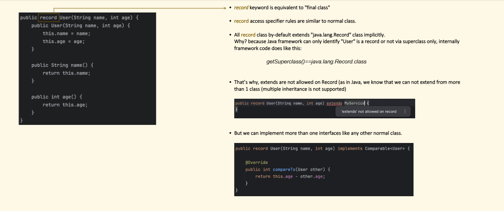
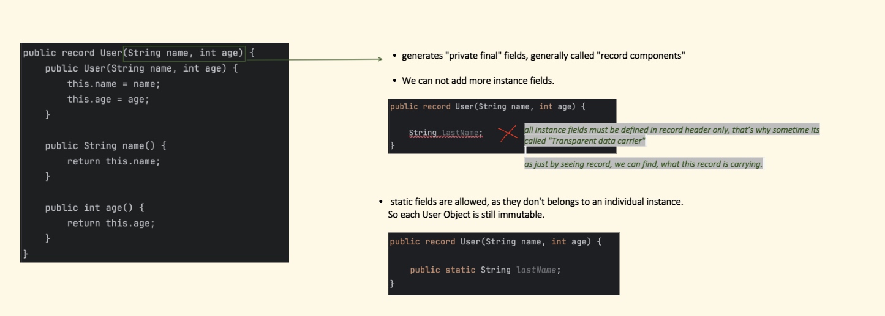

## Java Record Classes

A **record** is a special class in Java (introduced in Java 16) designed to be a **transparent, immutable data carrier**. It eliminates boilerplate code for simple data-holding classes.no setter method here!!

### The Problem Records Solve

Traditional data class with all the boilerplate:

```java
public class Person {
    private final String name;
    private final int age;

    public Person(String name, int age) {
        this.name = name;
        this.age = age;
    }

    public String getName() { return name; }
    public int getAge() { return age; }

    @Override
    public boolean equals(Object o) { ... }

    @Override
    public int hashCode() { ... }

    @Override
    public String toString() { ... }
}
```

### The Record Equivalent

```java
public record Person(String name, int age) {}
```

That single line auto-generates everything above!

Syntax: `record YourRecordName(Type field1, Type field2, ...) { } `

---



### What Java Generates Automatically

| Generated | Description |
|---|---|
| `private final` fields | One for each component |
| Canonical constructor | Assigns all components |
| Accessor methods | `name()` and `age()` (not `getName()`) |
| `equals()` | Compares all components |
| `hashCode()` | Based on all components |
| `toString()` | e.g. `Person[name=Alice, age=30]` |

---

### Key Characteristics

**1. Immutable by default**
```java
Person p = new Person("Alice", 30);
// p.name = "Bob"; ❌ Cannot reassign — fields are final
```

**2. Accessor methods (not getters)**
```java
Person p = new Person("Alice", 30);
System.out.println(p.name()); // "Alice"  ← not getName()
System.out.println(p.age());  // 30
```

**3. Compact constructor (for validation)**
```java
public record Person(String name, int age) {
    Person {  // No parameter list needed
        if (age < 0) throw new IllegalArgumentException("Age can't be negative");
        name = name.trim(); // Can modify before assignment
    }
}
```

**4. Can add custom methods**
```java
public record Person(String name, int age) {
    public boolean isAdult() {
        return age >= 18;
    }
}
```

**5. Can implement interfaces**
```java
public record Person(String name, int age) implements Comparable<Person> {
    @Override
    public int compareTo(Person other) {
        return Integer.compare(this.age, other.age);
    }
}
```

---

### What Records **Cannot** Do

- ❌ Extend another class (implicitly extends `java.lang.Record`)
- ❌ Be subclassed
- ❌ Have instance fields outside the record header
- ❌ Be `abstract`

---



### Common Use Cases

```java
// API responses / DTOs
record ApiResponse(int status, String message, Object data) {}

// Coordinates / value objects
record Point(double x, double y) {}

// Map keys (great because equals/hashCode are auto-generated)
record CacheKey(String userId, String resourceId) {}

// Pattern matching (Java 21+)
if (obj instanceof Person(String name, int age)) {
    System.out.println(name + " is " + age);
}
```

---

### Records vs Lombok `@Data`

| Feature | Record | Lombok `@Data` |
|---|---|---|
| Built-in | ✅ Yes | ❌ Needs dependency |
| Immutable | ✅ Always | ❌ Mutable by default |
| Inheritance | ❌ No | ✅ Yes |
| Flexibility | Less | More |

Records are the **idiomatic Java choice** for simple, immutable data carriers — clean, concise, and zero dependencies.


## Lombok vs record

Great question! This is a very common debate. Let me break it down clearly.

---

## Record vs Lombok — Why Do We Need Records?

---

### First, What Lombok Does

Lombok is a **third-party library** that generates boilerplate via annotations at compile time:

```java
@Data  // generates getters, setters, equals, hashCode, toString
@AllArgsConstructor
@NoArgsConstructor
public class Person {
    private String name;
    private int age;
}
```

Looks clean — but there are real problems with Lombok.

---

### Problems with Lombok

#### 1. External Dependency
```xml
<!-- You MUST add this to every project -->
<dependency>
    <groupId>org.projectlombok</groupId>
    <artifactId>lombok</artifactId>
    <version>1.18.30</version>
</dependency>
```
> Records need **zero dependencies** — it's pure Java.

---

#### 2. IDE & Tool Fragility

```
❌ Lombok breaks with:
   - New Java versions (upgrade Java → Lombok may stop working)
   - Some IDEs without plugin installed
   - Code coverage tools (JaCoCo issues)
   - Certain annotation processors conflicting
   - GraalVM native image compilation

✅ Records just work everywhere — no plugins, no setup
```

---

#### 3. Lombok is Mutable by Default

```java
// Lombok @Data — MUTABLE (has setters!)
@Data
public class Person {
    private String name;
    private int age;
}

Person p = new Person("Alice", 30);
p.setName("Hacker");  // ✅ Anyone can mutate it — dangerous!
p.setAge(-999);       // ✅ This works too!
```

```java
// Record — IMMUTABLE by design
public record Person(String name, int age) {}

Person p = new Person("Alice", 30);
p.name = "Hacker";  // ❌ Compile error — fields are final
```

> Immutability prevents bugs in **multithreaded** apps and makes objects safer to share.

---

#### 4. Lombok Hides Code — Records are Transparent

```java
// What does @Data actually generate? You have to guess or decompile.
@Data
public class Person {
    private String name;
    private int age;
}
// Generated: getters? setters? which constructor? equals how?
// You can't see it without decompiling bytecode
```

```java
// Record — contract is crystal clear from the declaration
public record Person(String name, int age) {}
// Everyone knows EXACTLY what's generated — no surprises
```

---

#### 5. No JVM-Level Understanding of Lombok

```java
// JVM has NO idea what Lombok is
// It just sees the generated bytecode after compilation

// But JVM NATIVELY understands Records:
// - Pattern matching works seamlessly
// - Serialization framework aware
// - Reflection gives richer metadata
```

**Java 21 Pattern Matching — only works natively with Records:**

```java
// Deconstruct a Record directly — clean and powerful
Object obj = new Person("Alice", 30);

switch (obj) {
    case Person(String name, int age) ->           // ✅ Record deconstruction
        System.out.println(name + " is " + age);
    default -> System.out.println("Unknown");
}

// Lombok class cannot do this ❌
```

---

#### 6. Semantics — Intent is Different

```java
// Lombok @Data says:
// "I'm a regular class, just without boilerplate"
@Data
public class Person {
    private String name;
    private int age;
}

// Record says:
// "I am PURELY a data carrier — this IS my entire state"
public record Person(String name, int age) {}
```

> A Record is a **semantic contract** — it tells every developer:
> *"This class exists only to hold data. Nothing more."*

---

### When to Use What

| Scenario | Use |
|---|---|
| Simple immutable data carrier (DTO, API response) | ✅ Record |
| Need mutable fields | ✅ Lombok `@Data` |
| Need inheritance / extend a class | ✅ Lombok |
| Java 21 pattern matching | ✅ Record |
| No external dependencies allowed | ✅ Record |
| Complex entity with many customizations | ✅ Lombok |
| Multithreaded shared data | ✅ Record (immutable) |
| JPA / Hibernate Entity | ✅ Lombok (needs no-arg constructor + setters) |

---

### They Can Even Work Together!

```java
// Use Record for immutable DTOs
public record PersonDTO(String name, int age) {}

// Use Lombok for mutable JPA entities
@Data
@Entity
public class PersonEntity {
    @Id
    private Long id;
    private String name;
    private int age;
}

// Convert between them
PersonDTO dto = new PersonDTO(entity.getName(), entity.getAge());
```

---

### Summary

| | Lombok | Record |
|---|---|---|
| Type | 3rd party library | Built-in Java feature |
| Mutability | Mutable by default | Immutable always |
| Dependencies | Required | None |
| IDE support | Needs plugin | Native |
| Pattern matching | ❌ | ✅ |
| Transparency | Hidden (annotation magic) | Explicit contract |
| JPA Entities | ✅ Perfect | ❌ Not suitable |
| Intent | General purpose | Data carrier only |

> **Bottom line:** Lombok is a powerful tool, but Records are a **first-class Java citizen** designed for a specific, clear purpose. They're not competitors — they solve different problems and work best **together**.


# Marker Interface

## Marker Interfaces in Java

A **marker interface** is an interface with **no methods or fields** — it simply "marks" a class to signal something to the JVM or framework.

```java
public interface Serializable {}  // No methods — just a marker!
```

---

### Why Do They Exist?

They act as a **tag/label** on a class, telling the JVM or some framework:
> *"This class has a special property or capability."*

---

### Built-in Java Marker Interfaces

| Interface | Package | Purpose |
|---|---|---|
| `Serializable` | `java.io` | Object can be serialized to a byte stream |
| `Cloneable` | `java.lang` | Object can be cloned via `clone()` |
| `RandomAccess` | `java.util` | List supports fast random access (e.g. ArrayList) |
| `Remote` | `java.rmi` | Object can be used in Remote Method Invocation |

---

### Example: `Serializable`

```java
import java.io.Serializable;

public class Person implements Serializable {
    private String name;
    private int age;
}
```

```java
// JVM checks: does Person implement Serializable?
ObjectOutputStream out = new ObjectOutputStream(new FileOutputStream("file.dat"));
out.writeObject(new Person("Alice", 30)); // ✅ Works

// Without Serializable:
out.writeObject(new Car()); // ❌ Throws NotSerializableException
```

The `Serializable` interface has **zero methods** — just implementing it unlocks serialization.

---

### Example: `Cloneable`

```java
public class Point implements Cloneable {
    int x, y;

    @Override
    public Object clone() throws CloneNotSupportedException {
        return super.clone(); // ✅ Works only if Cloneable is implemented
    }
}

// Without Cloneable:
// super.clone() throws CloneNotSupportedException ❌
```

---

### Creating Your Own Marker Interface

```java
// Define the marker
public interface Auditable {}

// Mark classes with it
public class BankTransaction implements Auditable {
    double amount;
    String accountId;
}

public class UserLogin implements Auditable {
    String userId;
    LocalDateTime time;
}

// Use it with instanceof check
public class AuditService {
    public void save(Object obj) {
        if (obj instanceof Auditable) {
            System.out.println("Saving audit log for: " + obj.getClass().getSimpleName());
            // log to DB...
        } else {
            throw new RuntimeException("Object is not auditable!");
        }
    }
}
```

---

### How It Works Internally

The check is done at **runtime using `instanceof`** or **reflection**:

```java
// Runtime check
if (obj instanceof Serializable) { ... }

// Reflection check
if (Serializable.class.isAssignableFrom(obj.getClass())) { ... }
```

---

### Marker Interface vs Annotation

Modern Java often uses **annotations** instead of marker interfaces:

| Feature | Marker Interface | Annotation |
|---|---|---|
| Syntax | `implements Marker` | `@Marker` |
| Type safety | ✅ Can use in generics | ❌ Cannot |
| Runtime check | `instanceof` | Reflection |
| Target | Classes only | Class, method, field, etc. |
| Metadata | ❌ None | ✅ Can carry values |

```java
// Marker Interface approach
public interface Auditable {}
public class Transaction implements Auditable {}

// Annotation approach
@Retention(RetentionPolicy.RUNTIME)
public @interface Auditable {}

@Auditable
public class Transaction {}
```

**Use a marker interface when** you want type-safety and can use it in generics:

```java
// Only Auditable objects allowed — compile-time safety!
public <T extends Auditable> void audit(T obj) { ... }

// Annotations can't do this ❌
```

---

### Summary

- A marker interface has **no methods** — it's purely a label
- The JVM or framework checks for it using **`instanceof`** at runtime
- Built-in examples: `Serializable`, `Cloneable`, `RandomAccess`
- Prefer **annotations** for metadata, but use **marker interfaces** when **type safety** matters


## Marker Interface vs Annotation

Let me break this down clearly with a side-by-side comparison.

---

### What Are They?

```java
// Marker Interface — a label via inheritance
public interface Auditable {}
public class Transaction implements Auditable {}

// Annotation — a label via metadata tag
@Retention(RetentionPolicy.RUNTIME)
public @interface Auditable {}

@Auditable
public class Transaction {}
```

Both say *"this class is Auditable"* — but in very different ways.

---

### 1. Type Safety (Biggest Difference)

**Marker Interface ✅ — Compile-time safety via generics**

```java
// Only Auditable objects are allowed — enforced at COMPILE TIME
public <T extends Auditable> void audit(T obj) {
    System.out.println("Auditing: " + obj.getClass().getSimpleName());
}

audit(new Transaction()); // ✅ Compiles
audit(new Person());      // ❌ Compile error — Person is not Auditable
```

**Annotation ❌ — No compile-time safety**

```java
public void audit(Object obj) {
    // Must check at RUNTIME using reflection
    if (obj.getClass().isAnnotationPresent(Auditable.class)) {
        System.out.println("Auditing: " + obj.getClass().getSimpleName());
    }
}

audit(new Transaction()); // ✅ Works
audit(new Person());      // ✅ Also "works" — no compile error, just skips silently
```

---

### 2. Carrying Metadata

**Marker Interface ❌ — Cannot carry any data**

```java
public interface Auditable {}  // Just a label, nothing more
```

**Annotation ✅ — Can carry values**

```java
@Retention(RetentionPolicy.RUNTIME)
public @interface Auditable {
    String level() default "BASIC";   // metadata!
    boolean logToDb() default true;   // metadata!
}

@Auditable(level = "DETAILED", logToDb = false)
public class Transaction {}
```

```java
// Read metadata at runtime
Auditable a = Transaction.class.getAnnotation(Auditable.class);
System.out.println(a.level());    // "DETAILED"
System.out.println(a.logToDb());  // false
```

---

### 3. Where They Can Be Applied

**Marker Interface ❌ — Classes only**

```java
public class Transaction implements Auditable {}  // ✅ Class only
```

**Annotation ✅ — Almost anywhere**

```java
@Auditable                          // on class
public class Transaction {

    @Auditable                      // on field
    private double amount;

    @Auditable                      // on method
    public void process() {}

    public void pay(@Auditable double amount) {}  // on parameter
}
```

---

### 4. Runtime Check Mechanism

**Marker Interface — uses `instanceof`**

```java
Object obj = new Transaction();

if (obj instanceof Auditable) {         // simple & fast
    System.out.println("Is Auditable");
}
```

**Annotation — uses Reflection (slower)**

```java
Object obj = new Transaction();

if (obj.getClass().isAnnotationPresent(Auditable.class)) {  // reflection cost
    System.out.println("Is Auditable");
}
```

> `instanceof` is faster than reflection-based annotation checks.

---

### 5. Inheritance Behavior

**Marker Interface ✅ — Automatically inherited**

```java
public class Transaction implements Auditable {}

public class BankTransaction extends Transaction {}
// BankTransaction is ALSO Auditable — inherited automatically!

Object b = new BankTransaction();
System.out.println(b instanceof Auditable); // true ✅
```

**Annotation ❌ — NOT inherited by default**

```java
@Auditable
public class Transaction {}

public class BankTransaction extends Transaction {}

// BankTransaction does NOT have @Auditable unless you add @Inherited
BankTransaction.class.isAnnotationPresent(Auditable.class); // false ❌
```

To make annotations inherit, you must explicitly add `@Inherited`:

```java
@Inherited                          // now subclasses inherit it
@Retention(RetentionPolicy.RUNTIME)
public @interface Auditable {}
```

---

### 6. Real-World Usage

| Use Case | Best Choice | Why |
|---|---|---|
| Serialization (`Serializable`) | Marker Interface | Type safety, JVM-level integration |
| Cloning (`Cloneable`) | Marker Interface | Type safety |
| Validation (`@NotNull`) | Annotation | Applies to fields/params, carries metadata |
| Dependency Injection (`@Autowired`) | Annotation | Applies to fields/methods |
| ORM mapping (`@Entity`, `@Table`) | Annotation | Carries table name, schema, etc. |
| Restricting generic types | Marker Interface | Only option for compile-time enforcement |

---

### Complete Side-by-Side Summary

| Feature | Marker Interface | Annotation |
|---|---|---|
| Syntax | `implements Marker` | `@Marker` |
| Type safety | ✅ Compile-time (generics) | ❌ Runtime only |
| Carry metadata/values | ❌ No | ✅ Yes |
| Apply to methods/fields | ❌ No | ✅ Yes |
| Runtime check | `instanceof` (fast) | Reflection (slower) |
| Inheritance | ✅ Automatic | ❌ Needs `@Inherited` |
| Modern usage | Less common | Preferred in frameworks |

---

### The Golden Rule

> ✅ Use a **Marker Interface** when you need **compile-time type safety** and generic constraints.

> ✅ Use an **Annotation** when you need **metadata**, need to apply it beyond classes, or are building a **framework** (Spring, Hibernate, JUnit, etc.).