# Notes

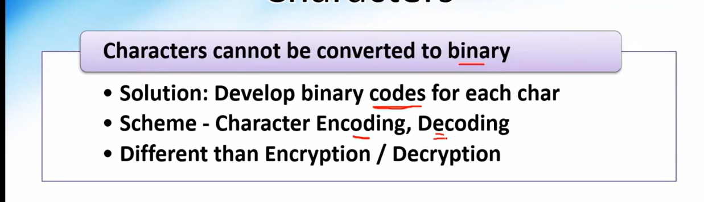

Characters are encode and decoded!!Integers are converted to binary !!

Encode/Decode is different from Encrypted/Decrypted, Encytion/Decryption has privacy concern but Encoding/Decoding has no privacy concern anyone who knows encoding scheme can encode/decode!!

Type of Encoding 

1. ASCII --> every character is encode with 8 bit , used in C , but in manay lanaguages we have more characters than 256.

so a commitee created UNICODE encoding scheme

2. Unicode (UTF-8,UTF-16,UTF-32)--> UTF-8 does not mean 8 bit is used ,it can have 32 but!!

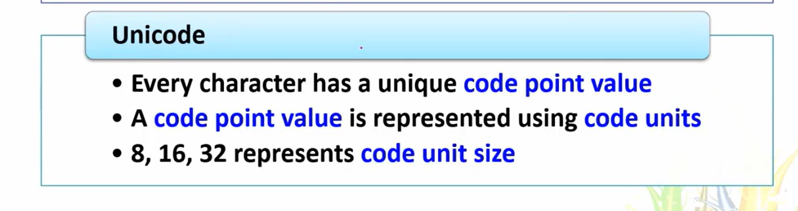

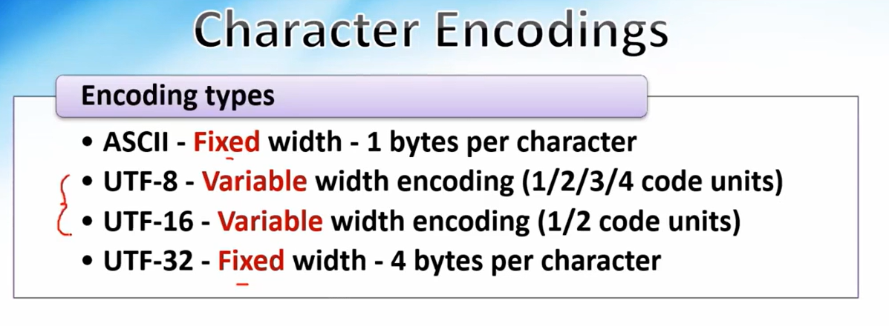

UTF-8 is mostly used as

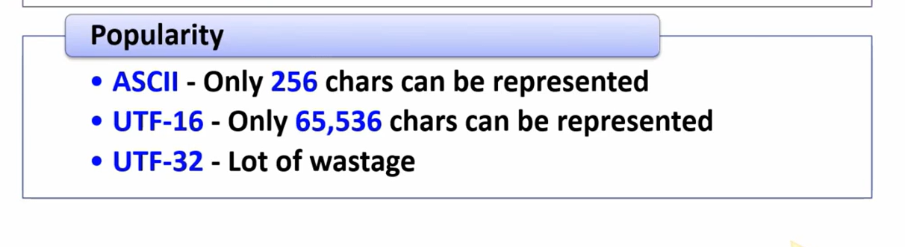

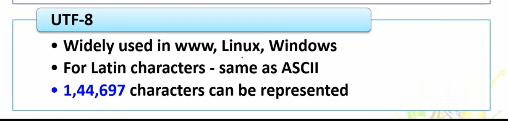

Latin Char means A,B, (English Alphabet)!!

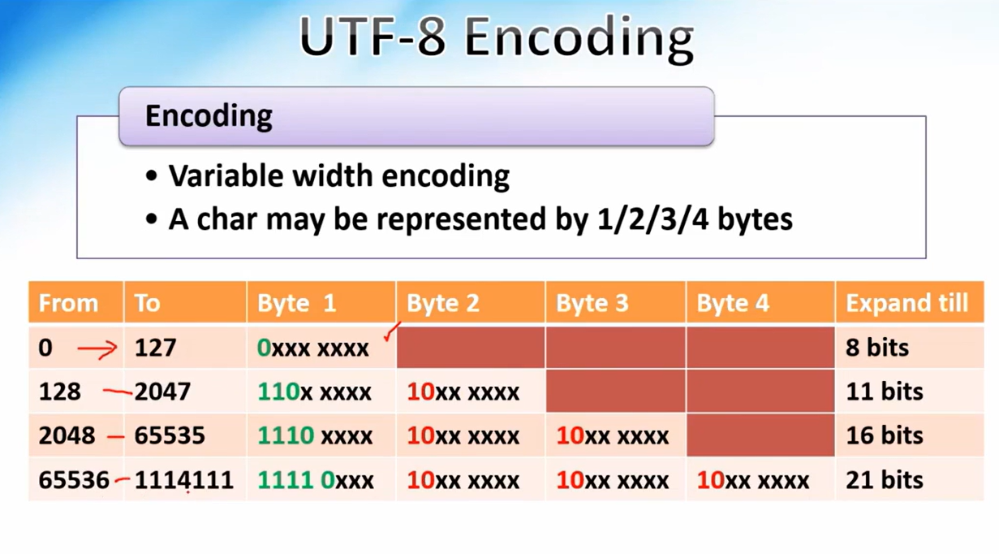

Let us do Unicode some value!!

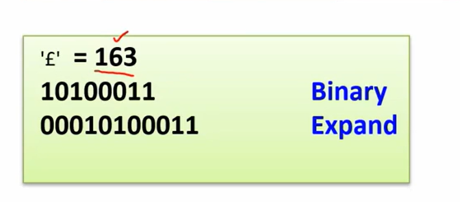

Expanded to 11 bits!! by adding 3 extra zeroes in begining to make 11 bits , now split into 2 parts one of 5 bits and 2nd of 6 bits!!

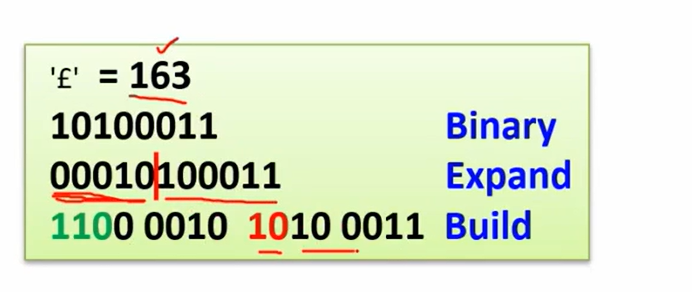

in 1st part we have `110` fixed and 2nd part `10` fixed as suggested by commitee!!

Let us see 3 byte example 

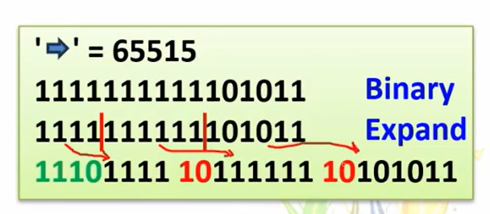

Let us do decoding!!

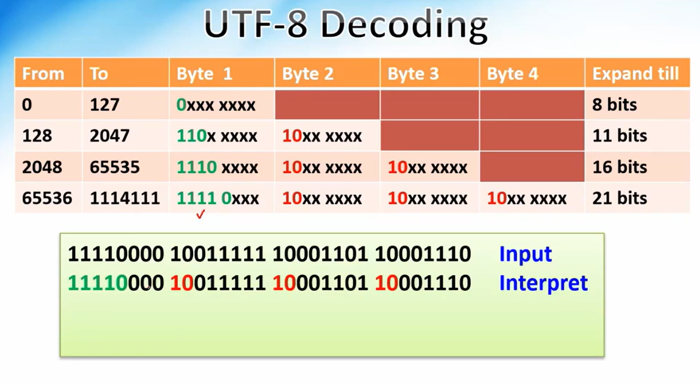

seeing `11110` we get to know it is of last set!!

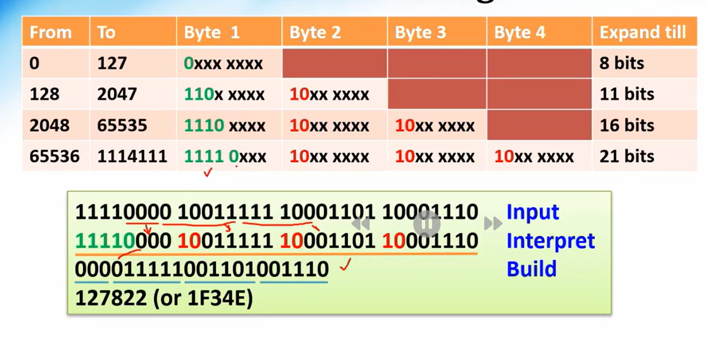

Let us see another example!!

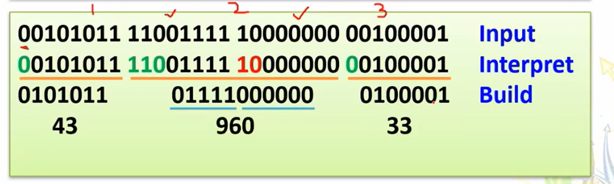

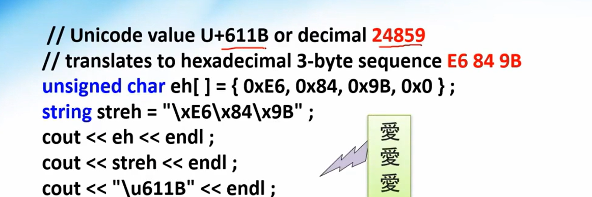

