# Notes
Proof that endl is slower than `\n`!!We compared timings of both!!

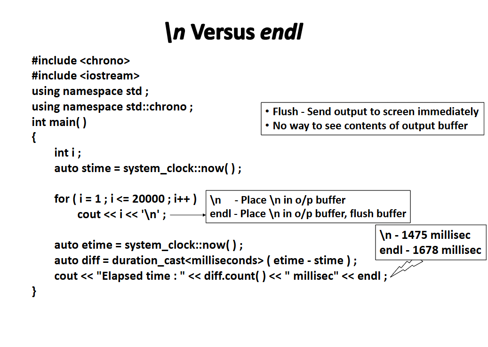

endl uses `\n` internally!! endl get data and flushes data into output buffer immendiately so it is slower!!

Some compiler do not implement endl as flush immediately , they implement endl as flush when output buffer is full then only flush so it is compiler depedent so better use `\n`!!

Above here we used `std:chrono` chrono is namespace indside namespace std, so chrono is nested namespace in std!!

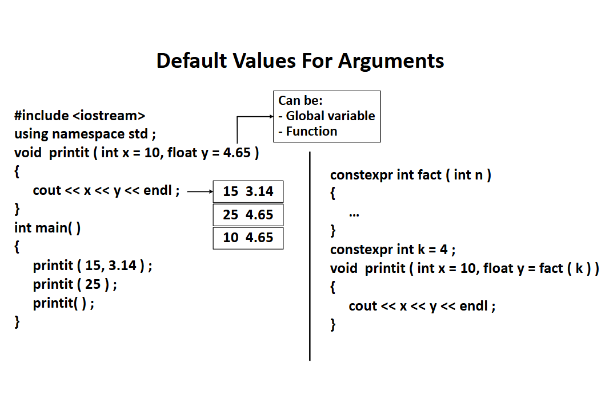

when k is known at compilation state then we can tell fact(k) will run at compilation state!!Here k is constexpr so it is known at compilation state so fact(k) will run at compilation state here!!

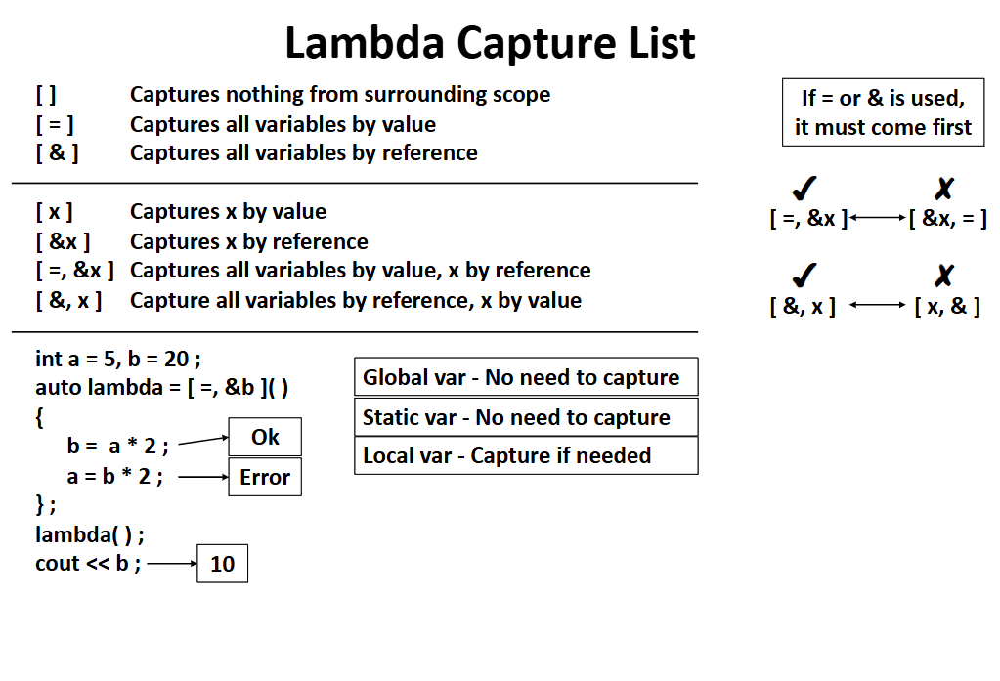

>Note:Must rememebr that `=` and `&` must comes first in capture list!!We first mention generalization and then specific variables!!

## Why have capture list and parameters in lamabda??

Configuration info by Capture List!!

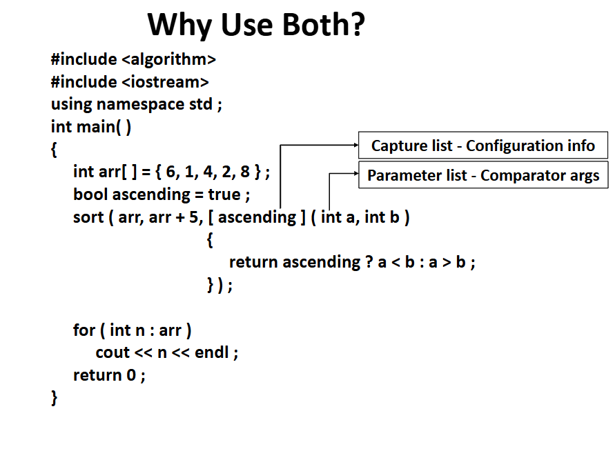

for Cpp remember cpp  we can do a-b<0 and a-b>0 but in java cannot do `a<b`or `a>b`as a Comparator in Java must return an int, not a boolean.

In C++, a comparator (used in std::sort, std::priority_queue, etc.) is a binary predicate that returns:

- true if first element should come before second,

- false otherwise.

Java’s Comparator<T> expects a method that returns:

- negative int → if first argument is "less than" second

- zero → if equal

- positive int → if "greater than"

So in Java we use difference and In cpp we use `>` or `<`

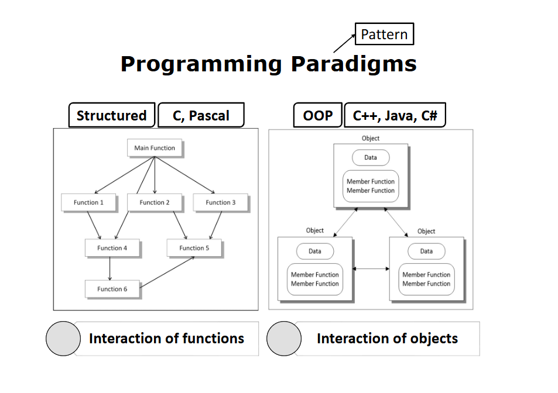

Structred Programmimg whole importance was given to function ,data was given no importance!!

We need data and fucntion to co-exist so we need Object-oiented Programming Lanaguage!!

IN OOPs it is interaction of object with fucntions!!

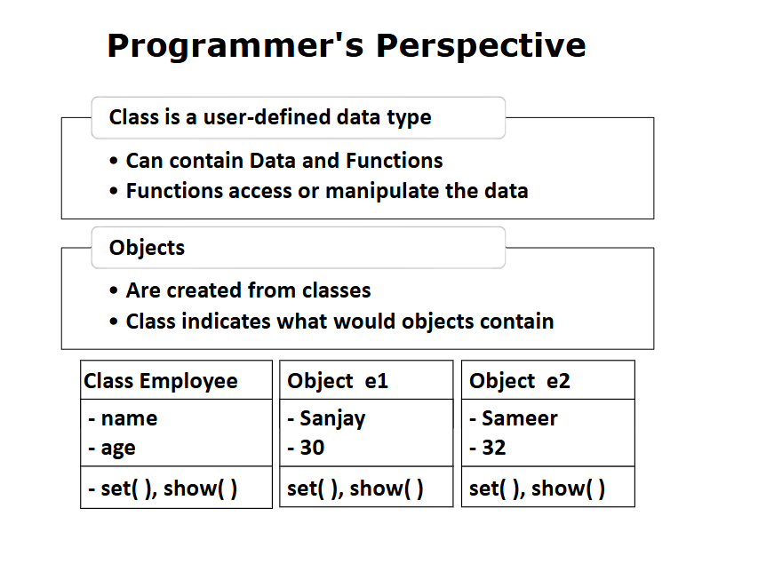

Class does not occupy any space in memeory It is object which takes up memeory!!

string is class already written for us!!

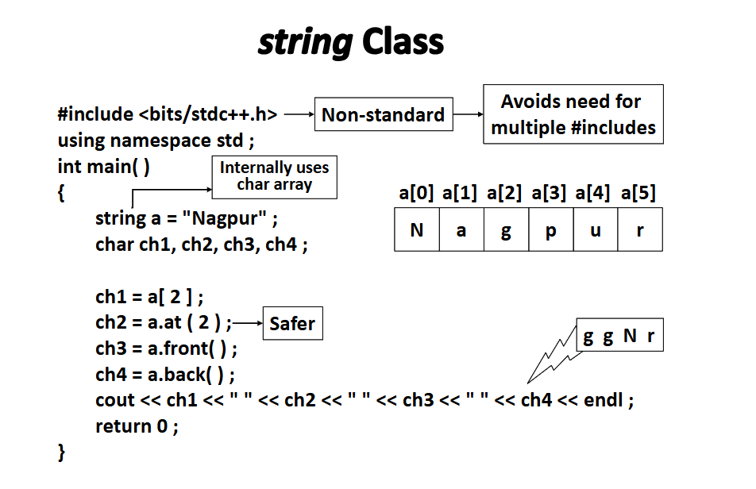

a[20] will print some garbage value but a.at(20) will give error!!

## `a[20]`

- Accesses index 20 without bounds checking.

- If index is invalid (like here), it invokes undefined behavior.

- May print garbage, crash, or nothing — depending on memory.

## `a.at(20)`

- Performs bounds checking.

- Since "Nagpur" has length 6, index 10 is out of range.

- Will throw an exception: std::out_of_range.

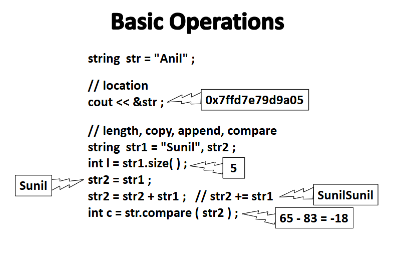

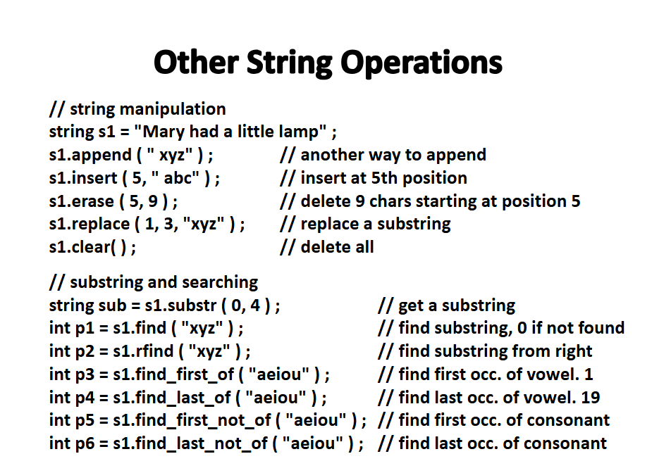

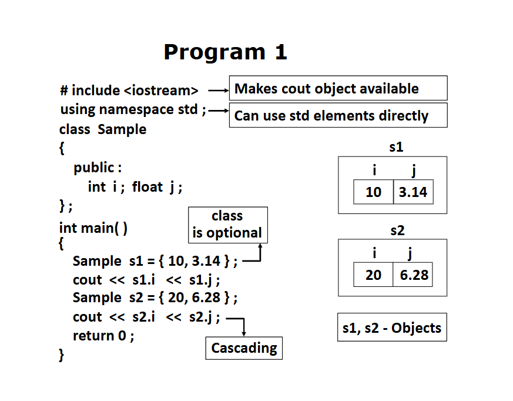

we can use `class Sample s1` or ignore class keyword and use `Sample s1`!!

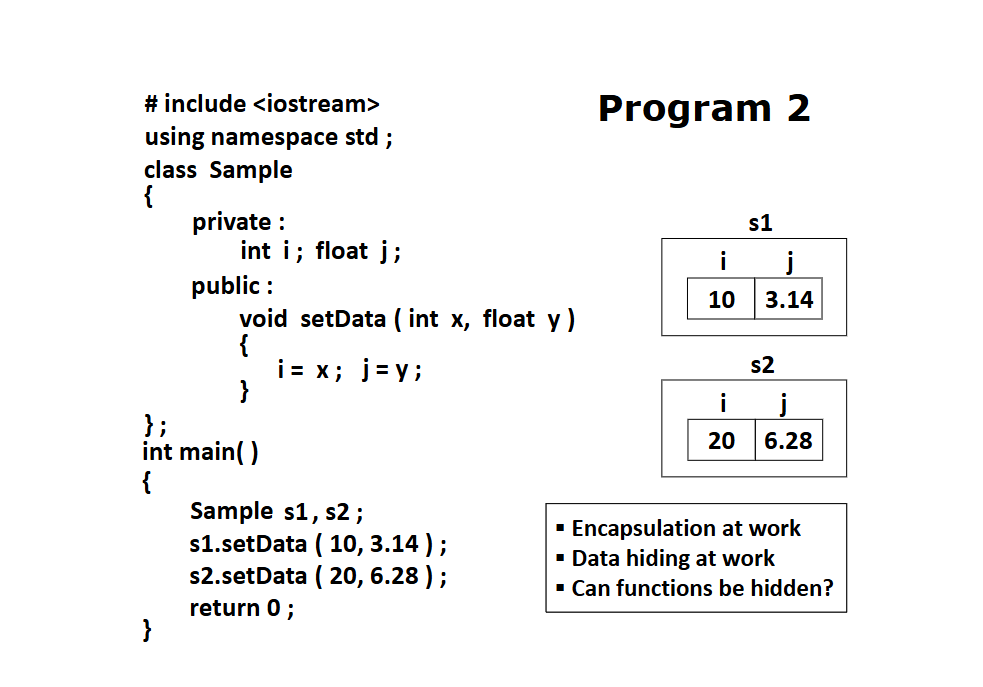

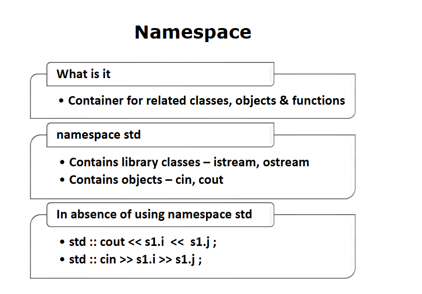

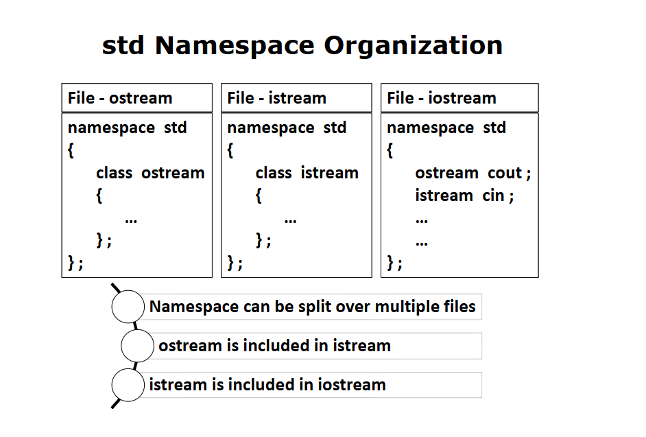

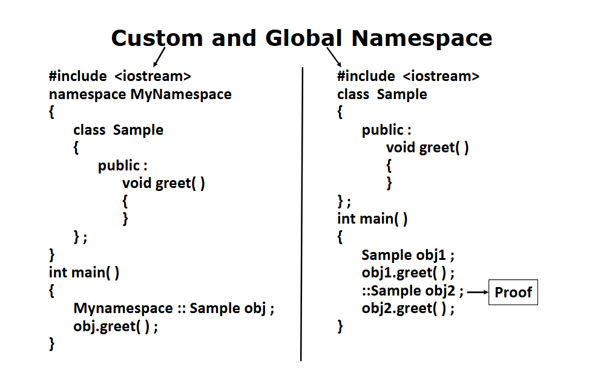

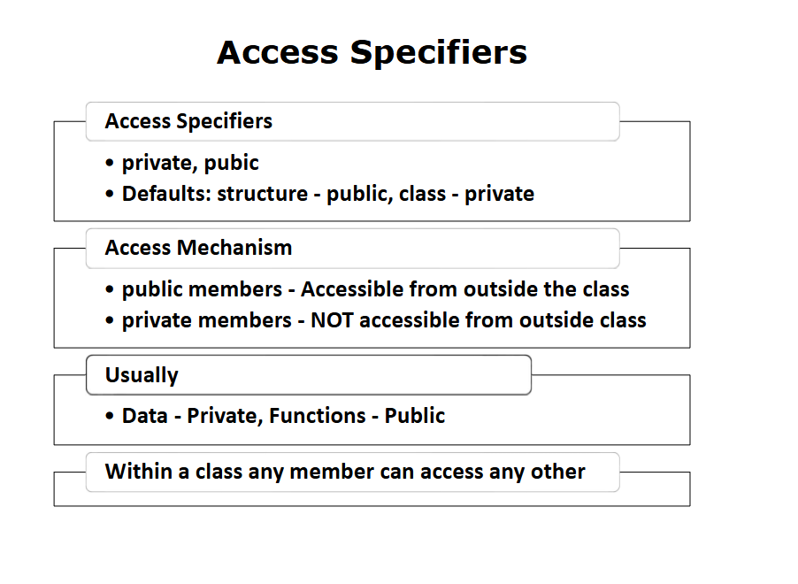

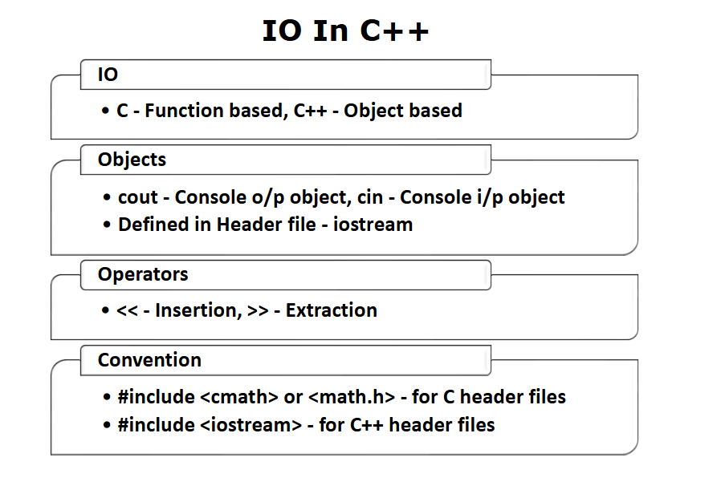

