# Notes

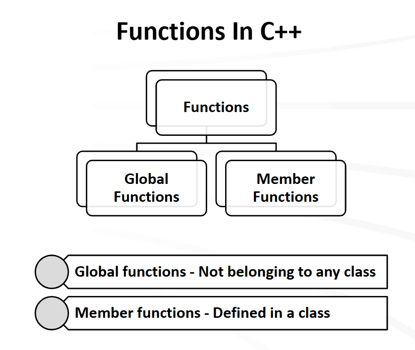


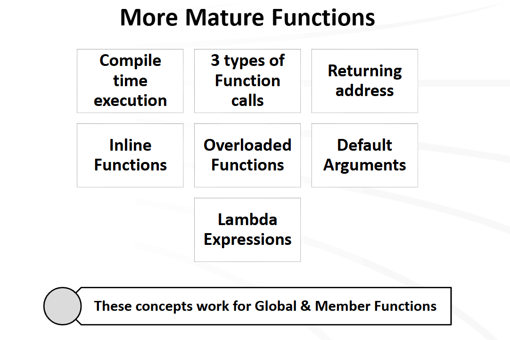

We ahve seen it!!These work for global as well as memeber function!!

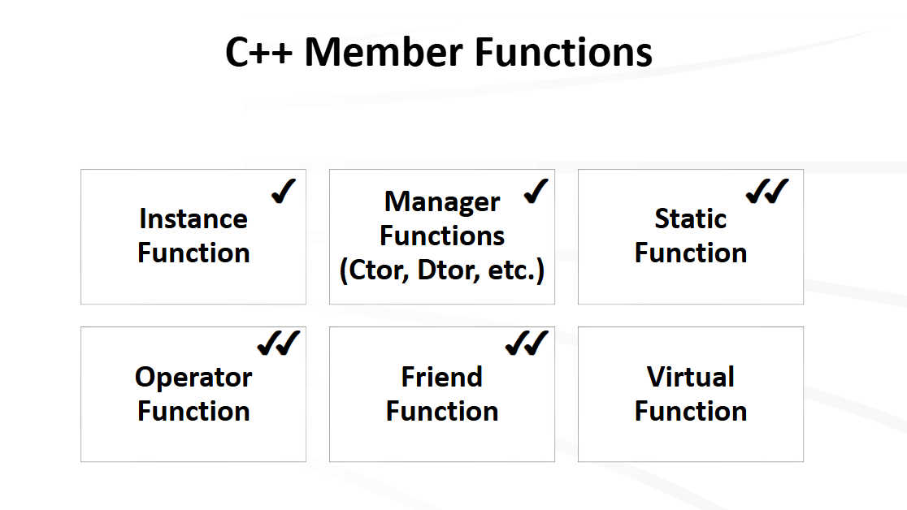

Above function only can be member funtion!!

## Static data and function usage 

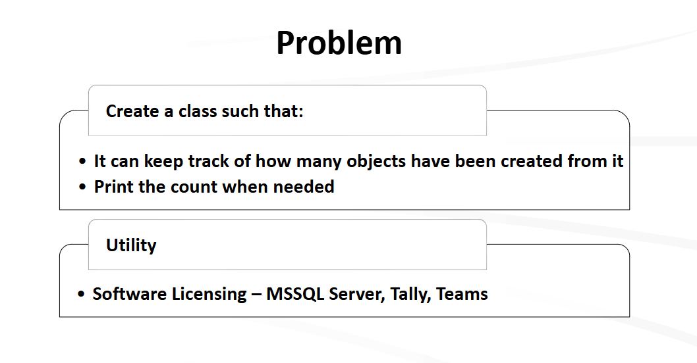

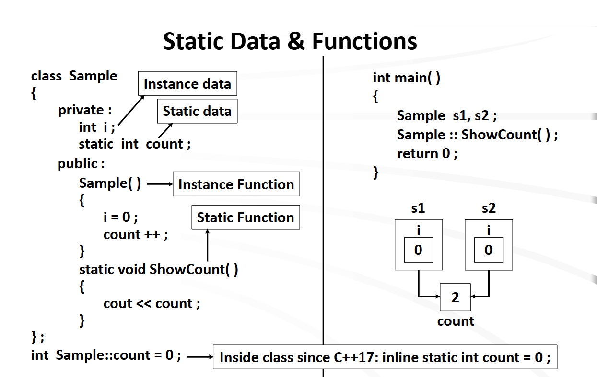

We know static function and data belongs to class not to object .

It is because here compiler do not pass adress of object to this function!!

❌ No, you cannot initialize a static data member inside the class definition (except for const static integral types).

A static data member:

- Is shared across all instances of a class.

- Has external linkage, so it needs to be defined outside the class.

```cpp

#include <iostream>
using namespace std;

class MyClass {
public:
    static int count;  // declaration (not definition)

    MyClass() {
        count++;
    }
};

// ✅ definition outside the class
int MyClass::count = 0;

int main() {
    MyClass a, b, c;
    cout << MyClass::count << endl;  // Output: 3
    return 0;
}

```

✅ Exception: const static integral types (like int, char)

```cpp

class Test {
public:
    static const int size = 100;  // ✅ allowed
    // static const float pi = 3.14; ❌ Not allowed
};

```
🔴 Not allowed:
```cpp

class MyClass {
    static int x = 5;  // ❌ Compilation error
};
```

✅ Instead:
```cpp

class MyClass {
    static int x;  // ✅ Declare only
};
int MyClass::x = 5;  // ✅ Define and initialize outside
```

Yes! In modern C++ (C++17 and later), you can do this:

```cpp

class MyClass {
public:
    inline static int count = 0;  // ✅ C++17 feature
};
```

ex:
```cpp
#include <iostream>
using namespace std;

class MyClass {
public:
    inline static int count = 0;

    MyClass() {
        count++;
    }
};

int main() {
    MyClass a, b, c;
    cout << MyClass::count << endl;  // Output: 3
    return 0;
}

```
---

### Imp

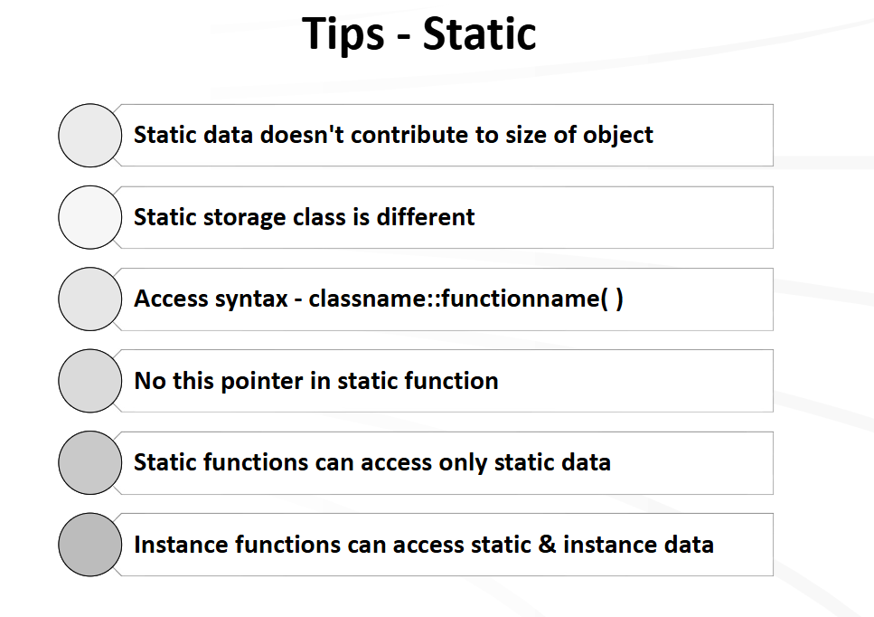

last point is very imp!!

>Even though you can call static fucntion by object but it is highly discouraged ,always use Class to access statis function.

## Operator overloading


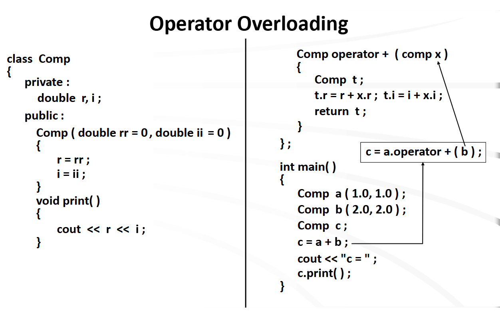

see how one constructor doing Default constructor as well as constructor with arguments using `Default arguments`.

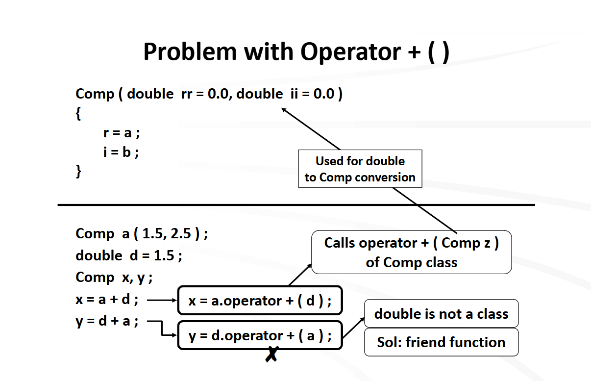

In first call implicitly d is converted to Comp class object but when you do `y=d+a` which is same as `d.operator +(a)` but d is not a class ,so here conversion of d to Comp not happens!!

We can stop this d conversion to Comp in first call i.e. `x=a+d`!! we can use `explicit` keyword

```cpp
#include <iostream>
using namespace std;

class Complex {
    double real, imag;

public:
    // Constructor
    Complex(double r = 0, double i = 0) : real(r), imag(i) {}

    // Getter for demonstration
    void print() const {
        cout << real << " + " << imag << "i" << endl;
    }

    // Operator+ to add two Complex numbers
    Complex operator+(const Complex& other) {
        return Complex(real + other.real, imag + other.imag);
    }
};

int main() {
    Complex c1(3, 4);

    Complex result = c1 + 5.5;  // double implicitly converted to Complex(5.5, 0)
    result.print();             // Output: 8.5 + 4i

    return 0;
}


```

### With explicit 

```cpp
class Complex {
    double real, imag;

public:
    // 👇 Now marked as explicit
    explicit Complex(double r, double i = 0) : real(r), imag(i) {}

    Complex operator+(const Complex& other) const {
        return Complex(real + other.real, imag + other.imag);
    }

    void print() const {
        cout << real << " + " << imag << "i" << endl;
    }
};
int main() {
    Complex c1(3, 4);
    Complex result = c1 + 5.5;  // ❌ Compilation Error: No implicit conversion allowed
    result.print();
    return 0;
}


```

But this way we stopped adding up of double either way!!

To work both way we can use friend function!!

---

### Friend function

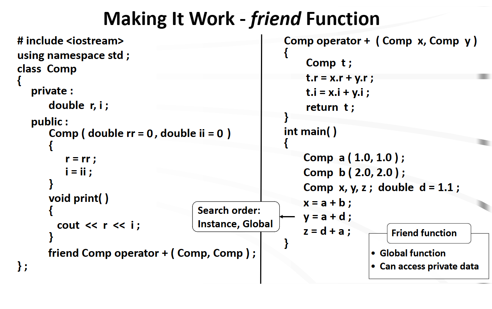

In here conversion of d to Comp will work in bith calls.

friend function is global fucntion so no `this pointer` is present here!!

Compiler first search any overloading in Instance function and then gllobally!!

>Mistake: No friend keyword to be used outside class , just in class we tell class this is friend !!

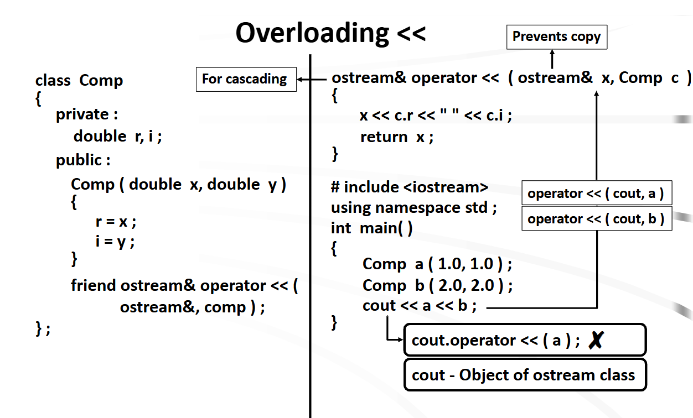

## Overloading urany operator

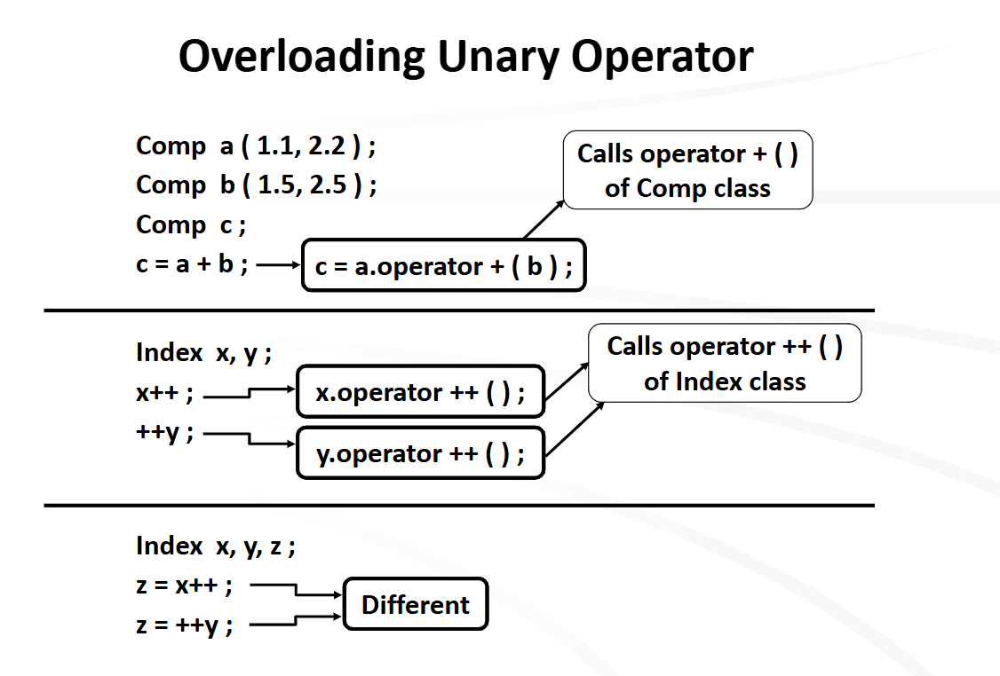


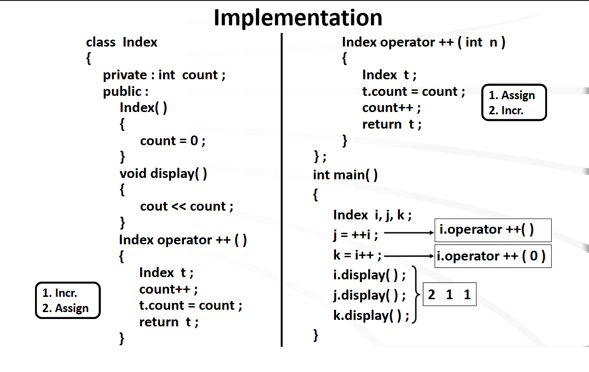


when i do `k=i++` compiler chnages it to `k=i.operator++(0)` so this 0 is collected in n!!

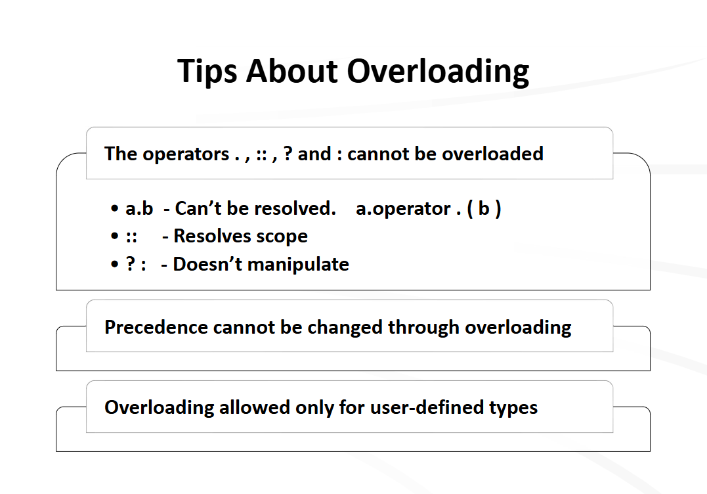

## Friend Class

A friend class means-->
One class grants another class full access to its private and protected members.

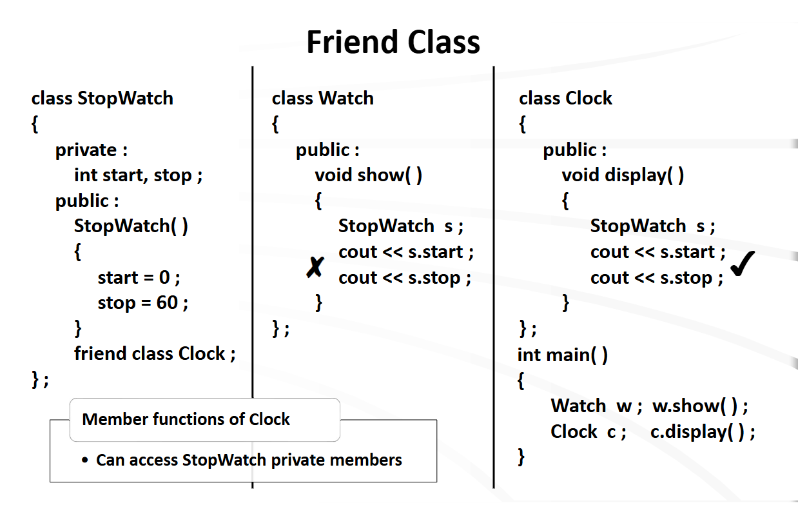

## Class Organization

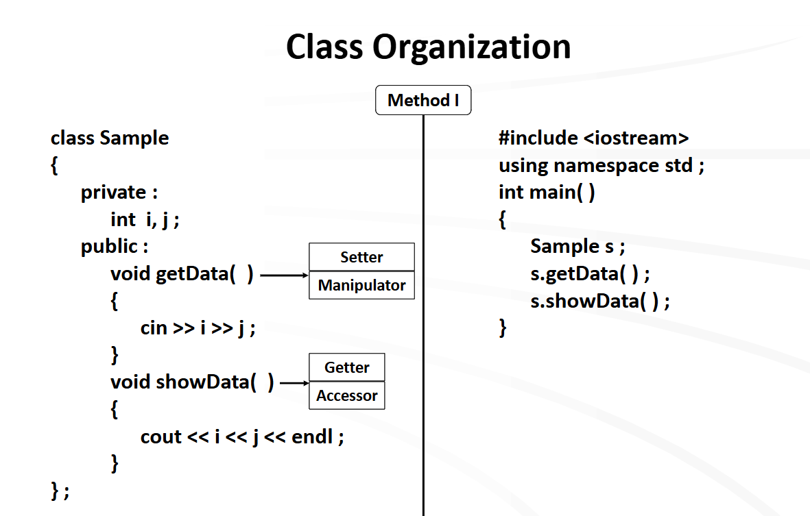


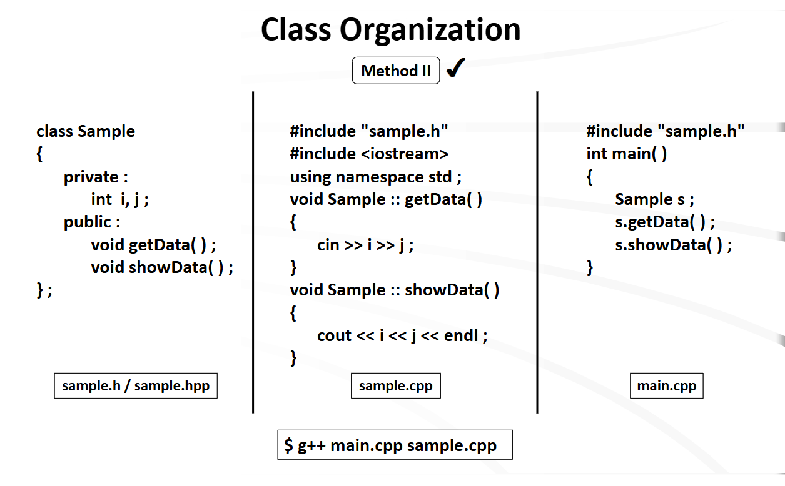

In Old days `sample.cpp` wa sgiven in compiled format and `Sample.h` was given so that client knows how to call !! 

## Object creation

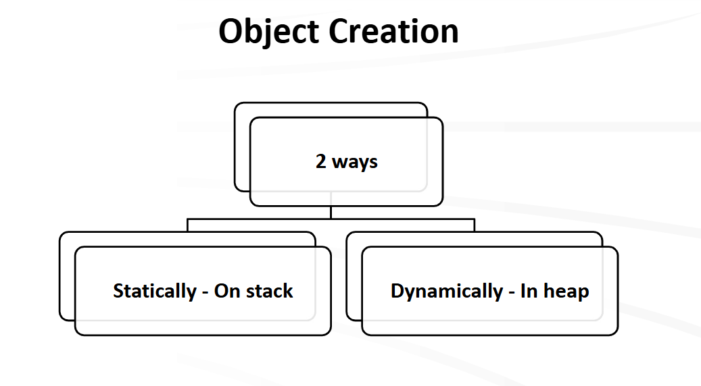

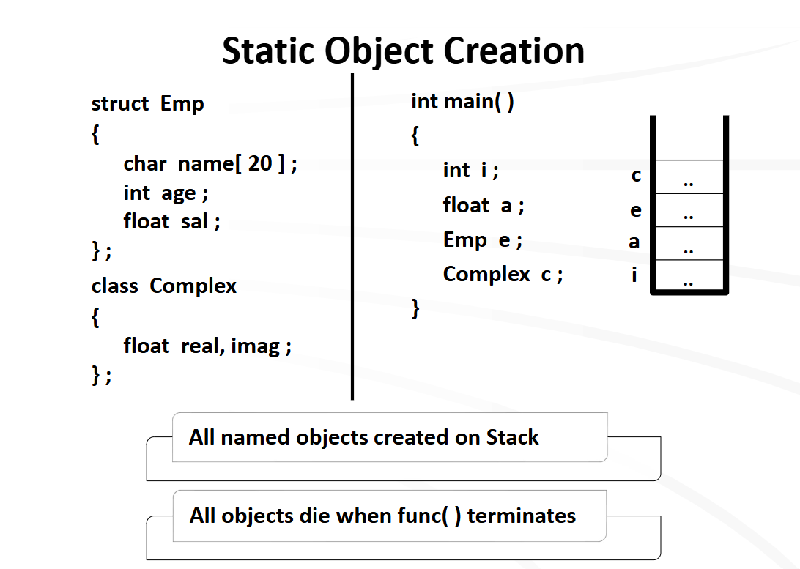


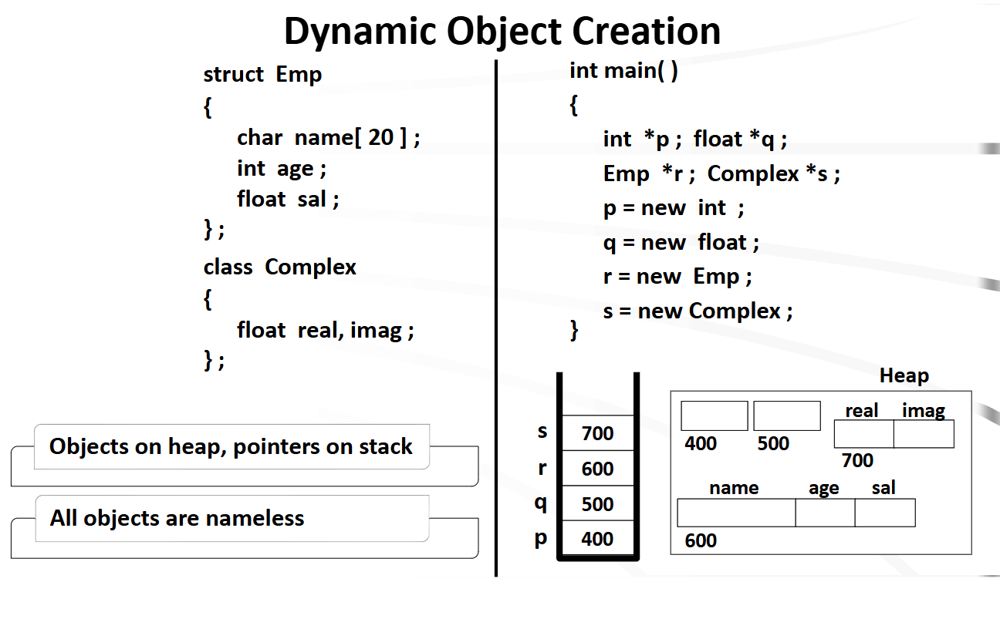

Any thing that has name is created in stack!!

In heap everythning is nameless!!

---


