# Notes

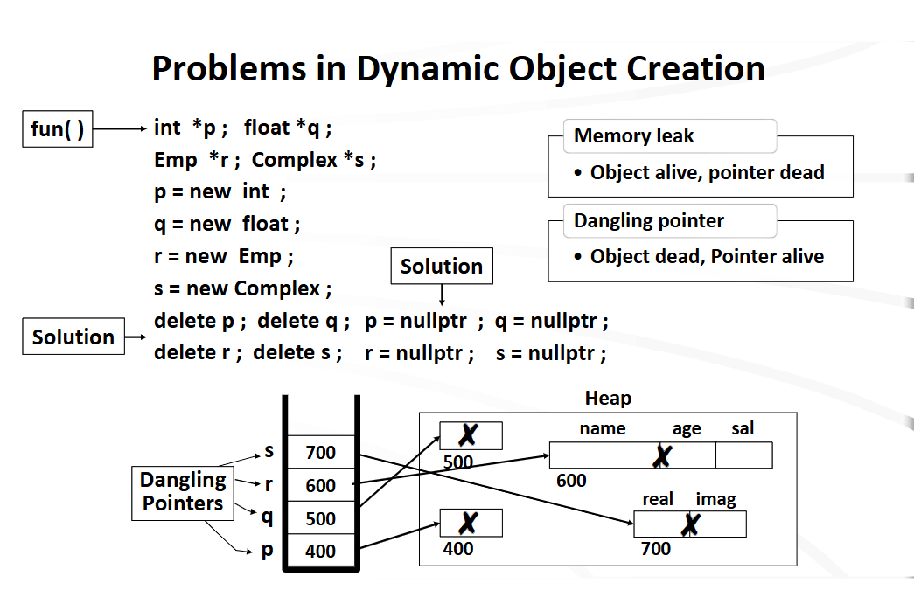

`delete p`--> does not mean p is deleted it mean whatever it is pointing to is deleted!!That means adress which is pointed by p is vacated!!

after deleting heap Unnamed object is deleted but ,p,q,r,s is till pointing to same location ,so we should put them as `nullptr` !!Dangling pointer is object deleted but pointer alive ,that happens when we  do not put `nullptr` in p,q,r,s then p,q,r,s be `dangling pointer`!!

See Memory leak is Object alive ,pointer dead!!Memory is allocated but never freed, and there’s no pointer left to access it.

```cpp
#include <iostream>

void leakMemory() {
    int* ptr = new int[100];  // Memory allocated
    // forgot to delete ptr
}

int main() {
    for (int i = 0; i < 1000; ++i) {
        leakMemory();  // Called repeatedly, leaking memory each time
    }

    std::cout << "Done\n";
    return 0;
}

```

Dangling pointer A pointer still exists but the memory it points to is deleted or freed.

```cpp
int* danglingPointer() {
    int* ptr = new int(10);
    delete ptr;        // Memory freed
    return ptr;        // Returning a dangling pointer!
}

int main() {
    int* p = danglingPointer();
    *p = 5; // ❌ undefined behavior: accessing freed memory
}

```
❌ Problem:
- Pointer refers to invalid memory.

- Accessing it causes undefined behavior, crashes, or corruption.

sol--> Set Pointers to nullptr After Deletion

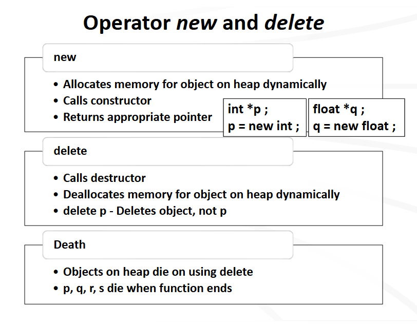

malloc() in C theere is no guarntee that constructor is called ,but in `new` always constructor is callled!!

with `malloc()` return type is `void *` so need to typecast that to appropiate pointer but with `new` no need of typecast!!

likewise `delete` calls destructor but `free` will not call destructor!! 

Remember `delete` frees up object ,adress in pointer is still same ,after `delete` set that pointer to `nullptr` to avoid `Dangling Pointer`!! 

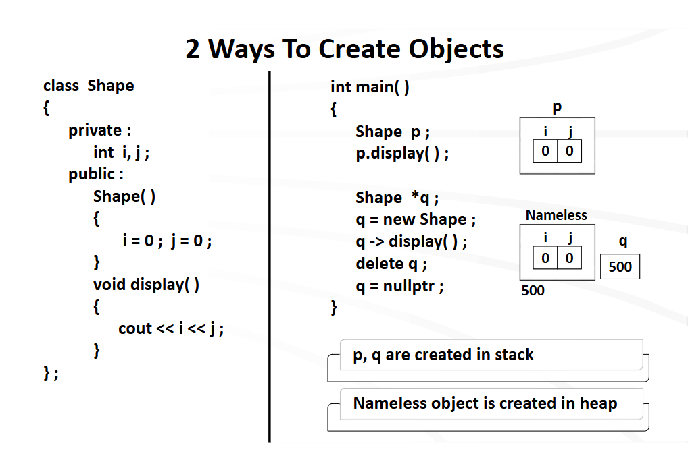

p creates in stack and q in heap!!

### Imp 

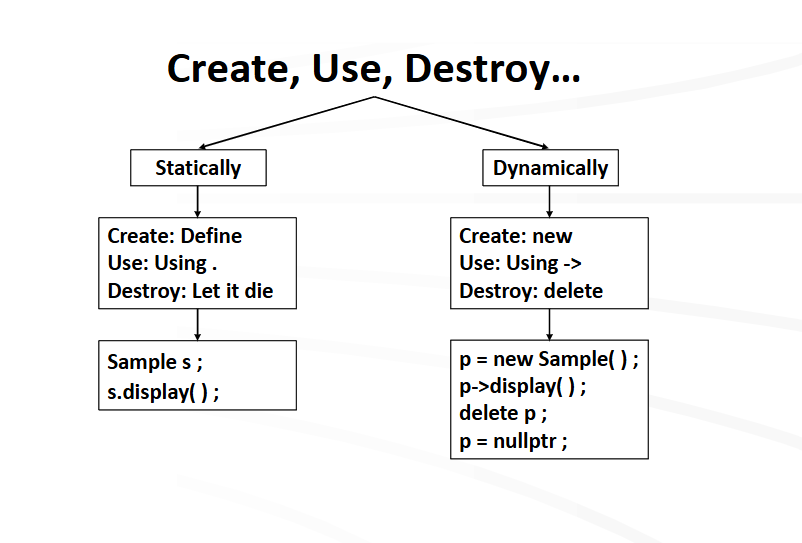

Static ones is deletd as soon as it goes out of scope, no need to explict deletion. But when we do with `new` we need to delete it explicitly!!

## Manager function

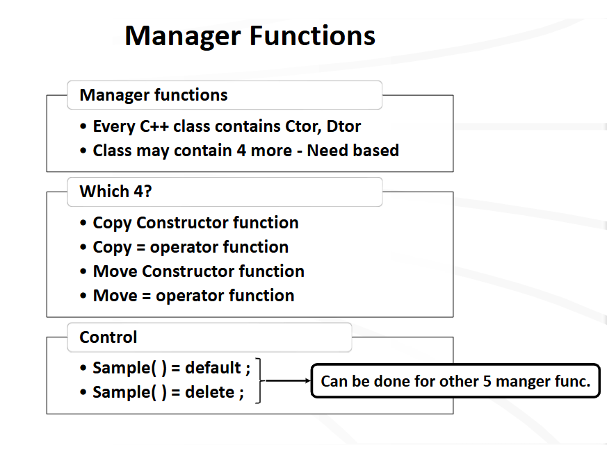

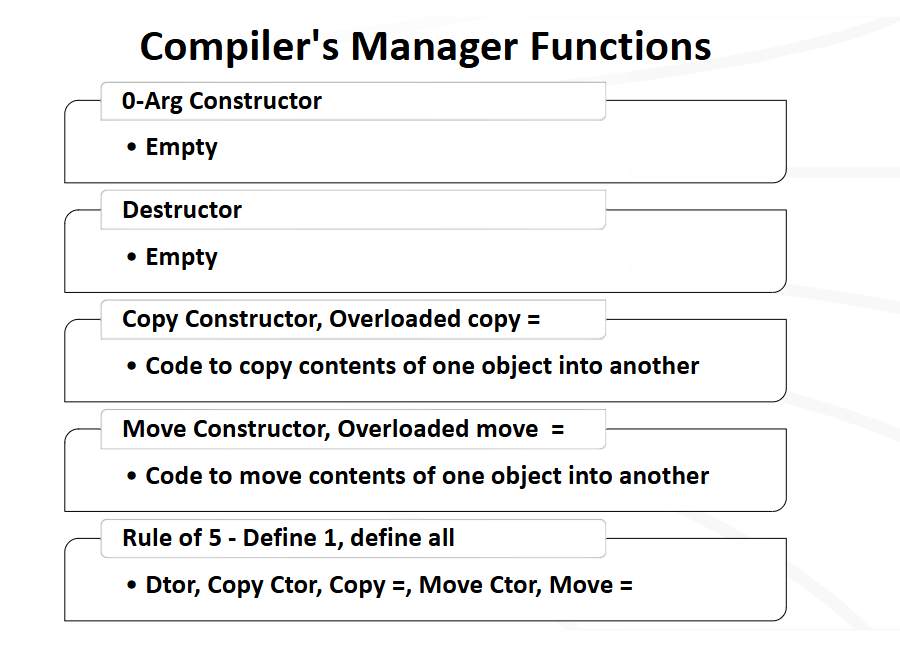

🧠 Tip: Rule of Five

- Destructor → cleans up resources

- Copy Constructor → deep copy of another object

- Copy Assignment Operator → deep copy during assignment

- Move Constructor → take over resources from temporary object

- Move Assignment Operator → move during assignment

Rule of 5 says if you provide any one of these , you must provide all other 4 too!!


Copy assignment vs copy constructor --> Copy assignment botyh object created and doing e1=e2 but copy contructor one object is not created we are creating it `Emp e1(e2)`.

```cpp

#include <iostream>
using namespace std;

class MyArray {
    int* data;
    int size;

public:
    // Constructor
    MyArray(int s) : size(s) {
        data = new int[size];
        cout << "Constructor called\n";
    }

    // Destructor
    ~MyArray() {
        delete[] data;
        cout << "Destructor called\n";
    }

    // Copy Constructor
    MyArray(const MyArray& other) : size(other.size) {
        data = new int[size];
        for (int i = 0; i < size; ++i)
            data[i] = other.data[i];
        cout << "Copy Constructor called\n";
    }

    // Copy Assignment Operator
    MyArray& operator=(const MyArray& other) {
        if (this != &other) {
            delete[] data;  // free old memory
            size = other.size;
            data = new int[size];
            for (int i = 0; i < size; ++i)
                data[i] = other.data[i];
            cout << "Copy Assignment called\n";
        }
        return *this;
    }

    // Move Constructor
    MyArray(MyArray&& other) noexcept : size(other.size), data(other.data) {
        other.data = nullptr;
        other.size = 0;
        cout << "Move Constructor called\n";
    }

    // Move Assignment Operator
    MyArray& operator=(MyArray&& other) noexcept {
        if (this != &other) {
            delete[] data;  // free old memory
            size = other.size;
            data = other.data;
            other.data = nullptr;
            other.size = 0;
            cout << "Move Assignment called\n";
        }
        return *this;
    }
};

int main() {
    MyArray a(5);            // Constructor
    MyArray b = a;           // Copy Constructor
    MyArray c(3);
    c = a;                   // Copy Assignment

    MyArray d = move(a);  // Move Constructor
    MyArray e(10);
    e = std::move(b);          // Move Assignment
}

```

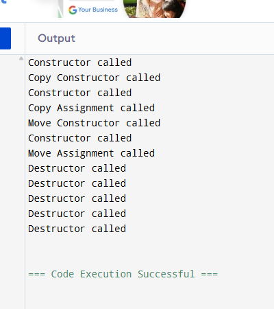

🚦 Compiler Decision Rules
🟩 The move constructor or move assignment is called when:
- The source is an rvalue (temporary object or explicitly std::move()-ed)

- The destination supports move semantics (i.e., a move constructor or assignment is defined)

🟥 The copy constructor or copy assignment is called when:
- The source is an lvalue

```cpp
MyArray a(5);         // normal constructor
MyArray b = a;        // copy constructor (a is an lvalue)
MyArray c = std::move(a);  // move constructor (a becomes rvalue)

```
- l- value: Something you can take the address of, i.e., it has a persistent location in memory.

- rvalue: A temporary value, used and then discarded. You can’t take its address (unless casted).

🧠 std::move(a) doesn't make a an rvalue — it casts it to an rvalue reference.

🔧 So, what really happens in:
```cpp
MyArray c = std::move(a);
```

- a is originally an lvalue

- std::move(a) does not move anything by itself

- It converts (casts) a into an rvalue reference (MyArray&&), allowing move constructor to be used

### ✅ Why It Works:

Even though a is still a named object (an lvalue), you're telling the compiler:

    “I know this variable a is safe to be moved from — treat it like an rvalue!”

That's why the move constructor is called here.

## Raw pointer vs move constructor 

```cpp

#include <iostream>
#include <utility>
using namespace std;

class Complex {
public:
    int real, imag;

    Complex(int r, int i) : real(r), imag(i) {
        cout << "Constructed: " << real << " + " << imag << "i\n";
    }

    // Copy constructor
    Complex(const Complex& other) : real(other.real), imag(other.imag) {
        cout << "Copied: " << real << " + " << imag << "i\n";
    }

    // Move constructor
    Complex(Complex&& other) noexcept {
        real = other.real;
        imag = other.imag;
        cout << "Moved: " << real << " + " << imag << "i\n";
        other.real = 0;
        other.imag = 0;
    }

    ~Complex() {
        cout << "Destroyed: " << real << " + " << imag << "i\n";
    }

    void display() const {
        cout << real << " + " << imag << "i\n";
    }
};

int main() {
    cout << "=== Creating a ===\n";
    Complex* a = new Complex(3, 4);  // constructed

    cout << "\n=== Moving *a to *b ===\n";
    Complex* b = new Complex(std::move(*a));  // move constructor called

    cout << "\n=== Displaying both ===\n";
    cout << "*a: "; a->display();  // moved-from state
    cout << "*b: "; b->display();  // 3 + 4i

    cout << "\n=== Cleaning up ===\n";
    delete a;  // safe to delete, object is in moved-from state
    delete b;

    return 0;
}

```

Output:

```
=== Creating a ===
Constructed: 3 + 4i

=== Moving *a to *b ===
Moved: 3 + 4i

=== Displaying both ===
*a: 0 + 0i
*b: 3 + 4i

=== Cleaning up ===
Destroyed: 0 + 0i
Destroyed: 3 + 4i


=== Code Execution Successful ===
```

```cpp
#include <iostream>
#include <utility>
using namespace std;

class Complex {
public:
    int real, imag;

    Complex(int r, int i) : real(r), imag(i) {
        cout << "Constructed: " << real << " + " << imag << "i\n";
    }

    // Copy constructor
    Complex(const Complex& other) : real(other.real), imag(other.imag) {
        cout << "Copied: " << real << " + " << imag << "i\n";
    }

    // Move constructor
    Complex(Complex&& other) noexcept {
        real = other.real;
        imag = other.imag;
        cout << "Moved: " << real << " + " << imag << "i\n";
        other.real = 0;
        other.imag = 0;
    }

    ~Complex() {
        cout << "Destroyed: " << real << " + " << imag << "i\n";
    }

    void display() const {
        cout << real << " + " << imag << "i\n";
    }
};

int main() {
    cout << "=== Creating a ===\n";
    Complex* a = new Complex(3, 4);  // constructed

  
    Complex* b = a; 

    cout << "\n=== Displaying both ===\n";
    cout << "*a: "; a->display();  
    cout << "*b: "; b->display();  // 3 + 4i

    cout << "\n=== Cleaning up ===\n";
    delete a;  
    delete b;

    return 0;
}

```

Output:

```
=== Creating a ===
Constructed: 3 + 4i

=== Displaying both ===
*a: 3 + 4i
*b: 3 + 4i

=== Cleaning up ===
Destroyed: 3 + 4i
Destroyed: 167083 + 0i
free(): double free detected in tcache 2
Aborted


=== Code Exited With Errors ===
```
You're demonstrating a very common and dangerous mistake in C++: double deletion of a raw pointer.

```cpp
delete a;  // Frees the memory (calls destructor)
delete b;  // ❌ Undefined Behavior: double delete!
```
❗ What Went Wrong
- You freed the same memory twice:

- First delete a; calls the destructor and releases the memory.

- Then delete b; attempts to destroy memory that was already freed, leading to undefined behavior — possibly a crash, memory corruption, or nothing (but it’s still wrong).


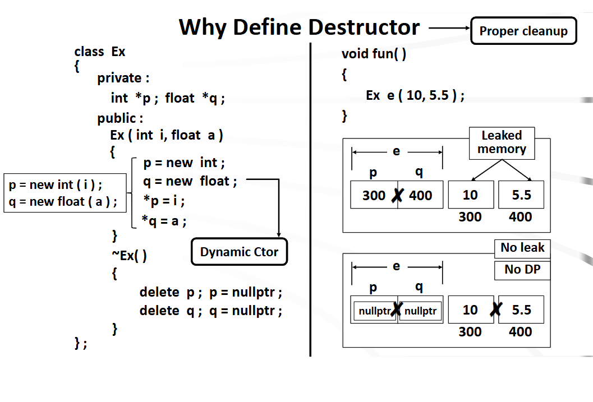

Constructor having new in it is called as `Dynamic Constructor`!! If we do not define `Destructor` then p and q will not be there but memeory will still be allocated,so to deallocate memory we must call our own destructor!!

DP here is dangling pointer , we need to put p and q as nullptr to avoid it!!

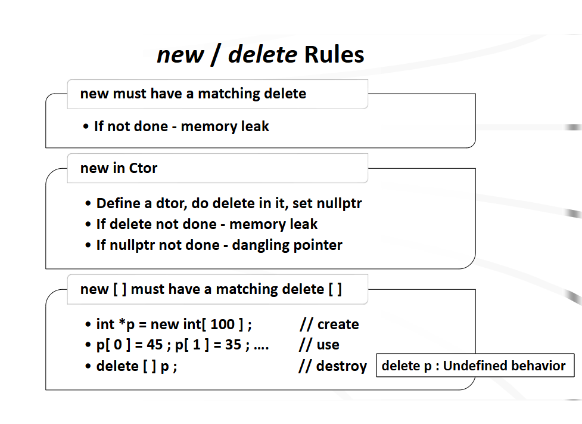

## Shallow copy and Deep copy

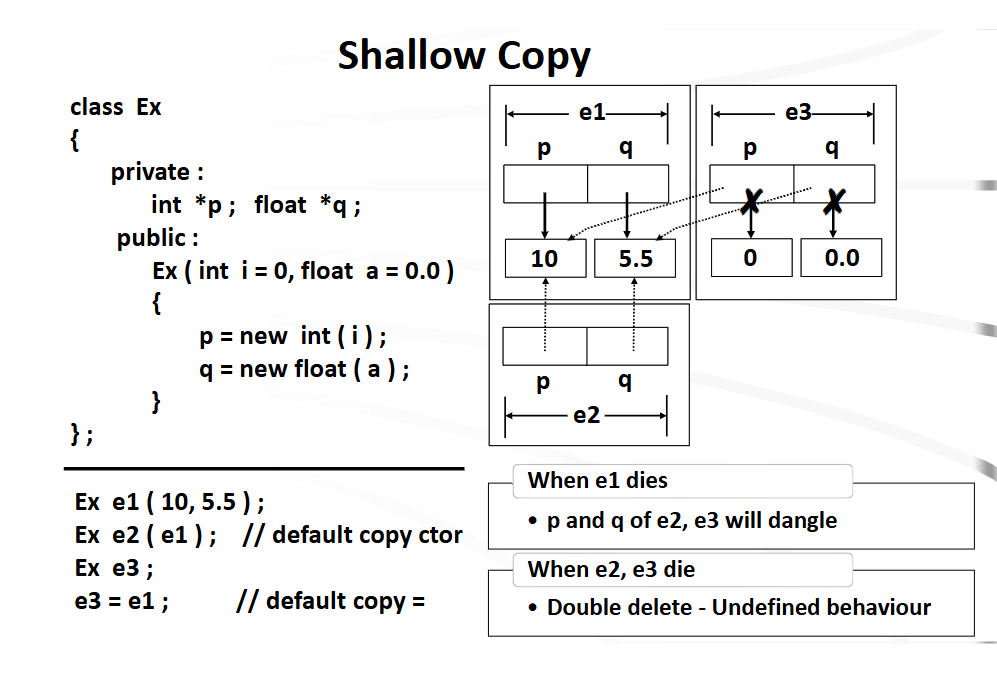

Deafault copy constructor do shallow copy !!It just copies adress of p and q not create new Object for them!! 

Same with assignment!!

We have dangling pointer problem if e1 is deleted!!

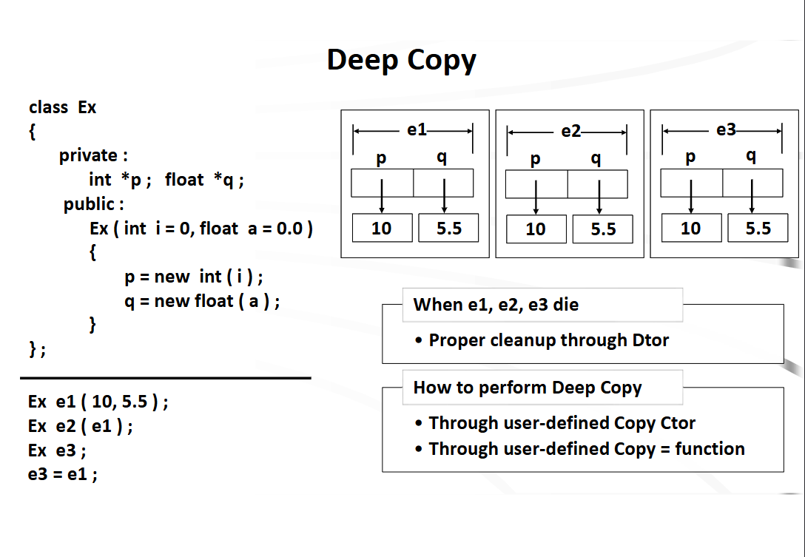

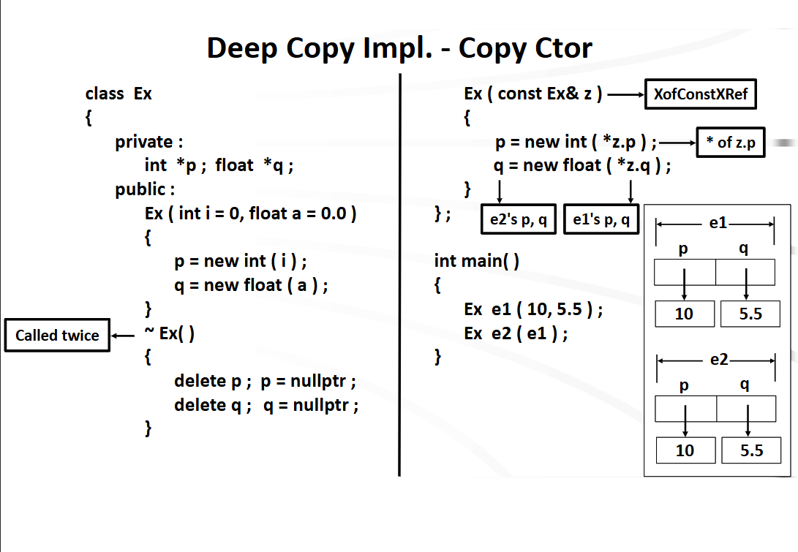

we making z as const in `Copy=` as Ex should not modify z!!

Copy constructor synatx --> X of const X Ref 
 
 where x is some Class!!


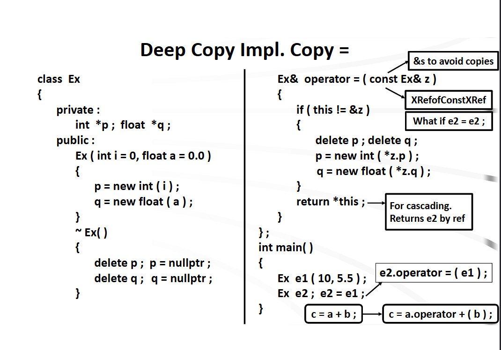

we deleted first p and q in `copy = Operator` as old memeory location allocated to p and q must be deleted!!

we return by refernce to avoid copy!!

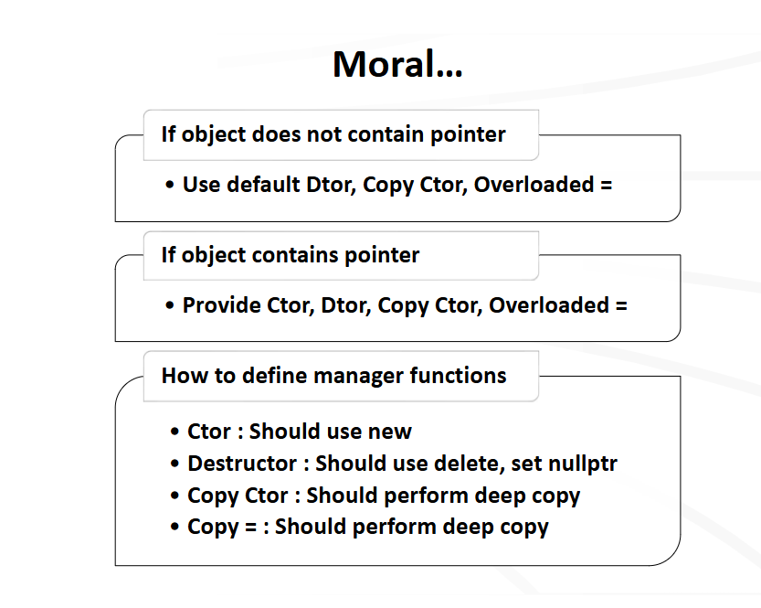

## lvalue and rvalue

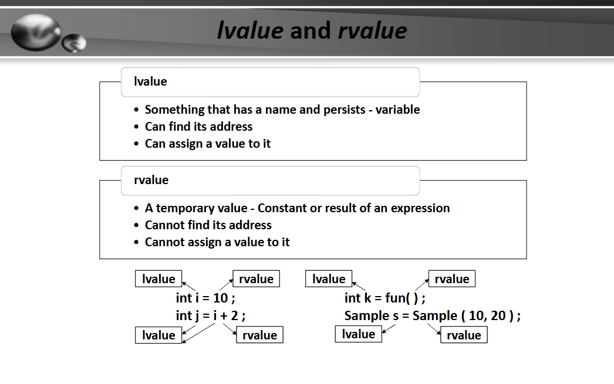

>What occuring on left is left value and on right is rvalue is wrong!!

expression (i+2) is rvalue but i is lvalue as have adress!!

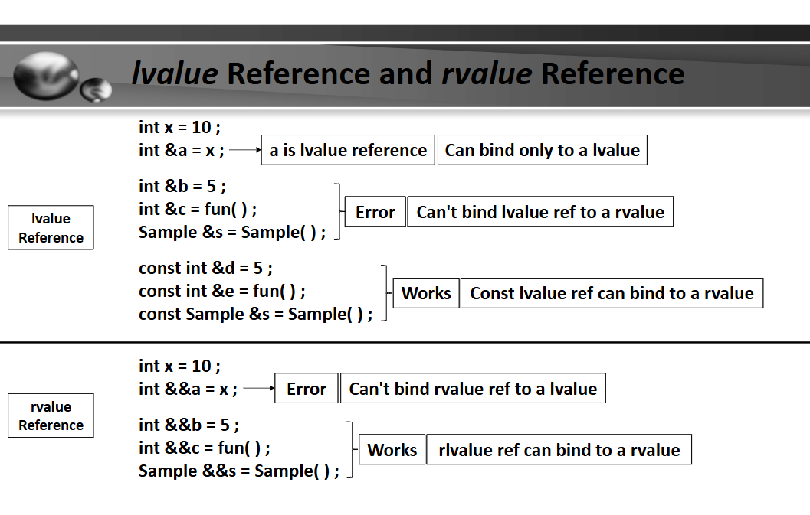

Single & lavlaue ref ,Double & rvalue refernece!!

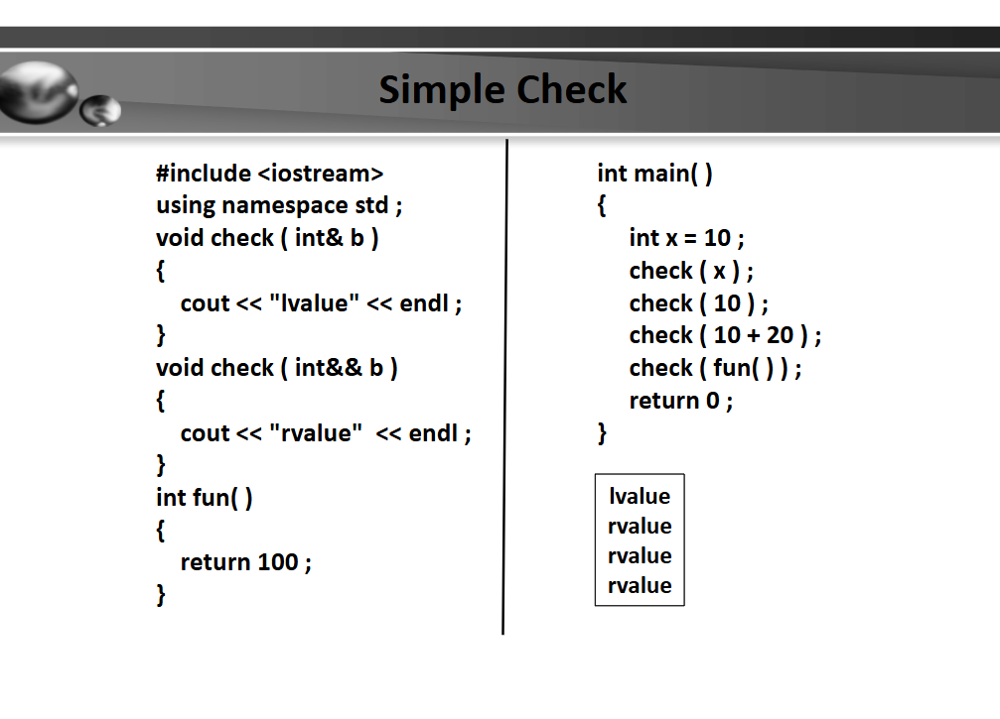

## Move constructor

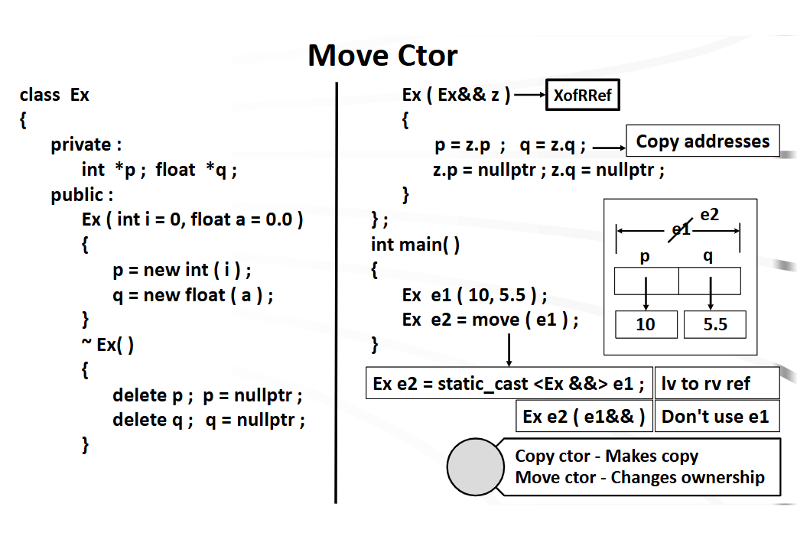

Here we need to specify move(e1) if we do not tell it will call copy constructor!!

e1 is lvaleue nbut internally e1 is casted to rvalue refenece. 

In here we do not do `new()` ,we want existing resources owned by `e1` should be owned by `e2` so we just copy them!! 

And then in `e1` we just put `nullptr`!!

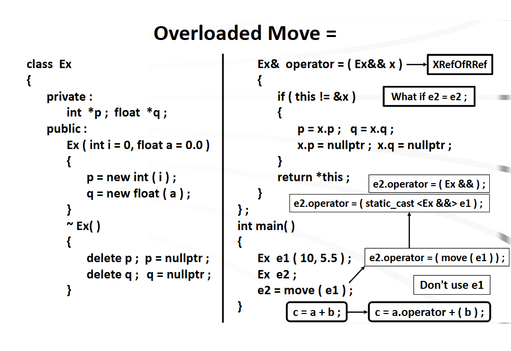

In move assignment too we need to tell to call move() assignment else will call copy assignment!!

Again here internally casting happens to `rValue Refence`!! See here in parameter we are receiving `rValue Ref` in copy we just have `refenence`

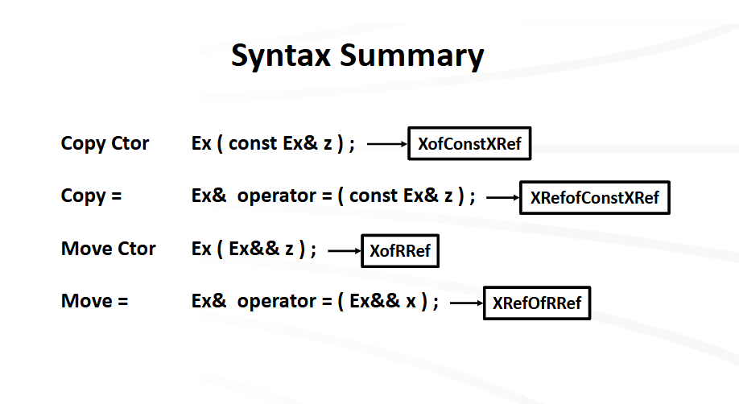

## Why need move constructor and assignment!!

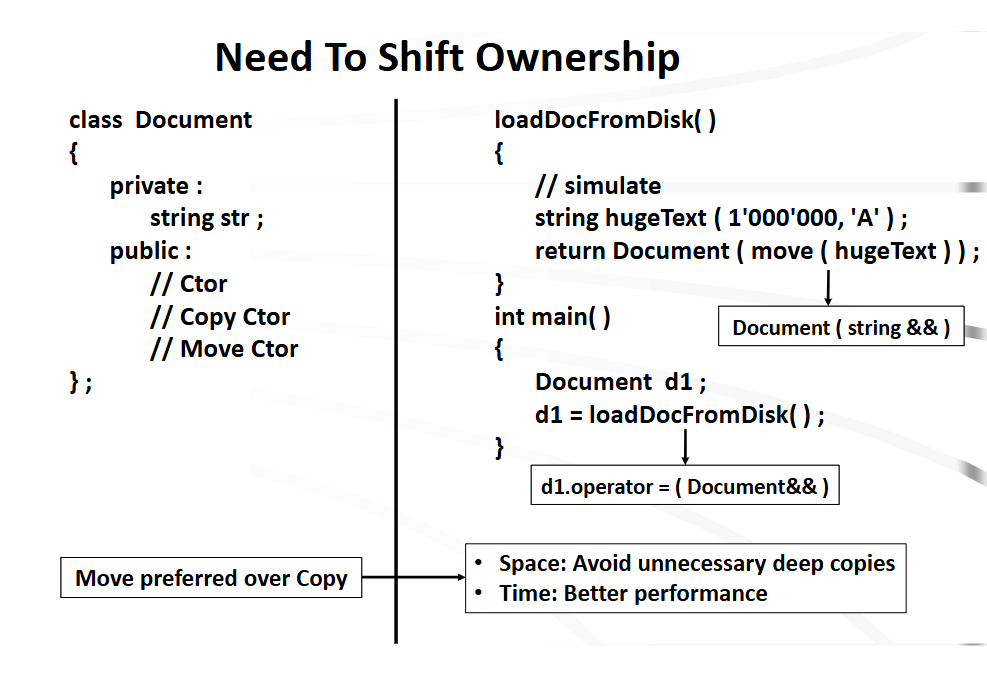


